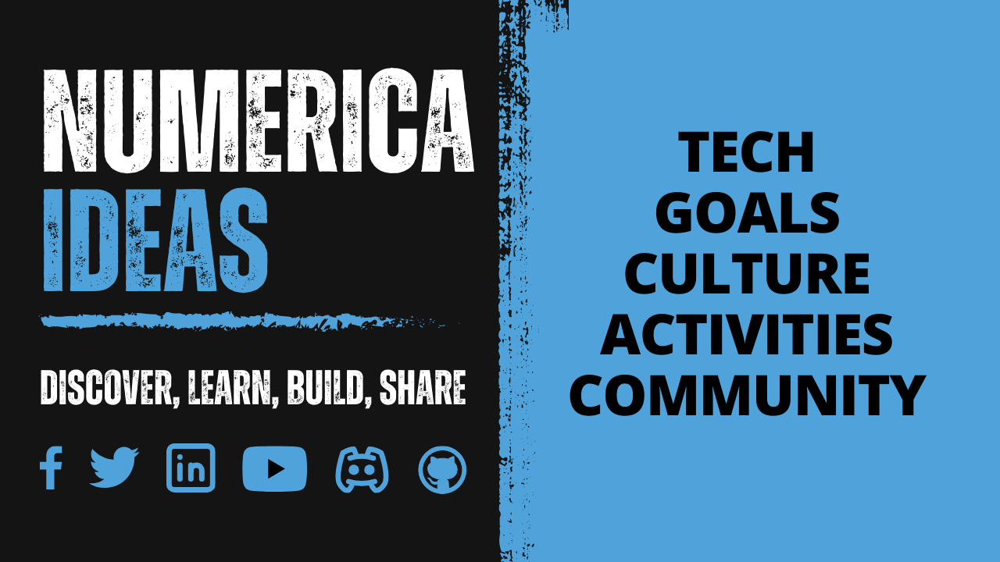

  

<h3 align="center">TECH TOPICS TO SHARPEN YOUR CLOUD AND SOFTWARE ARCHITECTURE SKILLS</h3>

No hour of life is wasted that is spent gaining invaluable skills

"DISCOVER, LEARN, BUILD, & SHARE" 🚀

<a href="https://blog.numericaideas.com">Blog</a> · <a href="https://www.youtube.com/@numericaideas/channels?sub_confirmation=1">YouTube</a> · <a href="https://discord.numericaideas.com">Discord</a> · <a href="https://github.com/numerica-ideas/community#tech-projects">Projects</a>

 

# Ni Community Activities&nbsp;

[NumericaIdeas](https://numericaideas.com) is a technical community that creates opportunities for IT professionals, where you’ll secure your dream job, and indeed the group through which you can develop your hard and soft skills at your own pace.

Does this speak to you? If **YES**, feel free to subscribe to our [YouTube Channel](https://www.youtube.com/@numericaideas/channels?sub_confirmation=1), register to the [Newsletter](https://news.numericaideas.com), and join our [Discord Server](https://discord.numericaideas.com) to be kept posted of new content and activities.

## Recent Content
<table><tr><td valign="top" width="50%">

###    Latest YouTube Videos      
 
<!-- YOUTUBE-VIDEOS-LIST:START -->
- [NumericaIdeas Community Updates #1](https://www.youtube.com/watch?v=va8SgEa0ssw)
- [Built-in .env Files Support Starting from Node.js v20.6.0](https://www.youtube.com/watch?v=gnVtDbl2gpg)
- [Lift And Shift Cloud Migration of Spring Boot to AWS ElasticBeanstalk | Part 3: GitHub Actions CI/CD](https://www.youtube.com/watch?v=TI84hpeiTZE)
- [Meetup 02: Devenez un freelance de 1ère classe &lpar;top 3%&rpar; avec Toptal - Salomon Nghukam](https://www.youtube.com/watch?v=AmhMAQTxcGg)
- [Lift And Shift Cloud Migration of Spring Boot App Using AWS ElasticBeanstalk | Part 2 | Scalability](https://www.youtube.com/watch?v=KHOxmHL5USI)
- [Lift And Shift Cloud Migration of Spring Boot App Using AWS ElasticBeanstalk | Part 1 | Deployment](https://www.youtube.com/watch?v=tWQFavEJQ7c)
- [Important Cloud Computing Concepts in 8 minutes](https://www.youtube.com/watch?v=0II0ikOZEYE)
- [Something new to be released soon!](https://www.youtube.com/watch?v=iTpM3Ue7qR8)
- [Introduction to Terraform for Infrastructure Provisioning](https://www.youtube.com/watch?v=tJ6L1332WU4)
- [Meetup 01: Multi-modules à la Rescousse des Microservices - Valdèse Kamdem](https://www.youtube.com/watch?v=e_LJvcikUCk)
<!-- YOUTUBE-VIDEOS-LIST:END -->
 
</td><td valign="top" width="50%">

###    Latest Articles on n-i.cm     
<!-- TECH-POSTS-LIST:START -->
- [React Hooks to Manage Component State and Lifecycle](https://blog.numericaideas.com/react-hooks/)
- [Spring Boot Production-Ready: Enhanced Monitoring and Management using Actuator](https://blog.numericaideas.com/spring-boot-actuator/)
- [Built-in .env Files Support Starting from Node.js v20.6.0](https://blog.numericaideas.com/nodejs-env-files-support/)
- [Apply SOLID Principles in a Real Angular Project](https://blog.numericaideas.com/solid-principles-in-angular-cheat-sheet/)
- [Introduction to Terraform](https://blog.numericaideas.com/introduction-to-terraform/)
- [Continuous Deployment of Spring Boot to AWS Elastic Beanstalk via GitHub Actions: A Step-by-Step Guide](https://blog.numericaideas.com/cd-springboot-aws-eb-github-actions/)
- [Docker Init: Quickly Dockerizing NodeJS Application](https://blog.numericaideas.com/quickly-dockerizing-nodejs/)
- [How to Change Default SSH Port on Linux](https://blog.numericaideas.com/change-default-ssh-port-linux/)
- [Dockerize Spring Boot and MySQL with Docker Compose](https://blog.numericaideas.com/docker-compose-springboot-mysql/)
- [Scalability Types in Software Architecture](https://blog.numericaideas.com/scalability-types/)
<!-- TECH-POSTS-LIST:END -->

</td></tr></table>

**More tech content is available on [the blog](https://blog.numericaideas.com) and on [YouTube](https://www.youtube.com/@numericaideas/channels?sub_confirmation=1).**

## 💡 Newsletter
<!-- NI-NEWS-LIST:START -->
- [Community Updates #1](https://news.numericaideas.com/community-updates-1/)
- [Monthly Activities #2](https://news.numericaideas.com/monthly-recap-2/)
- [Monthly Activities #1](https://news.numericaideas.com/monthly-recap-1/)
- [Monthly Activities #0](https://news.numericaideas.com/monthly-recap-0/)
<!-- NI-NEWS-LIST:END -->

Subscribe to the monthly activities newsletter at: [news.numericaideas.com](https://news.numericaideas.com) ✅

## 👥 Social Media
Multilingual (English & Français) presence on social media with the following accounts :eight_spoked_asterisk:
-  Twitter  : [EN](https://twitter.com/numericaideas) | [FR](https://twitter.com/NumericaIdeasFr)
-  Facebook : [EN](https://facebook.com/numericaideas) | [FR](https://facebook.com/NumericaIdeasFr)
-  LinkedIn : [EN](https://www.linkedin.com/company/numericaideas) | [FR](https://www.linkedin.com/company/numericaideas-fr)
-  [Discord (EN | FR)](https://discord.numericaideas.com)
-  [YouTube (EN | FR)](https://www.youtube.com/@numericaideas/channels?sub_confirmation=1)

## Contribute
There are a lot of **activities** that you can contribute to within the community, the idea is to help others grow while sharpening your hard and soft skills at the same time:
- Publicly shared [TODO list](https://github.com/numerica-ideas/community/issues).
- Become an **author** and be featured in the [Blog](https://blog.numericaideas.com).
- **Speak** at organized [Meetups](https://github.com/numerica-ideas/meetups) events.
- Be part of [Workshops](https://discord.numericaideas.com) to **host or attend** tech topics discussions.
- Do pre-recorded **videos** uploaded to our [YouTube (English & Français)](https://www.youtube.com/@numericaideas/channels?sub_confirmation=1) channels.
- [Pair Interviews](https://docs.google.com/forms/d/e/1FAIpQLSfapW9TSe2RR43QF65MRlJjXaQ3uFC0RssvtWforWLZXF4zRg/viewform) for Software Jobs: be the **interviewee or interviewer** for technical assessments.
- **Sharing** our content (articles and videos) on social media to get us noticed.
- **Re-using** our content by crediting us.
- Be **active** in the [Discord](https://discord.numericaideas.com) community.
- **Committing** to our [tech projects](https://github.com/numerica-ideas/community#tech-projects).

🔔 Please note that any contribution to our community will be considered voluntary and free. Any content (article, video, and post) shared on our social media channels will not be compensated, unless mentioned. If you do not wish to have your content shared, please refrain from contributing.

Your contributions are **precious** and some are [awarded](https://github.com/numerica-ideas/community#numies) at the end of each year, **Thank you for making NumericaIdeas shine** ⚡️

**Note**: Feel free to **suggest** new ideas/enhancement to work on by [creating an issue](https://github.com/numerica-ideas/community/issues) :bulb:

## Tech Projects
The articles, workshops, and other events **projects** are centralized in this repository:
- [Algorithms](./algorithms)
- [Android](./android)
- [Angular](./angular)
- [Architecture](./architecture)
- [Articles](./articles)
- [Amazon Web Services (AWS)](./aws)
- [Microsoft Azure](./azure)
- [Cheat Sheets](./cheatsheets)
- [Design (UI & UX)](./design)
- [DevOps](./devops)
- [Docker](./docker)
- [Google Cloud Platform (GCP)](./gcp)
- [GitHub Actions](./github-actions)
- [GitLab CI/CD](./gitlab-ci-cd)
- [iOS](./ios)
- [Java](./java)
- [Kubernetes](./kubernetes)
- [NodeJS](./nodejs)
- [Python](./python)
- [ReactJS](./reactjs)
- [Security](./security)
- [Serverless](./serverless)
- [Spring Boot](./spring-boot)
- [Terraform](./terraform)
- [Videos](./videos)
- [Web Development](./web)
- [Meetups](https://github.com/numerica-ideas/meetups)
- [Open Source](https://github.com/numerica-ideas)
- ...
- [More topics](https://blog.numericaideas.com/topics)

## Numies
**Numies** is the NumericaIdeas Awards conducted each year-end to celebrate a few **top contributors** who worked toward the vision of our professional network while impacting more people and differentiating themselves by their commitments and presence. There are many categories available and some prizes are given away 🎉

The [contribution opportunities](https://github.com/numerica-ideas/community#contribute) are available on the top, the **2022** winners are now public on the [Award](https://numericaideas.com/award) page.

By [NumericaIdeas Network](https://numericaideas.com) :fire:
