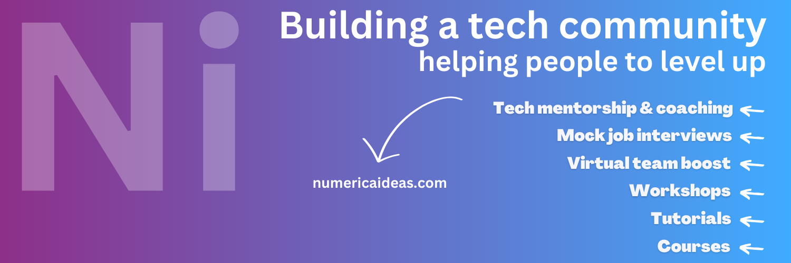

<h3 align="center">TECH TOPICS TO SHARPEN YOUR CLOUD AND SOFTWARE ARCHITECTURE SKILLS</h3>

No hour of life is wasted that is spent gaining invaluable skills

"DISCOVER, LEARN, BUILD, & SHARE" 🚀

<a href="https://numericaideas.com/blog/">Blog</a> · <a href="https://www.youtube.com/@numericaideas/channels?sub_confirmation=1">YouTube</a> · <a href="https://discord.numericaideas.com">Discord</a> · <a href="https://github.com/numerica-ideas/community#tech-projects">Projects</a>

 

# Ni Community Activities&nbsp;

[NumericaIdeas](https://numericaideas.com) is a technical community that creates opportunities for IT professionals, where you’ll secure your dream job, and indeed the group through which you can develop your hard and soft skills at your own pace.

Does this speak to you? If **YES**, feel free to subscribe to our [YouTube Channel](https://www.youtube.com/@numericaideas/channels?sub_confirmation=1), register to the [Newsletter](https://numericaideas.com/blog/category/news), and join our [Discord Server](https://discord.numericaideas.com) to be kept posted of new content and activities.

## Recent Content
<table><tr><td valign="top" width="50%">

###    Latest YouTube Videos      
 
<!-- ENGLISH-YOUTUBE-VIDEOS:START -->
- [Tech Career: Should You Specialize Sooner or Later?](https://www.youtube.com/watch?v=tADeuqlCylI)
- [The 5-Step Tech Jobs Application Framework to Apply in 2024](https://www.youtube.com/watch?v=jU_8xL9ywfA)
- [Migration: SEO and 301 Redirects](https://www.youtube.com/watch?v=YonptTEEqWk)
- [Migration: Speed VS Design and Time Saving](https://www.youtube.com/watch?v=zV_ocd33-ZQ)
- [Ni Platform Migration from Ghost to WordPress](https://www.youtube.com/watch?v=bqD0Pp_qDbk)
<!-- ENGLISH-YOUTUBE-VIDEOS:END -->

----------------

<!-- FRENCH-YOUTUBE-VIDEOS:START -->
- [Entretien Technique #02 : Développeur Spring Boot Junior](https://www.youtube.com/watch?v=V0NHhdOOvY0)
- [Entretien Technique #01: Développeur Frontend HTML + CSS](https://www.youtube.com/watch?v=ILGVVFNeRcY)
- [Meetup 02: Devenez un freelance de 1ère classe &lpar;top 3%&rpar; avec Toptal - Salomon Nghukam](https://www.youtube.com/watch?v=AmhMAQTxcGg)
- [Meetup 01: Multi-modules à la Rescousse des Microservices - Valdèse Kamdem](https://www.youtube.com/watch?v=e_LJvcikUCk)
<!-- FRENCH-YOUTUBE-VIDEOS:END -->
 
</td><td valign="top" width="50%">

###    Latest Articles on n-i.cm     
<!-- TECH-POSTS-LIST:START -->
- [Numerica Ideas’s Tech Writers Leaderboard](https://numericaideas.com/blog/tech-writers-leaderboard/)
- [Monthly Activities #7](https://numericaideas.com/blog/monthly-activities-7/)
- [Dockerize NodeJS and MySQL with Docker Compose](https://numericaideas.com/blog/docker-compose-nodejs-mysql/)
- [Beginner’s Guide to Apache Maven](https://numericaideas.com/blog/maven-for-beginners/)
- [Understanding the Difference Between Observable and Subject in RxJS](https://numericaideas.com/blog/difference-between-observable-and-subject-in-rxjs/)
- [How to Install Apache Superset using Docker Compose](https://numericaideas.com/blog/install-apache-superset-via-docker-compose/)
- [Salesforce OAuth 2.0 Web Server Flow in NodeJS](https://numericaideas.com/blog/salesforce-oauth2-web-server-flow/)
- [Understanding DevOps Roles and Technologies](https://numericaideas.com/blog/understanding-devops-roles-and-technologies/)
- [Summary of Platform Migration from Ghost to WordPress](https://numericaideas.com/blog/platform-migration-from-ghost-to-wordpress/)
- [Monthly Activities #6](https://numericaideas.com/blog/monthly-activities-6/)
<!-- TECH-POSTS-LIST:END -->

</td></tr></table>

**More tech content is available on [the blog](https://numericaideas.com/blog/) and on [YouTube](https://www.youtube.com/@numericaideas/channels?sub_confirmation=1).**

## 💡 Newsletter
<!-- NI-NEWS-LIST:START -->
- [Monthly Activities #7](https://numericaideas.com/blog/monthly-activities-7/)
- [Monthly Activities #6](https://numericaideas.com/blog/monthly-activities-6/)
- [Monthly Activities #5](https://numericaideas.com/blog/monthly-recap-5/)
- [Monthly Activities #4](https://numericaideas.com/blog/monthly-recap-4/)
- [Monthly Activities #3](https://numericaideas.com/blog/monthly-recap-3/)
<!-- NI-NEWS-LIST:END -->

Subscribe to the monthly activities newsletter at: [https://numericaideas.com/blog/category/news](https://numericaideas.com/blog/category/news) ✅

## 👥 Social Media
Multilingual (English & Français) presence on social media with the following accounts :eight_spoked_asterisk:
-  Twitter  : [EN](https://twitter.com/numericaideas) | [FR](https://twitter.com/NumericaIdeasFr)
-  Facebook : [EN](https://facebook.com/numericaideas) | [FR](https://facebook.com/NumericaIdeasFr)
-  LinkedIn : [EN](https://www.linkedin.com/company/numericaideas) | [FR](https://www.linkedin.com/company/numericaideas-fr)
-  [Discord (EN | FR)](https://discord.numericaideas.com)
-  [YouTube (EN | FR)](https://www.youtube.com/@numericaideas/channels?sub_confirmation=1)

## Contribute
There are a lot of **activities** that you can contribute to within the community, the idea is to help others grow while sharpening your hard and soft skills at the same time:
- Publicly shared [TODO list](https://github.com/numerica-ideas/community/issues).
- Become an **author** and be featured in the [Blog](https://numericaideas.com/blog/).
- **Speak** at organized [Meetups](https://github.com/numerica-ideas/meetups) events.
- Be part of [Workshops](https://discord.numericaideas.com) to **host or attend** tech topics discussions.
- Do pre-recorded **videos** uploaded to our [YouTube (English & Français)](https://www.youtube.com/@numericaideas/channels?sub_confirmation=1) channels.
- [Pair Interviews](https://docs.google.com/forms/d/e/1FAIpQLSfapW9TSe2RR43QF65MRlJjXaQ3uFC0RssvtWforWLZXF4zRg/viewform) for Software Jobs: be the **interviewee or interviewer** for technical assessments.
- **Sharing** our content (articles and videos) on social media to get us noticed.
- **Re-using** our content by crediting us.
- Be **active** in the [Discord](https://discord.numericaideas.com) community.
- **Committing** to our [tech projects](https://github.com/numerica-ideas/community#tech-projects).

🔔 Please note that any contribution to our community will be considered voluntary and free. Any content (article, video, and post) shared on our social media channels will not be compensated, unless mentioned. If you do not wish to have your content shared, please refrain from contributing.

Your contributions are **precious** and some are [awarded](https://github.com/numerica-ideas/community#numies) at the end of each year, **Thank you for making NumericaIdeas shine** ⚡️

**Note**: Feel free to **suggest** new ideas/enhancement to work on by [creating an issue](https://github.com/numerica-ideas/community/issues) :bulb:

## Tech Projects, Tutorials, and Workshops
The articles, workshops, and other events **projects** are centralized in this repository:

### Categories
- [Algorithms](./algorithms)
- [Architecture](./architecture)
- [Articles](./articles)
- [Backend](./backend)
- [Career](./career)
- [Cheat Sheets](./cheatsheets)
- [Cloud](./cloud)
- [CMS](./cms)
- [CRM](./crm)
- [Data Engineering](./data-engineering)
- [Design (UI & UX)](./design)
- [DevOps](./devops)
- [Frontend](./frontend)
- [Full Stack](./full-stack)
- [Mobile](./mobile)
- [Monitoring](./monitoring)
- [Observability](./observability)
- [Security](./security)
- [Serverless](./serverless)
- [Tech Interviews](./tech-interviews)
- [Videos](./videos)
- [Meetups](https://github.com/numerica-ideas/meetups)

### Stacks
- [Android](./android)
- [Angular](./angular)
- [Amazon Web Services (AWS)](./aws)
- [Microsoft Azure](./azure)
- [Docker](./docker)
- [Google Cloud Platform (GCP)](./gcp)
- [Git](./git)
- [GitHub Actions](./github-actions)
- [GitLab CI/CD](./gitlab-ci-cd)
- [iOS](./ios)
- [Java](./java)
- [JavaScript](./javascript)
- [Kubernetes](./kubernetes)
- [NodeJS](./nodejs)
- [Python](./python)
- [ReactJS](./reactjs)
- [RxJS](./rxjs)
- [Salesforce](./salesforce)
- [Spring Boot](./spring-boot)
- [Terraform](./terraform)
- [Web Development](./web)

[More topics](https://numericaideas.com/blog/)

## Numies
**Numies** is the NumericaIdeas Awards conducted each year-end to celebrate a few **top contributors** who worked toward the vision of our professional network while impacting more people and differentiating themselves by their commitments and presence. There are many categories available and some prizes are given away 🎉

The [contribution opportunities](https://numericaideas.com/#activities) are available, the **Top Contributors** winners are now public on the [Award](https://numericaideas.com/numies/) page.

By [NumericaIdeas Network](https://numericaideas.com) :fire:
