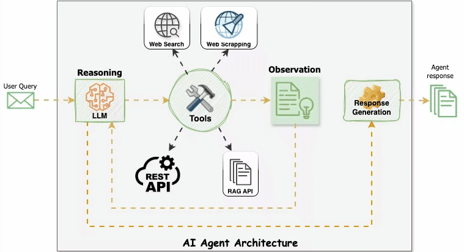
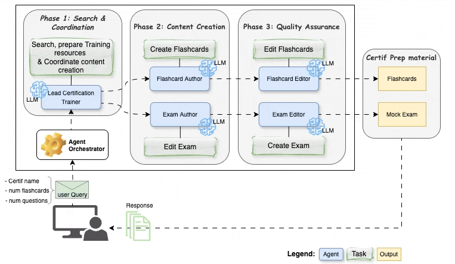

# AI Agents for Certification Exam Preparation

This code repository contains the codes for building AI agents to generate certification exam preparation materials. 

**Important note**: This resource is for **educational purposes only** and does not guarantee the accuracy of the generated materials nor a successful exam.

## Overview

The goal of this project is to build a **certification exam preparation assistant** to generate certification exam preparation materials. It starts from concepts and ends with a production-ready application. It helps you understand the concepts of ai agents and multi-agent systems.

## AI Agents
An agent powered by a Large Language Model (LLM) is capable of performing tasks by following a structured approach like the ReAct pattern (Reasoning + Acting). When the agent receives an input (e.g. a user query), it thinks about the next action to take, performs the action, observes the environment, reasons about the next steps, takes actions accordingly, and so on. It makes use of tools to perform specific actions, like accessing external knowledge or performing calculations. This pattern helps the agent break down complex tasks into manageable steps and maintain a coherent thought process throughout the task execution.



**Multi-agent systems** take this concept further by orchestrating multiple specialized agents, each with their own role and expertise, to collaborate on complex tasks. This approach offers several advantages: it enables division of labor, allows for peer review and quality control, and can handle more complex workflows than a single agent. In our certification exam preparation system, different agents specialize in tasks like researching exam content, creating flashcards, and developing mock exams, working together to produce comprehensive study materials.

## Features
The certification exam preparation assistant has the following features:
- **Generation of flashcards** with:
  - Questions and answers
  - Detailed explanations
  - Relevant resource links

- **Creation of mock exams** with:
  - Multiple choice questions
  - Explanations of the correct answers

- **Quality assurance** through:
  - Review stages
  - Minimal overlap between materials

To generate the certification exam preparation materials, the assistant leverages multiple specialized AI agents:

- **Lead Certification Trainer**: Researches and analyzes certification exam content and requirements
- **Flashcard Author**: Creates detailed flashcards for memorization and quick review
- **Flashcard Editor**: Reviews and refines flashcards for accuracy and clarity 
- **Exam Author**: Develops mock exams with situational questions similar to the real exam
- **Exam Editor**: Reviews and refines mock exams for accuracy and clarity



Read the articles below to learn more about AI agents and the design of the certification exam preparation assistant.

- [Building AI Agents for Certification Exam Preparation: Part 1 - From Concept to Code](https://numericaideas.com/blog/building-ai-agents-for-certification-exam-prep-part-1)
- Building AI Agents for Certification Exam Preparation: Part 2 - Production application with CrewAI, FastAPI, Vue.js, and Docker (*Coming soon*)

## Directory Structure

```
notebooks/
app/
media/
README.md
```

- `notebooks/`: contains the Jupyter notebooks for the article [Building AI Agents for Certification Exam Preparation: Part 1 - From Concept to Code](https://numericaideas.com/blog/building-ai-agents-for-certification-exam-prep-part-1)
- `app/`: (*Coming soon*) will contain the FastAPI app for the production-ready version. It corresponds to the coming part 2 article. 
- `media/`: contains the media files for the repository.
- `README.md`: This file.

The details about the requirements and the usage of the notebook and the app are described in the corresponding folders.
<!-- 
## Example outputs

### Professional Scrum Master I (PSM I)

#### Flashcards


#### Mock Exam


### Google Cloud Certified Professional Machine Learning Engineer (MLE)

#### Flashcards


#### Mock Exam

 -->