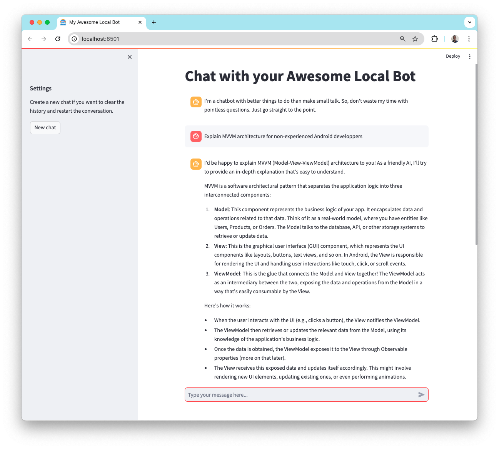
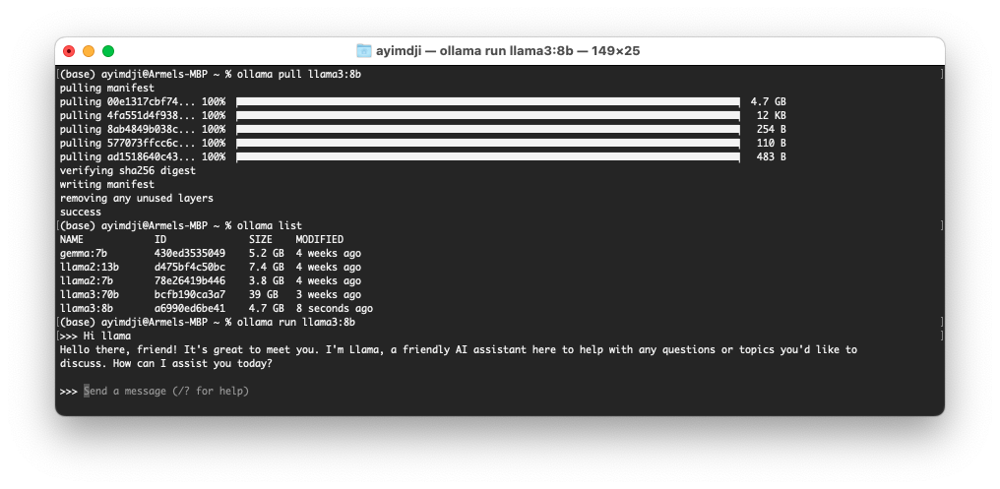
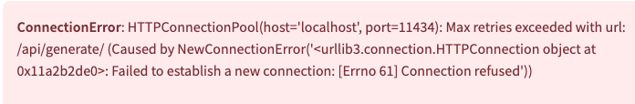

# Local Chatbot with Streamlit GUI

Code for writing your own local chatbot as described in the article [The surprisingly simple way to build your own local "ChatGPT"](article link to be added). 

The article introduces Large Language Models (LLMs) and breaks down the steps to build a local chatbot using [Python](https://www.python.org/), [LangChain](https://www.langchain.com/), [Ollama](https://ollama.com/), an open LLM (e.g., [llama3](https://llama.meta.com/code-llama), [gemma](https://ai.google.dev/gemma)), and [Streamlit](https://streamlit.io/) for the user interface.

- Have a look at the notebook `src/Local-chatbot.ipynb` to understand and test the building blocks.
- `src/chat.py` contains the chatbot code without the graphical user interface. You can run it in a terminal once you've installed Ollama and the required libraries: 
  ```shell
  % pip install langchain, streamlit
  % python chat.py
  ```
- `src/web-app` folder contains the fully functional web app.
  - The streamlit app `chat_streamlit.py`
  - The shell script to launch the app `chatweb.sh`

## Demo screen

The following is a screenshot of your local chatbot in action.



## Installation

The following are the steps you will need to make it run on your **Unix-based computer (Mac, Linux)**. If you are using **Windows**, try to adapt. Unfortunately, I don't have a Windows computer to describe how to do that.

How to set the environment up is described in details in the [article](article link to be added).

1. Clone the repository.

2. Get Ollama up and running.
   * Download and install [Ollama](https://ollama.com/download) for your operating system.
   * Verify Ollama is working by executing `ollama` command in a terminal. It will display ollama command's help. If the command is not found, you might need to reinstall.
   * Use Ollama to download an open LLM. The exact command will depend on the model and the specific version you want. The full list is available [here](https://ollama.com/library). For example, you can pull Llama3 8b (4.7 GB) by running `ollama pull llama3:8b`.
   * Run `ollama list` command to list the models available on your local system and verify llama3:8b is in the list.
   * You can start prompting llama3 from your terminal with `ollama run llama3:8b`
    

3. If [Python](https://www.python.org/) is not installed yet, download and install it.

4. Create and activate a python virtual environment (e.g., `localbot_env`) as described [here](https://packaging.python.org/en/latest/guides/installing-using-pip-and-virtual-environments/#create-and-use-virtual-environments).

    Once activated, the name of your python environment should appear in the terminal as follows:
    ```bash
    (localbot_env) %
    ```

5. Install the required `LangChain` and `Streamlit` libraries in the local chatbot python environment created.

    ```bash
    (localbot_env) % pip install langchain, streamlit
    ```

- In the `src/web-app/` folder, update the shell script `chatweb.sh` to match both the path of your python environment and the path to `chat_streamlit.py`.
  - Replace `/path/to/your/python/env` by the actual path of your python environment 
  - Replace `/path/to/repo/folder/` by the full path of the `local-chatbot` repository you cloned. 

- Grant the shell script execute permission.
    ```shell
    % chmod +x chatweb.sh
    ```
- Add an alias for the shell script file.
  - Open your `~/.zshrc` file with your favorite editor, e.g., `nano`
      ```shell
      % nano ~/.zshrc
      ```
  - Add a new line to define the alias, e.g., `chatweb`
    
    ```shell
      alias chatweb="/path/to/repo/folder/src/web-app/chatweb.sh"
      ```
- Reload the `.zshrc` file by opening a new terminal or running the following command in the same terminal.
    ```shell 
    % source ~/.zshrc
    ```
## Running your chatbot

You can run the chatbot from anywhere in a terminal using its alias. The web UI will be opened in a new tab in your default web browser.
```bash
% chatweb
```

If you have an error while trying to run your chatbot, verify if Ollama server is up and running. 
When Ollama is not running, you'll have an error similar to the one in the following screenshot. In that case, just launch Ollama. 


To automatically launch Ollama at startup, you can add it to your startup applications. This will save you time and ensure Ollama is running whenever you need it.
