# Effortless App Distribution: Publish Your Android App on Google Play Using Bitrise

## Introduction
Welcome to **Part 2** of our comprehensive guide on publishing your Android app using **Bitrise**! In Part 1 of this series (if you haven't read it yet, you can find it [here](https://blog.numericaideas.com/accelerate-android-app-delivery-via-bitrise-ci-cd-pipelines)), we walked you through the process of generating a signed app binary using **Bitrise**, empowering you to automate and streamline your app's build process. Now, in this eagerly awaited continuation, we will dive into the next crucial step: setting up Google Play and getting your app ready for publication. So, fasten your seatbelts as we explore the ins and outs of leveraging **Bitrise** to seamlessly upload and publish your **Android** app on the world's largest app distribution platform. Let's get started!

## Setting up Google Cloud Platform
You need a **Service Account** created in the **Google Cloud Platform** so that Bitrise can authenticate with Google Play Deploy to publish your app. The new **Service Account** has to be invited to **Google Play Console** as a user with the appropriate permission. Before we get started, sign up on **Google Cloud Platform** [here](https://cloud.google.com).
### Create a Service Account
Applications use Service Accounts to make authorized API calls by authenticating as either the service account itself, or as Google Workspace or Cloud Identity users through domain-wide delegation. When an application authenticates as a service account, it has access to all resources that the service account has permission to access. Here is how you can create a service account.

*Skip to step 4 if you want to use an existing project.*
1. Go to Google Cloud [console](https://console.cloud.google.com/).
2. Click on current project name in the top-left part of the page to switch to the desired project.
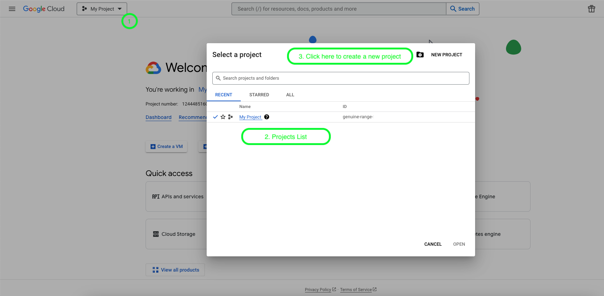
3. Click on **New Project** to create a new project and enter a name for the new project.
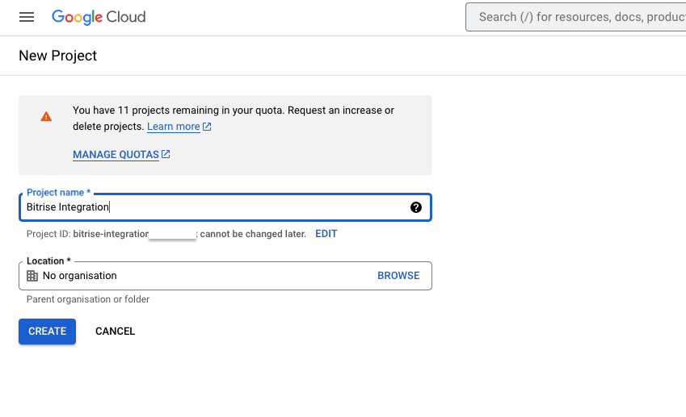
4. Go to the [Create Service Account](https://console.cloud.google.com/projectselector/iam-admin/serviceaccounts) page and select a project from the list
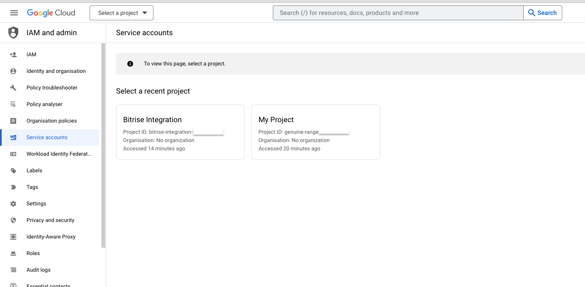
5. Enter the service account  **Name** and **Description** and click **Create and Continue**.
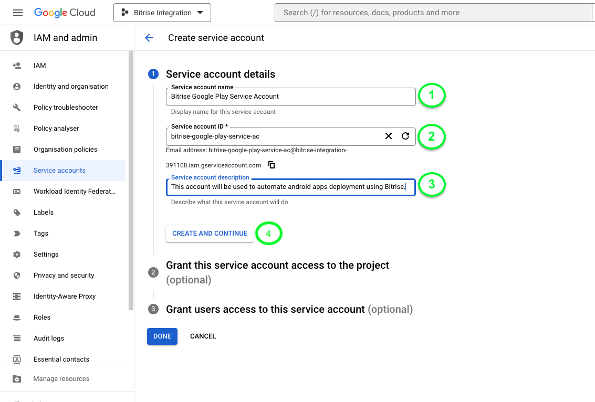
6. Select **Browser** as the role for the Service Account.
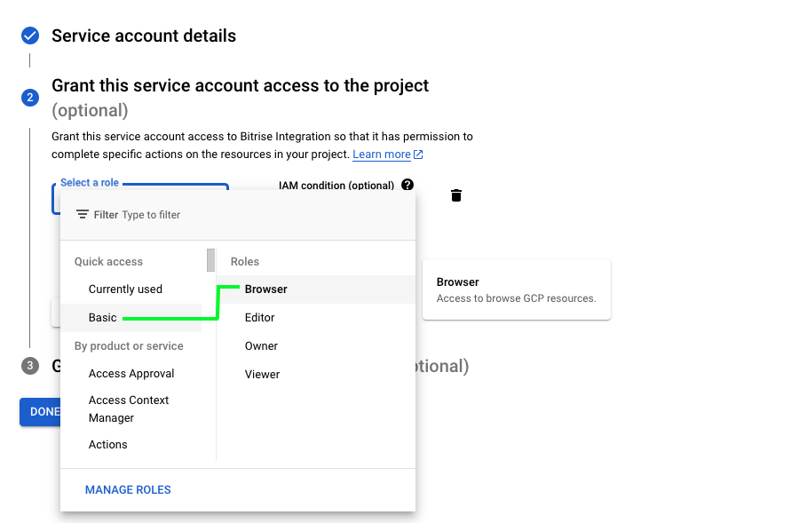
7. Keep the 3rd step as it is and click **Done** to finish creating the service account.
### Create Private Key for Service Account 
After creating the Service Account, you will be redirected to the [list](https://console.cloud.google.com/iam-admin/serviceaccounts) of all Service Accounts.

1. Click on the 3-dotted icon on the right side of your Service Account and select **Manage Keys**.
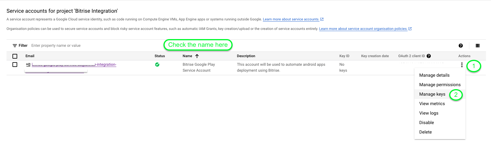
2. On the keys page, click **ADD KEY** -> **Create new Key**. Keep **JSON** as the selected type and click **Create**. This will automatically download and save the key to your local machine. 
Keep this file safe as it will be needed later when configuring **Bitrise** settings.
## Setting up Google Play Console

### Add an app in Playstore
*If you already have an android app setup on Google Play Store, you may skip this step.*

Before we connect our **Service Account**, we need to create and setup our Android app.
1. Create and fill in a **Play Store listing**.
2. Declare **Privacy Policy** and **App Content**.
3. Generate and upload Signed APK bundle.

### Connect Google Play to Service Account

1. Go to [API Access](https://play.google.com/console/u/developers/api-access) page.
2. Scroll down to **Service Accounts** section. Click on **Manage Play Console Permissions** button for your Service Account.
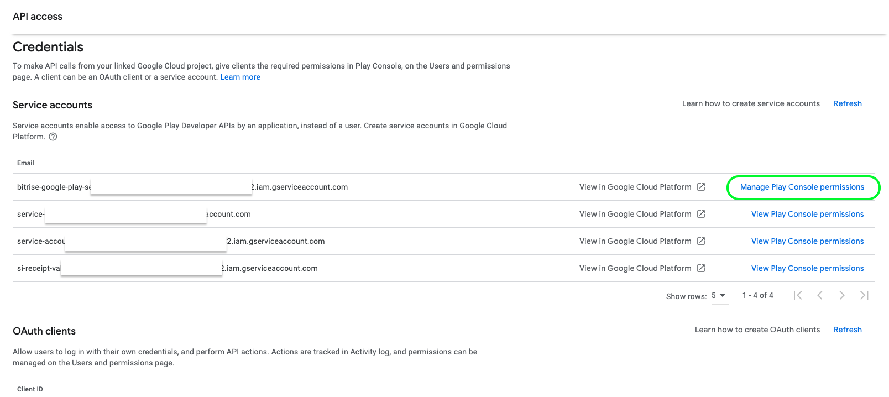
3. In the Invite user window, the Email address field is pre-filled. Do not change it.
4. Make sure the second option **View app information and download bulk reports (read-only)** is checked under API Access.
5. Click **Invite User** button at the bottom-right.
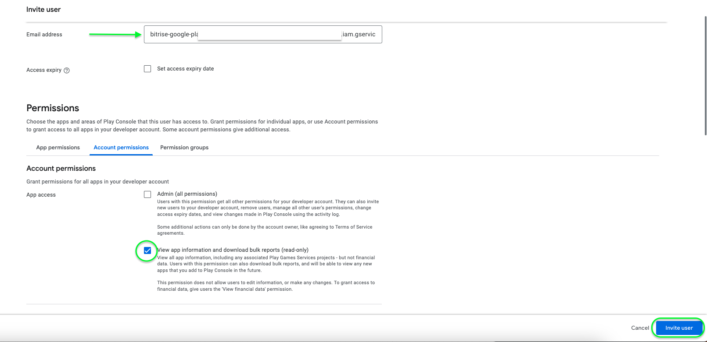
You have successfully prepared your Google Play Console project. A services credential account has been created which is authorized to manage your releases.

## Setting up Bitrise Workflow

### Managing Release Notes
Before we can publish a release to **Google Play Store**, we need to provide **Release Notes** for the new update. **Bitrise** provides utility step just for that. 
1. Go to your Bitrise [Dashboard](https://app.bitrise.io/dashboard) and select your Android app.
2. Click on **Edit workflow**. 
3. Add **Release notes extractor** step after **Git Clone Repository** step. 
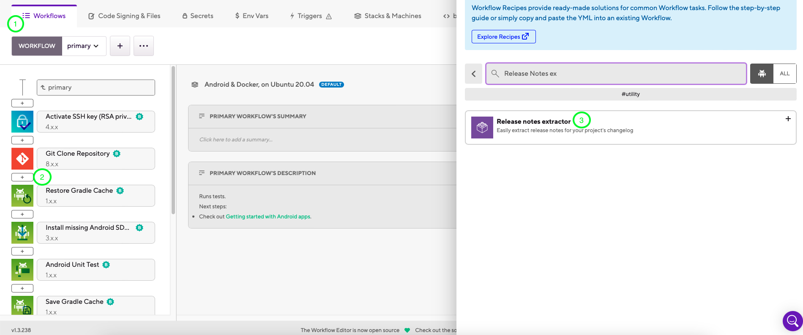
4. Specify the changelog file path. We will be using the default path and name i.e *CHANGELOG.md*
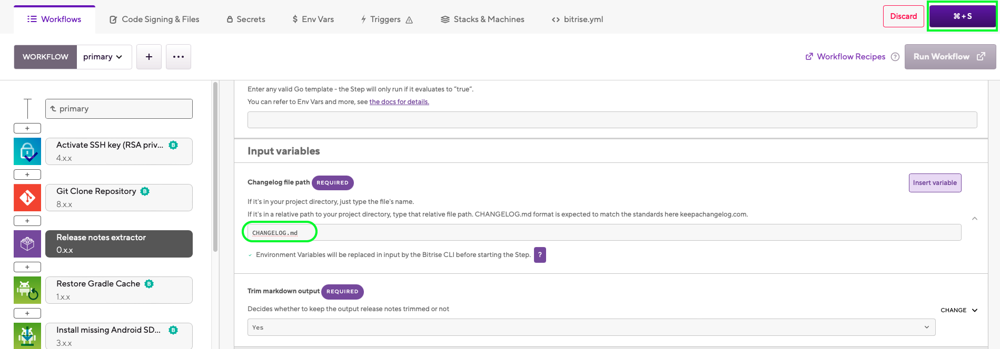
5. Now we need to add *CHANGELOG.md* to our root project directory.
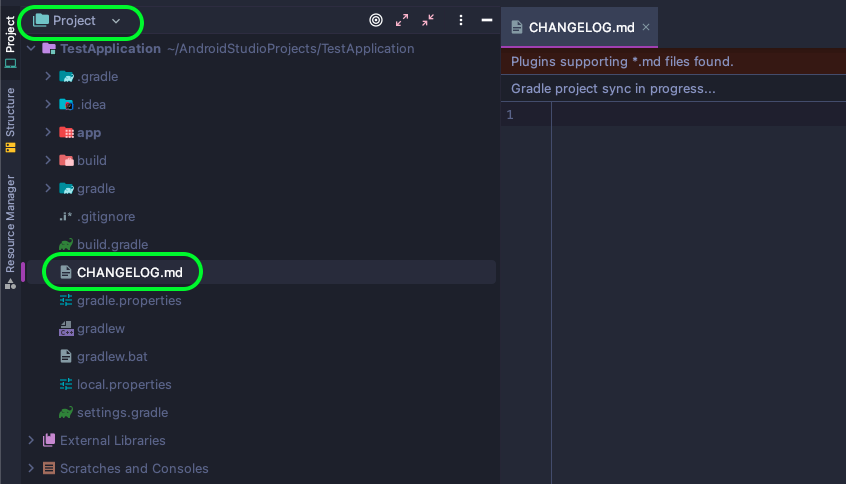
6. The format of  *CHANGELOG.md* should match the standards from [KeepaChangeLog](keepachangelog.com). You can find the format explanation in the following demo file.
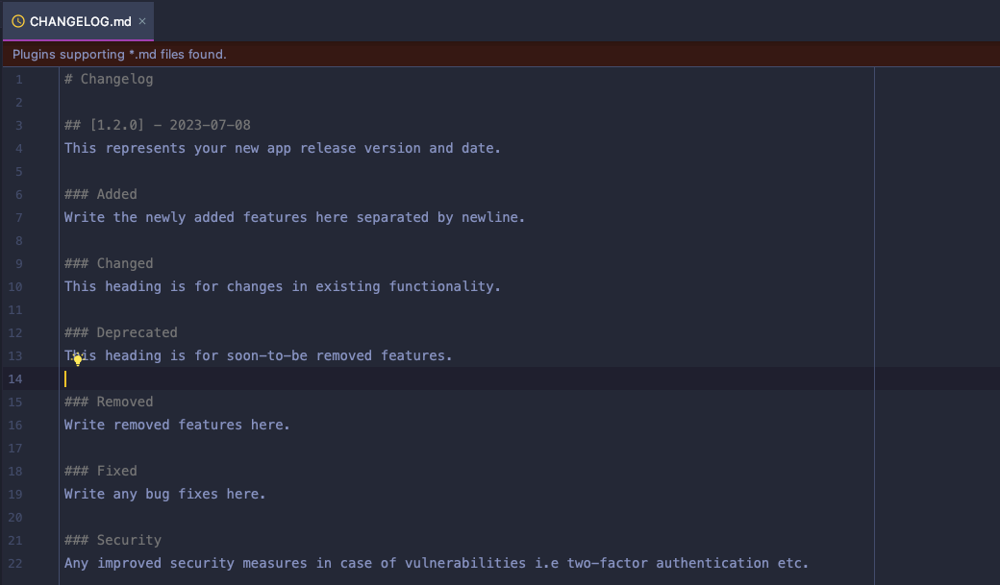
7. Finally push all the changes to Git Remote for Bitrise to read *CHANGELOG.md*.
### Adding Service Account JSON
1. Go to your Bitrise [Dashboard](https://app.bitrise.io/dashboard) and select your Android app.
2. Click on **Edit workflow**. 
3. Go to the **Code Signing & Files** tab, drag and drop your **Service Account** JSON file to **GENERIC FILE STORAGE**.
4. Enter an ID for **Service Account** JSON file and then upload it using the button below.
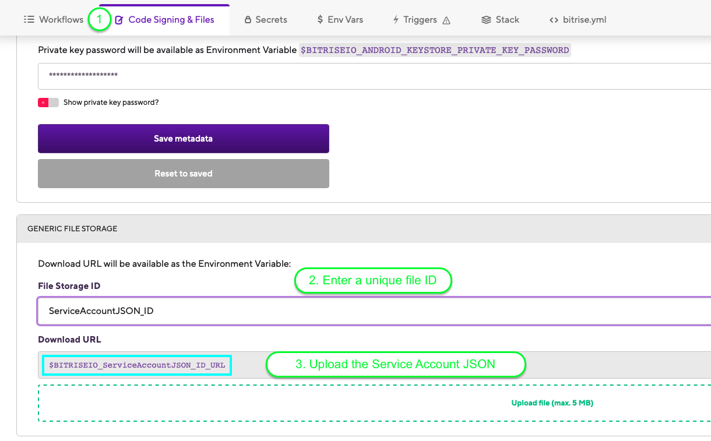
5. Note the file URL *(e.g $BITRISEIO_ServiceAccountJSON_ID_URL)* as it will be needed in the next steps.
### Setting up Google Play Deploy step
1. Go to **Workflows** tab and add **Google Play Deploy** step after **Android Sign** step.
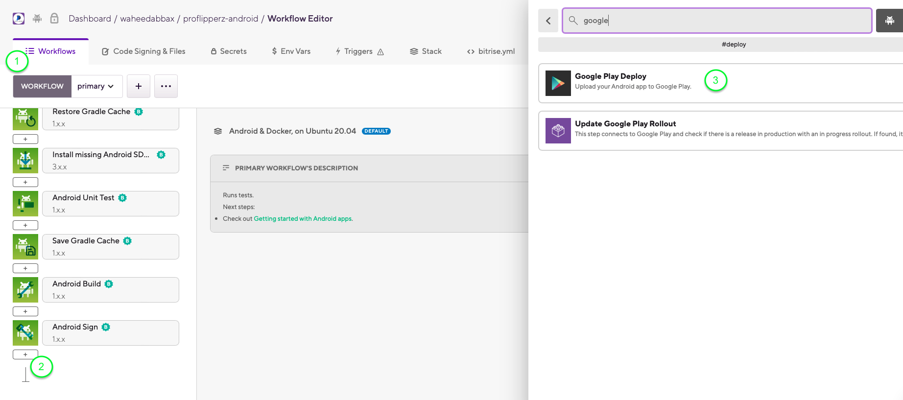
2. Set **Service Account JSON key file path** variable to the previously uploaded JSON file ID e.g *BITRISEIO_ServiceAccountJSON_ID_URL*
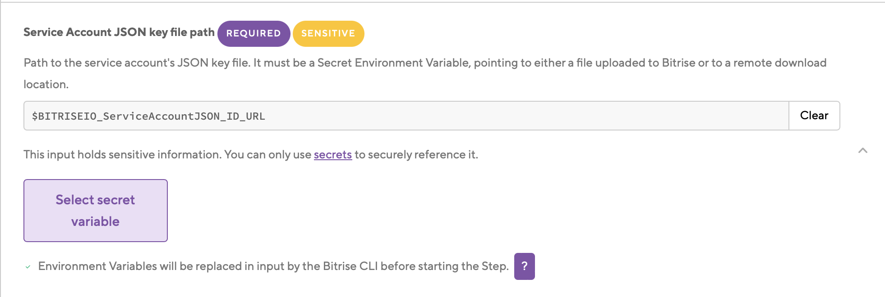
3. Enter **Package name** of your app from **build.gradle** file.
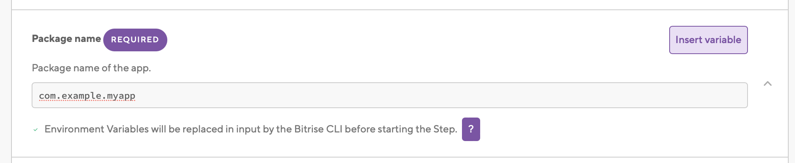
4. Set **App file path** to just **$BITRISE_AAB_PATH**.
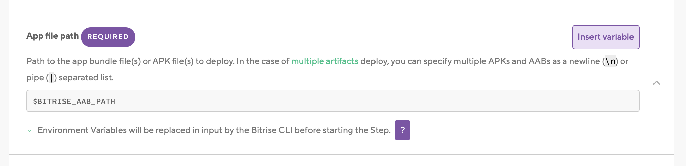
5. The **Track** will be *production* because we want to release the app for everyone.

6. Finally save all the changes and start a build to deploy your app to **Google Play Store** using **Bitrise**.
## Conclusion
In conclusion, leveraging the power of Bitrise for Android app publishing significantly elevates the efficiency and reliability of your development workflow. By seamlessly integrating continuous integration and delivery processes, Bitrise automates the build, test, and deployment stages, allowing developers to focus more on innovation and less on repetitive tasks. Embrace Bitrise to unlock the true potential of streamlined app deployment and set your development journey on a path of success.