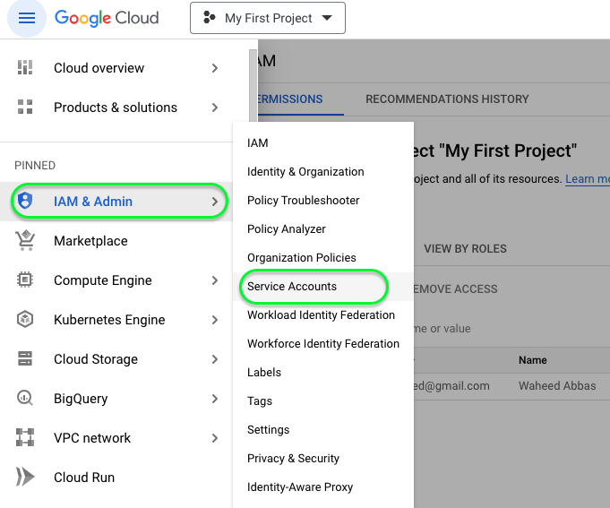
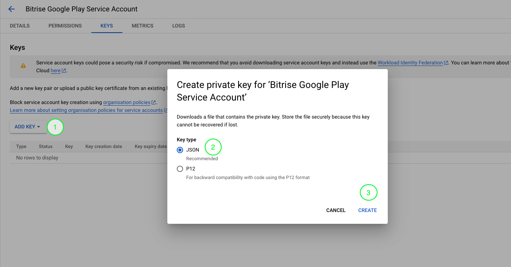
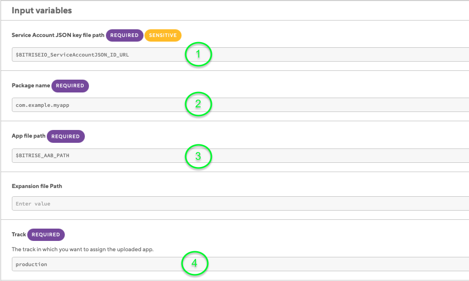

# Effortless App Distribution: Publish Your Android App on Google Play Using Bitrise

## Introduction
Welcome to **Part 2** of our comprehensive guide on publishing your Android app using **Bitrise**! In Part 1 of this series (if you haven't read it yet, you can find it [here](https://blog.numericaideas.com/accelerate-android-app-delivery-via-bitrise-ci-cd-pipelines)), we walked you through the process of generating a signed app binary using **Bitrise**, empowering you to automate and streamline your app's build process. In this continuation, we will dive into the next crucial step: setting up Google Play and getting your app ready for publication. So, fasten your seatbelts as we explore the ins and outs of leveraging **Bitrise** to seamlessly upload and publish your **Android** app on the world's largest app distribution platform. Let's get started!

## Setting up Google Cloud Platform
We need to setup **Google Cloud** project and a **Service Account** for Bitrise to authenticate with Google Play to publish our app.

### Google Cloud Project Set up
To begin, the first step is to create a new Google Cloud project. You can do this by visiting the [Google Cloud console](https://console.cloud.google.com/). Once you're there, select current project name in the top-left corner of the page and click on it to either select an existing project or create a new one.

  

If you need to create a new project, click on **New Project** and simply enter a name for the new project and click **Create**. Make sure the project name clearly reflects the purpose of your project.


By following these steps, you'll establish the foundation for your work within Google Cloud.

### Create a Service Account
Applications use Service Accounts to make authorized API calls by authenticating as either the service account itself, or as Google Workspace or Cloud Identity users through domain-wide delegation. When an application authenticates as a service account, it has access to all resources that the service account has permission to access.

To create a Service Account, start by visiting the [Service Accounts](https://console.cloud.google.com/projectselector/iam-admin/serviceaccounts) page. Once on this page, click on **Create Service Account**.



### Service Account Details 
 On the new Service Account Details page, provide a **name** and **description** for your Service Account to make it easily identifiable. After filling in these details, click **Create and Continue**.


### Service Account Role 
Now, it's time to select the role for your **Service Account**. In this case, choose the **Browser** role to ensure it has the appropriate permissions. After selecting the role, simply keep the third step as it is and click **Done** to complete the Service Account creation.


### Create a Private Key for Service Account 
After creating the Service Account, you will be redirected to the [list](https://console.cloud.google.com/iam-admin/serviceaccounts) of all Service Accounts. The next crucial step is to generate a private key for it.

Proceed by clicking on the three-dotted icon on the right side of your Service Account and select **Manage Keys**. On the keys page, click **ADD KEY** and then select **Create new Key**. Make sure to keep **JSON** as the selected type, and then click **Create**. Your browser will automatically download and save the key to your local machine. Be sure to keep this file safe because you'll need it when configuring Bitrise settings.



## Setting up Google Play Console

### Initial Setup of Your Android App on the Google Play Store
*If you already have an Android app set up on Google Play Store, you may skip this step.*

- **Create a Google Play Developer Account:**
  - Sign in to your Google account.
  - Visit the [Google Play Console](https://play.google.com/apps/publish/) website.
  - Agree to the terms and conditions and pay the one-time registration fee.

- **Create a New Application:**
  - Click on "Create Application."
  - Choose the default language and enter the title of your app.
  - Click "Create."

- **App Listing Details:**
  - Fill in the app's basic information, such as the default language, app title, and a short description.
  - Upload a high-resolution app icon and feature graphic.
  - Add a comprehensive description, detailed screenshots, and promotional videos to showcase your app's features.

- **App Content Rating:**
  - Complete the content rating questionnaire, answering questions about the app's content and audience.
  -  The Google Play Store will assign an appropriate content rating based on your responses.

- **Pricing and Distribution:**
  - Set the pricing model for your app (free or paid).
  - Choose the countries or regions where you want to make your app available.

- **App Releases:**
  - Upload your AAB (Android Package) file. Ensure it's signed with a Keystore for security.
  - Define release tracks (alpha, beta, production) and manage the rollout strategy.
  - Configure advanced settings like targeting specific devices and setting up advanced optimizations (such as app bundles for optimized APK delivery).

- **Optimize for Discoverability:**
  - Add relevant keywords to improve searchability.
  - Choose a category and add relevant tags to your app listing.

- **App Review and Launch:**
  - Review all the information and settings to ensure they are accurate.
  - If your app requires review by Google Play for compliance, wait for the review process to complete.
  - Once the review is successful (if applicable), click "Publish" to make your app live on the Google Play Store.


### Connect Google Play to Service Account
Before **Bitrise** can start managing app releases, you need to set up **API access** to your Google Play Developer Account. Begin by going to the [Google Play Console](https://play.google.com/console). This is the portal where you manage your Android app's distribution and configurations.

Once you're in the Google Play Console, locate and click on [API Access](https://play.google.com/console/u/developers/api-access) in the left-side menu. This section is where you set up the necessary access for your Service Account to interact with your app's information and data. Scroll down to **Service Accounts** section. Click on **Manage Play Console Permissions** button for your Service Account.


In the **Invite user** window, you'll find the Email address field pre-filled. Ensure you do not make any changes to it. Click the "Invite User" button located at the bottom-right of the window.

You have successfully prepared your Google Play Console project. A services credential account has been created which is authorized to manage your releases.


## Setting up Bitrise Workflow

### Managing Release Notes
Before we can publish a release to **Google Play Store**, we need to provide **Release Notes** for the new update. **Bitrise** provides a utility step just for that. 

### Add Bitrise Release Notes Step
To begin, visit your **Bitrise** [Dashboard](https://app.bitrise.io/dashboard) and select the Android app you're working on. Once in your app's dashboard, click on "Edit workflow" to make changes to your Bitrise workflow. This is where you'll integrate the release notes extraction step.

Now, add the **Release notes extractor** step to your workflow, placing it after the "Git Clone Repository" step. In the configuration of this step, you'll need to specify the changelog file path. We will be using the default path and name i.e *CHANGELOG.md*


### Add Change Log File to Project
Add the **CHANGELOG.md** file to the root directory of your project. This is where you'll store your changelog information. 


Additionally, it's essential that the format of your **CHANGELOG.md** file aligns with the standards outlined by [KeepaChangeLog](keepachangelog.com). You can refer to the provided demo file for detailed format guidelines.

```markdown
# Changelog

## [1.2.0] - 2023-07-08
This represents your new app release version and date.

### Added
Write the newly added features here separated by newline.

### Changed
This heading is for changes in existing functionality.

### Deprecated
This heading is for soon-to-be removed features.

### Removed
Write removed features here.

### Fixed
Write any bug fixes here.

### Security
Any improved security measures in case of vulnerabilities i.e two-factor authentication etc.
```

Finally push all the changes to Git Remote for Bitrise to read *CHANGELOG.md*.

### Adding Service Account JSON

Within the workflow editor, navigate to the **Code Signing & Files** tab and enter an ID under **GENERIC FILE STORAGE** for the **Service Account** JSON file and upload it using the button below.


Note the file URL *(e.g $BITRISEIO_ServiceAccountJSON_ID_URL)* as it will be needed in the next steps.

### Adding Google Play Deploy step
The Step uploads your Android app to Google Play. It works with both APK and AAB files.
Please note that in order to successfully use this Step, you must upload your first APK or AAB file manually, using Google's own web interface! Once you uploaded one APK or AAB of your app to Google Play manually, you can use **Bitrise** for all subsequent versions.

Start by navigating to the Workflows tab within **Bitrise** and add **Google Play Deploy** step after **Android Sign** step.


### Configuring Google Play Deploy step
Within the **Google Play Deploy** step, you need to configure several variables. The first one is the **Service Account JSON** key file path. This variable should point to the JSON file you uploaded earlier e.g *BITRISEIO_ServiceAccountJSON_ID_URL*. Next, provide **Package name** of your app from **build.gradle** file. Set **App file path** to just **$BITRISE_AAB_PATH**. Lastly, the release **Track** will be *production* because we want to release the app for everyone.



Once all these configurations are in place, save the changes you've made to your **Bitrise** workflow. After saving, start a build to initiate the deployment process of your Android app to the **Google Play Store** using **Bitrise**.

## Conclusion
In conclusion, leveraging the power of Bitrise for Android app publishing significantly elevates the efficiency and reliability of your development workflow. By seamlessly integrating continuous integration and delivery processes, Bitrise automates the build, test, and deployment stages, allowing developers to focus more on innovation and less on repetitive tasks. Embrace Bitrise to unlock the true potential of streamlined app deployment and set your development journey on a path of success.