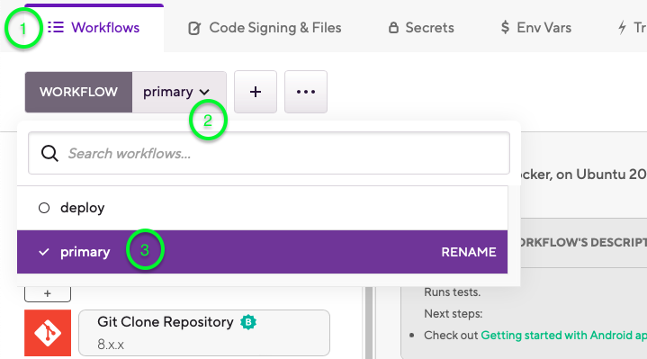
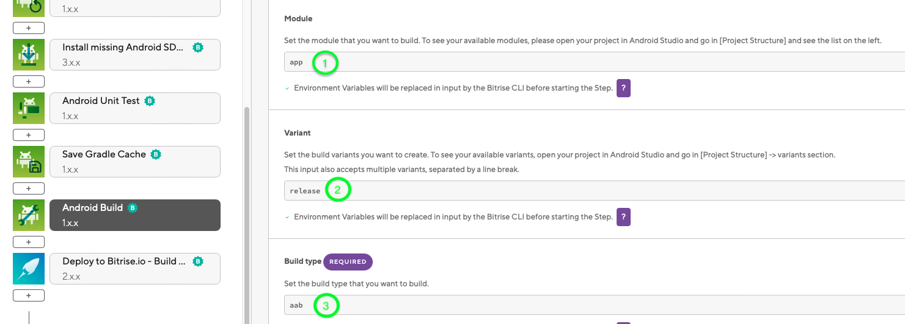

# How to set up a CI/CD pipeline for your Android app using Bitrise

## Introduction
**Bitrise** is a Continuous Integration and Delivery (CI/CD) Platform as a Service (PaaS) with a main focus on mobile app development (iOS, Android, React Native, Flutter, and so on). It is a collection of tools and services to help you with the development and automation of your software projects.
## Why use Bitrise?
Using a CI/CD platform like Bitrise for your Android app development has many benefits:
1. **Efficiency:** Bitrise automates many of the manual steps involved in the development, testing, and deployment process, saving you time and effort.
2. **Faster Feedback:** With Bitrise, you get feedback on your app's performance and functionality much faster than manual testing, so you can address issues as they arise.
3. **Consistency:** Bitrise ensures that all of your builds are consistent, regardless of who runs them. This reduces the chances of introducing errors or inconsistencies into your app.
4. **Integration:** Bitrise integrate with other development tools like GitHub, Jira, and Slack, making it easier to incorporate them into your existing workflow.
5. **Scalability:** It can scale to accommodate projects of any size, from small apps to enterprise-level applications.

Overall, using Bitrise can help you streamline your Android app development process, improve the quality of your app, and stay ahead of the competition.
## Setting Up a Bitrise Account
You can create a **Bitrise** account by visiting Bitrise Sign up page [here](https://app.bitrise.io/users/sign_up). You can sign up using your **Google** or **GitHub** account or create a new Bitrise account using your email address. Signing up with either of the Git service providers means you connect your Bitrise account to your account on that service provider. With a connected account, you can grant Bitrise access to any of your repositories on that account.
After signing up, you can connect your Bitrise account to all of the three supported Git service providers. For example, after you signed up with **GitHub**, you can connect your **Bitrise** account to both your **GitLab** and **Bitbucket** accounts, too, and access any repositories you have on those accounts.
## Adding an Android app to Bitrise
1. Go to your Bitrise [Dashboard](https://app.bitrise.io/dashboard).
2. Click the + sign on the top menu bar and select Add New App on web UI, which takes you to the [Create New App page](https://app.bitrise.io/apps/add).

3. Select Workaspace and set the privacy of the app to either Private or Public and click Next.

4. Choose Git Provider and select your repository from the popup list.

5. When prompted to set up repository access, click No for auto-add SSH key or manually copy the provided SSH key to gitlab settings.
6. Select your main branch from the dropdown and choose **Yes, auto-detect configuration**. Bitrise will now start validating your project to detect it as an Android Project. 
7. The Bitrise Scanner selects the main module of your project by default. If there are more modules to choose from in the Module list, select a module that works best for your project.
8. Select a variant for building (you can Select All Variants which will generate all variants in Artifacts) and select a variant for testing too. You can find list of your build variants from android studio.

9. Register a webhook when prompted so that Bitrise can start a build automatically when code is pushed to your repository. Skip this part if you want to manually trigger builds.

Congraguations! Bitrise will kick off your first test build now!

## Signing your Android App
Now that you have successfully built your Android project, its time to sign your apk for production release.
1. [Generate a keystore file](https://developer.android.com/studio/publish/app-signing#generate-key) or use existing if you have one already.
2. Go to your Bitrise [Dashboard](https://app.bitrise.io/dashboard and select your Android app.
3. Click on **Edit workflow**. 
 
4. Go to the **Code Signing & Files** tab and drag-and-drop your keystore file to the ANDROID KEYSTORE FILE field.
5. Fill out the **Keystore password**, **Keystore alias**, and **Private key password** fields and click Save metadata.

6. Go to **Workflows** tab and choose a workflow from the dropdown.

7. Add **Android Build** step after **Android Unit Tests** OR **Save Gradle Cache**. Just make sure its before **Android Sign** and **Deploy** steps.

8. Select **Android Build** step and Fill out the **Input Variables** section if the values are missing.

9. Add **Android Sign** step after **Android Build**. There is no need to change any input variables. Just make sure the  **Keystore** file configuration is correct.

Hit **Run Workflow**. Once the build is finished, you have now successfully **Signed** your Android app using **Bitrise**.