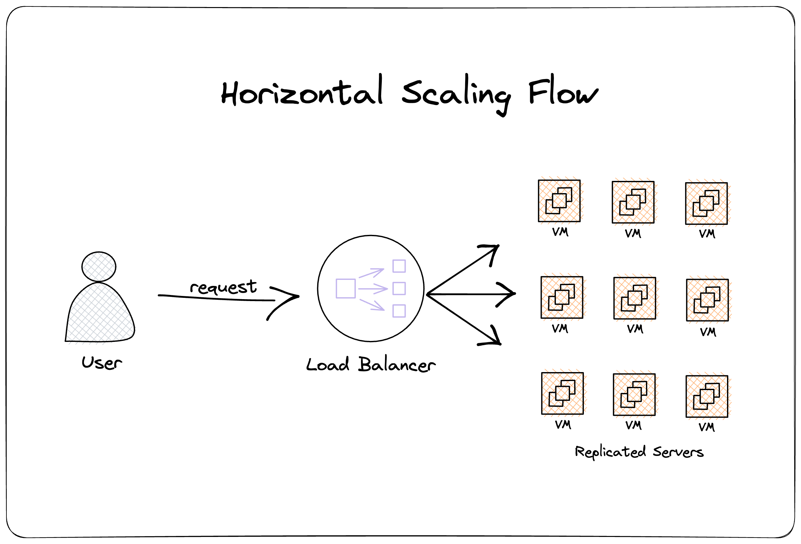
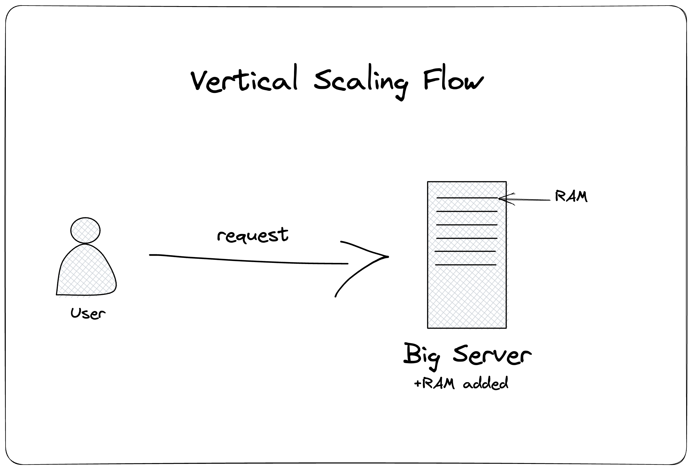
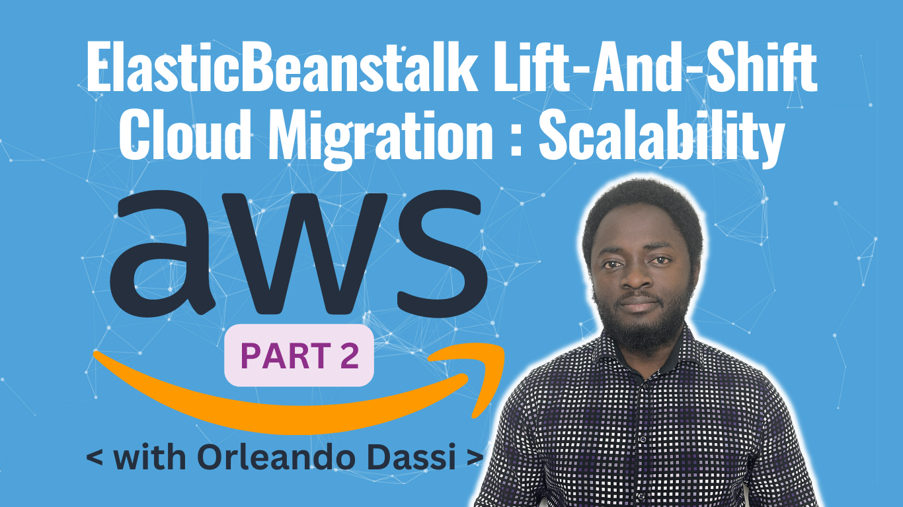

# Scalability Types in Software Architecture

**This article was originally written by "Orleando Dassi" on the blog**: https://blog.numericaideas.com/scalability-types

## Introduction
A scalabe system is one that has the ability to adapt itself by providing more or less resources in order to meet demands. Nowadays, with the unpredictability of monoliths and microservices systems, it’s important to always build a system to be scalable (or to be ready to) no matter if we are dealing with compute, storage, database, and any other components.

## Scalability Types
There’s no single way to make a system scale, sometimes it’s being done by offloading some tasks to other threads, but in this section, we’ll focus on the main **Scaling Types** applied to IT systems, which are the **vertical** and the **horizontal** approches, respectively referred to as scaling **UP** and scaling **OUT**.

### Horizontal Scaling
Working on scaling your system horizontally means making sure that more compute resources, generally with the same specs, are added to your infrastructure. To make it simple, if one computer (VM: virtual machine) was used to process your web App requests, with more processing power needed, more computers will be added to the float while making sure to use a **Load Balancer** that distributes the workload amongst them.

Despite it being complex to implement, one of the biggest advantage of Horizontal Scaling is the increased redundancy since the App or one of its component is getting duplicated into a completely different device to support more trafic, which means, even if one of the duplicated part goes down, the system won’t fall so it’s good to avoid [single point of failure](https://en.wikipedia.org/wiki/Single_point_of_failure).

### Vertical Scaling
The purpose of scaling remains, but the approach differs, with Vertical Scaling, instead of adding more computers to our infrastructure, we’ll increase the specs of the existing one. To be more specific, an example could be to move from a virtual server of 32 GB of RAM to 64 GB. Any amovible spec as the CPU could be into play, not only the RAM.

In contrary to the precedent, it’s easier to apply this approach and to manage vertically scaled systems. But if it’s the only method that our system benefited, we should watch it carrefully since there’s a big risk of downtimes.

### Mixed Scaling
In reality, depending on the system, it’s possible to mix up both scaling types in order to reach our goals, putting together the vertical and horizontal ways for our App to be as responsive as possible according to our target.

## Scaling Policies
There are many approaches for the scaling activities to be launched so that our infrastructure changes to accomodate the trafic, the most common are:

- **Manual scaling**: in which you’ll personally handle the scaling by manually adding and removing instance(s) to the pool.
- **Dynamic scaling**: where some conditions are to be met for a **“scale activity”** to launch automatically, they can be of many natures depending on what you are measuring your infrastructure operations with. A system could scale based on the usages of the following metrics: the CPU, Latency, Memory (RAM), and so on.
- **Scheduled scaling**: scaling based on a schedule (date + time) gives you the possibility to scale your infrastructure in response to **predictable trafics** _for e.g. Christmas, Black Friday._

## Cloud Scaling Services
Cloud enables us to accomplish even more quickly, in case you opted for moving into the Cloud, depending on the public Cloud provider that you use, some services are available to scale infrastructures:

- **AWS** Auto Scaling Group
- **Azure** Scale Set
- **GCP** Managed Instance Groups

Let's note that the **Elasticity** property of the Cloud allows your system, not only to scale **UP** and **OUT** but also to scale **DOWN** and **IN** to release unused resources once the trafic decreased.

If you are interested into a [demo](https://www.youtube.com/watch?v=KHOxmHL5USI) of how we scaled **OUT/IN** a project migrated to AWS public Cloud, the following video is for you:

———————

We have just started our journey to build a network of professionals to grow even more our free knowledge-sharing community that’ll give you a chance to learn interesting things about topics like cloud computing, software development, and software architectures while keeping the door open to more opportunities.

Does this speak to you? If **YES**, feel free to [Join our Discord Server](https://discord.numericaideas.com) to stay in touch with the community and be part of independently organized events.

———————

## Conclusion
This article higlighted the different types of **Scalability Types**, their particularities as well as pointing out what the possibilities are in term of services while using public Clouds like AWS, Azure or GCP.

Thanks for reading this article, recommend and share if you enjoyed it. Follow us on [Facebook](https://www.facebook.com/numericaideas), [Twitter](https://twitter.com/numericaideas), and [LinkedIn](https://www.linkedin.com/company/numericaideas) for more content.
