# **Building a Serverless Web Application with AWS S3, Lambda, DynamoDB, CloudFront, and AWS WAF**

## **Introduction**
Serverless architecture has revolutionized the way we build and deploy web applications. By abstracting away server management and scaling, it allows developers to focus on writing code and delivering value to users. In this article, we will explore the world of **serverless web applications** using a powerful combination of AWS services. We will leverage **AWS S3** for hosting, **Lambda functions** for data retrieval and storage, **DynamoDB** as a scalable database, **API Gateway** for creating RESTful APIs, **CloudFront** for global content delivery, and **AWS WAF** to secure against SQL injections. Join us on this journey as we dive into the implementation details, best practices, and benefits of building a serverless web application using AWS services.

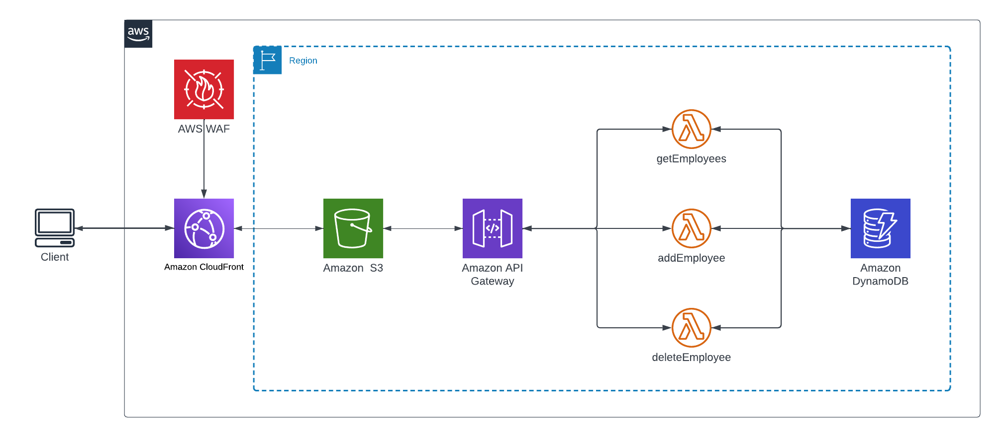

## **Overview of serverless architecture**
Serverless architecture is a cloud computing paradigm that eliminates the need for managing servers and infrastructure. In this model, the cloud provider takes care of server provisioning, scaling, and maintenance, allowing developers to focus solely on writing code. Applications are built using small, stateless functions that are triggered by events. These functions are executed in a managed environment and automatically scale based on demand. Serverless architecture offers benefits such as cost efficiency, scalability, reduced operational overhead, and rapid development.

## **Introduction to the AWS services used in the article**
To build a serverless web application, we leverage several key AWS services. Firstly, Amazon S3 (Simple Storage Service) provides us with a highly scalable and durable storage solution for hosting our web application files. We utilize AWS Lambda, a serverless compute service, to write functions that retrieve and store data, ensuring efficient and on-demand processing. DynamoDB, a fully managed NoSQL database, serves as our data storage solution, offering scalability and low latency access. AWS API Gateway enables us to create RESTful APIs to expose our Lambda functions securely. CloudFront, AWS's content delivery network (CDN), ensures fast and reliable global content distribution of our web application. Lastly, AWS WAF (Web Application Firewall) adds a layer of security by protecting against SQL injections and other web attacks. Together, these AWS services provide a comprehensive infrastructure for building a secure and scalable serverless web application.

## **Prerequisites**

Before diving into building a serverless web application with AWS services, it is essential to have a few prerequisites in place. 

- **AWS Account**: Create an AWS account to access and utilize the AWS services mentioned in this article.
- **AWS IAM**: Understand the basics of AWS `Identity and Access Management (IAM)` for managing user permissions and roles within the AWS environment.
- **Knowledge of AWS Lambda**: Familiarize yourself with AWS Lambda, as it will be used to write the serverless functions for this application.
- **Understanding of REST APIs**: Have a basic understanding of REST (Representational State Transfer) APIs and their fundamental principles, including the `HTTP` methods such as `GET`, `POST`, and `DELETE`, which will be used to interact with the API Gateway.

## **STEP 1: Configure AWS S3, CloudFront, and WAF**

### What's AWS S3

[**AWS S3**](https://aws.amazon.com/s3/) (Simple Storage Service) is a highly scalable and durable cloud storage service provided by Amazon Web Services. It allows you to store and retrieve large amounts of data, such as files, images, videos, and backups, in a secure and cost-effective manner.

With AWS S3, you can create buckets, which act as containers for storing your data. Each bucket has a globally unique name, and you can choose the region where you want to host your data. S3 provides strong data consistency and durability, ensuring that your files are accessible and protected against data loss.

### Setting up an AWS S3 bucket for hosting the web application

To begin, log in to the AWS Management Console and navigate to the `Amazon S3` service. From there, you can create a new S3 bucket by clicking on **Create Bucket**.

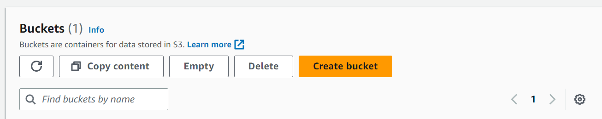

Pprovide a unique name for your bucket. It's important to choose a name that is globally unique within the entire `AWS S3 namespace`. This ensures that there are no naming conflicts with existing buckets. Select the region where you want to host your web application.

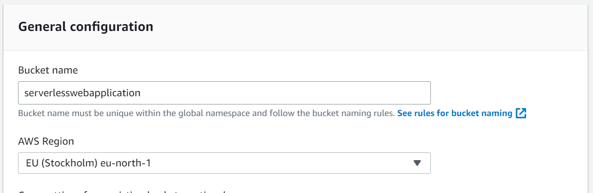

Then click on `Create bucket`

Once the bucket is created, you can proceed to upload your web application files. Click on your bucket and select the **Upload** option then **Add files**. 

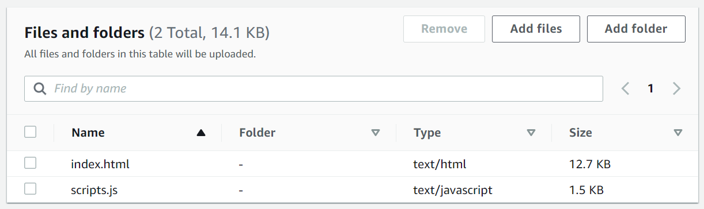

Select the files from your local machine that make up your web application, and click on `Upload` to add them to your bucket.

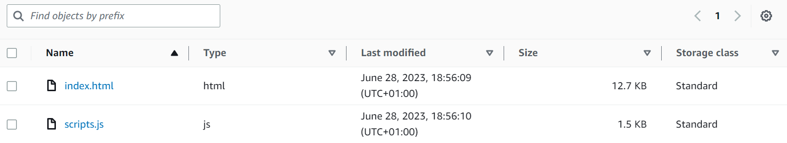

### What's AWS WAF

[AWS WAF](https://aws.amazon.com/waf/) (Web Application Firewall) is a cloud-based firewall service that helps protect your web applications from common web exploits and attacks. It allows you to define and enforce rules to control access to your web application and filter out malicious traffic.

When setting up AWS WAF, you create a Web ACL (Access Control List), which acts as a container for the rules and conditions that define how your application should handle incoming requests. These rules and conditions help identify and block potential threats, such as SQL injection attacks, cross-site scripting (XSS) attacks, and more.

### Setting up AWS WAF rules

Navigate to the **AWS WAF service** in the AWS Management Console.

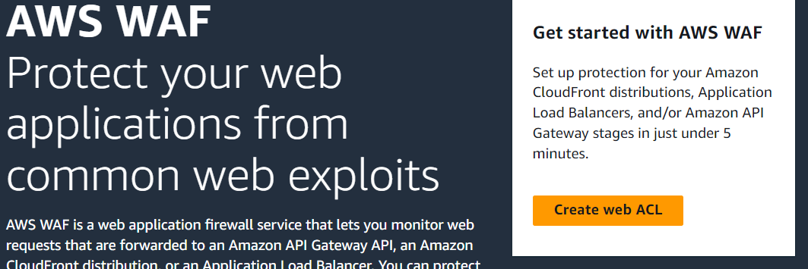

Click on  **Create web ACL** to create a new web Access Control List (ACL).

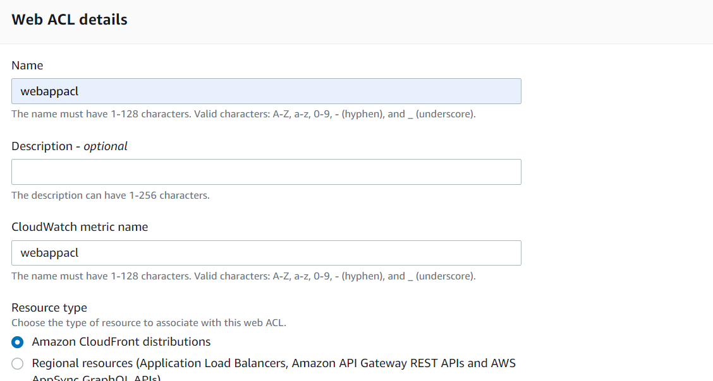

Provide a name for your web ACL and select ressource type in our case **Amazon cloudFront distributions**. Then click on **Next**

In the **Add rules and rule groups** section, click on Add rules, and then select Add managed rule groups.

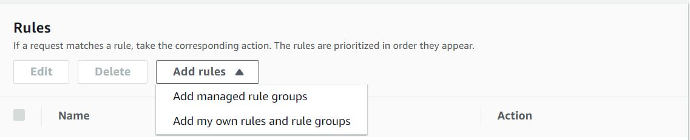 

click on Add rules then select `Add managed rule groups`

 

In the next window, expand **AWS Managed rule groups** and scroll down to **Free rule groups**. Add a few rules to protect your application.

 

Scroll down and click on **Add rules**.

To ensure that requests not matching any rules are allowed, select **Allow** under the **Default action** section.

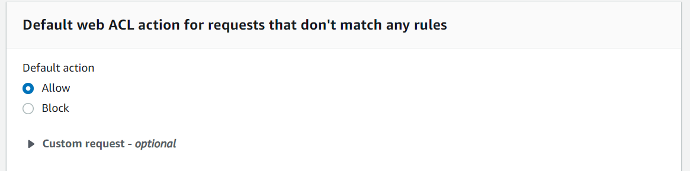 

Click on `Next` until you reach the end, leaving the default settings as they are. Finally, review your configurations and click on**Create web ACL.** Your web ACL has been created.

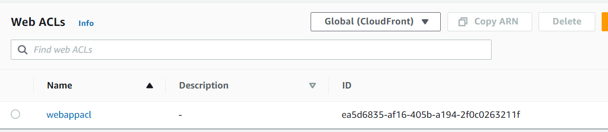 

### What's CloudFront

[**CloudFront**](https://aws.amazon.com/cloudfront/) is a content delivery network (CDN) service provided by Amazon Web Services (AWS). It enables the efficient distribution of your content, including web pages, images, videos, and other static or dynamic files, to end users across the globe.

CloudFront works by caching your content in edge locations, which are distributed globally. When a user requests content, CloudFront delivers it from the edge location that is geographically closest to the user, reducing latency and improving the overall performance of your application.

### Setting up CloudFront distribution for the S3 bucket

Navigate to the **AWS CloudFront service** in the AWS Management Console.

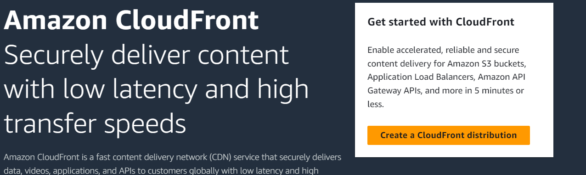 

Click on **Create Distribution** to create a new CloudFront distribution. In the Create Distribution interface, click on the `Origin Domain` field and select the previously created S3 bucket.

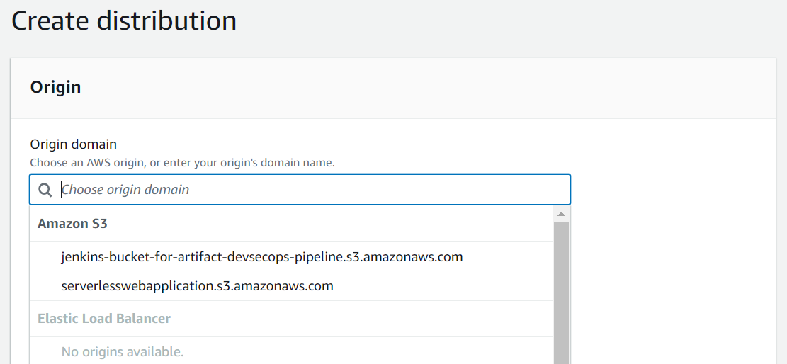 

Under **Origin Access,** select `Origin access control setting`

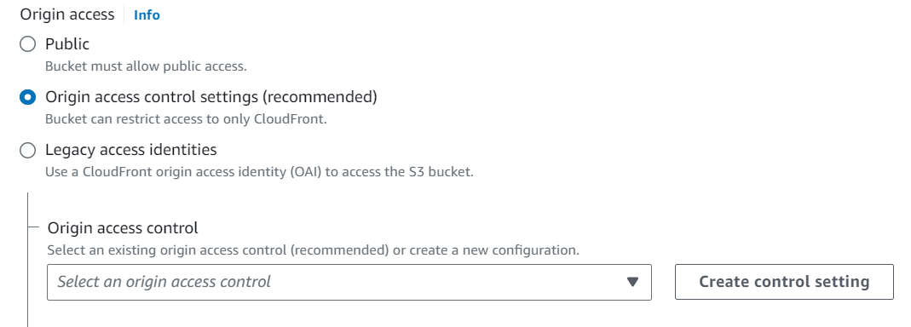 

Click on **Create control setting Identity**, leaving all settings at their default values, and then click on **Create**.

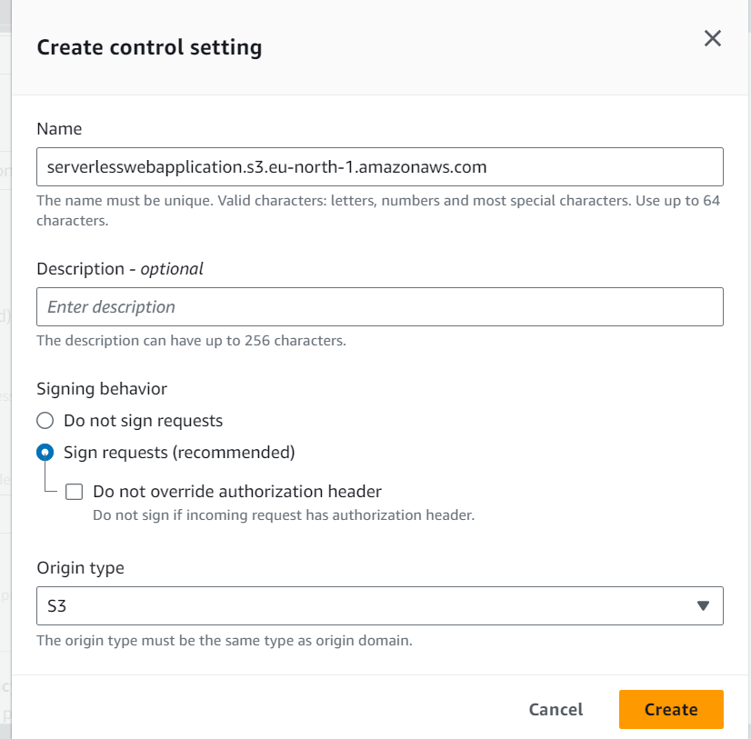 

For the **viewer protocol policy,** apply the same settings as shown in the screenshot below.

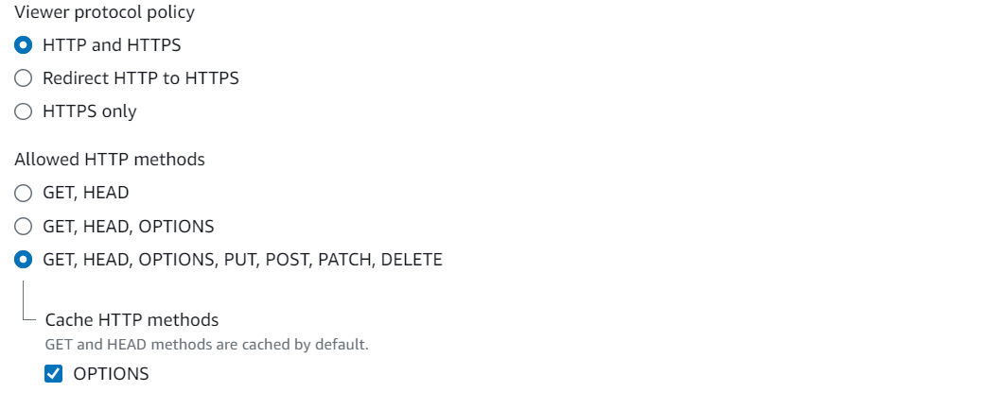 
In the next section, apply the following configurations and select the previously `created web ACL`

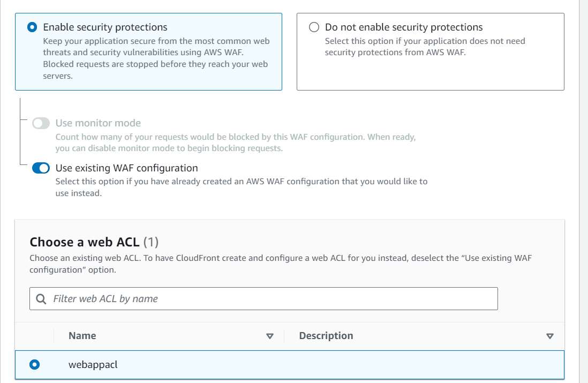 

In the **Default Root Object** section, enter the name of your main HTML file, in our case, **index.html**.

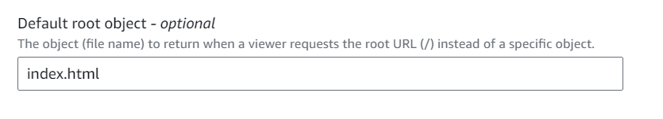 

Click on **Create.** After the new distribution is created, click on **Copy Policy.**

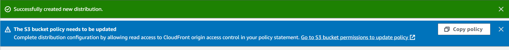 
This policy will grant **CloudFront access to our S3 bucket**. To apply it, go back to the S3 service, select the bucket containing your website, and go to **Permissions**.

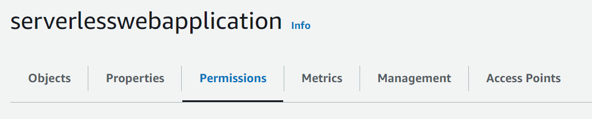 

In the **Bucket Policy** section, click on **Edit**, delete the existing content, paste the copied policy, and click on **Save Changes**.

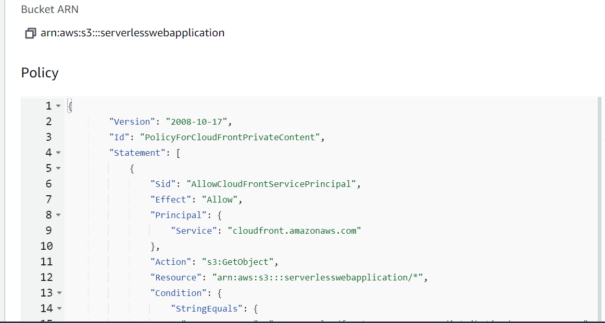 

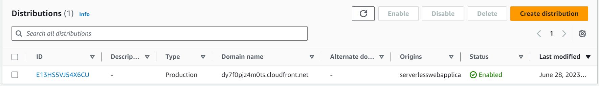 

Wait a few minutes for your distribution to deploy, then copy the domain name and paste it into your browser.

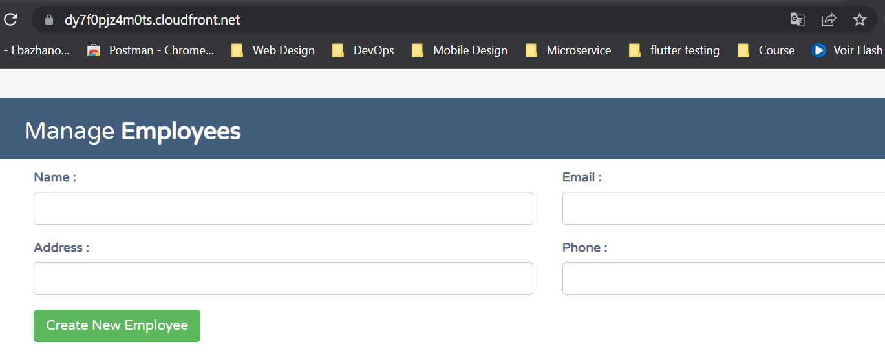 

## STEP 2: Configure DynamoDB and Lambda Functions

### What's Amazon DynamoDB 

[**Amazon DynamoDB**](https://aws.amazon.com/dynamodb/) is a fully managed **NoSQL database** service provided by Amazon Web Services (AWS). It is designed to deliver seamless and scalable performance for applications that require low-latency, consistent, and highly available data storage.

DynamoDB is a key-value store that allows you to store and retrieve any amount of data with single-digit millisecond latency. It offers automatic scaling to handle the throughput needs of your application, ensuring that your database can handle high traffic and unpredictable workloads without any manual intervention. This scalability makes DynamoDB suitable for a wide range of use cases, from small-scale applications to large-scale enterprise solutions.

### Creating an AWS DynamoDB table for data storage

Navigate to the DynamoDB service

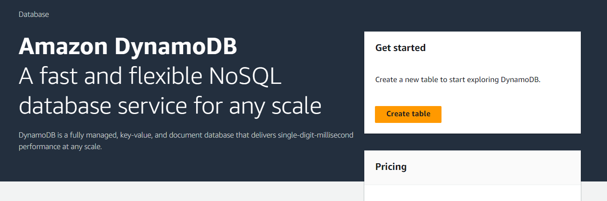 

Then, click on **Create table.** 

 

Provide a name for your table and specify the **partition key** value. Leave all other parameters at their default settings.

**Your table has been successfully created.**

 

### Configuring IAM roles and permissions for Lambda functions
Navigate to the IAM service

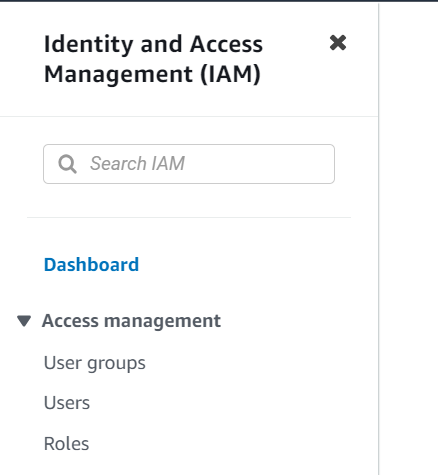 

In the left sidebar of the IAM service, click on **Roles.** In the new interface, click on **Create role.** 

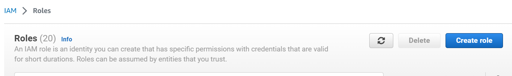 

Select the Lambda service and click on **Next.**

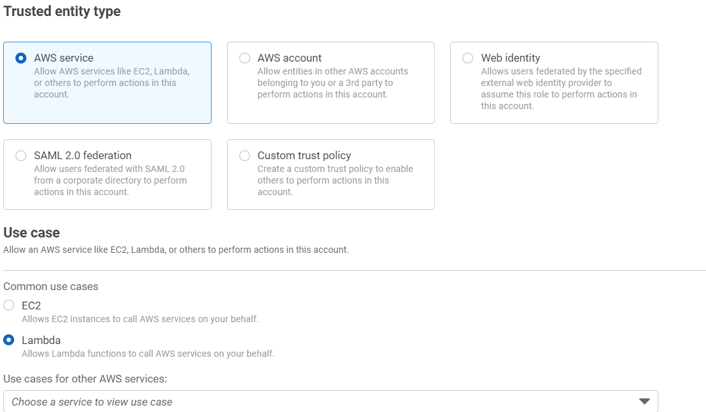 

In the search results, find the DynamoDB permissions, select the **AmazonDynamoDBFullAccess** policy, and click on **Next.** 

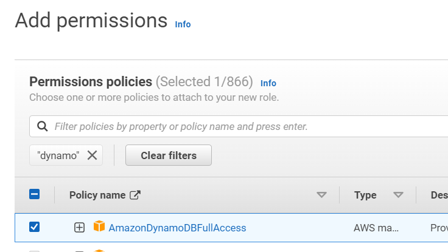 

Enter the role name, verify the chosen policy, and click on **Create role.**

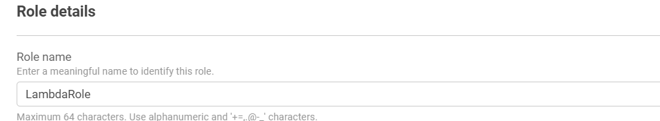 

### What's AWS Lambda

[**AWS Lambda**](https://aws.amazon.com/lambda/) is a **serverless** compute service provided by Amazon Web Services (AWS). It allows you to run your code without provisioning or managing servers, making it an ideal choice for building scalable and cost-effective applications.

With AWS Lambda, you can focus on writing your application logic in the form of functions, known as Lambda functions. These functions are triggered by various events, such as changes to data in an Amazon S3 bucket, updates to a DynamoDB table, or incoming HTTP requests through API Gateway. Lambda automatically scales your functions in response to the incoming workload, ensuring that your application can handle any amount of traffic without the need for manual intervention.

### Create Lambda Functions 

Navigate to the Lambda service and clic on **create a function**

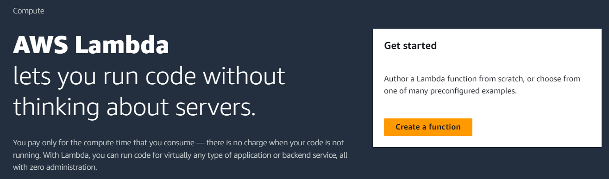 

Enter the function name and select **Python 3.9** as the `runtime`.

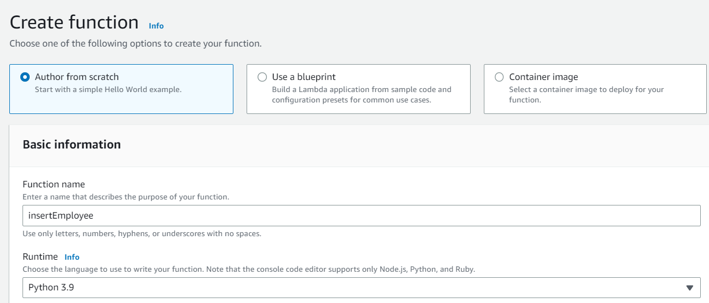 

In the permissions section, select `Use an existing role` and choose the previously created role. Then, click on **Create function.**

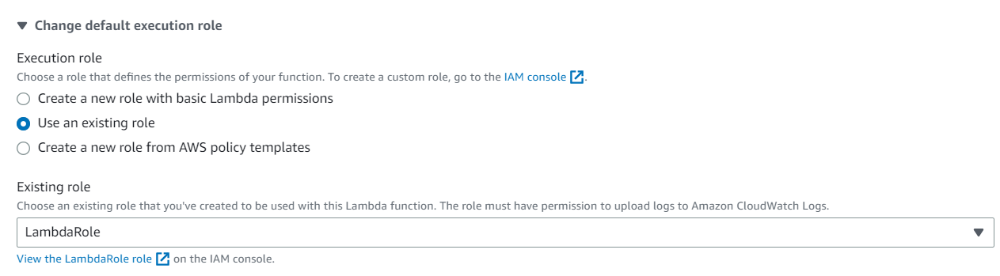 

After creating the function, scroll down to the **Code** tab. Enter your code in this section and click on **Deploy**.  

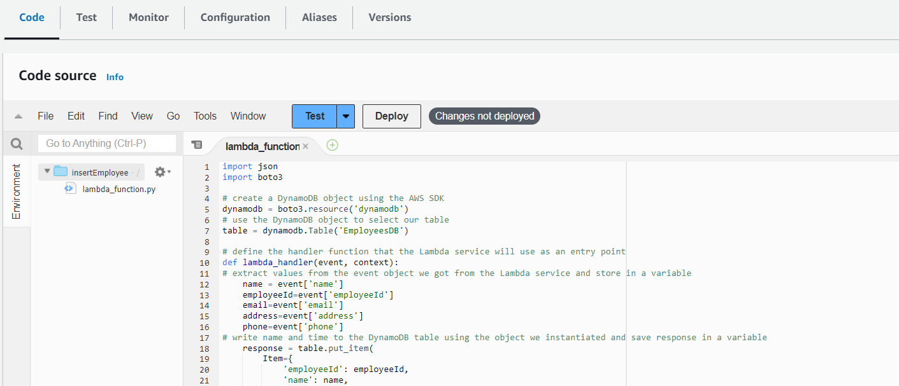 

**Our Lambda function has been successfully created.**

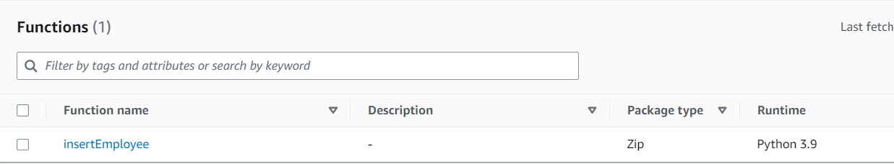 

Repeat the same steps to create the other functions. For example, create a function named **getEmployees**.

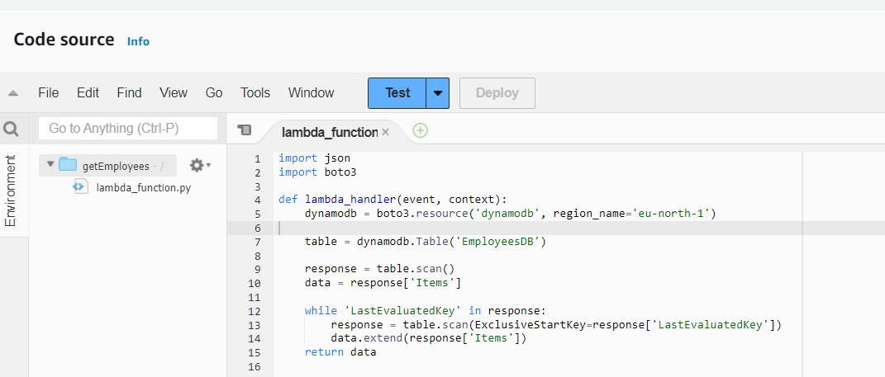 

**deleteEmployee Function**
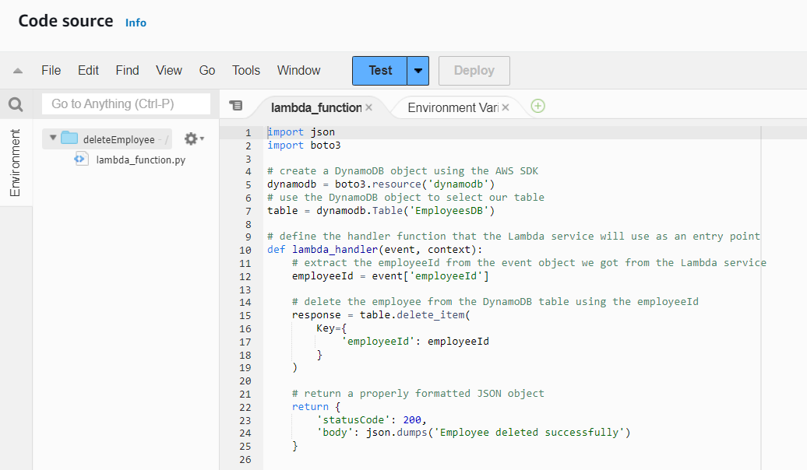 

**Remember to deploy your functions after creating them.**

## STEP 3: Implementing API Gateway

### What's AWS API Gateway

[**AWS API Gateway**](https://aws.amazon.com/api-gateway/) is a fully managed service that allows you to create, publish, and manage APIs for your applications. It acts as a front door, enabling you to expose your application's functionality as secure and scalable APIs that can be accessed by clients such as web browsers, mobile devices, or other services.

With API Gateway, you can easily build RESTful APIs that integrate with other AWS services or external systems. It provides a range of features to streamline the API development and management process. These include request and response transformations, authentication and authorization mechanisms, traffic management, monitoring, and logging capabilities.

Navigate to the **API Gateway service**

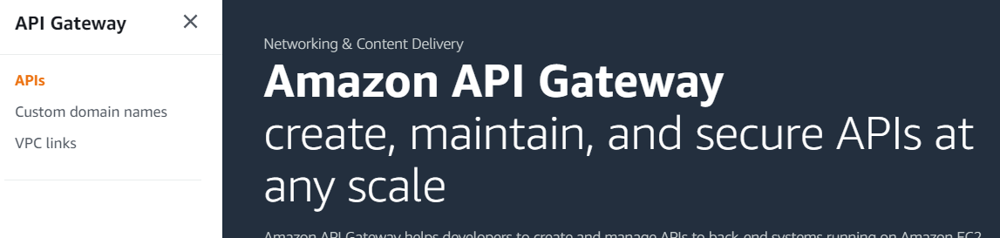

Scroll down to the **REST API** section and click on **Build.**

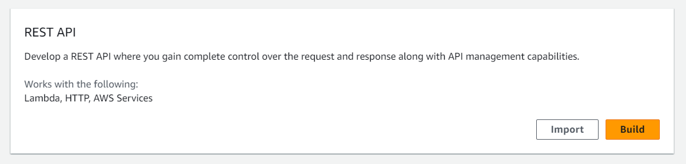

Select **New API** and provide the required information. Then, click on **Create API.**

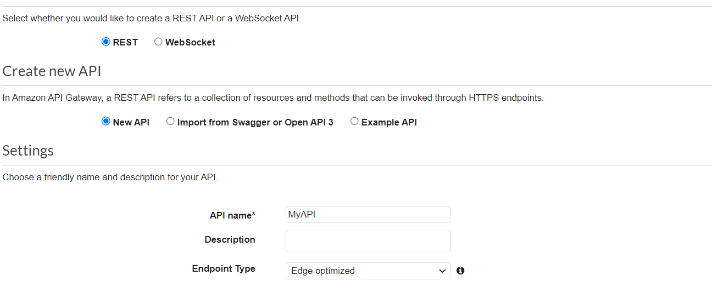

In the new window, click on **Action** and then **Create Method.**

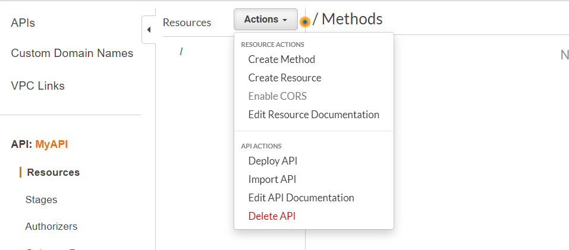

Let's start by creating a method to retrieve employees saved in our `DynamoDB table`. Select the `GET method`, enter the name of the previously created Lambda function, and click on **Save.**

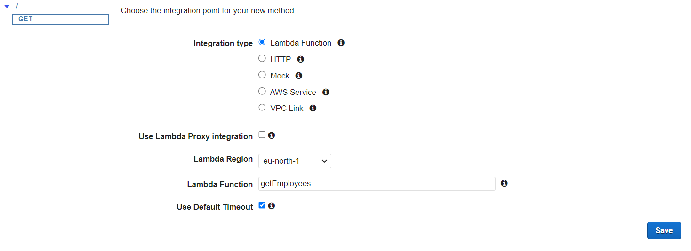

For the **insertEmployee** function, create a method of type `POST`. 

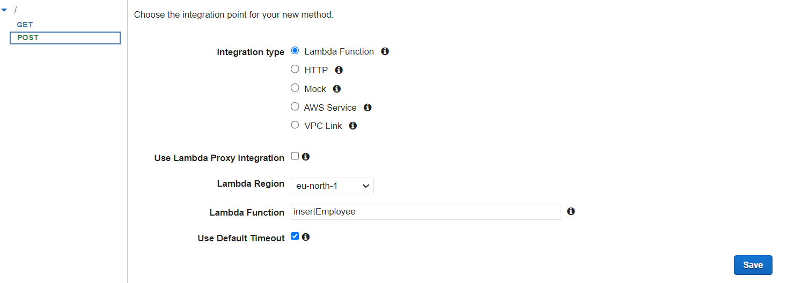

For the **deleteEmployee** function, create a method of type `DELETE`. 

With our methods ready, let's deploy our API. Click on `Action,` then **Deploy API.** In the popup window, select **New stage** and enter the stage name. Then, deploy.

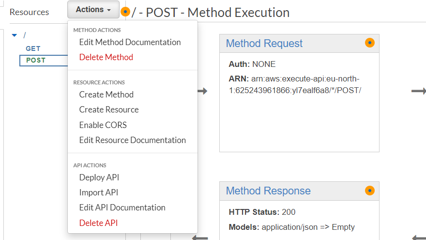

After successfully deploying our API in the API Gateway, we need to configure **CORS (Cross-Origin Resource Sharing)** to ensure proper communication between the API Gateway and CloudFront. CORS is necessary because these two services reside in different domains.

Go back to the `Resources tab`, click on `Action,` and then **Enable CORS.**

Enabling `CORS` allows the **API Gateway** to handle requests from different origins, such as **CloudFront**. This step is crucial to prevent `CORS origin errors`, which occur when a web application hosted on one domain (CloudFront) tries to access resources from another domain (API Gateway) without proper CORS configuration.

**After enabling CORS, make sure to redeploy your API to apply the changes.**

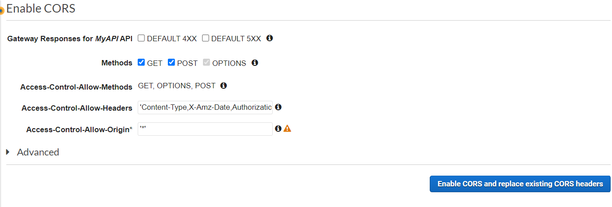

Now, copy the address of your API. 

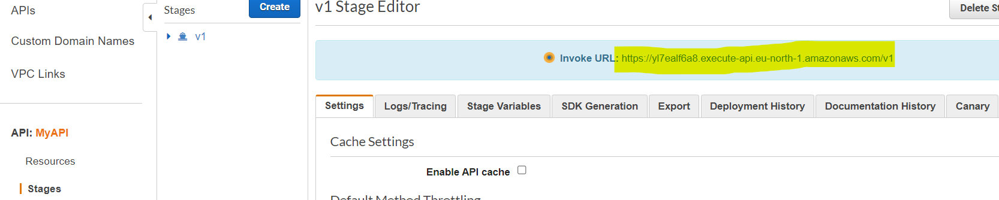

Go to the source code of your application, specifically the `scripts.js` file. Modify the `API_ENDPOINT` variable and enter the address of your API.

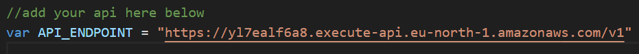

## STEP 4: Testing the Application

Go to CloudFront service and copy the url and paste it in your browser

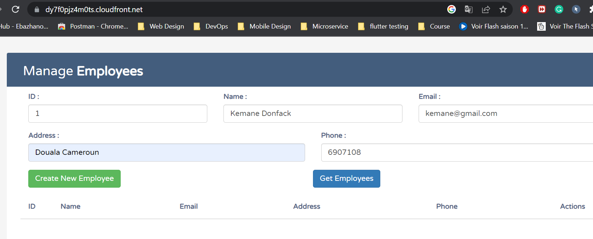

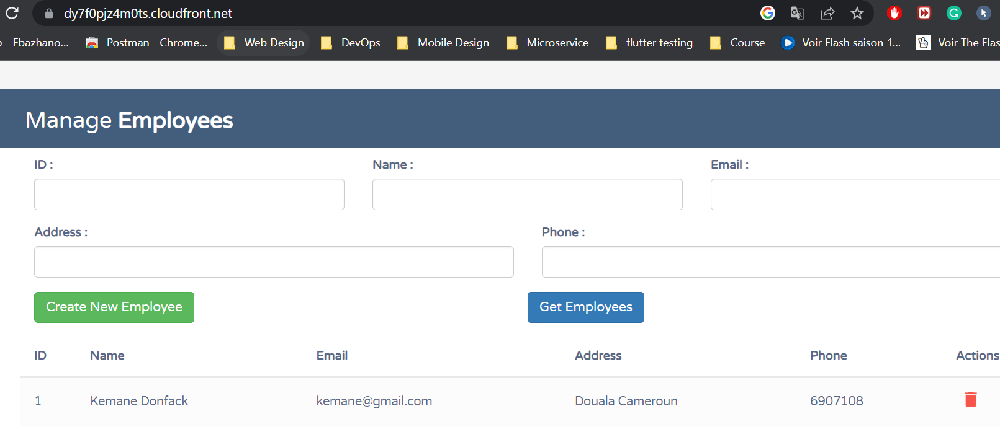

## Conclusion

In conclusion, this article outlined the process of building a serverless web application using AWS services. We configured AWS S3 for hosting, utilized CloudFront for content delivery, and implemented AWS WAF for security. DynamoDB and Lambda functions handled data storage and retrieval, while API Gateway exposed our functions as RESTful API endpoints.

With these tools, we achieved a scalable, secure, and efficient deployment. By leveraging serverless architecture and AWS services, you can build your own serverless web applications, delivering exceptional user experiences in the cloud.
