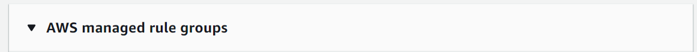
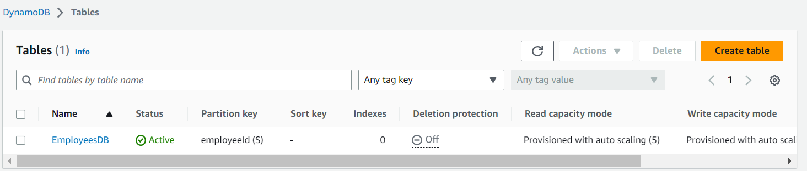

# Build a Serverless App with AWS Lambda, S3, DynamoDB and Python&nbsp;

**This article was originally written by "Kemane Donfack" on the blog**: https://blog.numericaideas.com/aws-serverless-web-application

## Introduction
Serverless architecture has revolutionized the way we build and deploy web applications. By abstracting away server management and scaling, it allows developers to focus on writing code and delivering value to users. In this article, we will explore the world of **serverless web applications** using a powerful combination of AWS services. We will leverage **AWS S3** for hosting, **Lambda functions** for data retrieval and storage, **DynamoDB** as a scalable database, **API Gateway** for creating RESTful APIs, **CloudFront** for global content delivery, and **AWS WAF** to secure against SQL injections. Join us on this journey as we dive into the implementation details, best practices, and benefits of building a serverless web application using AWS services.

## Solutions Architecture
Serverless architecture is a cloud computing paradigm that eliminates the need for managing servers and infrastructure. In this model, the cloud provider takes care of server provisioning, scaling, and maintenance, allowing developers to focus solely on writing code. Applications are built using small, stateless functions that are triggered by events. These functions are executed in a managed environment and automatically scale based on demand. Serverless architecture offers benefits such as cost efficiency, scalability, reduced operational overhead, and rapid development.

The architecture of the whole infrastructure looks like the following image whose description is provided down:

To build our serverless web application, we used the different AWS services below:
- [**Amazon S3 (Simple Storage Service)**](https://aws.amazon.com/s3/): is a highly scalable and durable cloud storage service. It allows you to store and retrieve large amounts of data, such as files, images, videos, and backups, in a secure and cost-effective manner.

- [**AWS Lambda**](https://aws.amazon.com/lambda/): is a **serverless** compute service provided. It allows you to run your code without provisioning or managing servers, making it an ideal choice for building scalable and cost-effective applications.

- [**DynamoDB**](https://aws.amazon.com/dynamodb/): is a fully managed **NoSQL database** service. It is designed to deliver seamless and scalable performance for applications that require low-latency, consistent, and highly available data storage.

- [**AWS API Gateway**](https://aws.amazon.com/api-gateway/): is a fully managed service that allows you to create, publish, and manage APIs for your applications. It acts as a front door, enabling you to expose your application's functionality as secure and scalable APIs that can be accessed by clients such as web browsers, mobile devices, or other services.

- [**CloudFront**](https://aws.amazon.com/cloudfront/): is a content delivery network (CDN) service. It enables the efficient distribution of your content, including web pages, images, videos, and other static or dynamic files, to end users across the globe. AWS's content delivery network (CDN), ensures fast and reliable global content distribution of our web application.

- [**AWS WAF (Web Application Firewall)**](https://aws.amazon.com/waf/): is a cloud-based firewall service that helps protect your web applications from common web exploits and attacks. It allows you to define and enforce rules to control access to your web application and filter out malicious traffic.

## Prerequisites
Before diving into building our serverless solution, it is essential to have the following prerequisites:

- **AWS Account**: Create an AWS account to access and utilize the AWS services mentioned in this article.
- **AWS IAM**: Understand the basics of AWS `Identity and Access Management (IAM)` for managing user permissions and roles within the AWS environment.
- **Knowledge of AWS Lambda**: Familiarize yourself with AWS Lambda, as it will be used to write the serverless functions for this application.
- **Basic knowledge of Python**: Read and write simple statements with Python programming language, as the Lambda functions in this tutorial will be written in Python.
- **Understanding of REST APIs**: Have a basic understanding of REST (Representational State Transfer) APIs and their fundamental principles, including the `HTTP` methods such as `GET`, `POST`, and `DELETE`, which will be used to interact with the API Gateway.

## Configure AWS S3, CloudFront, and WAF

### Setting up an AWS S3 bucket 
Once log in to your AWS console, navigate to the `AWS Console Management > AWS S3`. From there, you can create a new S3 bucket by clicking on **Create bucket** as illustrated in the following screenshot:

Provide a unique **name** for your bucket. It's required to choose a name that is globally unique within the entire `AWS S3 namespace`. This ensures that there are no naming conflicts with existing buckets. Next, select the **region** where you want to host your web application.

Then click on `Create bucket`.

Once the bucket is created, you can proceed to upload your web application files. Click on your bucket and select the **Upload** option then **Add files**. You'll find the application files [**here**](https://github.com/numerica-ideas/community/tree/master/aws/building-a-serverless-web-application/web)

Select the files from your local machine that make up your web application, and click on `Upload` to add them to your bucket.

### Create AWS WAF rules
Navigate in the `AWS Console Management > AWS WAF`, Click on **Create web ACL** to create a new web Access Control List (ACL).

Provide a name for your web ACL and select the ressource type in our case **Amazon cloudFront distributions**. Then click on **Next**.

In the **Add rules and rule groups** section, click on **Add rules**, and then select **Add managed rule groups**.

 

Click on Add rules then select `Add managed rule groups` to have the following:

 

In the next window, expand **AWS Managed rule groups** and scroll down to **Free rule groups**. Add a few rules to protect your application.

 

Scroll down and click on **Add rules**.

To ensure that requests not matching any rules are allowed, select **Allow** under the **Default action** section.

 

Click on `Next` until you reach the end, leaving the default settings as they are. Finally, review your configurations and click on**Create web ACL**. Your web ACL has been created.

### Set up CloudFront CDN for S3 Bucket
Navigate in the `AWS Console Management > CloudFront` Click on **Create Distribution** to create a new CloudFront distribution.

In the Create Distribution interface, click on the `Origin Domain` field and select the previously created S3 bucket.

Under **Origin Access**, select `Origin access control setting` to ensure the bucket is only accessible via the CloudFront distribution, here's the illustration below:

Click on **Create control setting Identity**, leaving all settings at their default values, and then click on **Create**.

 

For the **viewer protocol policy**, apply the same settings as shown in the screenshot below:

In the next section, apply the following configurations and select the previously `created web ACL`:

 

In the **Default Root Object** section, enter the name of your main HTML file, in our case, **index.html**.

Click on **Create**. Once the new distribution is created, click on **Copy Policy**.

This policy will grant **CloudFront access to our S3 bucket**. To apply it, go back to the S3 service, select the bucket containing your website, and go to **Permissions**.

 

In the **Bucket Policy** section, click on **Edit**, delete the existing content, paste the copied policy, and click on **Save Changes**.

 

 

Wait a few minutes for your distribution to deploy, then copy the generated domain name and paste it into your browser.

## Configure DynamoDB and Lambda Functions

### Create a DynamoDB table
Navigate in the `AWS Management Console > DynamoDB`, click on **Create table**. 

 

Provide a name for your table and specify the **partition key** value. Leave all other settings at their defaults.

**Your table has been successfully created**.

### Configuring IAM roles and permissions for Lambda functions
Navigate to the `AWS Management Console > IAM Service` dashboard.

 

In the left sidebar, click on **Roles**. In the new interface, click on **Create role**. 

Select the Lambda service and click on **Next**.

 

In the search results, find the DynamoDB permissions, select the **AmazonDynamoDBFullAccess** policy, and click on **Next**.

Enter the role name, verify the chosen policy, and click on **Create role**.

Let's note that for production usages, you should apply the **Least Privilege Principle** to enforce a better security of your infrastructure, this means not giving unnecessary permissions (DynamoDB full access) but only the precise actions our Lambda functions need.

### Create Lambda Functions
Navigate in the `AWS Management Console > AWS Lambda`, Click on **create a function**.
You will find the code for each function [**here**](https://github.com/numerica-ideas/community/tree/master/aws/building-a-serverless-web-application/functions)

For the unction name, enter **insertEmployee** and select **Python 3.9** as the `runtime`.

In the permissions section, select `Use an existing role` and choose the previously created role. Then, click on **Create function**.

 

After creating the function, scroll down to the **Code** tab. Enter your code in this section and click on **Deploy**.

**Our Lambda function has been successfully created**.

Repeat the same steps to create the other functions. For example, create a function named **getEmployees**.

 

As well as for **deleteEmployee** Function:

**Note**: Remember to deploy your functions after creating them.

## Implementing API Gateway
Navigate to the **API Gateway service**, still from the `AWS Management Console`.

Scroll down to the **REST API** section and click on **Build**.

Select **New API** and provide the required information. Then, click on **Create API**.

In the new window, click on **Action** and then **Create Method**.

Let's start by creating a method to retrieve employees saved in our `DynamoDB table`. Select the `GET method`, be sure **Lambda Function** is selected as **Integration type**, enter the name of the previously created Lambda function, and click on **Save**.

For the `insertEmployee` function, create a method of type `POST` as in the following image:

For the `deleteEmployee` function, create a method of type `DELETE`.

With our methods ready, let's deploy our API. Click on `Action`, then **Deploy API**. In the popup window, select **New stage** and enter the stage name. Then, deploy.

After successfully deploying our API in the API Gateway, we need to configure **CORS (Cross-Origin Resource Sharing)** to ensure proper communication between the API Gateway and CloudFront. CORS is necessary because these two services reside in different domains.

Go back to the `Resources tab`, click on `Action`, and then **Enable CORS**.

Enabling `CORS` allows the **API Gateway** to handle requests from different origins. This step is crucial to prevent `CORS origin errors`, which occur when a web application hosted on one domain (CloudFront) tries to access resources from another domain without proper CORS configuration.

**After enabling CORS, make sure to redeploy your API to apply the changes**.

Now, copy the address of your API.

Go to the source code of your application, specifically the `scripts.js` file. Modify the `API_ENDPOINT` variable and enter the address of your API.

**Note**: For the sake of the example we keep it this way but you should provide your API endpoint as an **environment variable** when your frontend is built using advanced stack like **React** or **Angular**.

## Testing the Application
Navigate in the `AWS Console Management > CloudFront`, on your CloudFront Distribution copy the URL of your domain name and paste it into your browser.

## Resources
To facilitate the practical implementation of the concepts discussed in this article, we have provided a [GitHub repository](https://github.com/numerica-ideas/community/tree/master/aws/building-a-serverless-web-application) containing all the necessary files to build your serverless web application using AWS services.

———————

We have just started our journey to build a network of professionals to grow even more our free knowledge-sharing community that’ll give you a chance to learn interesting things about topics like cloud computing, software development, and software architectures while keeping the door open to more opportunities.

Does this speak to you? If **YES**, feel free to [Join our Discord Server](https://discord.numericaideas.com) to stay in touch with the community and be part of independently organized events.

———————

## Conclusion
In conclusion, this article provided a detailed guide on building a scalable and secured serverless web application using AWS services. We successfully configured AWS S3 for efficient hosting, leveraged CloudFront CDN for optimized content delivery, and implemented AWS WAF to ensure robust security measures. Additionally, the dynamic duo of DynamoDB and Lambda functions seamlessly managed data storage and retrieval, while API Gateway served as a front gate for RESTful API endpoints. By leveraging serverless architecture and AWS services, you can build your own serverless web applications, delivering exceptional user experiences in the cloud.

Thanks for reading this article, recommend and share if you enjoyed it. Follow us on [Facebook](https://www.facebook.com/numericaideas), [Twitter](https://twitter.com/numericaideas), and [LinkedIn](https://www.linkedin.com/company/numericaideas) for more content.
