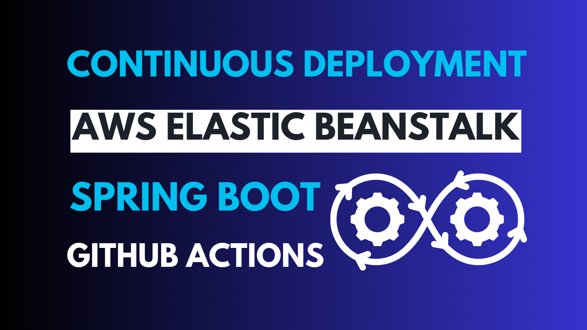

# Continuous Deployment of Spring Boot to AWS Elastic Beanstalk via GitHub Actions: A Step-by-Step Guide [](https://numericaideas.com/blog/cd-springboot-aws-eb-github-actions)

**This article was originally written by "Orleando Dassi" on the blog**: https://numericaideas.com/blog/cd-springboot-aws-eb-github-actions

## Introduction
The ability to deploy updates swiftly and reliably is paramount, it enables companies to be even more agile. Spring Boot, a widely adopted Java framework, seamlessly integrates with AWS Elastic Beanstalk, a platform-as-a-service solution. When coupled with the automation capabilities of GitHub Actions, the process of continuous deployment becomes a breeze. In this comprehensive guide, we'll walk you through the process of setting up continuous deployment for your Spring Boot application on AWS Elastic Beanstalk using GitHub Actions.

[](https://numericaideas.com/blog/cd-springboot-aws-eb-github-actions)

This article covers the **Part 3** of the [Lift and Shift Cloud Migration Series](https://youtube.com/playlist?list=PLJl2liPyo6s3oQkBT2UWbuSfrwO4aS-9Z) that we started on YouTube, please [SUBSCRIBE HERE](https://www.youtube.com/@numericaideas/channels?sub_confirmation=1) to be kept posted of the next chapters.

Do you prefer the Video format instead? Feel free to watch it by following this [link](https://youtu.be/TI84hpeiTZE):

[](https://youtu.be/TI84hpeiTZE)

## Prerequisites
1. **Spring Boot Application on GitHub:** Begin with a Spring Boot application hosted on GitHub, here's our [demo App](https://github.com/numerica-ideas/community/tree/master/aws/springboot-migration-elasticbeanstalk).
2. **AWS Elastic Beanstalk Environment:** Ensure you have an existing AWS account with an Elastic Beanstalk environment configured, here's [the guide](https://numericaideas.com/blog/lift-and-shift-cloud-migration-manual-aws-elasticbeanstalk#migration-steps).
3. **Familiarity with Tools:** Familiarize yourself with AWS Elastic Beanstalk, Spring Boot, GitHub, and GitHub Actions.

## Step 1: Prepare Your AWS Elastic Beanstalk Environment
Prior to configuring GitHub Actions, it is essential to ensure the presence of a fully operational Spring Boot application that has been deployed on AWS Elastic Beanstalk. This entails the creation of an environment within Elastic Beanstalk, the establishment of requisite AWS resources, and the verification of seamless functionality of your application within the AWS ecosystem.

In case you are first looking to deploy your Spring Boot App to AWS using Elastic Beanstalk service, we do recommend you to take a look at this related article, [Spring Boot Lift And Shift Cloud Migration via AWS](https://numericaideas.com/blog/lift-and-shift-cloud-migration-manual-aws-elasticbeanstalk).

The following is a summary of what should be done before moving to the next step.

First, let's **clone** the Spring Boot GitHub repository:

```bash
git clone https://github.com/numerica-ideas/community
cd aws/springboot-migration-elasticbeanstalk
```

The App has a [configuration file](https://github.com/numerica-ideas/community/blob/master/aws/springboot-migration-elasticbeanstalk/.elasticbeanstalk/config.yml) necessary to set up our Elastic Beanstalk environment for the provisioning of our AWS infrastructure, as the following:
- **Application name**: springboot-migration-elasticbeanstalk
- **Environment name**: spring-cloud-migration
- **The platform** to use: Java 17 - Corretto
- **AWS region**: us-east-1
- **The artifact (JAR file) location**: runnable.jar

Next, from the project root folder, create the **Elastic Beanstalk environment** with the following command, assuming you successfully installed [EB CLI](https://numericaideas.com/blog/lift-and-shift-cloud-migration-manual-aws-elasticbeanstalk#migration-steps):

```bash
eb create spring-cloud-migration --sample --single --timeout 30 --instance_type t2.micro --database.username SpringBootAdmin --database.password Strange_Pwd --envvars PORT=9090 --tags tag1=val1,tag2=val2
```

It'll take a few minutes and you'll have an output similar to the following:


By running the command `eb open`, or by accessing the generated application URL you'll see a placeholder App for now:


 
Finally, let's deploy the Spring Boot App into our EB Environment along with a MySQL database hosted on AWS RDS, here's the command:

```bash
eb deploy
```

**Note**: In order to implement your modifications, you need to commit them initially for Elastic Beanstalk to take them into account. Nevertheless, during your development or debugging process, you might prefer not to push changes that haven't been verified as functional. You can bypass the need to commit your alterations by staging them and utilizing the command `eb deploy --staged`, which conducts a regular deployment.


The deployment is overridden and we no more see the sample application, feel free to use Postman to test it as illustrated in the [video](https://youtu.be/tWQFavEJQ7c?t=908).

## Step 2: Safeguard AWS Credentials
For GitHub Actions to deploy to your AWS environment, it's essential to securely manage your AWS credentials. This can be achieved by utilizing **GitHub Secrets**, which enable you to store sensitive data securely.

1. Navigate to your GitHub repository.
2. Click on "Settings", then "Secrets and variables", then on "Actions", and finally, "New repository secret."
3. Create two secrets: `AWS_ACCESS_KEY_ID` and `AWS_SECRET_ACCESS_KEY`, providing the respective confidential values.

Here's an illustration of that section with the required AWS credentials:


## Step 3: GitHub Actions Workflow Configuration
In your GitHub repository, create a new directory called `workflows` within the `.github` folder if it doesn't exist already.

Within that directory, create a YAML file (e.g., `eb-springboot-workflow.yml`) to define the GitHub Actions workflow. Below is an example YAML workflow that orchestrates the deployment of your Spring Boot application to AWS Elastic Beanstalk:

```yaml
name: Continuous Deployment of Spring Boot to AWS Elastic Beanstalk workflow
on:
  workflow_dispatch:      # Enable to run workflow manually through the GitHub Actions Workflow page directly
  push:                   # Let's specify the target branch that triggers the action on new commits
    branches:
      - feature/lift-shift-cicd

jobs:
  build-deploy-to-aws-eb:
    name: Build and deploy a Spring-Boot App to AWS Elastic Beanstalk
    runs-on: ubuntu-latest
    defaults:             # Remove this section if your App is at the root of your repository
      run:
        shell: bash
        working-directory: ./aws/springboot-migration-elasticbeanstalk
    steps:
      - name: Checkout
        uses: actions/checkout@v3
      - name: Install and set up Java 17 on the runner
        uses: actions/setup-java@v3
        with:
          distribution: 'temurin'
          java-version: '17'
      - name: Build the project using a custom script
        run: ./build.sh
      - name: Generate deployment package
        run: zip -r deploy.zip . -i 'runnable.jar'
      - name: Deploy to AWS ElasticBeanstalk
        uses: einaregilsson/beanstalk-deploy@v21
        with:
          region: us-east-1
          aws_access_key: ${{ secrets.AWS_ACCESS_KEY_ID }}
          aws_secret_key: ${{ secrets.AWS_SECRET_ACCESS_KEY }}
          application_name: springboot-migration-elasticbeanstalk
          environment_name: spring-cloud-migration
          version_label: ${{ github.run_number }}
          use_existing_version_if_available: true
          deployment_package: ./aws/springboot-migration-elasticbeanstalk/deploy.zip
      - run: echo "🍏 This job's status is ${{ job.status }}."
```

This workflow triggers when changes are pushed to the `feature/lift-shift-cicd` branch, you can target other branches or other event types as documented [here](https://docs.github.com/en/actions/using-workflows/workflow-syntax-for-github-actions#on). It configures the Java environment, compiles the Spring Boot app using Maven, and finally, utilizes the AWS Elastic Beanstalk CLI to deploy the application to the specified environment.

Replace `application_name` and `environment_name` values with your actual Elastic Beanstalk deployment details, the **GitHub Actions Encrypted Secrets** are accessible by the workflow using the pattern `{{ secrets.SECRET_NAME }}`, and do remember to provide the right path as the **working_directory** and **deployment_package** lines.

Let's note that the **custom build script (`build.sh`)** simply build the App, and make sure to copy the resultant JAR file to a specific location at the root of the project, here's its content:

```bash
# Compile the App and move the executable JAR file to the root folder under runnable.jar

rm -f *.jar
./mvnw clean install -DskipTests
cp target/*.jar runnable.jar

echo "App Compiled Successfully"
```

## Step 4: Deploy and Validate the Workflow
Let's test everything with the following points:

1. Commit all the changes along with the `.github/workflows/eb-springboot-workflow.yml` file to your GitHub repository.
2. Make a minor code alteration in your Spring Boot application and push it to the `feature/lift-shift-cicd` branch.

GitHub Actions will automatically detect the push event, trigger the workflow, and initiate the deployment of your Spring Boot application to AWS Elastic Beanstalk. Monitor the workflow's progress and view logs conveniently from the GitHub Actions dashboard `(Repository > Actions)`.


**Note**: In case you would like to delete your EB environment from the terminal, the command `eb terminate` will erase everything.

———————

We have just started our journey to build a network of professionals to grow even more our free knowledge-sharing community that’ll give you a chance to learn interesting things about topics like cloud computing, software development, and software architectures while keeping the door open to more opportunities.

Does this speak to you? If **YES**, feel free to [Join our Discord Server](https://discord.numericaideas.com) to stay in touch with the community and be part of independently organized events.

———————

If the **Cloud** is of interest to you this [video](https://youtu.be/0II0ikOZEYE) covers the 6 most **Important Concepts** you should know about it.

## Conclusion
In this comprehensive guide, we've outlined a streamlined approach for achieving continuous deployment of your Spring Boot application on AWS Elastic Beanstalk through GitHub Actions. This integration empowers development teams to concentrate on coding while automating deployment tasks. The result is an accelerated development lifecycle, enhanced deployment reliability, and the ability to deliver value to users more frequently and efficiently.

Thanks for reading this article. Like, recommend, and share if you enjoyed it. Follow us on [Facebook](https://www.facebook.com/numericaideas), [Twitter](https://twitter.com/numericaideas), and [LinkedIn](https://www.linkedin.com/company/numericaideas) for more content.
