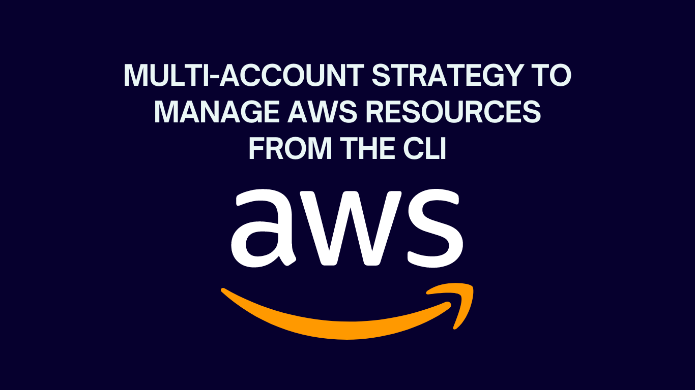

# How to Configure AWS CLI for Multi-Account Strategy&nbsp;[](https://blog.numericaideas.com/configure-aws-cli)

**This article was originally written by "Orleando Dassi" on the blog**: https://blog.numericaideas.com/configure-aws-cli

## Introduction
The **AWS CLI** is a powerful tool that allows you to interact with various AWS services through a command-line interface. In this article, we will go through the steps to configure AWS CLI for multiple accounts on your local machine or any server with Terminal access.

[](https://blog.numericaideas.com/configure-aws-cli)

> The **YouTube Channels** in both English (En) and French (Fr) are now accessible, feel free to subscribe by clicking [here](https://www.youtube.com/@numericaideas/channels?sub_confirmation=1).

## Install AWS CLI
The first step is to install the **AWS CLI** on your machine. AWS CLI can be installed on Windows, macOS, and Linux systems. You can follow the appropriate steps from the [AWS CLI website](https://docs.aws.amazon.com/cli/latest/userguide/getting-started-install.html).

## Generate AWS Access Key
To use AWS CLI, you must have an **Access Key** and **Secret Access Key**. You can create them from the AWS Management Console. Follow these steps to create an access key:
1. Login to the [AWS Management Console](https://aws.amazon.com).
2. Click on your **username** at the top right corner of the console and select **"Security Credentials"** from the dropdown menu.
3. In the **"Access keys"** section, click on **"Create Access Key"**.
4. The access key and secret access key will be generated. **Download** the CSV file containing the keys and keep it safe.

[](https://blog.numericaideas.com/configure-aws-cli)

Let's note that once you left that area, the Access Key won't be available anymore, so it's your only chance to copy and keep it safe somewhere else.

[](https://blog.numericaideas.com/configure-aws-cli)

## Configure AWS CLI with Access Key
After installing AWS CLI and creating the Access Key, the next step is to configure AWS CLI with that access key. Follow the steps below:
1. Open a command prompt or terminal window.
2. Type the command `aws configure` and press Enter.
3. Enter your **access key** and **secret access key** when prompted.
4. Enter your preferred **region** and **output format**. The region is the geographical location where your AWS resources are located.
5. Press Enter to complete the configuration.

The command `aws configure` will save your configurations in a hidden folder generally located in your user's home folder, on unix/linux based operating systems it's in `~/.aws` folder.

## Verify Configurations
After configuring AWS CLI, it's important to verify that the configurations was successful. To do this, let's run the following command:

`aws sts get-caller-identity`

This command should return the AWS account ID, user ID, and user ARN associated with your access key. Something similar to the following:

```
{
    "UserId": "XXXXXXXXXXXXXX",
    "Account": "XXXXXXXXXXXXXX",
    "Arn": "arn:aws:iam::XXXXXXX:user/XXXXXXX"
}
```

## Use the AWS CLI
After successfully configuring AWS CLI, you can now use it to interact with AWS services. You can run AWS CLI commands from the terminal. For example, to list all the S3 buckets in your AWS account, run the following command:

`aws s3 ls`

This will list all the S3 buckets in your AWS account as follow:

[](https://blog.numericaideas.com/configure-aws-cli)

## Multi-Account Setup: The Profile Option
The `--profile` option allows you to specify different AWS CLI profiles, each with its own set of access keys, regions, and output formats. This is useful when you have multiple AWS accounts or need to access AWS services in different regions.

Let's create a new profile in addition to the one that we did on the top, the same command will be used, just that a new option is added:

`aws configure --profile master-account`

Let's reply to the same questions again (access key, region and output format). Indeed, if you don't provide the `--profile` option your configurations will set/override the default profile.

You can create as many profiles as you want, at the end we will have something close to this for the `~/.aws/config` and `~/.aws/credentials` files (default and master-account profiles):

[](https://blog.numericaideas.com/configure-aws-cli)

Here are some examples of using the `--profile` option:

➡️ List all S3 buckets in the `master-account` profile:

`aws s3 ls --profile master-account`

➡️ Copy a file from local to an S3 bucket in the `master-account` profile:

`aws s3 cp file.txt s3://a-bucket-name/ --profile master-account`

➡️ Describe all running EC2 instances in the `default` profile:

`aws ec2 describe-instances --filters "Name=instance-state-name,Values=running" --profile default`

By using the `--profile` option, you can easily switch between different AWS CLI profiles and manage multiple AWS accounts or regions from a single command-line interface. Providing  `--profile default` is similar to not providing the profile option at all.

———————

We have just started our journey to build a network of professionals to grow even more our free knowledge-sharing community that’ll give you a chance to learn interesting things about topics like cloud computing, software development, and software architectures while keeping the door open to more opportunities.

Does this speak to you? If **YES**, feel free to [Join our Discord Server](https://discord.numericaideas.com) to stay in touch with the community and be part of independently organized events.

———————

If the **Cloud** is of interest to you this [video](https://youtu.be/0II0ikOZEYE) covers the 6 most **Important Concepts** you should know about it.

## Conclusion
Configuring **AWS CLI** is an essential step for interacting with AWS services using the command-line interface. By following the steps outlined in this article, you can successfully configure AWS CLI for many accounts on your machine and start using it to interact with AWS services.

Thanks for reading this article. Like, recommend, and share if you enjoyed it. Follow us on [Facebook](https://www.facebook.com/numericaideas), [Twitter](https://twitter.com/numericaideas), and [LinkedIn](https://www.linkedin.com/company/numericaideas) for more content.

