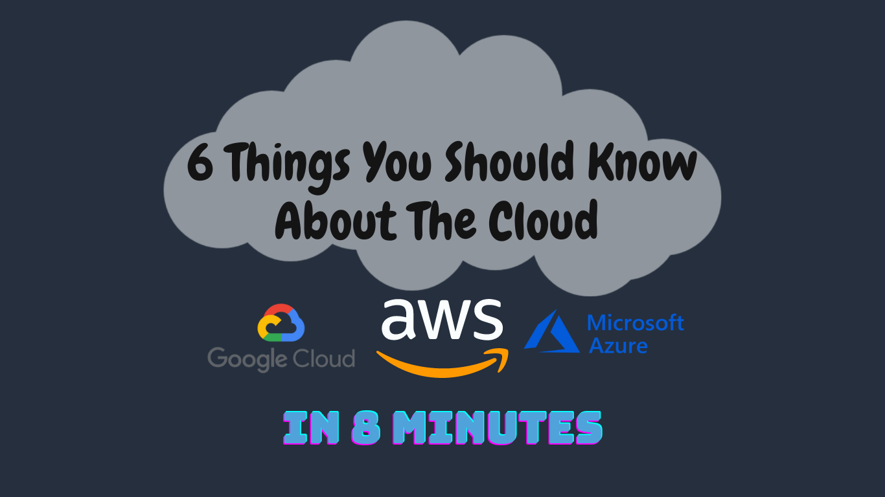

Important Cloud Concepts
========================

Essential concepts to know by all **Cloud actors**, both technical and non-technical professionals. No matter what you are using the Cloud for, you should consider this video content as a knowledge base to have solid grounds.

The [video](https://youtu.be/0II0ikOZEYE) includes detailed examples in order to better grab all the concepts:
- Agility
- Elasticity & Scalability
- Disaster Recovery
- High Availability
- Cost Optimization
- Security

**Video**: https://youtu.be/0II0ikOZEYE

Presentation powered by [ImpressJS](https://github.com/impress/impress.js).

By Orleando Dassi
