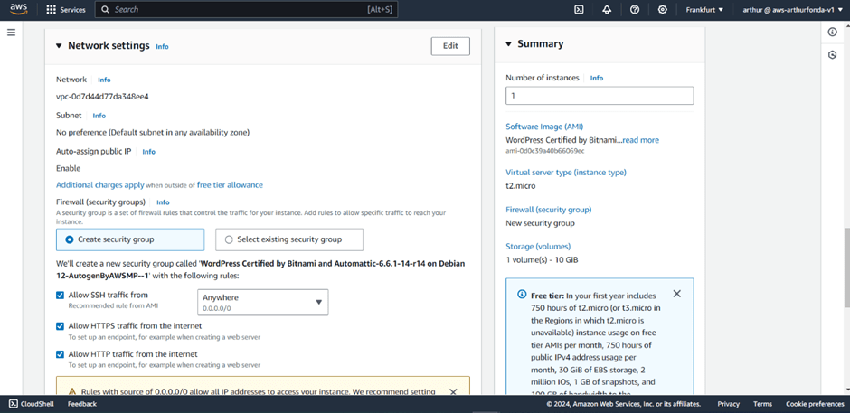

# Migrate WordPress Site From cPanel To AWS&nbsp;

**This article was originally written by "Arthur Fonda" on the blog**: https://numericaideas.com/blog/migrate-wordpress-from-cpanel-to-aws

## Introduction
Migrating from cPanel to AWS is a strategic move for businesses and developers looking to future-proof their WordPress websites. While cPanel is a popular and user-friendly hosting control panel, it has limitations in terms of scalability, performance, and flexibility. As your website grows and demands more resources, the need for a more robust and scalable hosting solution becomes essential.

> The **YouTube Channels** in both English (En) and French (Fr) are now accessible, feel free to subscribe by clicking [here](https://www.youtube.com/@numericaideas/channels?sub_confirmation=1).

## Why Migrate To AWS?
Migrating your WordPress site to AWS EC2 provides numerous benefits:
-	Scalability: One of the most significant advantages of hosting your WordPress site on AWS EC2 is the ability to scale your resources seamlessly as your website grows. With traditional cPanel hosting, you are often confined to the resources (CPU, RAM, storage) of a single server, and upgrading can be cumbersome, requiring a move to a higher-tier plan or even a server migration. AWS EC2 offers elastic scalability, meaning you can easily add or reduce resources based on real-time traffic demand.
-	Reliability: AWS’s infrastructure is designed to be highly available and fault-tolerant. Amazon EC2 operates within Amazon’s global data centers, which are spread across different geographic regions and availability zones. This architecture allows you to deploy WordPress on multiple instances across these regions
-	Security: Security is a major concern for any website owner, especially for WordPress sites, which are frequent targets of cyberattacks due to their widespread use. AWS provides a variety of built-in security features that go beyond what cPanel hosting offers which is network security, encryption, and automatic security updates.
-	Cost-Efficiency: With cPanel hosting, you're typically paying a fixed fee for a set amount of resources, whether you fully utilize them or not. This model may result in overpaying for resources you don’t need or require frequent upgrades as your site grows. AWS operates on a pay-as-you-go pricing model, where you only pay for the resources you consume. This flexibility allows you to optimize your costs based on actual usage.

## Prerequisites
Before you begin the migration process, ensure you have the following:
-	Access to your current WordPress site via cPanel.
-	An active AWS account.
-	Basic understanding of AWS services and WordPress management.
-	Familiarity with SSH and file transfer tools (e.g., FileZilla, WinSCP)

## Step 1: Backup Your WordPress Site

Before migrating, it's crucial to create a full backup of your WordPress site, including:
1.	Files: Use cPanel's File Manager or an FTP client to download all files from the public_html directory.
2.	Database: In cPanel, go to phpMyAdmin, select your WordPress database, and export it as a .sql file.
Store these backups securely on your local machine.

## Step 2: Launch an EC2 Instance with WordPress AMI
1.	Log in to AWS Management Console:
-	Navigate to the EC2 Dashboard.
-	Click "Launch Instance."

2.	Choose an AMI:
-	Search for "WordPress Certified by Bitnami and Automattic" in the AWS Marketplace.
-	Select the appropriate version and click "Continue."

3.	Choose an Instance Type:
-	For small to medium traffic sites, a t2.micro/free tier instance (eligible for the AWS Free Tier) is sufficient. For larger sites, consider a more powerful instance.
-	Create Key pair

4.	Configure Instance Settings:
-	Set the network and security options according to your requirements.
-	Ensure SSH access is enabled by setting up a key pair.

5.	Add Storage:
-	The default storage is usually enough, but you can increase the size based on your site’s needs.

6.	Launch the Instance:
-	Review your settings and click "Launch."

-	Can access this instance in the browser using its Public IPv4 address

-	Once launched, note down the public IP address of your instance.

## Step 3: Configure Your EC2 Instance
1.	Connect to Your EC2 Instance:
-	Use SSH to connect to your instance. The command will look something like this: ssh -i "your-key.pem" bitnami@your-ec2-ip

2.	Access the WordPress Directory:
-	Navigate to the WordPress directory, typically located at /opt/bitnami/apps/wordpress/htdocs/.

## Step 4: Migrate Your Files and Database
1.	Transfer Files:
-	Use an SCP client or FTP to upload your WordPress files (from the backup) to the /htdocs/ directory on your EC2 instance.
-   In this case, we used Filezilla for FTP setup with EC2 instance
-   After opening filezilla click on File ->  Site Manager -> New site
-   Copy the IP Address of your EC2 instance and paste it as your Host in Filezilla
-   In the Protocol section choose SFTP - SSH File Transfer Protocol
-   For Port set "22", Logon Type chose Key file, User set "bitnami", for Key file chose your .ppk file
-   After that click on connect 

2.	Import the Database:
-	Log in to phpMyAdmin on your EC2 instance (access it via http://your-ec2-ip/phpmyadmin).
-   Create a new database with the same name as your backup database. 
-	Import your .sql backup to the new database.

3.	Update the wp-config.php File:
-	Modify the wp-config.php file with your new database credentials. This includes updating the database name, username, and password.

## Step 5: Point Your Domain to AWS
1.	Update DNS Settings:
-	Create Hosted Zone in Route 53 service to connect domain name to EC2 instance.

-	In your domain registrar's dashboard, update the A record to point to your new EC2 instance's IP address.

2.	Test the Migration:
-	Access your website via the domain name to ensure everything is working correctly.
-	Check for broken links, missing images, or any other issues.

## Step 6: Secure Your WordPress Site on AWS
1.	Install SSL:
-	You can use Let's Encrypt to install a free SSL certificate on your site. Bitnami provides an automated tool for this purpose. The Bitnami HTTPS Configuration Tool is a command line tool for configuring mainly HTTPS certificates on Bitnami stacks, but also for automatic renewals, redirections (HTTP TO HTTPS), etc.. This tool is located in the installation directory of the stack at /opt/bitnami
-	sudo /opt/bitnami/bncert-tool 

-   Another way is using the AWS ACM to request a free public SSL certificate https://docs.aws.amazon.com/acm/latest/userguide/acm-public-certificates.html 
2.	Configure Security Groups:
-	Ensure your EC2 instance's security groups allow traffic only on necessary ports (80 for HTTP, 443 for HTTPS).
3.	Enable Backups:
-	Set up automated backups using AWS services like AWS Backup or manually configure cron jobs.

## Final Tips
-	Regularly monitor your EC2 instance’s performance through AWS CloudWatch.
-	Optimize your WordPress site using caching plugins and a CDN like Amazon CloudFront.
-	Keep your WordPress installation and plugins up to date for security and performance benefits.

———————

We have just started our journey to build a network of professionals to grow even more our free knowledge-sharing community that’ll give you a chance to learn interesting things about topics like cloud computing, software development, and software architectures while keeping the door open to more opportunities.

Does this speak to you? If **YES**, feel free to [Join our Discord Server](https://discord.numericaideas.com) to stay in touch with the community and be part of independently organized events.

———————

If the **Cloud** is of interest to you this [video](https://youtu.be/0II0ikOZEYE) covers the 6 most **Important Concepts** you should know about it.

## Conclusion
Migrating your WordPress site from cPanel to AWS EC2 using the WordPress Certified by Bitnami and Automattic AMI can seem daunting, but following these steps will help you achieve a seamless migration and flexible operation. 

Thanks for reading this article. Like, recommend, and share if you enjoyed it. Follow us on [Facebook](https://www.facebook.com/numericaideas), [Twitter](https://twitter.com/numericaideas), and [LinkedIn](https://www.linkedin.com/company/numericaideas) for more content.
