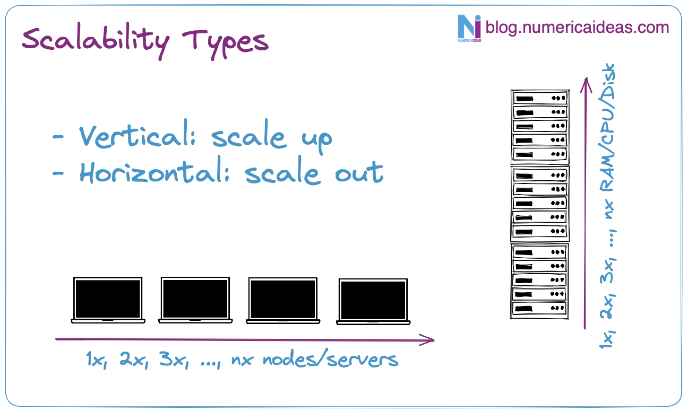

# Lift And Shift Cloud Migration of "Spring Boot + MySQL" App Using AWS ElasticBeanstalk&nbsp;

Migrating a *Spring Boot + MySQL* project to AWS Cloud using **[ElasticBeanstalk](https://aws.amazon.com/elasticbeanstalk/)** service.

Migrating an App with the **Lift And Shift** approach is often done by updating a few configurations files here and there, taking into consideration the **PAAS** model, in which we are only responsible for the App and its data, with the infrastructure and such being handled by the Cloud provider in use. 

This first [video](https://youtu.be/tWQFavEJQ7c) is part of a [series](https://github.com/numerica-ideas/community/tree/master/aws/springboot-migration-elasticbeanstalk#series), it goes over the definition of the **Lift And Shift (Rehosting)** Cloud migration strategy and demonstrates it in only 5 steps:
- **Step 1**: Initialize the Project
- **Step 2**: Create the Environment
- **Step 3**: Deployment Package (build)
- **Step 4**: Linking the Package with the Environment
- **Step 5**: Deployment (`eb deploy --staged`)

**Note**: In order to implement your modifications, you need to commit them initially for ElasticBeanstalk to take them into account. Nevertheless, during your development or debugging process, you might prefer not to push changes that haven't been verified as functional. You can bypass the need to commit your alterations by staging them and utilizing the command `eb deploy --staged`, which conducts a regular deployment.

**Bonus**:
- From the terminal, `eb terminate` will erase everything and free up AWS resources.
- **Command To Create EB Environment**: `eb create spring-cloud-migration --sample --single --timeout 30 --instance_type t2.micro --database.username SpringBootAdmin --database.password Strange_Pwd --envvars PORT=9090 --tags tag1=val1,tag2=val2`

**Video**: https://youtu.be/tWQFavEJQ7c

## Series
It's part of a **[Cloud Migration Series](https://youtube.com/playlist?list=PLJl2liPyo6s3oQkBT2UWbuSfrwO4aS-9Z)** whose content is below:
- **Part 1** : [Lift And Shift (rehosting) to ElasticBeanstalk](https://youtu.be/tWQFavEJQ7c)
- **Part 2** : [Scalability](https://youtu.be/KHOxmHL5USI)
- **Part 3** : CI / CD
- **Part 4** : Monitoring
- **Part 5** : Domain Name + HTTPS Setup (R53 + ACM )
- **Part 6** : Advanced Security Strategies

This video has no intention to highlight the advantages of the Cloud, but directly to migrate an Application to AWS, I’ll assume you have some basic knowledge around, if not, feel free to watch our [previous video](https://youtu.be/0II0ikOZEYE) which covers the most important advantages the Cloud has to offer.

We invite you to **subscribe** to the [YouTube Channels](https://www.youtube.com/@numericaideas/channels?sub_confirmation=1) to be aware of the release of the next videos in the following weeks.

## Scalability
In case you want to scale the infrastructure dynamically, you have to rename the folder **ebextensions** to **.ebextensions** since ElasticBeanstalk expects it to be hidden, we let it that way for the **Part 1** of the video not to scale.

Once done, here's the command to run to create your **scalable environment (load balanced)** instead of the precent one (single instance): `eb create spring-cloud-migration --sample --min-instances 2 --max-instances 4 --timeout 30 --instance_type t2.micro --database.username SpringBootAdmin --database.password Strange_Pwd --envvars PORT=9090 --tags tag1=val1,tag2=val2`

Once your *.ebextensions* file is ready with your configurations, feel free to build and deploy the App once more and they'll be picked up by AWS.

**Video**: https://youtu.be/KHOxmHL5USI

**Notes**:
- Making these changes via the **UI** for an existing deployment is demonstrated in the **Part 2** video, while the **.ebextensions** way works for new and existing environments.
- There is **order of precedence** for configurations options: https://docs.aws.amazon.com/elasticbeanstalk/latest/dg/command-options.html#configuration-options-precedence

## Prerequisites
- Install MySQL and run it.
- Having Java (openjdk17) installed and available in the PATH.
- Configure the environment variables.
- Compile & run the App.

## Environment Variables
Provide the environment variables for `database` access:
- RDS_HOSTNAME, RDS_PORT, RDS_DB_NAME, RDS_USERNAME, & RDS_PASSWORD. **The DB's tables get created at runtime**.

The App ones:
- PORT (default is 8090): it's the server port.

## Compile the App
`./build.sh`

## Run Locally
`./run.sh`

By Orleando Dassi
