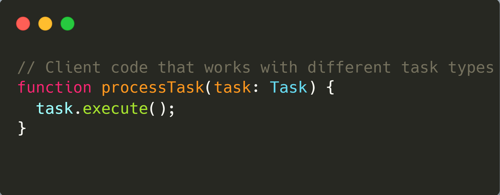

# Apply SOLID Principles in a Real Angular Project

Imagine you're developing a feature-rich task management application using Angular. To ensure a robust and maintainable codebase, let's see how **SOLID Principles** can guide your development journey:

Use Case: Task Management App

## 1. Single Responsibility Principle (SRP)
Each Angular component takes on a single role. For instance, you have separate components for task creation, task listing, and task details. This ensures that components are focused, easier to understand, and more reusable.

## 2. Open-Closed Principle (OCP)
You design the app to be open for extension but closed for modification. When adding new task types, you create new classes that inherit from a base `Task` class. This way, you can add features without altering existing code, ensuring stability.

## 3. Liskov Substitution Principle (LSP)
Suppose you introduce different types of tasks: *"SimpleTask"* and *"ComplexTask."* Applying LSP, you ensure that any component designed for the base `Task` class can seamlessly work with its derived types without causing unexpected behavior.

## 4. Interface Segregation Principle (ISP)
Implement distinct interfaces for different aspects of the app. For example, you create separate interfaces for task creation and task editing. This prevents components from being burdened with unnecessary methods, promoting clarity and maintainability.

## 5. Dependency Inversion Principle (DIP)
You use dependency injection extensively. Components depend on abstractions (interfaces) for services like task storage and notifications. This way, you can effortlessly swap out implementations without affecting the components' behavior.

## Practical Implementation
- Create an `ITask` interface and have `SimpleTask` and `ComplexTask` classes implement it.
- Develop separate components for adding tasks, listing tasks, and displaying task details.
- Use Angular services to manage task storage and notifications, injecting them into components for loose coupling.
- Leverage reactive programming with RxJS to handle task updates and real-time changes.By weaving SOLID principles into your Task Management App, you're ensuring that your

Angular codebase is not just functional, but also maintainable, adaptable, and ready for growth. Have you encountered any challenges or successes while applying SOLID principles in your Angular projects? Let's exchange stories and insights in the comments! Stay turn for more other nice contents.

---

This document was originally written by "Chris Kouakam" on the blog: https://blog.numericaideas.com/solid-principles-in-angular

We have just started our journey to build a network of professionals to grow even more our free knowledge-sharing community that’ll give you a chance to learn interesting things about topics like cloud computing, software development, and software architectures while keeping the door open to more opportunities.

Does this speak to you? If YES, feel free to [Join our Discord Server](https://discord.com/invite/UTP7Davtvg "Join Numerical Ideas Discord Server") to stay in touch with the community and be part of independently organized events.

Thanks for reading this article. Like, recommend, and share if you enjoyed it. Follow us on [Facebook](https://www.facebook.com/numericaideas), [Twitter](https://twitter.com/numericaideas), and [LinkedIn](https://www.linkedin.com/company/numericaideas/) for more content.