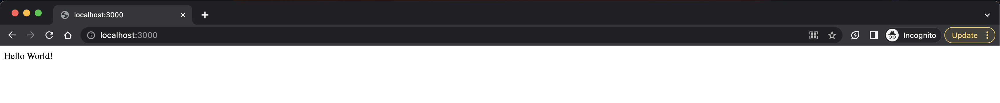

# Docker Init: Quickly Dockerizing NodeJS Application

**This article was originally written by "Orleando Dassi" on the blog**: https://blog.numericaideas.com/quickly-dockerizing-nodejs

## Introduction

Containerization has revolutionized the world of software development and deployment. Docker, one of the leading containerization platforms, offers developers the ability to package their applications and dependencies into lightweight containers, ensuring consistent performance across various environments. With Docker, the process of creating Dockerfiles and Docker Compose files can be simplified using the `docker init` command. In this article, we will explore how `docker init` can speed up the containerization of a **NodeJS/NestJS** App.

<!-- [](https://blog.numericaideas.com/quickly-dockerizing-nodejs) -->

The **YouTube Channels** in both English (En) and French (Fr) are now accessible, feel free to subscribe by clicking [here](https://www.youtube.com/@numericaideas/channels?sub_confirmation=1).

## What is 'docker init'?

The `docker init` command is a powerful tool that enables developers to generate Dockerfiles and Docker Compose files effortlessly. By analyzing your application's source code and dependencies, Docker can create a basic configuration, allowing you to jump-start your containerization journey.

## Benefits of 'docker init'

1. **Time-saving:** Writing Dockerfiles and Docker Compose files from scratch can be time-consuming, especially for large projects. With `docker init`, you can significantly reduce the time and effort required to set up a basic container configuration.

2. **Ease of use:** Whether you are a Docker novice or a seasoned pro, `docker init` is designed to be user-friendly. It automates the initial setup, abstracting complex configurations and allowing developers to focus on building and deploying their applications.

3. **Standardization:** By utilizing `docker init`, you can ensure consistency in your containerization process. Standardized Dockerfiles and Docker Compose files promote better collaboration among team members and facilitate smoother integration into continuous integration and continuous deployment (CI/CD) pipelines.

4. **Flexibility:** Although `docker init` creates an initial configuration, it doesn't lock you into a rigid structure. After generation, you can modify the files as needed to tailor them to your specific application requirements.

## How to use 'docker init'?

Using `docker init` is straightforward:

1. **Install Docker:** Ensure you have Docker installed on your system. If not, head to the Docker website and follow the installation instructions for your platform.

2. **Navigate to your project directory:** Open a terminal or command prompt and navigate to the root directory of your project, where your application source code is located.

3. **Execute 'docker init':** Type the `docker init` command in the terminal and hit Enter. Docker will now analyze your project's codebase and dependencies.

4. **Answer a few questions:** Once the analysis is complete, depending on the project, a few questions will be asked so that Docker will create the Dockerfiles and Docker Compose files in your project directory.

5. **Review the generated files:** Review these files to ensure they align with your application's requirements.

6. **Make necessary adjustments:** If needed, modify the generated files to add specific configurations or tweak settings as per your project's needs. Docker's initial setup serves as a solid starting point, but customization is often necessary for complex applications.

7. **Build and deploy:** With the Dockerfiles and Docker Compose files in place, proceed to build your Docker images and deploy containers using the familiar Docker commands.

## Dockerizing NestJS Application

Let's consider an [API](https://github.com/numerica-ideas/community/tree/master/docker/quickly-dockerizing-nodejs) built with the NestJS framework powered by Node.js, feel free to use any other project or to generate a new one as we did using the command `nest new quickly-dockerizing-nodejs` as illustrated below:


After running `docker init` in the project directory, the next step is to answer a few questions, generally the first one is detected automatically (talking about the platform : Node), and by default Nest uses `dist` as the output folder and the production command to start the App is `npm run start:prod` which starts the App on the port `3000`:


Finally, Docker generates the following [`Dockerfile`](./Dockerfile) for our NestJS Application:

```Dockerfile
# Dockerfile for the NestJS API

# syntax=docker/dockerfile:1

# Comments are provided throughout this file to help you get started.
# If you need more help, visit the Dockerfile reference guide at
# https://docs.docker.com/engine/reference/builder/

ARG NODE_VERSION=18.12.0

################################################################################
# Use node image for base image for all stages.
FROM node:${NODE_VERSION}-alpine as base

# Set working directory for all build stages.
WORKDIR /usr/src/app

################################################################################
# Create a stage for installing production dependecies.
FROM base as deps

# Download dependencies as a separate step to take advantage of Docker's caching.
# Leverage a cache mount to /root/.npm to speed up subsequent builds.
# Leverage bind mounts to package.json and package-lock.json to avoid having to copy them
# into this layer.
RUN --mount=type=bind,source=package.json,target=package.json \
    --mount=type=bind,source=package-lock.json,target=package-lock.json \
    --mount=type=cache,target=/root/.npm \
    npm ci --omit=dev

################################################################################
# Create a stage for building the application.
FROM deps as build

# Download additional development dependencies before building, as some projects require
# "devDependencies" to be installed to build. If you don't need this, remove this step.
RUN --mount=type=bind,source=package.json,target=package.json \
    --mount=type=bind,source=package-lock.json,target=package-lock.json \
    --mount=type=cache,target=/root/.npm \
    npm ci

# Copy the rest of the source files into the image.
COPY . .
# Run the build script.
RUN npm run build

################################################################################
# Create a new stage to run the application with minimal runtime dependencies
# where the necessary files are copied from the build stage.
FROM base as final

# Use production node environment by default.
ENV NODE_ENV production

# Run the application as a non-root user.
USER node

# Copy package.json so that package manager commands can be used.
COPY package.json .

# Copy the production dependencies from the deps stage and also
# the built application from the build stage into the image.
COPY --from=deps /usr/src/app/node_modules ./node_modules
COPY --from=build /usr/src/app/dist ./dist

# Expose the port that the application listens on.
EXPOSE 3000

# Run the application.
CMD npm run start:prod
```

At the same time, the [`compose.yaml`](./compose.yaml) file is generated with the following content:

```yaml
# Comments are provided throughout this file to help you get started.
# If you need more help, visit the Docker compose reference guide at
# https://docs.docker.com/compose/compose-file/

# Here the instructions define your application as a service called "server".
# This service is built from the Dockerfile in the current directory.
# You can add other services your application may depend on here, such as a
# database or a cache. For examples, see the Awesome Compose repository:
# https://github.com/docker/awesome-compose
services:
  server:
    build:
      context: .
    environment:
      NODE_ENV: production
    ports:
      - 3000:3000

# The commented out section below is an example of how to define a PostgreSQL
# database that your application can use. `depends_on` tells Docker Compose to
# start the database before your application. The `db-data` volume persists the
# database data between container restarts. The `db-password` secret is used
# to set the database password. You must create `db/password.txt` and add
# a password of your choosing to it before running `docker-compose up`.
#     depends_on:
#       db:
#         condition: service_healthy
#   db:
#     image: postgres
#     restart: always
#     user: postgres
#     secrets:
#       - db-password
#     volumes:
#       - db-data:/var/lib/postgresql/data
#     environment:
#       - POSTGRES_DB=example
#       - POSTGRES_PASSWORD_FILE=/run/secrets/db-password
#     expose:
#       - 5432
#     healthcheck:
#       test: [ "CMD", "pg_isready" ]
#       interval: 10s
#       timeout: 5s
#       retries: 5
# volumes:
#   db-data:
# secrets:
#   db-password:
#     file: db/password.txt
```

The generated Dockerfiles and Docker Compose file provide a basic setup to containerize both the **Node.js/NestJS** web application and eventually a **PostgreSQL** service. You can then use these files as a starting point and customize them further based on your application's specific requirements.

The complete source code of the project is available on [GitHub](https://github.com/numerica-ideas/community/tree/master/docker/quickly-dockerizing-nodejs).

## Run The Application

Let's test the final result by running the App with the command `docker compose up` whose output is below:


The API is accessible at http://localhost:3000:



**Congratulations! You have successfully dockerized your NodeJS/NestJS App with no effort while following best practices.**

———————

We have just started our journey to build a network of professionals to grow even more our free knowledge-sharing community that’ll give you a chance to learn interesting things about topics like cloud computing, software development, and software architectures while keeping the door open to more opportunities.

Does this speak to you? If **YES**, feel free to [Join our Discord Server](https://discord.numericaideas.com) to stay in touch with the community and be part of independently organized events.

———————

## Conclusion
Docker Init simplifies and expedites the containerization process by providing a convenient method to generate Dockerfiles and Docker Compose files. By using this single CLI command, developers can save time, maintain standardization, and focus on the crucial aspects of application development and deployment. Whether you are a Docker novice or an experienced user, `docker init` proves to be a valuable tool in streamlining your containerization workflow. So, give it a try and experience the efficiency and simplicity it brings to your container-based projects. Happy containerizing!

Thanks for reading this article. Like, recommend, and share if you enjoyed it. Follow us on [Facebook](https://www.facebook.com/numericaideas), [Twitter](https://twitter.com/numericaideas), and [LinkedIn](https://www.linkedin.com/company/numericaideas) for more content.
