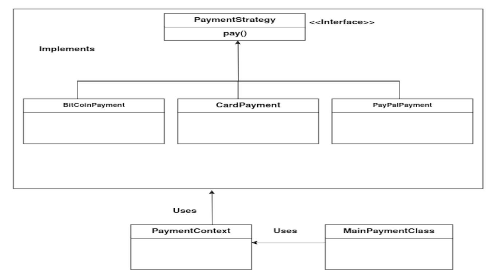

# Design pattern strategy&nbsp;

This repository is about demonstrating a sample implementation of the Design pattern Strategy in Java.

**Read the related article written by "Faouzi EL Mansour" on the blog**: https://numericaideas.com/blog/design-pattern-strategy

## Description of the case study

The case study, we will take as an example is an e-commerce platform that must manage several payment methods to allow its customers to pay their invoices. On this platform, we find articles. A user can purchase an item and pay their invoice directly from it using the payment method of their choice (PayPal, Credit Card, bitcoin, etc). The diagram below presents the architecture of the solution using the design pattern strategy.

In this structure, it is possible to classify it into three distinct parts:

    The PaymentContext class represents the context.
    The MainPaymentClass class represents the customer.
    The block of strategies that brings together (the PaymentStrategy interface as well as the concrete strategies PayPalPayment, BitCoinPayment, and CardPayment).

The PaymentContext class maintains a reference to one of the concrete policies and will only communicate with this object through the policy interface. Each time an algorithm is launched, the context requests the execution method of the corresponding strategy object. The context is not aware of how the strategy works or how the algorithm is implemented.

The different concrete strategies, such as PayPalPayment, BitCoinPayment, and CardPayment, use a common interface called PaymentStrategy. In this interface, a pay() method is declared, and used by the context to execute a specific strategy. And the various concrete strategies will implement this interface and each will be able to use its own logic to implement the pay() method at home. Concrete Strategies integrate various versions of algorithms that are used depending on the context.

The Client develops a particular object. Strategy and context. The context presents a setter that gives clients the ability to override the context-related policy during implementation.

## Run

It's a normal **Java** project, so you can run it using the run command of an IDE such as: IntelliJ, VS Code etc.
