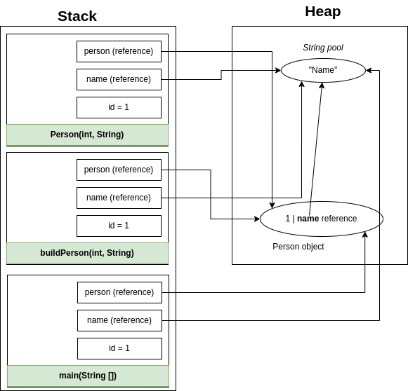

# JAVA INTERVIEW QUESTIONS AND ANSWERS FOR BEGINNER&nbsp;[](https://numericaideas.com/)

Java is without a doubt one of the most powerful and used programming languages around the world. In this article, we are going to describe some java specificities by answering 30 questions.

**Who could read this article?**

* Beginner developer: As a beginner developer, you can find this article useful to let you know more about Java and success your interview;
  
* Advanced developer: We all know that memory is few reliable, so It is not strange to forget about something you learned a long time ago. You can find here a memory reminder.

Feel free to write some comments that can help us to improve our articles.

**1.  What is Java ?**
   
   Java is a high level, class based, object oriented programming language and computing platform. It was first released by Sun Microsystems in 1995. Since January 2010, Oracle become the new owner of Java.

**2.  The features of Java programming language**
   
  * **Simple**: 

    Java is a simple programming language and easy to understand because it does not contain complexities that exist in prior programming languages. Simplicity was the design aim of Javasoft people because it has to work on electronic devices where less memory/resources are available. Java contains the same syntax as C and C++, so the programmers who are switching to Java will not face any problems in terms of syntax. Secondly, the concept of pointers has been completely removed from Java which leads to confusion for a programmer and pointers are also vulnerable to security.


  * **Object Oriented**:
    
    Java follows the object-oriented paradigm which allows us to maintain our code as a combination of different types of objects that incorporates both data and behavior.
    

  * **Platform independent**:

    The design objective of javasoft people is to develop a language that must work on any platform. Here platform means a type of operating system and hardware technology. Java allows programmers to write their program on any machine with any configuration and to execute it on any other machine having different configurations. 

  * **Portable**:
    
    The WORA (Write Once Run Anywhere) concept and platform-independent feature make Java portable. Now using the Java programming language, developers can yield the same result on any machine, by writing code only once. The reason behind this is JVM and bytecode. Suppose you wrote any code in Java, then that code is first converted to equivalent bytecode which is only readable by JVM. We have different versions of JVM for different platforms. Windows machines have their version of JVM, Linux has its own and macOS has its version of JVM. So if you distribute your bytecode to any machine, the JVM of that machine would translate the bytecode into the respective machine code. In this way portability lets the programmers focus on development and productivity rather than writing different code for different platforms. 

  * **Robust**:
    
    The Java Programming language is robust, which means it is capable of handling unexpected termination of a program. There are 2 reasons behind this, first, it has a most important and helpful feature called Exception Handling. If an exception occurs in java code then no harm will happen whereas, in other low-level languages, the program will crash. Another reason why Java is strong lies in its memory management features. Unlike other low-level languages, Java provides a runtime Garbage collector offered by JVM, which collects all the unused variables.
    
  * **Secure**:
    
    Java provides a strong Exception Handling mechanism which makes it more secure as it does not allow you to run the program until you rectify the error. Java also provides security features to the programmers. Security problems like virus threats, tampering, eavesdropping, and impersonation can be handled or minimized using Java. Encryption and Decryption features to secure your data from eavesdropping and tampering over the internet.
    
  * Interpreted:
    
    Java programming language uses both a compiler and an interpreter. Java programs are compiled to generate bytecode files then JVM interprets the bytecode file during execution. Along with this JVM also uses a JIT compiler (it increases the speed of execution).
    
  * **Multi-Threaded**:
    
    With Java's multithreaded feature, it is possible to write programs that can perform many tasks simultaneously. This design feature allows the developers to construct interactive applications that can run smoothly.

  * **Architecture Neutral**:
    
    Java is architectural neutral as it is not dependent on the architecture. In C, the size of data types may vary according to the architecture (32 bit or 64 bit) which doesn't exist in Java.
    
  * **Distributed**:
    
    Java is a distributed language which means that the program can be designed to run on computer networks. Java provides an extensive library of classes for communicating using TCP/IP protocols such as HTTP and FTP. This makes creating network connections much easier than in C/C++.    
    
**3. Explain JDK, JRE and JVM?**  
   
| JDK                                                                       | JRE                                                                          | JVM                                                                                                                            |
|---------------------------------------------------------------------------|------------------------------------------------------------------------------|--------------------------------------------------------------------------------------------------------------------------------|
| It stands for Java Development Kit.                                       | It stands for Java Runtime Environment.                                      |  It stands for Java Virtual Machine.                                                                                           |
| It is the tool necessary to compile, document and package Java programs.  | JRE refers to a runtime environment in which Java bytecode can be executed.  |  It is an abstract machine. It is a specification that provides a run-time environment in which Java bytecode can be executed. |
| It contains JRE + development tools.                                      | It’s an implementation of the JVM which physically exists.                   |  JVM follows three notations: Specification, Implementation, and Runtime Instance.                                             |
     
**4. Why is Java not a pure object oriented language?**  
   
  Java supports primitive data types - byte, boolean, char, short, int, float, long, and double and hence it is not a pure object oriented programming language.  
   
**5. How many types of memory areas are allocated by JVM?**  
   
  * **Class(Method) Area**:  
  Class Area stores per-class structures such as the runtime constant pool, field, method data, and the code for methods.  

  * **Heap**:  
  It is the runtime data area in which the memory is allocated to the objects  

  * **Stack**:  
  Java Stack stores frames. It holds local variables and partial results and plays a part in method invocation and return. Each thread has a private JVM stack, created at the same time as the thread. A new frame is created each time a method is invoked. A frame is destroyed when its method invocation completes.

  * **Program Counter Register**:  
  program counter register contains the address of the Java virtual machine instruction currently being executed.

  * **Native Method Stack**:  
  It contains all the native methods used in the application.

**6. Difference between Heap and Stack Memory in Java**   
   
   **Java Heap space** is used by java runtime to allocate memory to Objects and JRE classes. Whenever we create an object, it’s always created in the Heap space. Garbage Collection runs on the heap memory to free the memory used by objects that don’t have any reference. Any object created in the heap space has global access and can be referenced from anywhere in the application.  

   **Java Stack memory** is used for the execution of a thread. It contains method-specific values that are short-lived and references to other objects in the heap that are getting referred from the method. Stack memory is always referenced in LIFO (Last-In-First-Out) order. Whenever a method is invoked, a new block is created in the stack memory for the method to hold local primitive values and reference to other objects in the method. As soon as the method ends, the block becomes unused and becomes available for the next method. Stack memory size is much less compared to Heap memory.  

``` java  
class Person {  
    int id;
    String name;

    public Person(int id, String name) {
        this.id = id;
        this.name = name;
    }
}

public class PersonBuilder {

    private static Person buildPerson(int id, String name) {
        return new Person(id, name);
    }

    public static void main(String[] args) {
        int id = 1;
        String name = "Name";
        Person person = null;
        person = buildPerson(id, name);
    }
}
```  
If we run the code above, the *main* method will start the execution. Hence It will be loaded into the stack.

The first local variable *id* will be directly stored in the stack since It is a primitive variable. The reference of *name* and *person* variables will be stored in the stack since they are object.  

A string *"Name"* will be added in heap memory. 

The *buildPerson* method is called by the *main* method, then the *main* will stop execution and the *buildPerson* will be loaded into the stack.  

*id* and *name* are stored in stack as a local variable, *person* reference is also stored in stack as a return type. 

The the Person class constructor is loaded into the stack. Since It is called by *buildPerson* and all Its intance variables are stored in the stack.



**7. What is Java Classloader?**
   
  The Java ClassLoader is a part of the Java Runtime Environment that dynamically loads Java classes into the Java Virtual Machine. The Java run time system does not need to know about files and file systems because of classloaders. Java classes aren’t loaded into memory all at once, but when required by an application. At this point, the Java ClassLoader is called by the JRE, and these ClassLoaders load classes into memory dynamically.  
   
  Not all classes are loaded by a single ClassLoader. Depending on the type of class and the path of class, the ClassLoader that loads that particular class is decided. All classes are loaded based on their names and if any of these classes are not found then it returns a NoClassDefFoundError or ClassNotFoundException. A Java Classloader is of three types:

  *  **Bootstrap ClassLoader**: This is the first classloader which is the superclass of Extension classloader. It loads the rt.jar file which contains all class files of Java Standard Edition like java. lang package classes, java.net package classes, java.util package classes, java.io package classes, java.sql package classes, etc.
  
  *  **Extension ClassLoader**: The Extension ClassLoader is a child of Bootstrap ClassLoader and loads the extensions of core java classes from the respective JDK Extension library. It loads files from jre/lib/ext directory or any other directory pointed by the system property java.ext.dirs.
  
  *  **System/Application ClassLoader**: This is the child classloader of Extension classloader. It loads the class files from the classpath. By default, the classpath is set to the current directory. You can change the classpath using "-cp" or "-classpath" switch. It is also known as Application classloader.
  

**8. What is JIT**
   
  JIT stands for Just-In-Time and it is used for improving the performance during run time. It does the task of compiling parts of byte code having similar functionality at the same time thereby reducing the amount of compilation time for the code to run.  

  The compiler is nothing but a translator of source code to machine-executable code. But what is special about the JIT compiler? Let us see how it works:  

  * First, the Java source code (.java) conversion to byte code (.class) occurs with the help of the javac compiler.  
  
  * Then, the .class files are loaded at run time by JVM, and with the help of an interpreter, these are converted to machine-understandable code.  
  
  * JIT compiler is a part of JVM. When the JIT compiler is enabled, the JVM analyzes the method calls in the .class files and compiles them to get more efficient and native code. It also ensures that the prioritized method calls are optimized.  
  
  * Once the above step is done, the JVM executes the optimized code directly instead of interpreting the code again. This increases the performance and speed of the execution.

**9.  What are the various access modifier in Java** 
    
  In Java, access modifiers are used to set the accessibility (visibility) of classes, interfaces, variables, methods, constructors, and data members. Java provides access control through three keywords - private, protected, and public. We are not required to use these access modifiers always, so we have another one namely “default access”, “package-private” or “no modifier”.

  * **Java Access Modifiers - public keyword**  
  
    If a class member is “public” then it can be accessed from anywhere. The member variable or method is accessed globally. This is the simplest way to provide access to class members. However, we should take care of using this keyword with class variables otherwise anybody can change the values. Usually, class variables are kept as private, and getter-setter methods are provided to work with them.

  * **Java Access Modifiers - private keyword**  
  
    If a class member is “private” then it will be accessible only inside the same class. This is the most restricted access and the class member will not be visible to the outer world. Usually, we keep class variables as private and methods that are intended to be used only inside the class as private.

  * **Java Access Modifiers - protected keyword**  
  
    If class member is “protected” then it will be accessible only to the classes in the same package and to the subclasses. This modifier is less restricted from private but more restricted from public access. Usually, we use this keyword to make sure the class variables are accessible only to the subclasses.

  * **Java Access Modifiers - default access**  
  
    If a class member doesn’t have any access modifier specified, then it’s treated with default access. The access rules are similar to classes and the class member with default access will be accessible to the classes in the same package only. This access is more restricted than public and protected but less restricted than private.

**10. What is Object Oriented Programming (OOP)**
    
  Object-Oriented Programming or OOPs refers to languages that use objects in programming, they use objects as a primary source to implement what is to happen in the code. Objects are seen by the viewer or user, performing tasks assigned by you. Object-oriented programming aims to implement real-world entities like inheritance, hiding, polymorphism, etc. in programming. The main aim of OOP is to bind together the data and the functions that operate on them so that no other part of the code can access this data except that function. 

**11. Main concepts of OOP**
    
  1.  **Encapsulation**: It is the process of wrapping a code and behavior in a class and preventing from misuse. It exposes only parts of an object that are safe to be exposed and the remaining part of the object is kept secure.   
   
  2.  **Inheritance**: It is the process of acquiring the features of others. for example, a child acquires the features of their parents.
   
  3.  **Polymorphism**: It is a combination of two greek words which mean many forms. In polymorphism, actual type of object involved in method call determines which method to call rather type or reference variable.
    
**12. Difference between instance and local variables**

Instance variables are those variables that are accessible by all the methods in the class. They are declared outside the methods and inside the class. These variables describe the properties of an object and remain bound to it at any cost.  

Example:
```java
class Foo {
  public String bar;
  public String fooBar;
}
```  

Local variables are those variables present within a block, function, or constructor and can be accessed only inside them. The utilization of the variable is restricted to the block scope. Whenever a local variable is declared inside a method, the other class methods don’t have any knowledge about the local variable.  

Example:  
```java
public void foo() {
  public String bar;
  public String fooBar;
}
```

**13. Explain the static void main method**  
    
  main() in Java is the entry point for any Java program. It is always written as **public static void main(String[] args)**.

* ***public***: Public is an access modifier, which is used to specify who can access this method. Public means that this Method will be accessible by any Class.  
  
* ***static***: It is a keyword in Java that identifies it as class-based. main() is made static in Java so that it can be accessed without creating the instance of a Class. In case, main is not made static then the compiler will throw an error as main() is called by the JVM before any objects are made and only static methods can be directly invoked via the class.
  
* ***void***: It is the return type of the method. Void defines the method that will not return any value.  
  
* ***main***: It is the name of the method that is searched by JVM as a starting point for an application with a particular signature only. It is the method where the main execution occurs.  
  
* ***String args[]***: It is the parameter passed to the main method.

**14. Is empty .java file name a valid source file name?**  
    
  Yes, Java allows us to save our java file by .java only, we need to compile it by javac .java and run it by java classname.  

**15. What are wrapper classes in Java**  
    
  Wrapper classes convert the Java primitives into reference types (objects). Every primitive data type has a class dedicated to it. These are known as wrapper classes because they “wrap” the primitive data type into an object of that class.  

**16. What are constructors in Java?**  
    
  The constructor can be defined as the special type of method that is used to initialize the state of an object. It is invoked when the class is instantiated, and the memory is allocated for the object. The name of the constructor must be similar to the class name. The constructor must not have an explicit return type.  

  There are two types of constructors:  

  1. *Default Constructor*: In Java, a default constructor is the one that does not take any inputs. In other words, default constructors are the no-argument constructors that will be created by default in case you have no other constructor defined by the user. Its main purpose is to initialize the instance variables with the default values. Also, it is mainly used for object creation.  
   
  2. *Parameterized Constructor*: The parameterized constructor in Java is the constructor which is capable of initializing the instance variables with the provided values. In other words, the constructors which take the arguments are called parameterized constructors.  
    
**17. What are different between constructors and methods**  
    
  Constructor is used for initializing the object state whereas the method is used for exposing the object's behavior. Constructors have no return type but methods should have a return type. Even if It does not return anything, the return type is void. If the constructor is not defined, then a default constructor is provided by the java compiler. The constructor name should be equal to the class name. A constructor cannot be marked as final because whenever a class is inherited, the constructors are not inherited. A method can be defined as final but it cannot be overridden in its subclasses.  

**18. Difference between method overloading and overriding**
    
  Method overloading is creating multiple methods in a class with the same name but different parameters, while method overriding is creating a method in a subclass with the same name and parameters as a method in its superclass.

**19. Can we overload a constructor?** 
    
  Java allows the creation of multiple constructors for the same class. These constructors should have different parameters. Each constructor provides a different way to initialize an object of that class.

**20. Can we override a private or static method in Java?**
    
  Private methods aren't accessible for other classes unless they are inner classes or nested classes. A class cannot override a private method.  
  
  If you try to override a static method, you will fall to method hiding.

  ```java
    class Father {

      public static String sayHello() {
        return "Hello Father!";
      }

    }

    class Child extends Father {

      public static String sayHello() {
        return "Hello Child!";
      }

    }

    class Main {

      public static void main(String args[]) {
        
        Father test1 = new Father();
        System.out.println(test1.sayHello()); // output: Hello Father!

        Father test2 = new Child();
        System.out.println(test2.sayHello()); // output: Hello Father!

        Child test3 = new Child();
        System.out.println(test3.sayHello()); // output: Hello Child!
      }
    }
  ```
  You can see that in test2 "Hello Father!" is still printed. With method overring, the call is made from the subclasse. But in method hiding, the call is made from reference type (**Father**).

**21. What is inheritance?**
    
  Inheritance is one of the important features of object-oriented language. Inheriting is the process of acquiring the features of others. For example, a child acquires the features of their parents. In Java inheritance is the process of inheriting member of existing classes by extending their functionality. The original class is called base class, parent class, or super class. The new class derived from parent is called the child class, sub class, and derived class. We use the extends keyword in Java to extend a class. In Java, the super class of all classes is **Object** class from **java.lang** package.

**22. Why is multiple inheritance not supported in Java** 
    
  Multiple Inheritance is a type of inheritance in which a class extends two or more classes. Consider a scenario where A, B, and C are three classes. The C class inherits A and B classes. If A and B classes have the same method and you call it from child class object, there will be ambiguity to call the method of A or B class. This problem is termed as **Diamond Problem**. Since compile-time errors are better than runtime errors, Java renders compile-time error if you inherit 2 classes. So whether you have same method or different, there will be a compile time error.

  ```java
    class A {

      void sayHello() {
        System.out.println("Hello A!");
      }

    }

    class B {

      void sayHello() {
        System.out.println("Hello B!");
      }

    }

    class C extends A,B { //let's suppose it is possible

      public static void main(String args[]) {
        C test = new C();
        test.sayHello(); // Which sayHello() method would be invoked?
      }
    }
  ```
  This will result in a compilation error.  
  However, "*Multiple Inheritance*" can be achieved by implementing multiple interfaces since interface forces the method overriding.

**23. Difference between interface and abstract classes**
    
  An interface can only contain abstract methods whereas an abstract class can contain abstract and concrete methods. All methods in the interface must be public, but in the abstract class, except private, methods can have all other access specifiers. An interface can have variables, but they must be public static final. An abstract class cannot only have private variables. To inherit interface features, classes use the implements keyword. But they use the extends keyword for abstract class. A class can implement many interfaces but can just extend one abstract class.

**24. Explain the use of final keyword** 
    
  Final access modifier can be used for class, method and variables. The main advantage of final access modifier is security, no one can modify our classes, variables, and methods. The main disadvantage of final access modifier is we cannot implement object oriented programming concepts.

  * *Final class*: A final class cannot be extended. inheritance can be prevented by marking a class as final. The method of final class can be accessed by composition. String class is a built-in final class in Java.
  
  * *Final methods*: Method overriding is one of the important features of Java. But there are situations where we may not want to use this feature. To prevent a method from being overridden, we use final access modifier for methods.
  
  * *Final variable*: If a variable is declared as final, it behaves like a constant. We cannot modify its value. any attempt to modify the final variable will result in a compilation error.
  
**25. Composition vs aggregation** 
    
  Composition, and Aggregation help to build (Has - A - Relationship) between classes and objects. But both are not the same in the end. Let’s understand with the help of an example. 

  * Consider the University as a class that has some departments in it. So the university will be the container object. And departments in it will contain objects. Now in this case, if the container object is destroyed then the contained objects will also get destroyed automatically.  So here we can say that there is a strong association between the objects. So this **Strong Association** is called **Composition**.
  
  * Now consider one more example. Suppose we have a class department and there are several professors' objects there in the department. Now if the department class is destroyed then the professor's object will become free to bind with other objects. Because container objects (Department) only hold the references of contained objects (Professor). So here is the **weak association** between the objects. And this weak association is called **Aggregation**.

**26. What is a polymorphism**
    
  Polymorphism in Java is the phenomenon by which an object can acquire the ability to operate from different perspectives.

  ```java
    class Computer {
      void run() {
        System.out.println("A computer is running");
      }
    }

    class Laptop implements Computer {
      void run() {
        System.out.println("A Laptop is running");
      }
    }

    class Desktop implements Computer {
      void run() {
        System.out.println("A Desktop is running");
      }
    }

    class SmartPhone implements Computer {
      void run() {
        System.out.println("A SmartPhone is running");
      }
    }

    class Main {

      public static void main(String args[]) {

        Computer laptop = new Laptop();
        Computer desktop = new Desktop();
        Computer smartPhone = new SmartPhone();

        laptop.run();
        desktop.run();
        smartPhone.run();

      }
    }
  ```
  We can see that a computer can be a laptop, desktop, smartphone, and so on. Then it can behave differently according to the implementation.
    
**27. What are compile-Time Polymorphism and run-Time Polymorphism**
    
  Compile-time polymorphism is also known as static polymorphism or early binding. Compile-time polymorphism is a polymorphism that is resolved during the compilation process. Overloading of methods is called through the reference variable of a class. Compile-time polymorphism is achieved by method overloading and operator overloading.

  ```java
    class A {

      void sayHello() {
        System.out.println("Hello World!");
      }

      void sayHello(String name) {
        System.out.println("Hello " + name);
      }
    }

    class Main {

      public static vois main(String args[]) {
        A a = new A();
        a.sayHello(); // Hello World!
        a.sayHello("Man"); // Hello Man
      }
    }
  ```

  In Java, runtime polymorphism or dynamic method dispatch is a process in which a call to an overridden method is resolved at runtime rather than at compile-time. In this process, an overridden method is called through the reference variable of a superclass.

  ```java
    class Animal {
      void makeSound() {
        System.out.println("An animal is making a sound!");
      }
    }

    class Dog extends Aminal {
      void makeSound() {
        System.out.println("Wouaf!");
      }
    }

    class Cat extends Aminal {
      void makeSound() {
        System.out.println("Miaou!");
      }
    }

    class Main {

      public static vois main(String args[]) {
        Animal dog = new Dog();
        dog.makeSound(); // Wouaf!
        Animal cat = new Cat();
        cat.makeSound(); // Miaou!
      }
    }
  ```
**28. What is exception?**
    
  In Java, an exception is an object. Exceptions are created when abnormal situations are arisen in our program. Exceptions can be created by JVM or by our application code. Exception can be considered as a runtime error.

**29. Automatic garbage collection**
    
  Automatic garbage collection is the process of looking at heap memory, identifying which objects are in use and which are not, and deleting the unused objects. An in use object, or a referenced object, means that some part of your program still maintains a pointer to that object. An unused object, or unreferenced object, is no longer referenced by any part of your program. So the memory used by an unreferenced object can be reclaimed.  

  In a programming language like C, allocating and deallocating memory is a manual process. In Java, the process of deallocating memory is handled automatically by the garbage collector.

**30. Possible ways to making object eligible for garbage
collection**  

Even though the programmer is not responsible for destroying useless objects it is highly recommended to make an object unreachable(thus eligible for Garbage Collector) if it is no longer required.  

There are generally four ways to make an object eligible for garbage collection:  

* Nullifying the reference variable
* Re-assigning the reference variable
* An object created inside the method
* Island of Isolation
  
An island of isolation is a group of objects that reference each other but are not referenced by any active object in the application.

```java
class Foo {

  Foo  prop;

  public static void main(String args[]) {
    Foo obj1 = new Foo();
    Foo obj2 = new Foo();

    obj1.prop = obj2;
    obj2.prop = obj1;

    obj1 = null;
    obj2 = null;
  }
}
```

In the program below, both **obj1** and **obj2** variables are eligible for garbage collection.