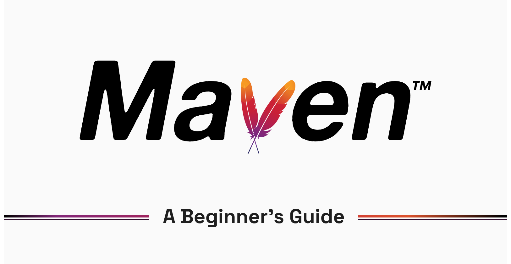
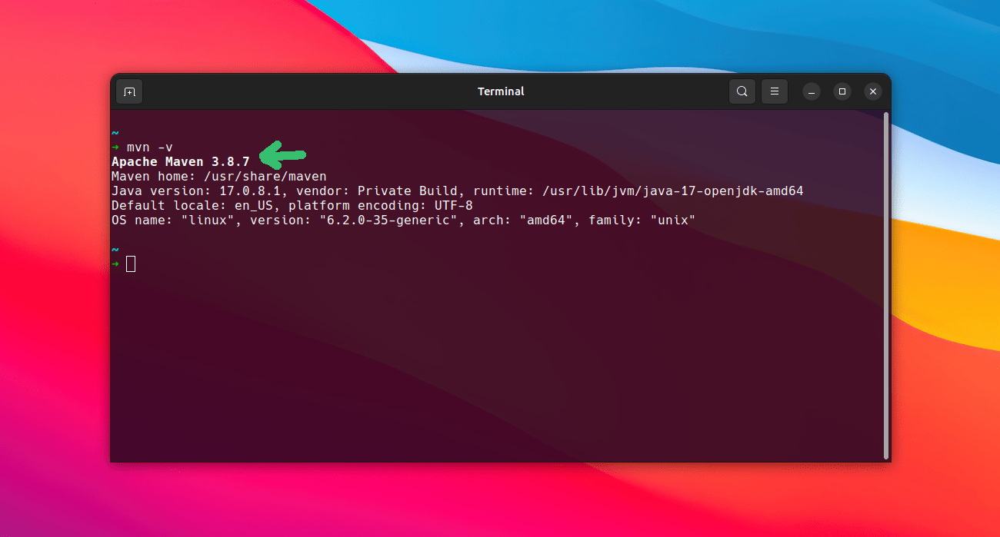
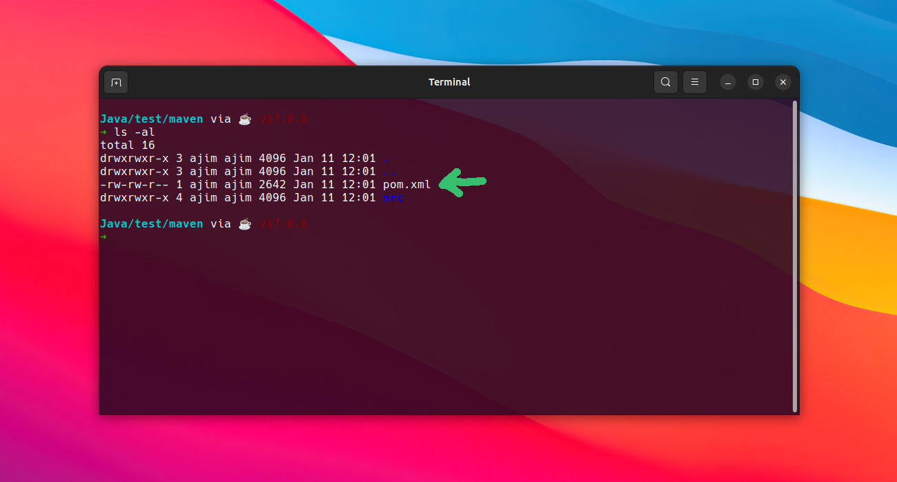
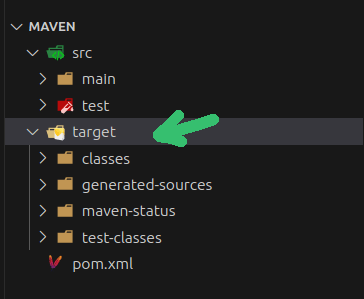
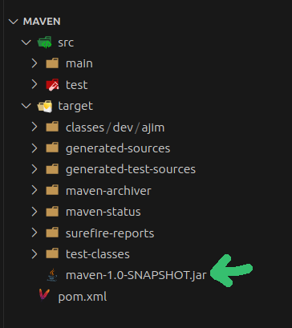
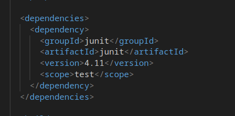
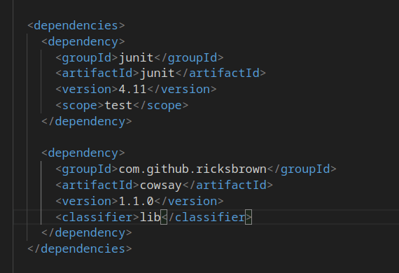
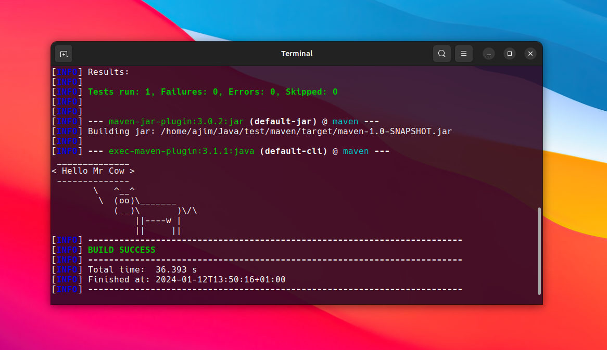

# A Beginner's Guide to Apache Maven


Maven is a build tool primarily used in Java projects to compile, test, and package code into JAR or WAR artifacts. It also provides a streamlined way to manage dependencies, generate documentation, and a host of other features.

In this article, we'll look at some of the core Maven concepts you should know as a beginner ; like commands to create, compile and package Maven projects, and also how dependencies and plugins work in Maven. Additionally, we will build a little project to tie everything together as we progress through the article. I hope you are excited about this, let's get right into the prerequisites.


## Prerequisites
To follow along, you need to have JDK(Java Development Kit) and Maven installed in your local environment — preferably the latest LTS versions.

Follow this link to get the latest version of JDK:
https://www.oracle.com/java/technologies/downloads/

And this link download Maven:
https://maven.apache.org/download.cgi

I decided not to include a setup guide as it would make this article rather lengthy, but there are plenty of resources online on how to do so and a search on Google or YouTube should do the job.


## Maven Commands

> The terminal is what we'll mainly be using to interface with Maven through out this guide. In places where we have to modify code/files, feel free to use any IDE or Text Editor of your choice.

To see if we installed Maven correctly, run the following command in your terminal:

```
mavn -v
```

If it displays the Maven version like this ⬇️, then you're good to go.



### Creating A Maven Project
To create a Maven project, navigate to any directory of your choice and run the following command:

```
mvn archetype:generate -Dfilter=org.apache.maven.archetypes:
```

After running it, you will be prompted to provide some values. You can just provide the `groupId:` and `artifactId:`, and leave the rest as default. Once your project has been created, navigate to the project directory and you should see a folder structure like this: 



It contains a `pom.xml` file and a `/src` directory.

- 📄 `pom.xml` : This is the file where we configure our maven project. It contains meta-data about our project, project dependencies, plugins, and so on. It is similar to the `package.json` file used in JavaScript projects. POM stands for **Project Object Model**.

- 📁 `/src` : This directory is where all the code and tests will be.

### Compiling and Packaging Our Maven Project
Before we compile or package our project, we need to first understand Maven's lifecycle and its commands. Maven has 8 lifecycle commands, and they are: Validate, Compile, Test, Package, Integration Test, Verify, Install and Deploy.

- `validate` : This command checks the `pom.xml` file and verifies if it  has been configured properly.
- `compile` : Compile will turn the `.java` source files into `.class` that can be executed by the JVM.
- `test` : Runs the unit tests.
- `package` : Packages the project into a portable JAR or WAR artifact.
- `integration-test` : Runs the integration tests.
- `verify` : Verifies all checks and tests pass.
- `install` : Adds the package to the local Maven repository.
- `deploy` : Pushes the package to a remote maven repository.

It is important to note each command you run will also run the preceding commands. For example, if you run `test` behind the scenes it runs `compile` and `validate` too. This is an example of how to run any of the commands with Maven, in this case I'm running the `package` command:

```
mvn package
```

Another command worth mentioning is  `clean` :
```
mvn clean
```

It basically removes everything generated by maven like the compiled executables and artifacts, and it's usually run alongside any of the other lifecycle commands like this:

```
mvn clean package
```

With that out of the way, now let's compile and package the project we created earlier. Go ahead and open the project in your favorite IDE or Text Editor, I am using VS Code. To compile the code, just run the following command in your terminal:

```
mvn compile
```

Notice a new directory was created called `/target`.



The class file can be found in **/target/classes**.

What command do we use to package our project ? you guessed it

```
mvn package
```

After running this command, you should see a new JAR file in the **/target** directory. The name of this file is a combination of your **artifactId** and **version number**.



Sadly though, there isn't a direct way to run our code and see the output with Maven. However, we can do so with the help of a plugin and that's what we'll do in the section under plugins.


## Maven Dependencies

All dependencies are managed in the **POM** file, inside an attribute called `<dependencies> </dependencies>`. If you open the **POM** file, you'd notice there is a dependency that comes by default and that is **junit**. JUnit is a unit testing library for Java.



Let's add a dependency for a cool library called **cowsay**. All it does is print a cow on the terminal saying something. Copy this code and add it to the dependencies in your POM file.

```xml
<dependency>
	<groupId>com.github.ricksbrown</groupId>
	<artifactId>cowsay</artifactId>
	<version>1.1.0</version>
	<classifier>lib</classifier>
</dependency>
```

This is how it should look like after adding it.



Also, let's modify the code in our main class to use the **cowsay** library. In `/src/main/.../App.java`, replace the code with the one below. 

> Make sure you don't remove the package declaration

```java
import com.github.ricksbrown.cowsay.Cowsay;

public class App{

	public static void main(String[] args) {
		String[] cowArgs = new String[] { "Hello Mr Cow" };

		String cowString = Cowsay.say(cowArgs);

		System.out.printf(cowString);

	}
}
```

This is a simple program that will print a cow on the console with the message "Hello Mr Cow".


## Maven Plugins

Plugins are basically third-party utilities written by other developers to extend the capabilities of Maven. They are very powerful and can be helpful in many cases, like in our case where we need a way to run our code with Maven. It is possible to run the code from an IDE or Text Editor easily, however, we're just doing this to learn how plugins work in Maven.

In the POM file, declared plugins can be found inside the `<plugins>` attribute, which is nested under the `<pluginMangement>` attribute that is also nested under the `<build>` attribute. You should find many other plugins that came with this installation like the **maven-clean-plugin**, **maven-compiler-plugin**, etc.

The plugin we will use to run our code is called **exec-maven-plugin**. You can add the following code to your POM file, inside the `<plugins>` attribute. Make sure you replace `(groupId)` with your actual group ID.

```xml
<plugin>
	<groupId>org.codehaus.mojo</groupId>
	<artifactId>exec-maven-plugin</artifactId>
	<version>3.1.1</version>
	<configuration>
		<mainClass>(groupId).App</mainClass>
	</configuration>
</plugin>
```

Now the time we've eagerly been waiting for, running our code 😁. You can use the following commands to do so:

```
mvn clean
```

```
mvn package
```

```
mvn exec:java
```

Or you can run it all in one go :

```
mvn clean package exec:java
```

`exec:java` is what calls our plugin. 

If you get an output similar to this, then your code ran successfully🎉.



———————

We have just started our journey to build a network of professionals to grow even more our free knowledge-sharing community that’ll give you a chance to learn interesting things about topics like cloud computing, software development, and software architectures while keeping the door open to more opportunities.

Does this speak to you? If **YES**, feel free to [Join our Discord Server](https://discord.numericaideas.com) to stay in touch with the community and be part of independently organized events.

———————


## Conclusion
In this article, we went over what Maven is about and saw some of its commands for compiling and packaging projects, etc. We also how to manage dependencies and plugins with Maven all working on a fun little project. If you went through the whole article, I hope you learned some new things and are now confident to start using Maven in your own projects.

Thanks for reading this article. Like, recommend, and share if you enjoyed it. Follow us on [Facebook](https://www.facebook.com/numericaideas), [Twitter](https://twitter.com/numericaideas), and [LinkedIn](https://www.linkedin.com/company/numericaideas) for more content.