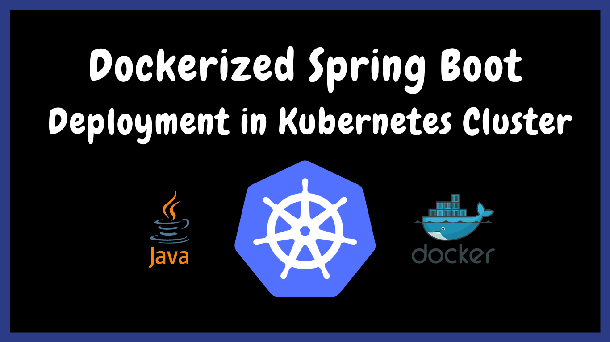

# Spring Boot Microservices Deployment to Kubernetes with Helm via GitLab CI&nbsp;[](https://blog.numericaideas.com/springboot-microservices-deployment-kubernetes-helm-gitlabci)

**This article was originally written by "Kemane Donfack" on the blog**: https://blog.numericaideas.com/springboot-microservices-deployment-kubernetes-helm-gitlabci

## Introduction
In today's fast-paced software development environment, it is essential to deploy applications quickly and efficiently. **Microservices** architecture is becoming increasingly popular for its ability to create highly scalable and flexible applications. **Kubernetes**, a popular open-source container orchestration system, has also become the go-to solution for microservices deployment. In this article, we will walk through the process of deploying applications from microservices to a Kubernetes cluster with **Helm** via **GitLab CI**.

[GitLab CI](https://docs.gitlab.com/ee/ci/) is an integral part of the [GitLab](https://about.gitlab.com) platform and provides a robust continuous integration and deployment (CI/CD) pipeline. It allows developers to automate the building, testing and deployment of their applications. [Helm](https://helm.sh/) is a package manager for Kubernetes that allows users to install, upgrade and manage applications in a Kubernetes cluster.

[](https://blog.numericaideas.com/springboot-microservices-deployment-kubernetes-helm-gitlabci)

## Prerequisites
To perform this demo, you will need to have the following prerequisites:
- **A Kubernetes cluster** : You can use an existing Kubernetes cluster or create a new one on a cloud provider such as Google Cloud, Amazon Web Services or Microsoft Azure.
- **A GitLab account** : You will need a GitLab account to set up the CI/CD pipeline.
- **Docker Hub account** : You will need a Docker Hub account to store Docker images.

In case you would like to grab more technical concepts, another published article illustrates how to [Deploy a Spring Boot App with Docker in a Kubernetes Cluster](https://blog.numericaideas.com/deploying-springboot-app-with-docker-and-kubernetes):

[](https://blog.numericaideas.com/deploying-springboot-app-with-docker-and-kubernetes)

## What is Helm ?
[Helm](https://helm.sh/) is a package manager for Kubernetes that allows you to easily install and manage applications on a Kubernetes cluster. Helm uses charts to define the structure and configuration of an application, which can be versioned and shared between teams.

[**Helm chart**](https://helm.sh/docs/topics/charts/#:~:text=Helm%20uses%20a%20packaging%20format,%2C%20caches%2C%20and%20so%20on.) is a package that contains all the Kubernetes manifests, configuration files and dependencies needed to install and run an application on a Kubernetes cluster. It defines the structure and configuration of an application, including items such as environment variables, ports, volumes and service dependencies.

Advantages of using Helm for deployment on a Kubernetes cluster:

- **Simplified deployment** : Helm provides a simple and efficient way to package and deploy applications to Kubernetes clusters, making it easier for developers and operators to manage complex deployments.
- **Version control** : Helm charts are version-controlled, which enables easy rollback to previous versions in case of issues or errors.
- **Consistency** : Helm automates manual tasks, significantly reducing deployment time and the risk of errors during deployment.
- **Template engine** : Helm uses a template engine that allows you to define variables and dynamically generate Kubernetes manifests, which can be customized for different environments, reducing the need for repetitive manual configuration.

## Step 1: Create your own Repository

You should create two repositories. The first one is used to store the source code of our microservices, and the other one is used to externalize our configuration files with **Spring Cloud Config Server** you will find all code in the following repository:

https://github.com/numerica-ideas/community/tree/master/kubernetes/spring-microservice-deployment-gitlab-helm.

Let's briefly highlight the importance of the folders present in that repository:


The above screenshot shows the different directories of the source code : 
- **.gitlab/agents/k8s-cluster** : contains the configurations of our Kubernetes agent for server we will discuss in more detail later in this article
- **ecommerce-api-gateway** : This directory contains the code for our API gateway that serves as an entry point for client requests to the microservices.
- **ecommerce-config-server** : This directory contains the code for our configuration server that centralizes configuration information for the microservices.
- **ecommerce-order-service** : This directory contains the code for our microservice that handles orders for the ecommerce application.
- **ecommerce-product-service** : This directory contains the code for our microservice that handles product-related functionality for the ecommerce application.
- **ecommerce-sale-service** : This directory contains the code for our microservice that handles sales-related functionality for the ecommerce application.
- **ecommerce-service-registry** : This directory contains the code for our service registry that keeps track of the available microservices in the system.
- **ecommerce-user-service** : This directory contains the code for our microservice that handles user-related functionality for the ecommerce application.
- **helm** : contains the different files to deploy our application under Kubernetes via Helm
- **.gitlab-ci.yml** : which is the core of our pipeline is the file where we describe the different steps of our pipeline
- **docker-compose.yml** : this file allows us to deploy our application under docker
- **microservices-configuration** : this folder must be stored in another repository, it contains the configuration files of our different microservices such as :
  - **ecommerce-api-gateway-dev.yml** : This file contains all the configurations of the gateway api in the dev environment (development)
  - **ecommerce-api-gateway-prod.yml** : This file contains all the gateway api configurations in the prod(production) environment

**Important** : You must have the two repositories mentioned

## Step 2: Configuration of Gitlab CI

Open the `.gitlab-ci.yml` file located at the root of the repository
```
variables:
  GATEWAY_IMAGE_NAME: lugar2020/api-gateway
  CONFIG_IMAGE_NAME: lugar2020/config-server
  ORDER_IMAGE_NAME: lugar2020/order-service
  PRODUCT_IMAGE_NAME: lugar2020/product-service
  SALE_IMAGE_NAME: lugar2020/sale-service
  REGISTRY_IMAGE_NAME: lugar2020/registry-service
  USER_IMAGE_NAME: lugar2020/user-service
 
stages:
  - build_push_image
  - deploy

build_push_microservice_image:
  stage: build_push_image
  image: docker:20.10.16
  services:
    - docker:20.10.16-dind
  variables:
    DOCKER_TLS_CERTDIR: "/certs"
  before_script:
    - echo $DOCKER_PASSWORD | docker login -u $DOCKER_LOGIN --password-stdin
  script: 
    - docker build -t $GATEWAY_IMAGE_NAME ecommerce-api-gateway/.
    - docker push $GATEWAY_IMAGE_NAME
    - docker build -t $CONFIG_IMAGE_NAME ecommerce-config-server/.
    - docker push $CONFIG_IMAGE_NAME
    - docker build -t $ORDER_IMAGE_NAME ecommerce-product-service/.
    - docker push $ORDER_IMAGE_NAME
    - docker build -t $PRODUCT_IMAGE_NAME ecommerce-product-service/.
    - docker push $PRODUCT_IMAGE_NAME
    - docker build -t $SALE_IMAGE_NAME ecommerce-sale-service/.
    - docker push $SALE_IMAGE_NAME
    - docker build -t $REGISTRY_IMAGE_NAME ecommerce-service-registry/.
    - docker push $REGISTRY_IMAGE_NAME
    - docker build -t $USER_IMAGE_NAME ecommerce-user-service/.
    - docker push $USER_IMAGE_NAME

deploy_application:
  stage: deploy
  image: devth/helm:latest
  before_script:
    - cd helm/
    - kubectl config get-contexts
    - kubectl config use-context kemanedonfack/spring-microservice-deployment:k8s-cluster
  script: 
    - helm install mysqldb mysql
    - helm install --set-string GIT_URL_CONFIG=$GIT_URL_CONFIG config config-server
    - helm install --set-string SERVICE_REGISTRY=$SERVICE_REGISTRY registry registry-service
    - helm install --set-string CONFIG_SERVER=$CONFIG_SERVER gateway api-gateway
    - helm install --set-string CONFIG_SERVER=$CONFIG_SERVER order order-service
    - helm install --set-string CONFIG_SERVER=$CONFIG_SERVER product product-service
    - helm install --set-string CONFIG_SERVER=$CONFIG_SERVER sale sale-service
    - helm install --set-string CONFIG_SERVER=$CONFIG_SERVER user user-service

```
Now let's dive into our `.gitlab-ci.yml` file to get a better understanding 

```
variables:
  GATEWAY_IMAGE_NAME: lugar2020/api-gateway
  CONFIG_IMAGE_NAME: lugar2020/config-server
  ORDER_IMAGE_NAME: lugar2020/order-service
  PRODUCT_IMAGE_NAME: lugar2020/product-service
  SALE_IMAGE_NAME: lugar2020/sale-service
  REGISTRY_IMAGE_NAME: lugar2020/registry-service
  USER_IMAGE_NAME: lugar2020/user-service
```

At the top of the file you will find a declaration of variables, these are the names of the docker images we will use in our pipeline. You have to create in your docker hub account the same repositories to store these images, **don't forget to change lugar2020 to your docker hub ID**.

```
stages:
  - build_push_image
  - deploy
```
Our pipeline will contain only two steps : **building and publishing** our images to the docker hub and **deploying** our application on a Kubernetes cluster

### Build & Push Stage

```
build_push_microservice_image:
  stage: build_push_image
  image: docker:20.10.16
  services:
    - docker:20.10.16-dind
  variables:
    DOCKER_TLS_CERTDIR: "/certs"
  before_script:
    - echo $DOCKER_PASSWORD | docker login -u $DOCKER_LOGIN --password-stdin
  script: 
    - docker build -t $GATEWAY_IMAGE_NAME ecommerce-api-gateway/.
    - docker push $GATEWAY_IMAGE_NAME
    - docker build -t $CONFIG_IMAGE_NAME ecommerce-config-server/.
    - docker push $CONFIG_IMAGE_NAME
    - docker build -t $ORDER_IMAGE_NAME ecommerce-product-service/.
    - docker push $ORDER_IMAGE_NAME
    - docker build -t $PRODUCT_IMAGE_NAME ecommerce-product-service/.
    - docker push $PRODUCT_IMAGE_NAME
    - docker build -t $SALE_IMAGE_NAME ecommerce-sale-service/.
    - docker push $SALE_IMAGE_NAME
    - docker build -t $REGISTRY_IMAGE_NAME ecommerce-service-registry/.
    - docker push $REGISTRY_IMAGE_NAME
    - docker build -t $USER_IMAGE_NAME ecommerce-user-service/.
    - docker push $USER_IMAGE_NAME
```
This step in the `.gitlab-ci.yml` file is called build_push_microservice_image and is defined as stage: build_push_image. It builds and pushes the Docker image for the microservices done in Spring boot to the docker hub.

- **image: docker:20.10.16** : uses the docker image docker:20.10.16 as the runtime environment for this step. Since we will have to execute docker commands we need a docker client and docker daemon which are available in this image. In this part we use the docker in docker concept for more information [see the article](https://blog.packagecloud.io/3-methods-to-run-docker-in-docker-containers/#:~:text=Docker%20In%20Docker%20)

- **services: docker:20.10.16-dind** : uses the docker image docker:20.10.16-dind as a service for Docker, which allows you to execute Docker commands inside the Docker container of this step.

- **variables: DOCKER_TLS_CERTDIR: "/certs"**: defines a `DOCKER_TLS_CERTDIR` environment variable that specifies the TLS certificate directory for Docker.

- **before_script:** a list of commands to be executed before the main task of this step is executed. In this step, there is one command to execute. it is to authenticate to the `Docker registry`.

To perform this step perfectly you need to create the variables `DOCKER_PASSWORD` and `DOCKER_LOGIN` in your project. These variables must contain the password and username of your docker hub account. To set up the required variables, navigate to the **Settings** tab in your GitLab project repository, then select **CI/CD** and go to the **Variables** section. Remember to mark the variables `DOCKER_PASSWORD` and `DOCKER_LOGIN` as `Protected` since they contain sensitive information.


- **script**: the main task of this step. In this step for each microservice, two Docker commands are executed. The first command `docker build -t IMAGE_NAME directory/.` builds the Docker image for the application using the Dockerfile present in the current directory. The second `docker push IMAGE_NAME` command pushes the previously built image into the Docker registry specified by the variable `IMAGE_NAME`.
For more information on the configurations of this stage please refer to the official Gitlab CI documentation [here](https://docs.gitlab.com/ee/ci/docker/using_docker_build.html#use-docker-in-docker)

### Run the First Stage

**important** : Before you start you need to make sure you can use the gitlab shared runners that we will use in this demo. If not, you can add your own runner to the project. To do this in your project go to `settings > CI/CD` then `Runners` then disable the shared runners and add your own by following the steps provided.

To be able to use the shared runners of gitlab you must validate your gitlab account. Launch the pipeline then a button to validate account will appear then you must add a credit card containing **1$**. Then you will have access to the gitlab shared runners in all your projects.

Let's run our pipeline, you have to access the repository main page, go to `CI/CD > pipelines` then click on `Run pipeline`


In the next screen, don't put anything, just click on Run Pipeline. After that you will get the result below. The build_push_image stage worked perfectly


### Deploy Stage

For the sake of the sample, we used a **Kubernetes cluster** on Killercoda connected to our Gitlab CI project [cluster](https://killercoda.com/helm/scenario/use).

[Killercoda](https://killercoda.com/) is a place where you open your browser and get instant access to a real Linux or Kubernetes environment ready to use. These environments are maintained remotely and accessed locally, hence no setup or huge resource usage in local browsers. As a user you can learn from existing scenarios and as a creator you can provide scenarios to teach any kind of tools or technologies.

**important**: In this step you will need a working Kubernetes cluster with Helm installed, then you will need to connect your cluster to gitlab. To do this you need to install an agent for Kubernetes in your cluster, go to `Infrastructure > Kubernetes clusters` click on `connect a cluster` then follow the steps, the name of our Kubernetes cluster is `k8s-cluster`. For more information, see the official documentation [here](https://docs.gitlab.com/ee/user/clusters/agent/install/index.html#register-the-agent-with-gitlab). 


The agent configuration file is located in the **.gitlab/agents/k8s-cluster** directory 


**id** : contains the path to the project on gitlab

```
deploy_application:
  stage: deploy
  image: devth/helm:latest
  before_script:
    - cd helm/
    - kubectl config get-contexts
    - kubectl config use-context kemanedonfack/spring-microservice-deployment:k8s-cluster
  script: 
    - helm install mysqldb mysql
    - helm install --set-string GIT_URL_CONFIG=$GIT_URL_CONFIG config config-server
    - helm install --set-string SERVICE_REGISTRY=$SERVICE_REGISTRY registry registry-service
    - helm install --set-string CONFIG_SERVER=$CONFIG_SERVER gateway api-gateway
    - helm install --set-string CONFIG_SERVER=$CONFIG_SERVER order order-service
    - helm install --set-string CONFIG_SERVER=$CONFIG_SERVER product product-service
    - helm install --set-string CONFIG_SERVER=$CONFIG_SERVER sale sale-service
    - helm install --set-string CONFIG_SERVER=$CONFIG_SERVER user user-service
```

- **image: devth/helm:latest** : This step specifies the Docker image to use for this step, which is "devth/helm:latest". This image contains Helm Kubernetes package manager that we will use to deploy our application.

- **before_script** : This step defines the commands to be executed before the main script is executed. In this case, there are three commands executed. First, we move to the "helm" directory which contains the Helm files. Next, we use the `kubectl config get-contexts` command to display the list of available Kubernetes contexts. Finally, we use the `kubectl config use-context` command to select the Kubernetes context to use for the deployment which is the one of our agent.

- **script** : These commands use the Helm package manager to install applications based on Helm charts. Here is a brief description of each command: 
    - **helm install mysqldb mysql**: This command installs a MySQL instance using the mysql Helm chart.
    - **helm install --set-string GIT_URL_CONFIG=$GIT_URL_CONFIG config config-server**: This command installs a configuration server using the `config-server` Helm chart, by setting the `GIT_URL_CONFIG` environment variable value.
    - **helm install --set-string SERVICE_REGISTRY=$SERVICE_REGISTRY registry registry-service**: This command installs a Eureka service registry using the registry-service Helm chart, by setting the `SERVICE_REGISTRY` environment variable value.
    - **helm install --set-string CONFIG_SERVER=$CONFIG_SERVER gateway api-gateway**: This command installs an API gateway using the api-gateway Helm chart, by setting the `CONFIG_SERVER` environment variable value.
   
You need to create three variables `SERVICE_REGISTRY`, `CONFIG_SERVER` AND `GIT_URL_CONFIG`. **SERVICE_REGISTRY** contains the link to the service registry application something like  `http://16.170.253.192:30081/eureka`. 
**CONFIG_SERVER** contains the link to the configuration server something like `http://16.170.253.192:30090` 
**GIT_URL_CONFIG** contains the link to the repository containing the configuration files something like `https://github.com/kemanedonfack/ecommerce-configurations.git`


**Important** : You must also modify the different ip address and link to the registry service in your second repository. For each microservice, modify only in the production configuration file (prod).

## Step 3: Launch our Pipeline

Finally, let's run our pipeline one more time and after a while you will get the following result:


Great, everything went well, let's check our Kuberntes cluster and our application if everything works as expected.


The complete source code of the project is available on [GitHub](https://github.com/numerica-ideas/community/tree/master/kubernetes/spring-microservice-deployment-gitlab-helm).

———————

We have just started our journey to build a network of professionals to grow even more our free knowledge-sharing community that’ll give you a chance to learn interesting things about topics like cloud computing, software development, and software architectures while keeping the door open to more opportunities.

Does this speak to you? If **YES**, feel free to [Join our Discord Server](https://discord.numericaideas.com) to stay in touch with the community and be part of independently organized events.

———————

## Conclusion

To sum up, we discussed the benefits of using **Helm** with **Kubernetes** to automate the deployment of **microservices**. It provides steps to set up a **CI/CD** pipeline using **GitLab CI** and Helm, allowing for efficient deployment of applications and increased productivity. By utilizing these technologies, developers can focus on coding, and automation can handle the rest, resulting in a reliable and scalable solution for deploying microservices in a modern software development environment.

Thanks for reading this article, recommend and share if you enjoyed it. Follow us on [Facebook](https://www.facebook.com/numericaideas), [Twitter](https://twitter.com/numericaideas), and [LinkedIn](https://www.linkedin.com/company/numericaideas) for more content.
