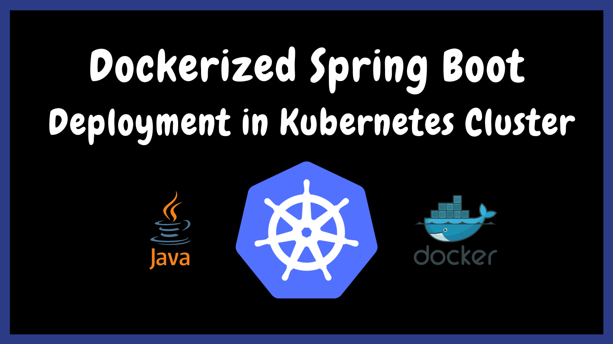
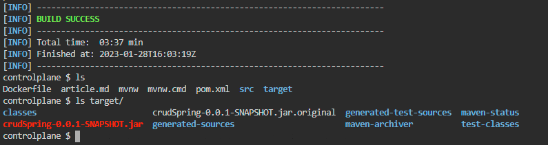
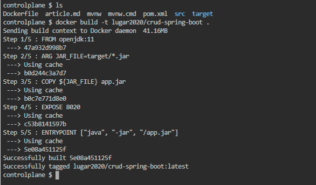
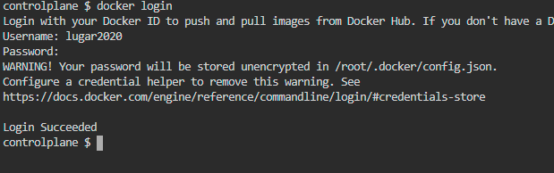
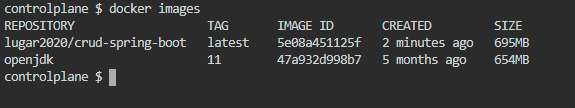
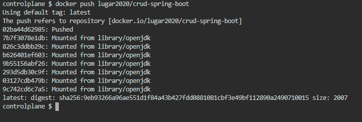
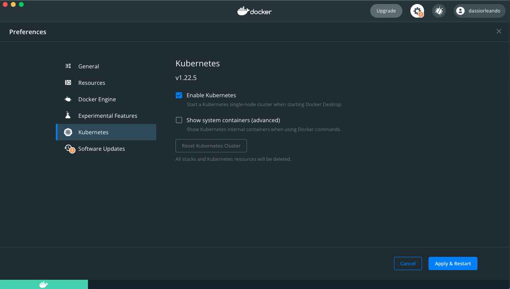
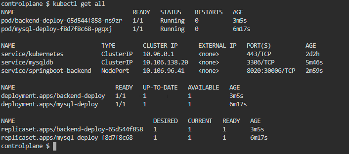
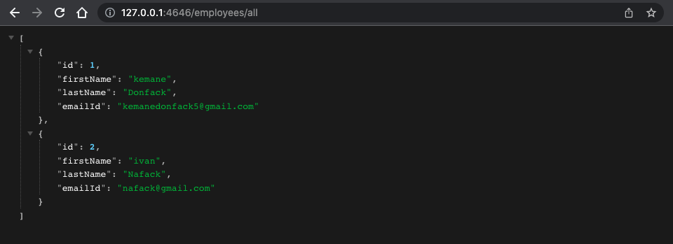
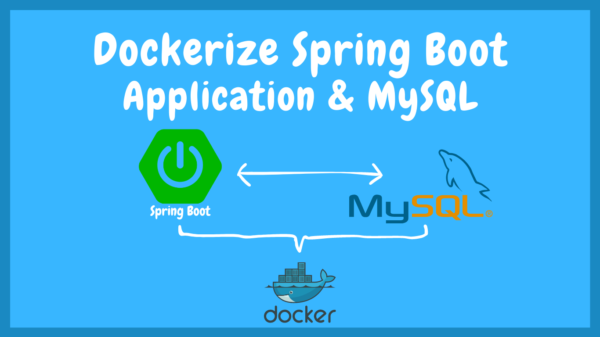

# Deploying a Spring Boot App with Docker in a Kubernetes Cluster&nbsp;[](https://numericaideas.com/blog/deploying-springboot-app-with-docker-and-kubernetes)

**This article was originally written by "Kemane Donfack" on the blog**: https://numericaideas.com/blog/deploying-springboot-app-with-docker-and-kubernetes

## Introduction
In the modern application ecosystem, it is becoming increasingly common to use technologies like **Docker** and **Kubernetes** to deploy applications in an efficient and scalable manner. By using Docker to **containerize** applications and Kubernetes to **orchestrate** them, developers can easily manage and deploy applications at scale.

The following lines will clearly differentiate between **containerized and orchestration** terms in a beginner-friendly way along with a practical sample using **Java** programming language.

[](https://numericaideas.com/blog/deploying-springboot-app-with-docker-and-kubernetes)

Moving to the following sections, we assume that you have **Java (OpenJDK 11), Docker, and Kubernetes** properly installed on your computer.

> The **YouTube Channels** in both English (En) and French (Fr) are now accessible, feel free to subscribe by clicking [here](https://www.youtube.com/@numericaideas/channels?sub_confirmation=1).

## Docker
[Docker](https://www.docker.com) is an open-source tool for containerizing applications, it encapsulates an application with all the dependencies needed for it to run. Docker containers are lightweight and easy to move around, allowing applications to be deployed quickly and efficiently on any system that supports Docker.

The advantage of containerizing applications is that it allows applications to be separated from operating systems. Applications can be deployed on different operating systems without having to worry about configuration differences. It also makes it easier to scale and manage applications because containers can be moved easily between servers.

To containerize an application with Docker, you must first create a file called `Dockerfile` that describes the steps needed to create a container. This file describes the commands to install the dependencies, configure the application and start the main process.

Once the Dockerfile is created, you can build the container image using the `docker build` command, which uses the instructions in the Dockerfile to create an image that can be used to start a container.

## Kubernetes

[Kubernetes](https://kubernetes.io/) aka **k8s** is an open-source container orchestration tool, it allows you to manage containers' clusters using concepts such as pods, replicasets, and deployments. **Pods** are groups of containers that work together to run an application, while **Replicasets** ensure that the number of running pods matches the number specified in the configuration, on the other hand, **Deployments** manage application updates by defining scaling and rollback policies. Kubernetes also provides high availability, load balancing, and monitoring capabilities.

Kubernetes has several advantages for managing application containers, including:
- **Scalability**: makes it easier to scale applications by increasing or decreasing the number of running pods in regard to the application's usage, also refers to as horizontal scaling.
- **High availability**: automatically manage the distribution of containers across different nodes to ensure application availability.
- **Flexibility**: supports many types of containers, including Docker, and can be used on different platforms, including public and private clouds.
- **Automation**: automates many container management tasks, such as scaling, upgrading, and deployment.
- **Integration**: facilitates the integration of different services and tools, such as monitoring systems, storage systems, and so on.
- **Update**: when updates are available, it's easy to apply them using Kubernetes, without interrupting the services.

## Deploying with Docker and Kubernetes

### Application Preparation
To deploy an application with Docker, you must first create a configuration file called `Dockerfile` which describes the steps needed to build the application's image.

### Building the Image
Next, the **Dockerfile** is used to build the image of the application using the `docker build` command. This image is then stored in a Docker image registry like the famous **Docker Hub**.

### Deploying the Image
Then, to deploy the application in a Kubernetes cluster, you need to create a configuration file called `deployment.yaml` which describes the deployment parameters such as the number of replicas (instances of the application), required resources, ... etc.

### Running the Application
Finally, with the configuration file in place, Kubernetes has everything to deploy the application in the cluster(s) using the command `kubectl create -f deployment.yaml`. It takes care of creating the necessary containers, placing them on the appropriate nodes, and managing them as needed (restarting, scaling, .. etc).

## Demo: Spring Boot Application Deployment in a Kubernetes Cluster

In this demo, we will deploy a **Spring Boot** application using Docker and Kubernetes with **MySQL** as the database management system. A **Dockerfile** is created to build the image of the application and then used to deploy the application on a Kubernetes cluster.

### Clone the Github Repository
Let's start by cloning the project from the [github repository](https://github.com/numerica-ideas/community):
```
git clone https://github.com/numerica-ideas/community
```

Then, go to the directory that contains the project:

```
cd community/kubernetes/springboot-docker-kubernetes-setup
```

### Project Compilation
To compile the project, let's run the following command if you are on a **Unix** based operating system:
```
./mvnw clean install -DskipTests
 ```
 The following works for **Windows** instead:
 ```
mvnw.cmd clean install -DskipTests
 ```

After that, you will get the following files and directories as illustrated in the screenshot:


### Presentation of the Dockerfile
The Dockerfile is used to create a Docker image of our application. Actually, it contains instructions to:
- Set the **Java version** to use (OpenJDK 11).
- Specify the folder in which the executable **Jar** file should be found at.
- Rename the jar file to **app.jar**.
- Expose the port **8020** defined in the `applications.properties` file that Spring-Boot embedded Tomcat server will use to run the App.
- Provide the **entry point** (command to run the App), it's equivalent to `java -jar /app.jar`.

```
FROM openjdk:11
ARG JAR_FILE=target/*.jar
COPY ${JAR_FILE} app.jar
EXPOSE 8020
ENTRYPOINT ["java", "-jar", "/app.jar"]
```

It's important to note that the `Dockerfile` must be placed at the root of our project for the commands to work properly.

### Creating the Docker Image
As said previously, creating a Docker image for the App is done via the docker build command by specifying the path of the Dockerfile, it reads the instructions in the Dockerfile and creates the corresponding image useful to deploy our application.

In the future instructions, **lugar2020** is my Docker Hub ID so replace it with yours after [creating](https://hub.docker.com/signup) your account.

Start the Docker process, then run this command which specifies the image tag (-t: username/app_name) and the Dockerfile path (dot: current directory):
```
docker build -t lugar2020/crud-spring-boot .
```



### Uploading the Image to the Docker Hub
Once we have created our application image, we can upload it to the Docker Hub using the docker push command. This will allow us to easily upload the image to a Kubernetes cluster for deployment purposes.

First, sign in to your Docker Hub account:

```
docker login
```


Check the Docker image existence with the command:
```
docker images
```


Push the application image to your Docker Hub repository:

```
docker push lugar2020/crud-spring-boot
```



### Deploying the Application
To deploy in a Kubernetes cluster, we need two manifest files for both Spring-Boot and for Mysql, these files are respectively of **Service** and **Deployment** kinds.

The deployment manifest file defines a deployment on Kubernetes. It allows you to deploy and manage one or more replicas (instances) of your App in the cluster. The file describes the features (pod, replicas) that your App needs to run and to be accessible by users.

A Kubernetes service manifest file is used to describe a Kubernetes service which exposes the App to external users by using a standard port and IP address and mapping those requests to Kubernetes pods running the applications. It defines how services should work and which pods they should connect to.

Together, the service file and the deployment file define the behavior of the Kubernetes App and how it will be managed.

In our case, the deployment `app-deploy.yml` file will allow to deploy our Spring-Boot App (we will use the image previously pushed on the docker hub) in the cluster and the `mysql-deploy.yml` file will do the same for MySQL (an existing image will be used for MySQL: **mysql:5.7**). The `mysql-service.yml` file makes our database accessible inside the cluster, the `app-service.yml` allow our Spring-Boot App to be accessible for users outside the cluster.

The `app-deploy.yml` file looks like the following:
```
apiVersion: apps/v1
kind: Deployment
metadata:
  name: backend-deploy
  labels:
   app: backend-app
spec:
  replicas: 1
  selector:
    matchLabels:
      app: backend-app
  template:
    metadata:
      labels:
        app: backend-app
    spec:
      containers:
      - name: backend-container
        image: lugar2020/crud-spring-boot
        imagePullPolicy: IfNotPresent
        ports:
        - containerPort: 8020
        env:
        - name: DB_HOST
          value: mysqldb
        - name: DB_NAME
          value: crud-db
        - name: DB_USERNAME
          value: root
        - name: DB_PASSWORD
          value: Password123
```

While its associated service file nammed `app-service.yml`, is as below:
```
apiVersion: v1
kind: Service
metadata:
  name: springboot-backend
  labels:
    name: backend-service
spec:
  type: NodePort
  ports:
    - port: 8020
      targetPort: 8020
      nodePort: 30006
  selector:
    app: backend-app
```

The property `spec:selector` in the service file identifies which `pods (deployments units)` will be included in the service. For this case, it means the deployments that has the label `app: backend-app` defined in the `app-deploy.yml` file.

The same goes by for **MySQL** configurations, you'll find all these files in the `kubernetes` folder in the repository.

In case you are using **Docker Desktop**, you have to **enable** Kubernetes from its settings:



To deploy the App, a script has been created which you can run from within the root folder, it applies all the Kubernetes `deployment/service` manifests:
```
./deploy.sh
```

Once deployed, feel free to run the following command to display all Kubernetes resources (pods, services, etc ...):
```
kubectl get all
```



Finally, we can open the App once exposed outside the cluster with the script `./expose.sh` which uses the [port forwarding method](https://kubernetes.io/docs/tasks/access-application-cluster/port-forward-access-application-cluster/) to serve it on **localhost** using the port **4646**.



## Environment Variables
**Environment Variables** are parameters that can be set and used to configure applications and services. In our case we have defined some in the `application.properties` file and we assigned values to these variables at deployment time to the App from the `app-deploy.yml` file in the `containers.env` key pairs.

The `application.properties` file is as follow:
```
spring.datasource.url=jdbc:mysql://${DB_HOST}/${DB_NAME}?serverTimezone=UTC
spring.datasource.username=${DB_USERNAME}
spring.datasource.password=${DB_PASSWORD}
```

For a production grade application, the way to provide these variables could differ but the general idea remains passing them to the App.

The complete source code of the project is available on [GitHub](https://github.com/numerica-ideas/community/tree/master/kubernetes/springboot-docker-kubernetes-setup).

If you are interested in related content, take a look at the following which explains how to Dockerize a [Spring Boot Application with MySQL](https://numericaideas.com/blog/docker-compose-springboot-mysql):

[](https://numericaideas.com/blog/docker-compose-springboot-mysql)

———————

We have just started our journey to build a network of professionals to grow even more our free knowledge-sharing community that’ll give you a chance to learn interesting things about topics like cloud computing, software development, and software architectures while keeping the door open to more opportunities.

Does this speak to you? If **YES**, feel free to [Join our Discord Server](https://discord.numericaideas.com) to stay in touch with the community and be part of independently organized events.

———————

## Conclusion
To summarize, Docker and Kubernetes are incredibly powerful and flexible tools for deploying containerized applications in clusters. Using these two tools together makes it possible to deploy applications efficiently, reliably, and in a productive manner by taking advantage of Docker's isolation and Kubernetes' clusters management. Having a good understanding of both in terms of features/concepts is a must to put them in a perfect symbiose.

Thanks for reading this article. Like, recommend, and share if you enjoyed it. Follow us on [Facebook](https://www.facebook.com/numericaideas), [Twitter](https://twitter.com/numericaideas), and [LinkedIn](https://www.linkedin.com/company/numericaideas) for more content.

