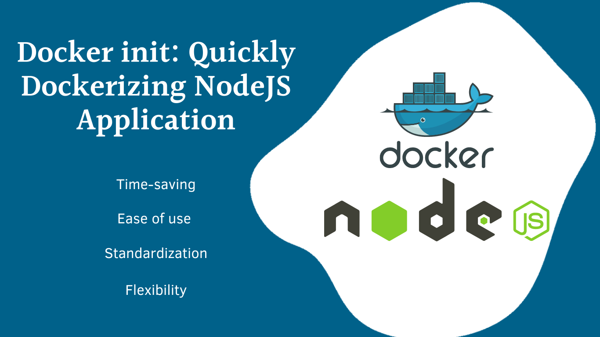

# Built-in .env Files Support Starting from Node.js v20.6.0&nbsp;[](https://blog.numericaideas.com/nodejs-env-files-support)

**This document was originally written by "Orleando Dassi" on the blog**: https://blog.numericaideas.com/nodejs-env-files-support

[](https://blog.numericaideas.com/nodejs-env-files-support)

> The **YouTube Channels** in both English (En) and French (Fr) are now accessible, Feel free to subscribe by clicking [here](https://www.youtube.com/@numericaideas/channels?sub_confirmation=1).

## Introduction
A long-awaited feature amongst NodeJS developers. Finally, starting from **Node.js v20.6.0**, Node.js supports `.env` files for configuring environment variables.

We used to plug in third-party dependencies for that same need, the most notable one is [dotenv](https://www.npmjs.com/package/dotenv).

## Built-in Env Files Support

Let's do a very simple test by installing the latest NodeJS version as of today (05th of September 2023) and playing with a basic `.env` file.

Feel free to get **NodeJS v20.6.0** from the official [download page](https://nodejs.org/en/download/current) or by using [NVM](https://github.com/nvm-sh/nvm) as we'll in the following lines.

Let's confirm our current NodeJS version by using the command `node -v` or `nvm current`:


Now, we install NodeJS v20.6.0 using the command `nvm install 20.6.0`:


In case you had it installed already, a simple `nvm use 20.6.0` will do.
At the end, we can confirm the installed version is present by using the first command as illustrated above.

We have created a basic env file with a single line as content:

```bash
ACCESS_KEY=FAKE_ACCESS_KEY
```

Along with a minimalist index.js JS file runnable by NodeJS, here's its content:

```js
console.log(`The access key is: ${process.env.ACCESS_KEY}`)
```

Both files are very basic and are used for illustration purposes only, so we aren't dealing with a full-fledged NodeJS project but the concept is the same since to access environment variables in NodeJS you'll follow the pattern: `process.env.THE_ENVIRONMENT_VAR_KEY`.

Finally, let's run the project now, `node --env-file=.env index.js`:


As you can see, it simply prints the content of the `ACCESS_KEY` environment variable, without any dependency installed.

If you are using a version lower than 20.6.0, you'll get the following message since it wasn't included in NodeJS yet:
`node: bad option: --env-file=.env`

Here's the complete [source code](https://github.com/numerica-ideas/community/tree/master/nodejs/node-support-env-files) of this experimentation.

If you are interested in related content, take a look at the following which explains how to [Quickly Dockerizing NodeJS Application using docker init command](https://blog.numericaideas.com/quickly-dockerizing-nodejs) effortlessly:

[](https://blog.numericaideas.com/quickly-dockerizing-nodejs)

———————

We have just started our journey to build a network of professionals to grow even more our free knowledge-sharing community that’ll give you a chance to learn interesting things about topics like cloud computing, software development, and software architectures while keeping the door open to more opportunities.

Does this speak to you? If **YES**, feel free to [Join our Discord Server](https://discord.numericaideas.com) to stay in touch with the community and be part of independently organized events.

———————

## Conclusion
In this article, we have seen how **NodeJS +v20.6.0** support `.env` files out of the box without any third-party dependency.

Thanks for reading this article. Like, recommend, and share if you enjoyed it. Follow us on [Facebook](https://www.facebook.com/numericaideas), [Twitter](https://twitter.com/numericaideas), and [LinkedIn](https://www.linkedin.com/company/numericaideas) for more content.
