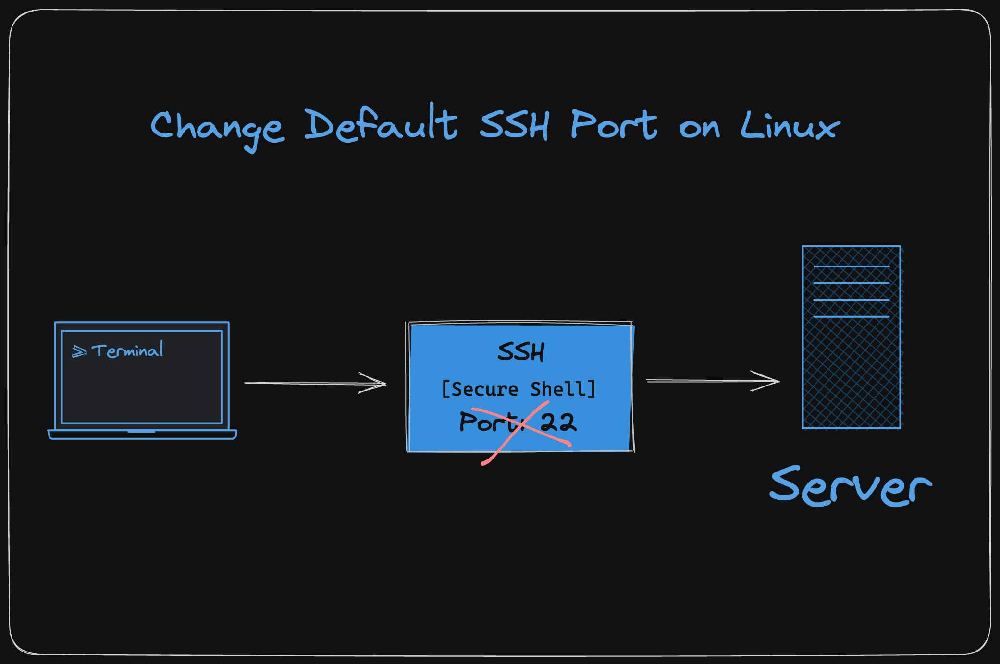
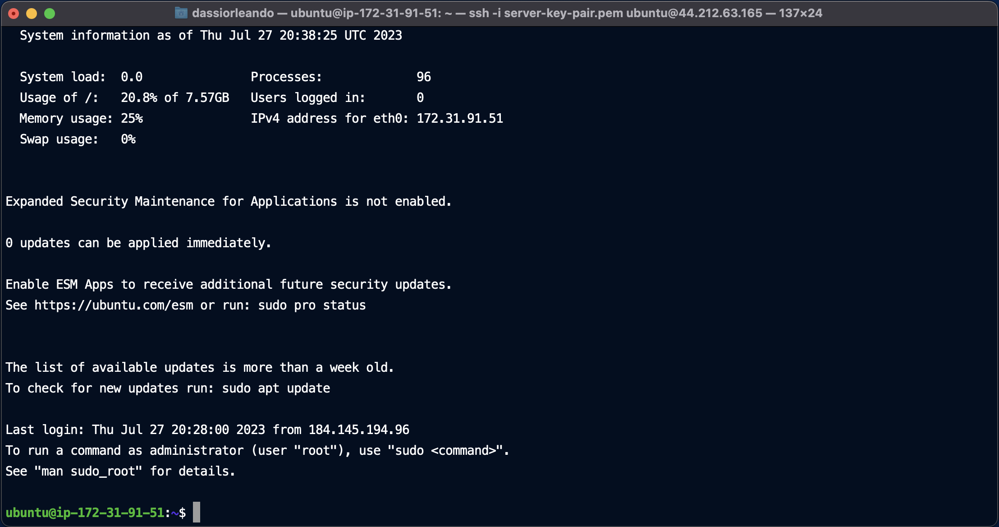
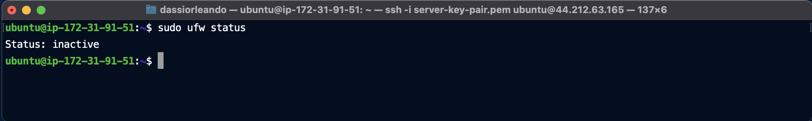
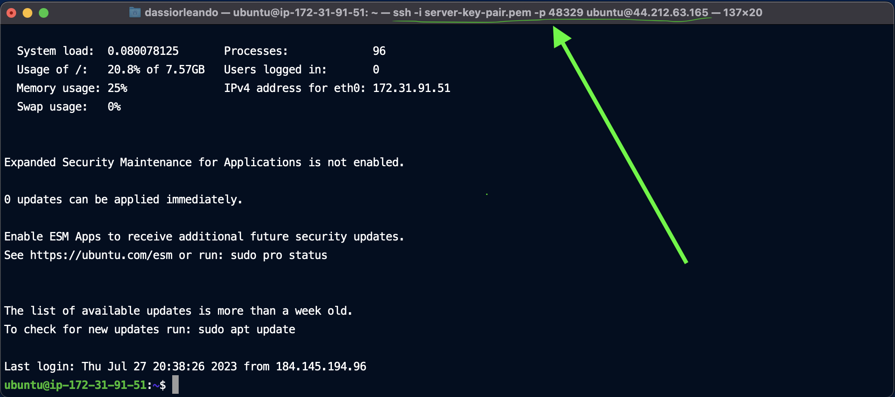

# How to Change Default SSH Port on Linux

**This article was originally written by "Orleando Dassi" on the blog**: https://blog.numericaideas.com/change-default-ssh-port-linux

## Introduction
**SSH stands for Secure Shell**, it's a widely used network protocol for securely accessing and managing remote computers or servers over the internet. It provides a secure encrypted connection between the client and the server, ensuring that data transmitted between them remains confidential and protected from unauthorized access. In this article, we will walk you through the process of changing the default SSH port on Linux systems, ensuring a safer and more secure remote access experience.

[](https://blog.numericaideas.com/change-default-ssh-port-linux)

The **YouTube Channels** in both English (En) and French (Fr) are now accessible, feel free to subscribe by clicking [here](https://www.youtube.com/@numericaideas/channels?sub_confirmation=1).

## Security
The internet is a big open space with plenty of possibilities, not only for good but also for mal intended persons, they often try to guess what our servers' passwords are by using the default settings, and since the **Linux ports** range from **0 to 65536**, it's a terrific work to find out the specific port a service runs on if your default ports are unavailable. So, there is a big chance they won't compromise your servers.

By default, SSH listens on port **22**, but changing the default port to a non-standard one can enhance security by making it harder for malicious actors to target the SSH service by brute-forcing or any other method.

## How to Change SSH Port on Linux
In this section is unveiled a step-by-step guide to change the SSH port for Linux systems.

### Step 1: Accessing the Terminal
To begin the process, you need to access the terminal on your Linux system. You can do this by opening the Terminal application if you're logged in already, or by using a remote terminal via an existing SSH connection as below.

For the sake of the example, we spinned up an Ubuntu virtual server instance, then we successfully connected ourself via the command:

```bash
ssh username@your_server_ip

or

ssh -i server-key-pair.pem username@your_server_ip
```

In this command, **server-key-pair.pem** represents the server SSH keypair (if necessary), **username** is the username of the account to use, and **your_server_ip** the server's public IP address over the internet.

As output, here's the terminal session:



### Step 2: Switch to Superuser (Root) or Use Sudo
Changing the SSH port requires administrative privileges. Depending on your setup, you can either switch to the superuser (root) using the `su` command and enter the root password, or you can use the `sudo` command before each relevant command throughout the process.

### Step 3: Backup SSH Configuration
Before making any changes, it is essential to create a backup of the SSH configuration file to avoid any potential issues. The SSH configuration file is usually located at `/etc/ssh/sshd_config`.

To create a backup, use the following command to make a copy of that file:

```bash
sudo cp /etc/ssh/sshd_config /etc/ssh/sshd_config_backup
```

### Step 4: Edit the SSH Configuration File
Next, you'll need to modify the SSH configuration file to specify the new port. Open the file using a text editor like nano or vim:

```bash
sudo nano /etc/ssh/sshd_config
```

Locate the line that reads:

```
# Port 22
```

Remove the '#' symbol at the beginning of the line, and change '22' to your desired port number (choose a port between 1024 and 65535, which are non-privileged ports):

```
Port 48329
```

Replace **48329** with your preferred port number, don't put in something trivial like 22222.

### Step 5: Save and Exit
After making the changes, save the file and exit the text editor. In nano, you can do this by pressing `CTRL + O` followed by `ENTER` to save, and then `CTRL + X` to exit.

### Step 6: Restart the SSH Service
To apply the changes, you need to restart the SSH service:

```bash
sudo service ssh restart
```

If you are using a system with systemd, you can use the following command instead:

```bash
sudo systemctl restart sshd
```

### Step 7: Firewall Configuration (Optional)
If you have a firewall running on your system, you need to update the rules to allow the new SSH port. For example, if you are using **UFW (Uncomplicated Firewall)**, use the following command:

```bash
sudo ufw allow 48329/tcp
```

For our case, that service is disabled:



**Note**: If you skip doing this, you'll be locked out of your own server, and without any admin panel to reset the firewall configuration, you won't be able to sign in via SSH again.

### Step 8: Verify the New Port
To ensure everything is working correctly, let's verify that the new SSH port is active by attempting to connect to the Linux system:

```bash
ssh -p 48329 username@your_server_ip

or

ssh -i server-key-pair.pem -p 48329 username@your_server_ip [with keypair]
```

The addition is the option `-p` to pass in the SSH port for the connection request, here's an example in the following screenshot:



———————

We have just started our journey to build a network of professionals to grow even more our free knowledge-sharing community that’ll give you a chance to learn interesting things about topics like cloud computing, software development, and software architectures while keeping the door open to more opportunities.

Does this speak to you? If **YES**, feel free to [Join our Discord Server](https://discord.numericaideas.com) to stay in touch with the community and be part of independently organized events.

———————

## Conclusion
Congratulations! You have successfully changed the SSH port on your Linux system, which enhances security by reducing the risk of automated attacks. Always remember the new port number and use it to establish SSH connections to your server in the future. By following these steps and implementing best security practices, you can strengthen the defense of your Linux system against potential threats.

Thanks for reading this article. Like, recommend, and share if you enjoyed it. Follow us on [Facebook](https://www.facebook.com/numericaideas), [Twitter](https://twitter.com/numericaideas), and [LinkedIn](https://www.linkedin.com/company/numericaideas) for more content.
