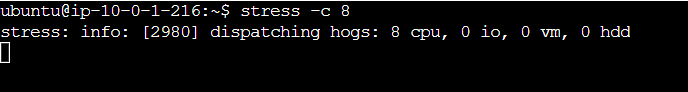

# Auto Scaling Group on AWS with Terraform

## Introduction

In today's digital landscape, building `highly available` and `scalable` infrastructure is crucial for ensuring the `reliability` and `performance` of applications. **Amazon Web Services (AWS)** provides a comprehensive suite of cloud services that enable organizations to build `resilient` and `elastic` environments. In this article, we will explore how to set up a highly available infrastructure on AWS using **Terraform**, a popular infrastructure-as-code tool.


## Auto Scaling Group (ASG)

Before we dive into the deployment of our infrastructure, let's take a moment to understand the concept of an **Auto Scaling Group (ASG)** and its role in ensuring the availability and scalability of our applications.

### What is an Auto Scaling Group?

An [Auto Scaling Group](https://aws.amazon.com/autoscaling/) is a fundamental component of AWS that allows you to automatically adjust the number of instances based on demand. It helps maintain application availability, distribute traffic evenly, and optimize resource utilization.

When you configure an **Auto Scaling Group**, you define parameters such as the minimum and maximum number of instances to keep running, desired capacity, and scaling policies. AWS then automatically manages the instances, launching new ones or terminating existing ones as needed, based on the defined policies.

### How Does Auto Scaling Work?

**Auto Scaling** uses metrics and policies to determine when to scale the number of instances. Metrics can include `CPU utilization`, `network traffic`, or custom metrics from `Amazon CloudWatch`. Based on these metrics, you can define scaling policies that specify how and when the **Auto Scaling Group** should add or remove instances.

For example, you can set a scaling policy to add instances when CPU utilization exceeds a certain threshold and remove instances when it drops below a specific level. This dynamic scaling capability ensures that your applications can handle varying levels of traffic and resource demands, while also optimizing costs.

### The Role and Importance of Auto Scaling Group

The **Auto Scaling Group** plays a crucial role in building resilient and elastic environments. Here's why it is essential:

- **High Availability**: By distributing instances across multiple availability zones, the Auto Scaling Group ensures that if one zone becomes unavailable, your applications can continue running on instances in other zones. This helps minimize downtime and provides resilience against infrastructure failures.

- **Scalability**: The Auto Scaling Group allows your infrastructure to scale up or down automatically based on demand. As traffic increases, the group adds more instances to handle the load, ensuring that your applications remain responsive and performant. Conversely, during periods of low demand, instances are scaled down to optimize resource utilization and reduce costs.

- **Fault Tolerance**: If an instance within the Auto Scaling Group fails, the group automatically replaces it with a new instance. This self-healing capability helps maintain application availability and reduces the need for manual intervention.

By incorporating the Auto Scaling Group into our infrastructure, we can achieve a resilient and elastic environment that can handle fluctuations in traffic and resource demands effectively.

## Infrastructure Provisioning

The overall architecture looks like the following image in which the AWS Cloud Services are highlighted:


## Prerequisites

Before we begin, make sure you have the following prerequisites in place:

- **An AWS account** with appropriate permissions to create and manage resources.
- **Terraform installed** on your local machine. You can download it from the official Terraform website and follow the installation instructions for your operating system.

**Important** : In this article, we will focus on the auto scaling group, so if you want to learn more about the `vpc.tf`, `variables.tf`, `security_group.tf`, `route_table.tf`, `provider.tf`, `outputs.tf`, loadbalancer.tf files, which will be created below, please refer to my previous article on [Deploy WordPress on a 2-Tier AWS Architecture with Terraform](https://blog.numericaideas.com/deploy-wordpress-2-tier-aws-architecture-with-terraform), where I explain the role of all these files in more detail. 

### Step 1: Provider Configuration

Create a file named `provider.tf` with the following content:

```
provider "aws" {
  region = "ca-central-1"
}

terraform {
  required_providers {
    aws = {
      source  = "hashicorp/aws"
      version = "4.65.0"
    }
  }
}
```

### Step 2: Network Configuration

Create a file named `variables.tf` with the following content:

```
variable "inbound_ec2" {
  type        = list(any)
  default     = [22, 80]
  description = "inbound port allow on production instance"
}

variable "instance_type" {
  type    = string
  default = "t2.micro"
}

variable "ami" {
  type    = string
  default = "ami-0940df33750ae6e7f"
}

variable "key_name" {
  type    = string
  default = "wordpressKey"
}

variable "availability_zone" {
  type    = list(string)
  default = ["ca-central-1a", "ca-central-1b"]
}

variable "vpc_cidr" {
  type    = string
  default = "10.0.0.0/16"
}

variable "subnet_cidrs" {
  type        = list(string)
  description = "list of all cidr for subnet"
  default     = ["10.0.1.0/24", "10.0.2.0/24"]
}
```

Create a file named `vpc.tf` with the following content:

```
resource "aws_vpc" "infrastructure_vpc" {
  cidr_block           = var.vpc_cidr
  enable_dns_support   = "true" #gives you an internal domain name
  enable_dns_hostnames = "true" #gives you an internal host name
  instance_tenancy     = "default"

  tags = {
    Name = "asg-vpc"
  }
}

#It enables our vpc to connect to the internet
resource "aws_internet_gateway" "infrastructure_igw" {
  vpc_id = aws_vpc.infrastructure_vpc.id
  tags = {
    Name = "asg-igw"
  }
}

#first public subnet
resource "aws_subnet" "first_public_subnet" {
  vpc_id                  = aws_vpc.infrastructure_vpc.id
  cidr_block              = var.subnet_cidrs[1]
  map_public_ip_on_launch = "true" //it makes this a public subnet
  availability_zone       = var.availability_zone[1]
  tags = {
    Name = "first public subnet"
  }
}

#second public subnet
resource "aws_subnet" "second_public_subnet" {
  vpc_id                  = aws_vpc.infrastructure_vpc.id
  cidr_block              = var.subnet_cidrs[0]
  map_public_ip_on_launch = "true" //it makes this a public subnet
  availability_zone       = var.availability_zone[0]
  tags = {
    Name = "second public subnet"
  }
}
```

Create a file named `route_table.tf` with the following content:

```
resource "aws_route_table" "infrastructure_route_table" {
  vpc_id = aws_vpc.infrastructure_vpc.id

  route {
    //associated subnet can reach everywhere
    cidr_block = "0.0.0.0/0"
    //CRT uses this IGW to reach internet
    gateway_id = aws_internet_gateway.infrastructure_igw.id
  }

}

# attach first subnet to an internet gateway
resource "aws_route_table_association" "route-ec2-1-subnet-to-igw" {
  subnet_id      = aws_subnet.first_public_subnet.id
  route_table_id = aws_route_table.infrastructure_route_table.id
}

# attach second subnet to an internet gateway
resource "aws_route_table_association" "route-ec2-2-subnet-to-igw" {
  subnet_id      = aws_subnet.second_public_subnet.id
  route_table_id = aws_route_table.infrastructure_route_table.id
}
```

### Step 3: Security Group Configuration

Create a file named `security_group.tf` with the following content:

```
resource "aws_security_group" "instance_sg" {
  name = "asg-instance-sg"

  # dynamic block who create two rules to allow inbound traffic 
  dynamic "ingress" {
    for_each = var.inbound_ec2
    content {
      from_port   = ingress.value
      to_port     = ingress.value
      protocol    = "tcp"
      cidr_blocks = ["0.0.0.0/0"]
    }
  }

  egress {
    from_port   = 0
    to_port     = 0
    protocol    = "-1"
    cidr_blocks = ["0.0.0.0/0"]
  }

  vpc_id = aws_vpc.infrastructure_vpc.id
}

resource "aws_security_group" "alb_sg" {
  name = "asg-alb-sg"
  ingress {
    from_port   = 80
    to_port     = 80
    protocol    = "tcp"
    cidr_blocks = ["0.0.0.0/0"]
  }

  egress {
    from_port   = 0
    to_port     = 0
    protocol    = "-1"
    cidr_blocks = ["0.0.0.0/0"]
  }

  vpc_id = aws_vpc.infrastructure_vpc.id
}
```

### Step 4: Elastic Load Balancer Configuration

Create a file named `loadbalancer.tf` with the following content:

```
resource "aws_lb" "alb" {
  name               = "asg-alb"
  internal           = false
  load_balancer_type = "application"
  security_groups    = [aws_security_group.alb_sg.id]
  subnets            = [aws_subnet.first_public_subnet.id, aws_subnet.second_public_subnet.id]
}

resource "aws_lb_listener" "alb_listener" {
  load_balancer_arn = aws_lb.alb.arn
  port              = "80"
  protocol          = "HTTP"

  default_action {
    type             = "forward"
    target_group_arn = aws_lb_target_group.alb_target_group.arn
  }
}

resource "aws_lb_target_group" "alb_target_group" {
  name     = "asg-target-group"
  port     = 80
  protocol = "HTTP"
  vpc_id   = aws_vpc.infrastructure_vpc.id
}
```
### Step 5: Auto Scaling group 

Create a file named `main.tf` with the following content:

```
resource "aws_launch_template" "instances_configuration" {
  name_prefix            = "asg-instance"
  image_id               = var.ami
  key_name               = var.key_name
  instance_type          = var.instance_type
  user_data              = filebase64("install_script.sh")
  vpc_security_group_ids = [aws_security_group.instance_sg.id]

  lifecycle {
    create_before_destroy = true
  }

  tags = {
    Name = "asg-instance"
  }

}

resource "aws_autoscaling_group" "asg" {
  name                      = "asg"
  min_size                  = 2
  max_size                  = 4
  desired_capacity          = 2
  health_check_grace_period = 150
  health_check_type         = "ELB"
  vpc_zone_identifier       = [aws_subnet.first_public_subnet.id, aws_subnet.second_public_subnet.id]
  launch_template {
    id      = aws_launch_template.instances_configuration.id
    version = "$Latest"
  }

}

resource "aws_autoscaling_policy" "avg_cpu_policy_greater" {
  name                   = "avg-cpu-policy-greater"
  policy_type            = "TargetTrackingScaling"
  autoscaling_group_name = aws_autoscaling_group.asg.id
  # CPU Utilization is above 50
  target_tracking_configuration {
    predefined_metric_specification {
      predefined_metric_type = "ASGAverageCPUUtilization"
    }
    target_value = 50.0
  }

}

resource "aws_autoscaling_attachment" "asg_attachment" {
  autoscaling_group_name = aws_autoscaling_group.asg.id
  lb_target_group_arn    = aws_lb_target_group.alb_target_group.arn
}
```

The resources defined in this file are:

- **aws_launch_template "instances_configuration"**: This resource defines a launch template that specifies the configuration for the EC2 instances launched by the Auto Scaling Group. It includes parameters such as the image ID, key name, instance type, user data script, and security group IDs. The launch template serves as a blueprint for creating instances within the Auto Scaling Group.

**Role**: The launch template serves as a central configuration template for the EC2 instances created by the Auto Scaling Group. It enables centralized definition of instance characteristics and configurations to ensure consistency and reproducibility when launching instances.

- **aws_autoscaling_group "asg"**: This resource configures the Auto Scaling Group. It defines the group's name, minimum and maximum number of instances, desired capacity, health check settings, and the VPC subnets where instances will be launched. It references the previously defined launch template to specify the instance configuration.

**Role**: The Auto Scaling Group is responsible for automatic management of the number of instances based on demand. It ensures scalability of the infrastructure by adding or removing instances in response to monitoring metrics, such as system load or resource utilization. The Auto Scaling Group utilizes the launch template to create new instances with the specified configuration.

- **aws_autoscaling_policy "avg_cpu_policy_greater"**: This resource creates an Auto Scaling policy that adjusts the capacity of the Auto Scaling Group based on CPU utilization. In this example, the policy is set to target tracking scaling with a target value of 50% CPU utilization. It ensures that the Auto Scaling Group maintains the desired CPU utilization by scaling the number of instances up or down accordingly.

**Role**: The Auto Scaling policy defines the rules by which the Auto Scaling Group adjusts its capacity. In this case, the policy monitors CPU utilization and increases or decreases the number of instances based on the defined target value. This helps maintain a balance between the required capacity to handle the workload and efficient resource utilization.

- **aws_autoscaling_attachment "asg_attachment"**: This resource attaches the Auto Scaling Group to a Load Balancer target group. It specifies the ASG and the ARN of the target group, allowing the instances launched by the ASG to receive traffic from the Load Balancer.

By combining these resources, the Auto Scaling Group is able to maintain an optimal number of EC2 instances based on demand, while the launch template ensures consistency in instance configurations. The Auto Scaling policy monitors and dynamically adjusts capacity based on the defined metrics, ensuring efficient resource utilization and scalability tailored to the application's needs.

Create a file named `install_script.sh` with the following content:

```
#!/bin/bash

sudo apt-get update
sudo apt-get install nginx -y
sudo systemctl enable nginx
sudo systemctl start nginx
EC2_AVAIL_ZONE=`curl -s http://169.254.169.254/latest/meta-data/placement/availability-zone`
echo "<h3 align='center'> Hello World from Availability zon : $EC2_AVAIL_ZONE ; Hostname $(hostname -f) </h3>" > /var/www/html/index.html
sudo apt install stress -y
```

The `install_script.sh` file is a Bash script that contains a series of commands to be executed on the EC2 instances when they are launched. A script that updates the package repository, installs Nginx, configures it to start on boot, and starts the service. It then Retrieves the availability zone of the EC2 instance using the instance metadata service and Creates an HTML file with a customized message that includes the availability zone and hostname of the EC2 instance. The file is saved in the default Nginx web server document root directory. And finaly installs the stress testing tool, which can be used to simulate high CPU usage on the EC2 instance.

Create a file named `outputs.tf` with the following content:

```
output "application_endpoint" {
  value = aws_lb.alb.dns_name
}
```

### Step 6: Deployment

To start the deployment process, we need to initialize Terraform in our project directory. This step ensures that Terraform downloads the necessary providers and sets up the backend configuration. Run the following command in your terminal:

```
terraform init
```


After initializing Terraform, we can generate an execution plan to preview the changes that will be made to our AWS infrastructure. The plan provides a detailed overview of the resources that will be created, modified, or destroyed.

To generate the plan, execute the following command:
```
terraform plan
```


Once we are satisfied with the execution plan, we can proceed with deploying our infrastructure on AWS. Terraform will provide the necessary resources and configure them according to our specifications.

To deploy the infrastructure, run the following command:

```
terraform apply
```

Terraform will prompt for confirmation before proceeding with the deployment. Type `yes` and press Enter to continue.
The deployment process will take some time. Terraform will display the progress and status of each resource being created.


Once the deployment is complete, Terraform will output the application load balancer dns name.


Finally, let's check our infrastructure from the AWS Console:


Now that our infrastructure is ready, let's test our Auto Scaling Group to see if it works as expected. To do this, connect via ssh to one of the two instances and type the command below: 
```
stress -c 8
```



Then wait a few minutes and you'll get the results below, of a new instance created by the Auto Scaling group.


## Conclusion

To conclude, implementing an Auto Scaling Group on AWS with Terraform provides a flexible and efficient solution for managing application scalability. By leveraging Terraform's infrastructure-as-code capabilities, teams can easily handle workload fluctuations and optimize performance. Thorough research and careful configuration are crucial for achieving optimal results. Regular monitoring and adjustments ensure high availability and cost-effectiveness. Deploying an Auto Scaling Group with Terraform empowers teams to scale resources, improve performance, and leverage AWS's elastic infrastructure.

