# How to Scale WordPress on AWS&nbsp;[](https://blog.numericaideas.com/aws-scale-wordpress)

**This document was originally written by "Kemane Donfack" on the blog**: https://blog.numericaideas.com/aws-scale-wordpress

> The **YouTube Channels** in both English (En) and French (Fr) are now accessible, Feel free to subscribe by clicking [here](https://www.youtube.com/@numericaideas/channels?sub_confirmation=1).

## Introduction

In today's article, we will explore the **scalability** possibilities of deploying WordPress on AWS. Building upon our previous article on **deploying WordPress on a 2-Tier AWS architecture with Terraform**, we will focus on utilizing the `Auto Scaling Group (ASG)` feature, along with leveraging `Amazon S3` for media storage and `CloudFront` for **caching**. These enhancements will enable us to scale our WordPress deployment effectively and handle increasing traffic demands. So let's dive in!

If you haven't read the previous article, [**Deploying WordPress on a 2-Tier AWS Architecture with Terraform**](https://blog.numericaideas.com/deploy-wordpress-2-tier-aws-architecture-with-terraform), we highly recommend checking it out first. It provides a comprehensive guide on setting up the initial 2-Tier architecture, which forms the foundation for this scalability enhancement.

[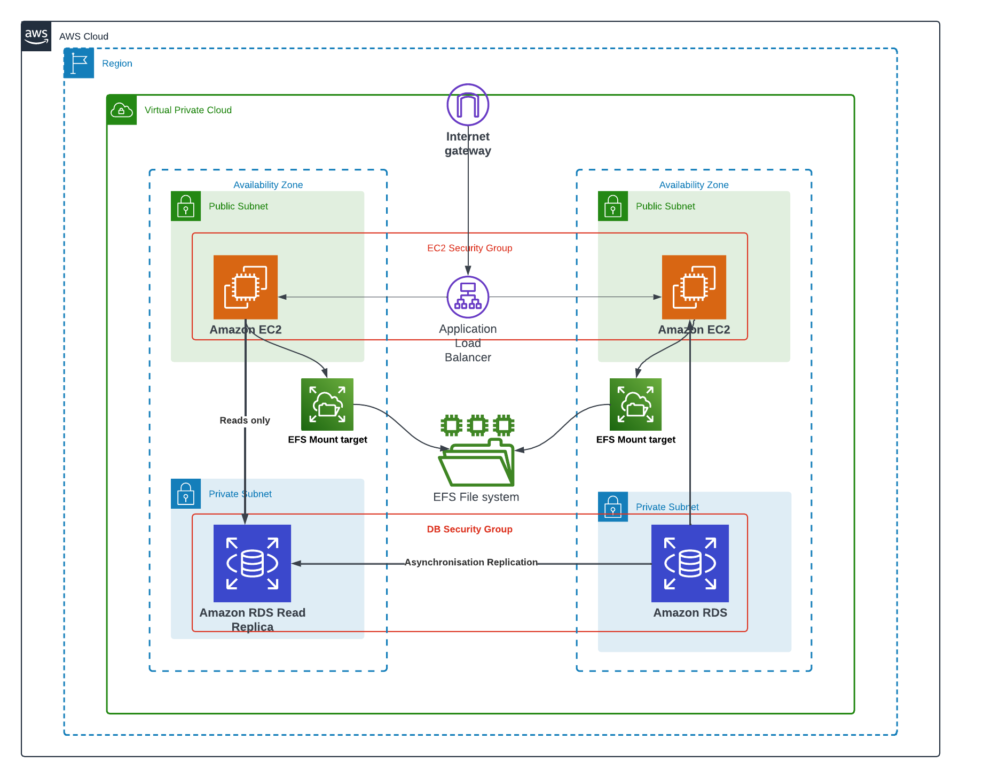](https://blog.numericaideas.com/deploy-wordpress-2-tier-aws-architecture-with-terraform)

## Scalable Architecture

To make the deployment of WordPress scalable on AWS, we used several strategies detailed in the illustration and sections below:

[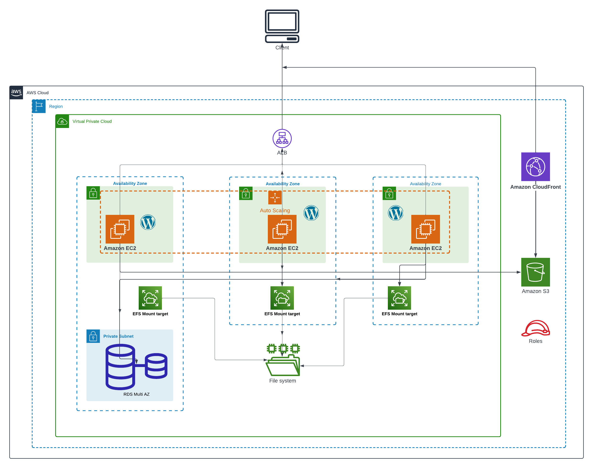](https://blog.numericaideas.com/aws-scale-wordpress)

### Horizontal Scaling with Auto Scaling Groups

**Auto Scaling Groups** provide us with the means to dynamically adjust the number of EC2 instances that power our WordPress site in response to changing demand. This dynamic capability enables horizontal scaling, allowing us to efficiently manage varying traffic loads.

By establishing automatic **scaling policies**, we ensure that the capacity of our WordPress fleet can automatically expand or contract based on performance metrics, such as `CPU utilization`. This approach leads to `high availability` and `cost efficiency`, as opposed to **maintaining a fixed number of EC2 instances**.

Furthermore, Auto Scaling Groups offer built-in **health checks** and automatic instance replacement, contributing to a self-healing infrastructure.

### Optimized Media Delivery with S3 and CloudFront 

Transferring static media assets, such as images, videos, and files, to an **S3 bucket** not only relieves the load and storage pressure on the WordPress application servers but also enhances performance.

By leveraging a global **Content Delivery Network (CDN)** like `CloudFront`, we can minimize latency by **caching content closer** to end users at **edge locations**. This, in turn, reduces origin requests to the S3 bucket.

This optimized media delivery setup results in lower costs and improved overall performance.

### Shared Storage with EFS

Employing **Elastic File System (EFS)** enables the WordPress instances within the Auto Scaling Group to seamlessly share files and data.

EFS offers a `scalable` and `high-performance Network File System (NFS)` that can be accessed concurrently by multiple EC2 instances.

This shared file storage is pivotal for the horizontal scaling of WordPress, ensuring that essential files such as `plugins`, `themes`, and uploads are consistently accessible across the entire fleet.

### Read Replicas for RDS

We can take advantage of **Read Replicas** for our **RDS database** to alleviate the load on the primary instance. This is particularly useful for queries that involve extensive **reading**, such as `reporting tasks`.

**Read Replicas** not only contribute to horizontally scaling database reads but also enhance overall database availability.

## Prerequisites

Before we proceed with scaling our WordPress deployment on AWS, make sure you have the following prerequisites in place
- An `AWS account` with appropriate permissions to create resources.
- Basic knowledge of `Terraform` and its concepts.
- Read the previous article: [**Deploying WordPress on a 2-Tier AWS Architecture with Terraform**](https://blog.numericaideas.com/deploy-wordpress-2-tier-aws-architecture-with-terraform)

## Using Auto Scaling Group for Scalability

By using ASG, we can ensure our WordPress deployment can **scale horizontally** to handle varying loads.

In this section, we'll explain the modifications made to the existing Terraform files to incorporate ASG into our WordPress deployment.

If you would like to delve deeper into the concept of Auto Scaling Group and its benefits, we have a dedicated article that covers it in detail. It provides valuable insights into how ASG works, and its configuration options.
[**Auto Scaling Group in AWS**](https://blog.numericaideas.com/auto-scaling-group-on-aws-with-terraform)


### Step 1: Modify main.tf

In this step, we are going to make significant changes to the `main.tf` file and introduce a new file called `install_script.tpl` in our current directory, which will automate the installation of the tools needed to keep our WordPress website running smoothly.

First, let's take a look at the `install_script.tpl` file:

`install_script.tpl`
```bash
#!/bin/bash

sudo yum update -y
sudo yum install docker -y
wget https://github.com/docker/compose/releases/latest/download/docker-compose-$(uname -s)-$(uname -m)
sudo mv docker-compose-$(uname -s)-$(uname -m) /usr/local/bin/docker-compose
sudo chmod -v +x /usr/local/bin/docker-compose
sudo systemctl enable docker.service
sudo systemctl start docker.service
sudo yum -y install amazon-efs-utils
sudo mkdir -p ${mount_directory}
sudo mount -t efs -o tls ${efs_volume_id}:/ ${mount_directory}
sudo docker run --restart=always --name wordpress-docker -e WORDPRESS_DB_USER=${dbuser} -e WORDPRESS_DB_HOST=${dbendpoint} -e WORDPRESS_DB_PASSWORD=${dbpassword}  -e WORDPRESS_DB_NAME=${db_name} -v ${mount_directory}:${mount_directory} -p 80:80 -d wordpress
```

The `install_script.tpl` file is a Bash script that will be used as the user data for our EC2 instances. It installs Docker, sets up Amazon EFS, and runs a WordPress container to deploy our website. The script is designed to work with the variables passed to it when called.

Next, we will modify the `main.tf` file to incorporate the changes. We will remove the two `aws_instance` resources and introduce the `aws_launch_template` resource, which defines the configuration for our EC2 instances.

```terraform
resource "aws_launch_template" "instances_configuration" {
  name_prefix            = "asg-instance"
  image_id               = var.ami
  key_name               = var.key_name
  instance_type          = var.instance_type
  user_data              = base64encode(templatefile("install_script.tpl", { efs_volume_id = aws_efs_file_system.efs_volume.id, db_name = aws_db_instance.rds_master.db_name, mount_directory = var.mount_directory, dbuser = aws_db_instance.rds_master.username, dbendpoint = aws_db_instance.rds_master.endpoint, dbpassword = aws_db_instance.rds_master.password }))
  vpc_security_group_ids = [aws_security_group.production-instance-sg.id]

  iam_instance_profile {
    name = aws_iam_instance_profile.ec2_wordpress_instance_profile.name
  }

  lifecycle {
    create_before_destroy = true
  }

  tags = {
    Name = "asg-instance"
  }
}
```

In the same `main.tf` file, we'll create the Autoscaling Group `aws_autoscaling_group` resource. The ASG will be responsible for managing the number of instances and ensuring they match the desired capacity.

```terraform
resource "aws_autoscaling_group" "asg" {
  name                      = "asg"
  min_size                  = 3
  max_size                  = 6
  desired_capacity          = 3
  health_check_grace_period = 150
  health_check_type         = "ELB"
  vpc_zone_identifier       = [aws_subnet.ec2_1_public_subnet.id, aws_subnet.ec2_2_public_subnet.id, aws_subnet.ec2_3_public_subnet.id]
  launch_template {
    id      = aws_launch_template.instances_configuration.id
    version = "$Latest"
  }

  tag {
    key                 = "Name"
    value               = "production-instance"
    propagate_at_launch = true
  }

  depends_on = [
    aws_db_instance.rds_master,
  ]
}
```
Next, we'll define an Auto Scaling policy that will dynamically adjust the number of instances in our Auto Scaling group based on CPU utilization. In addition, thanks to the `aws_autoscaling_attachment`resource we will link our **Auto Scaling Group** to the **Application Load Balancer (ALB)**.

`main.tf`

```terraform
resource "aws_autoscaling_policy" "avg_cpu_policy_greater" {
  name                   = "avg-cpu-policy-greater"
  policy_type            = "TargetTrackingScaling"
  autoscaling_group_name = aws_autoscaling_group.asg.id
  # CPU Utilization is above 50
  target_tracking_configuration {
    predefined_metric_specification {
      predefined_metric_type = "ASGAverageCPUUtilization"
    }
    target_value = 50.0
  }

}

resource "aws_autoscaling_attachment" "asg_attachment" {
  autoscaling_group_name = aws_autoscaling_group.asg.id
  lb_target_group_arn    = aws_lb_target_group.alb_target_group.arn
}
```

### Step 2: Modify loadbalancer.tf

To ensure that the ALB handles incoming HTTP traffic on port 80 and distributes it evenly across the instances in the ASG, we modified the `loadbalancer.tf` file as follows:

```terraform
resource "aws_lb" "alb" {
  name               = "asg-alb"
  internal           = false
  load_balancer_type = "application"
  security_groups    = [aws_security_group.alb_sg.id]
  subnets            = [aws_subnet.ec2_1_public_subnet.id, aws_subnet.ec2_2_public_subnet.id, aws_subnet.ec2_3_public_subnet.id]
}

resource "aws_lb_listener" "alb_listener" {
  load_balancer_arn = aws_lb.alb.arn
  port              = "80"
  protocol          = "HTTP"

  default_action {
    type             = "forward"
    target_group_arn = aws_lb_target_group.alb_target_group.arn
  }
}

resource "aws_lb_target_group" "alb_target_group" {
  name     = "asg-target-group"
  port     = 80
  protocol = "HTTP"
  vpc_id   = aws_vpc.infrastructure_vpc.id
}
```

We have also created a security group for the ALB
`security_group.tf`


```terraform
resource "aws_security_group" "alb_sg" {
  name = "asg-alb-sg"
  ingress {
    from_port   = 80
    to_port     = 80
    protocol    = "tcp"
    cidr_blocks = ["0.0.0.0/0"]
  }

  egress {
    from_port   = 0
    to_port     = 0
    protocol    = "-1"
    cidr_blocks = ["0.0.0.0/0"]
  }

  vpc_id = aws_vpc.infrastructure_vpc.id
}
```

### Step 3: Modifying efs.tf

In this step, we will make significant changes to the `efs.tf` file.

We will remove the `key_pair` resource and the `null_resource` since they are no longer needed, and then proceed with the new content for our `efs.tf` file.

```terraform
resource "aws_efs_file_system" "efs_volume" {
  creation_token = "efs_volume"
}

resource "aws_efs_mount_target" "efs_mount_target_1" {
  file_system_id  = aws_efs_file_system.efs_volume.id
  subnet_id       = aws_subnet.ec2_1_public_subnet.id
  security_groups = [aws_security_group.efs_sg.id]
}

resource "aws_efs_mount_target" "efs_mount_target_2" {
  file_system_id  = aws_efs_file_system.efs_volume.id
  subnet_id       = aws_subnet.ec2_2_public_subnet.id
  security_groups = [aws_security_group.efs_sg.id]
}

resource "aws_efs_mount_target" "efs_mount_target_3" {
  file_system_id  = aws_efs_file_system.efs_volume.id
  subnet_id       = aws_subnet.ec2_3_public_subnet.id
  security_groups = [aws_security_group.efs_sg.id]
}
```

## RDS Multi-AZ Configuration

Instead of using Read Replicas, we will opt for a Multi-AZ configuration for our RDS instance. This configuration ensures high availability for our database by automatically creating a replica in a different availability zone. In case of a primary zone failure, replication will automatically switch to the replica in the backup availability zone, thus ensuring uninterrupted operations.

Here's how to configure our RDS Multi-AZ instance in Terraform `main.tf`:

```terraform
resource "aws_db_instance" "rds_master" {
  identifier              = "master-rds-instance"
  allocated_storage       = 10
  engine                  = "mysql"
  engine_version          = "5.7.37"
  instance_class          = "db.t3.micro"
  db_name                 = var.db_name
  username                = var.db_user
  password                = var.db_password
  backup_retention_period = 7
  multi_az                = true
  db_subnet_group_name    = aws_db_subnet_group.database_subnet.id
  skip_final_snapshot     = true
  vpc_security_group_ids  = [aws_security_group.database-sg.id]
  storage_encrypted       = true

  tags = {
    Name = "my-rds-master"
  }
}
```

## Creating IAM Role for EC2 Instances

In this section, we will create an IAM role that allows our WordPress application running on EC2 instances to securely access the S3 bucket. This IAM role will have the necessary permissions to perform actions such as `ListAllMyBuckets`, `GetObject`, and `PutObject` on specific S3 resources.

### Step 1: Creating IAM Policy for S3 Access

First, let's modify the **IAM policy** resource to specify the more specific permissions required for the EC2 instances to interact with the S3 bucket securely.

```terraform
resource "aws_iam_policy" "ec2_wordpress_policy" {
  name = "ec2_wordpress_policy"
  policy = jsonencode({
    Version = "2012-10-17"
    Statement = [
      {
        Effect   = "Allow"
        Action   = "s3:ListAllMyBuckets"
        Resource = "*"
      },
      {
        Effect   = "Allow"
        Action   = "s3:*"
        Resource = "arn:aws:s3:::${var.bucket_name}"
      },
      {
        Effect   = "Allow"
        Action   = "s3:*"
        Resource = "arn:aws:s3:::${var.bucket_name}/*"
      },
    ]
  })
}
```

In this IAM policy, we have specified three statements:

1. The first statement allows the EC2 instances to list all S3 buckets (`s3:ListAllMyBuckets`) on any resource (`Resource = "*"`).

2. The second statement allows the EC2 instances to perform any S3 action (`s3:*`) on the specific S3 bucket with the ARN `arn:aws:s3:::${var.bucket_name}`. The variable `var.bucket_name` refers to the name of the S3 bucket you have specified in your Terraform configuration.

3. The third statement allows the EC2 instances to perform any S3 action (`s3:*`) on any object within the specified S3 bucket (`Resource = "arn:aws:s3:::${var.bucket_name}/*"`).


### Step 2: Creating IAM Role for EC2 Instances

Next, let's create the IAM role that will be associated with the EC2 instances.

```terraform
resource "aws_iam_role" "ec2_wordpress_role" {
  name               = "ec2_wordpress_role"
  assume_role_policy = jsonencode({
    Version   = "2012-10-17"
    Statement = [
      {
        Action    = "sts:AssumeRole"
        Effect    = "Allow"
        Sid       = "RoleForEC2"
        Principal = {
          Service = "ec2.amazonaws.com"
        }
      },
    ]
  })
}
```

In this updated IAM role resource, we have added specific permissions to the assume role policy, which grants permission to EC2 instances to assume this role. The policy allows EC2 instances to act as the role for the purpose of accessing other AWS resources.

### Step 3: Attaching IAM Policy to IAM Role

Now, let's attach the previously created IAM policy to the IAM role.

```terraform
resource "aws_iam_role_policy_attachment" "ec2_wordpress_policy_attachment" {
  policy_arn = aws_iam_policy.ec2_wordpress_policy.arn
  role       = aws_iam_role.ec2_wordpress_role.name
}
```

In this step, we associate the IAM policy with ARN `aws_iam_policy.ec2_wordpress_policy.arn` to the IAM role named `aws_iam_role.ec2_wordpress_role.name`. This attachment ensures that the permissions defined in the IAM policy are now associated with the IAM role.

### Step 4: Creating IAM Instance Profile for EC2 Instances

Finally, let's create an IAM instance profile, which allows us to associate the IAM role with EC2 instances.

```terraform
resource "aws_iam_instance_profile" "ec2_wordpress_instance_profile" {
  name = "ec2_wordpress_instance_profile"
  role = aws_iam_role.ec2_wordpress_role.name
}
```

In this step, we create an instance profile named `ec2_wordpress_instance_profile` and associate it with the IAM role `aws_iam_role.ec2_wordpress_role.name`. This instance profile allows our EC2 instances to assume the IAM role, granting them the necessary permissions to interact securely with the S3 bucket.

With these changes, our EC2 instances will now have the required permissions to access the specified S3 bucket securely, ensuring the smooth functioning of our WordPress application.

## Creating S3 Bucket and CloudFront distribution

In this section, we'll create an **S3 bucket** to store the media files of the WordPress application and set up a **CloudFront distribution** to cache and serve these assets globally, providing improved performance and reduced latency for users.

Before starting add these two variables in your `variables.tf` file

```terraform
variable "bucket_name" {
  type    = string
  default = "my-s3-wordpress-bucket"
}

variable "s3_origin_id" {
  type    = string
  default = "my-s3-wordpress-origin"
}
```

### Step 1: Creating the S3 Bucket

First, we define an S3 bucket resource using Terraform to store the media files of the WordPress application:

```terraform
resource "aws_s3_bucket" "wordpress_files_bucket" {
  bucket = var.bucket_name
  tags   = {
    name = "wordpress-bucket"
  }
}
```

In this resource, we specify the desired bucket name as the value of the variable `var.bucket_name`. we also add a tag to the bucket for better identification.

### Step 2: Configuring CloudFront Origin Access Control

Next, we configure the **CloudFront Origin Access Control (OAC)** to manage access to the S3 bucket:

```terraform
locals {
  s3_origin_id = var.s3_origin_id
}

resource "aws_cloudfront_origin_access_control" "my_origin" {
  name                              = local.s3_origin_id
  description                       = "Origin access control"
  origin_access_control_origin_type = "s3"
  signing_behavior                  = "always"
  signing_protocol                  = "sigv4"
}
```

The `aws_cloudfront_origin_access_control` resource defines access control settings for the S3 bucket as an origin. we set the `signing_behavior` and `signing_protocol` to **always** and **sigv4,** respectively, to enforce the use of AWS Signature Version 4 for all requests made to the CloudFront distribution.

### Step 3: Creating CloudFront Distribution

Now, we create the CloudFront distribution that will cache and serve the media files stored in the S3 bucket:

```terraform
data "aws_cloudfront_cache_policy" "cache-optimized" {
  name = "Managed-CachingOptimized"
}

resource "aws_cloudfront_distribution" "s3_distribution" {
  origin {
    domain_name              = aws_s3_bucket.wordpress_files_bucket.bucket_regional_domain_name
    origin_access_control_id = aws_cloudfront_origin_access_control.my_origin.id
    origin_id                = local.s3_origin_id

  }

  enabled         = true
  is_ipv6_enabled = true
  comment         = "my-cloudfront"

  default_cache_behavior {
    cache_policy_id        = data.aws_cloudfront_cache_policy.cache-optimized.id
    allowed_methods        = ["DELETE", "GET", "HEAD", "OPTIONS", "PATCH", "POST", "PUT"]
    cached_methods         = ["GET", "HEAD"]
    target_origin_id       = local.s3_origin_id
    viewer_protocol_policy = "allow-all"
    min_ttl                = 0
    default_ttl            = 3600
    max_ttl                = 86400
  }

  price_class = "PriceClass_All"

  restrictions {
    geo_restriction {
      restriction_type = "none"
      locations        = []
    }
  }

  viewer_certificate {
    cloudfront_default_certificate = true
  }
}
```

In this resource, we define the CloudFront distribution and specify the S3 bucket as the origin to be associated with the distribution. The `cache_policy_id` refers to the managed caching policy named **Managed-CachingOptimized,** which optimizes cache behavior for better performance.

we also set the `default_cache_behavior` to cache the allowed HTTP methods and define caching TTLs (time-to-live) for the assets. The `viewer_protocol_policy` is set to **allow-all** to allow both HTTP and HTTPS access.

Additionally, we specify the CloudFront distribution to use the default SSL/TLS certificate provided by AWS (`cloudfront_default_certificate = true`) for secure connections.

### Step 4: Configuring S3 Bucket Policy for CloudFront Access

Finally, we create an **S3 bucket policy to allow CloudFront access to the bucket**

```terraform
data "aws_iam_policy_document" "s3_policy" {
  statement {
    sid       = "AllowCloudFrontServicePrincipal"
    actions   = ["s3:GetObject"]
    resources = ["${aws_s3_bucket.wordpress_files_bucket.arn}/*"]
    condition {
      test     = "StringEquals"
      variable = "AWS:SourceArn"
      values   = ["${aws_cloudfront_distribution.s3_distribution.arn}"]
    }
    principals {
      type        = "Service"
      identifiers = ["cloudfront.amazonaws.com"]
    }
  }
}

resource "aws_s3_bucket_policy" "mybucket" {
  bucket = aws_s3_bucket.wordpress_files_bucket.id
  policy = data.aws_iam_policy_document.s3_policy.json
}
```

In this step, we define an IAM policy document that allows the CloudFront service principal (`cloudfront.amazonaws.com`) to access the S3 bucket's objects. The policy uses the `aws_s3_bucket.wordpress_files_bucket.arn` and the `aws_cloudfront_distribution.s3_distribution.arn` as resources to specify the S3 bucket and CloudFront distribution as the allowed sources.

Finally, we apply the defined S3 bucket policy using the `aws_s3_bucket_policy` resource.

With these configurations, the S3 bucket is ready to store WordPress media files, and the CloudFront distribution is set up to cache and serve these assets, providing faster and more reliable content delivery globally.

## Deploying our Infrastructure


```terraform
terraform init
```

```terraform
terraform validate
```

```terraform
terraform plan
```

```terraform
terraform apply --auto-approve
```

## Configuring WordPress to Use IAM Role for S3 Access

In this section, we'll configure the `wp-config.php` file of our WordPress installation to utilize the IAM role we previously created. This will allow WordPress to securely access the S3 bucket. 

### Step 1: Connect to EC2 Instance via SSH

To configure the `wp-config.php` file, you can use one of the available methods to connect to one of the EC2 instances created by the Auto Scaling Group using SSH. One common method is using an SSH client that we'll use

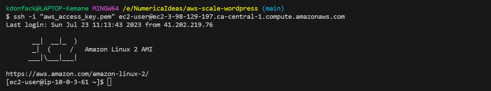

### Step 2: Edit wp-config.php

Once connected to the EC2 instance, navigate to the WordPress installation directory and edit the `wp-config.php` file

```bash
cd /var/www/html
```

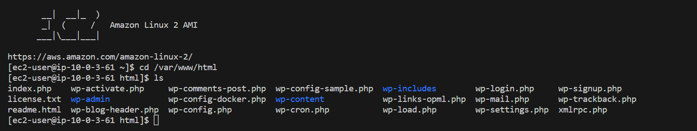

```bash
sudo vi wp-config.php
```

Inside the `wp-config.php` file, locate the database connection settings, and add the following lines after the `DB_COLLATE` definition

```php
define( 'AS3CF_SETTINGS', serialize( array(
    'provider' => 'aws',
    'use-server-roles' => true,
) ) );
```
Save the changes and exit the file.

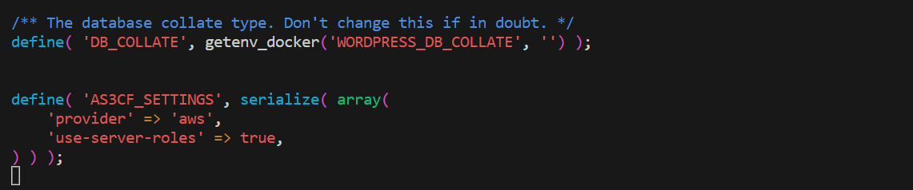

## Installing And Configuring WP Offload Plugin

### Step 1: Accessing WordPress via Load Balancer URL

Now that we have configured the `wp-config.php` file, access your WordPress website using the URL provided by the **Load Balancer**. This URL should point to your WordPress application hosted on the EC2 instances.

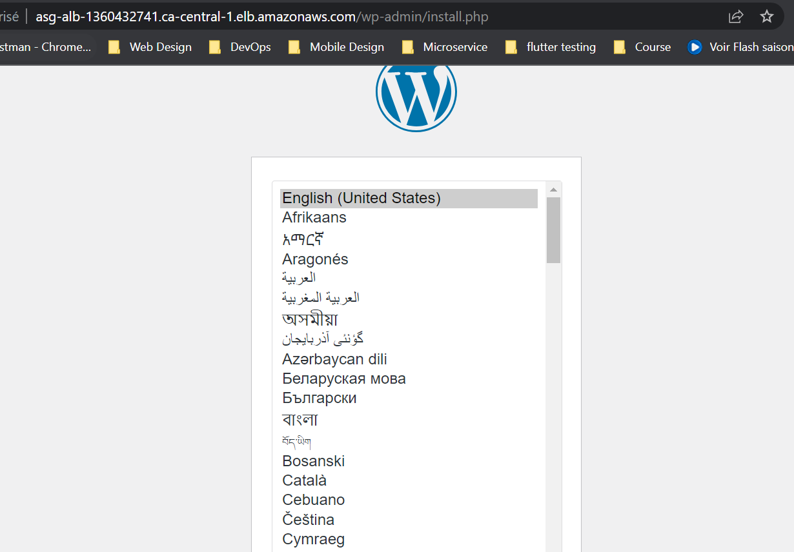

then configure your wordpress website

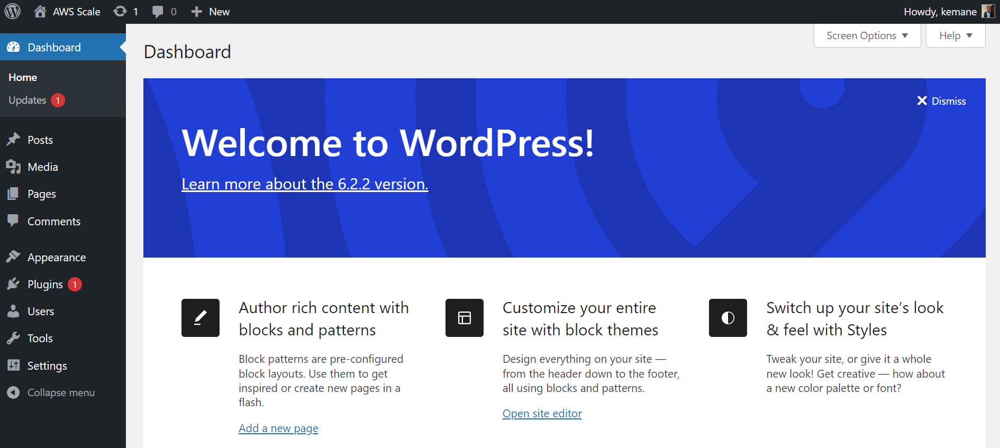


### Step 2: Installing and Configuring WP Offload Plugin

Once you have accessed your WordPress website, follow these steps to install and configure the **WP Offload Media Lite for Amazon S3** plugin

1. In the WordPress dashboard, go to **Plugins** > **Add New**
2. Search for **WP Offload Media Lite for Amazon S3** and click **Install Now.**
3. After installation, click **Activate** to activate the plugin.
4. Go to **Settings** > **WP Offload Media.**

Under **Bucket** select **Use Existing Bucket > Browse existing buckets** then select the S3 bucket created previously and save.

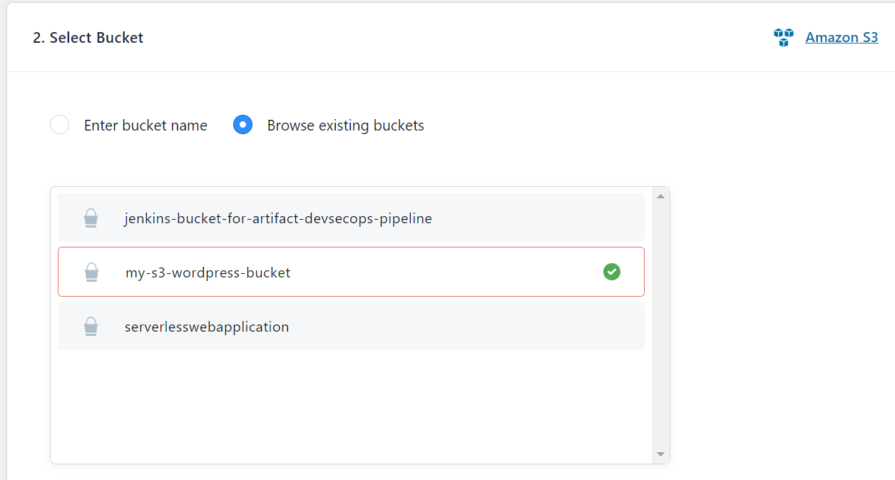

On the security tab, leave all settings as default, then click on **Keep Bucket Security As Is**

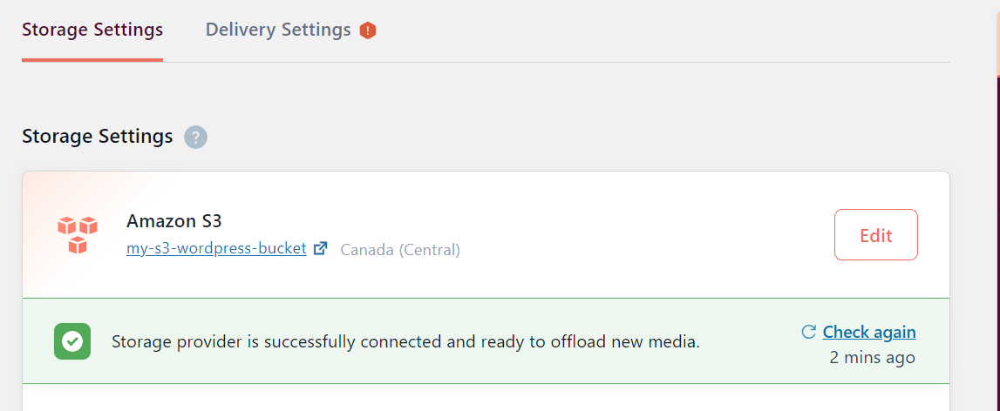

Go to **Delivery Setting** to configure CloudFront

Click on **Edit** then on choose **Amazon CloudFront**, then save

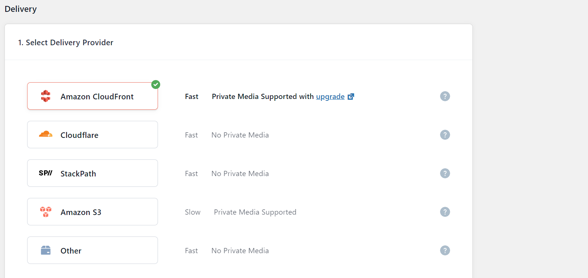

Click on Use **Custom Domain Name (CNAME)** and go to your CloudFront distribution to copy the **Distribution Domain Name** and paste it into the Use Custom Domain Name (CNAME) field.

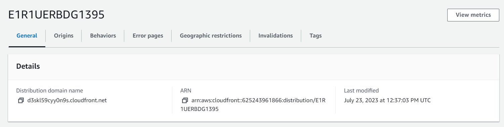

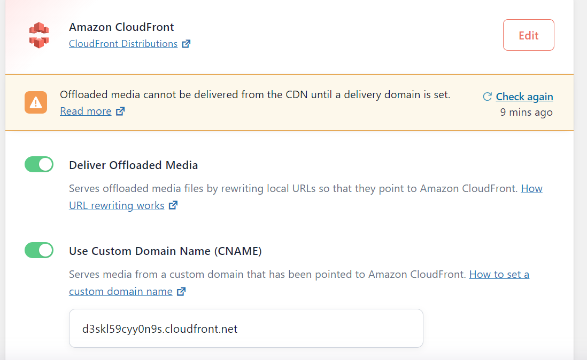

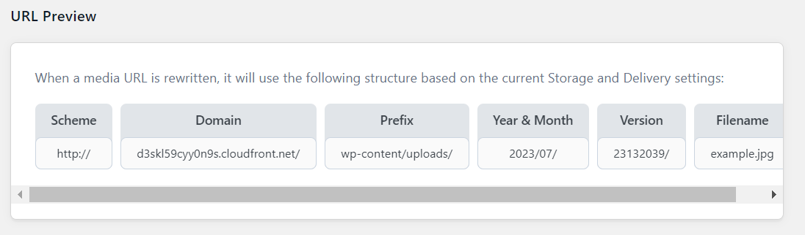

Save your configuration.

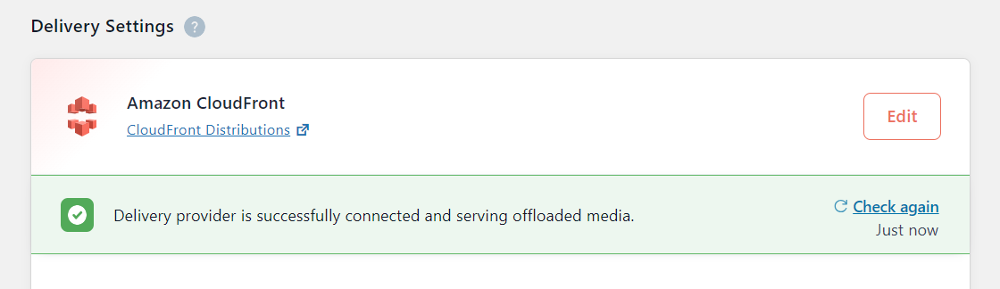

The **WP Offload Media Lite for Amazon S3** plugin is now configured to use your S3 bucket and CloudFront distribution for storing and serving media files. All your media uploads will be automatically offloaded to the S3 bucket and served via CloudFront, reducing the load on your WordPress instances and improving the overall performance of your website.

## Demo

For the demo go to  **Media > Add New** and upload a new file then look at the file details

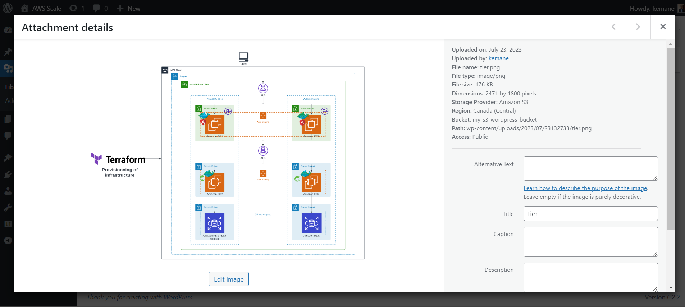

Go to your **S3 bucket** and you'll also see your file

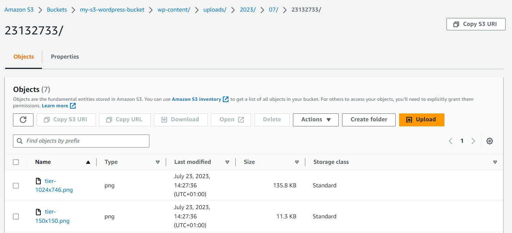

Congratulations! Your WordPress website is now successfully configured to use the IAM role for secure S3 access and WP Offload Media Lite for Amazon S3 plugin to store and serve media files from the S3 bucket via CloudFront, enhancing the scalability and performance of your website.

The complete source code of the project is available on [GitHub](https://github.com/numerica-ideas/community/tree/master/terraform/aws-scale-wordpress).

———————

We have just started our journey to build a network of professionals to grow even more our free knowledge-sharing community that’ll give you a chance to learn interesting things about topics like cloud computing, software development, and software architectures while keeping the door open to more opportunities.

Does this speak to you? If **YES**, feel free to [Join our Discord Server](https://discord.numericaideas.com) to stay in touch with the community and be part of independently organized events.

———————

## Conclusion

In this article, we learned how to enhance our WordPress deployment on AWS by incorporating scalability features using Auto Scaling Group and optimizing media storage and delivery with S3 and CloudFront. By utilizing these powerful AWS services, you can ensure your WordPress application remains highly available, responsive, and cost-efficient as the traffic fluctuates.

Thanks for reading this article. Like, recommend, and share if you enjoyed it. Follow us on [Facebook](https://www.facebook.com/numericaideas),  [Twitter](https://twitter.com/numericaideas), and [LinkedIn](https://www.linkedin.com/company/numericaideas) for more content.
