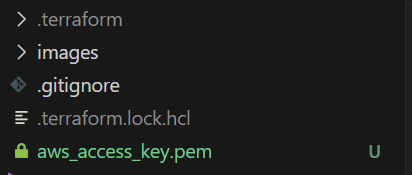

# AWS Scale WordpPress

## Introduction

In today's article, we will explore the **scalability** possibilities of deploying WordPress on AWS. Building upon our previous article on **deploying WordPress on a 2-Tier AWS architecture with Terraform**, we will focus on utilizing the `Auto Scaling Group (ASG)` feature, along with leveraging `Amazon S3` for media storage and `CloudFront` for **caching**. These enhancements will enable us to scale our WordPress deployment effectively and handle increasing traffic demands. So let's dive in!


If you haven't read the previous article, **Deploying WordPress on a 2-Tier AWS Architecture with Terraform**, we highly recommend checking it out first. It provides a comprehensive guide on setting up the initial 2-Tier architecture, which forms the foundation for this scalability enhancement.
[**Deploying WordPress on a 2-Tier AWS Architecture with Terraform**](https://blog.numericaideas.com/deploy-wordpress-2-tier-aws-architecture-with-terraform)


## Prerequisites

Before we proceed with scaling our WordPress deployment on AWS, make sure you have the following prerequisites in place
- An `AWS account` with appropriate permissions to create resources.
- Basic knowledge of `Terraform` and its concepts.
- Familiarity with `WordPress` and its deployment on AWS, as discussed in our previous article.

## Using Auto Scaling Group for Scalability

**Auto Scaling Group (ASG)** is a powerful AWS feature that allows you to automatically adjust the number of instances in your application fleet based on demand. By using ASG, we can ensure our WordPress deployment can **scale horizontally** to handle varying loads.

In this section, we will explain the modifications made to the existing Terraform files to incorporate ASG into our WordPress deployment.

If you would like to delve deeper into the concept of Auto Scaling Group and its benefits, I have a dedicated article that covers it in detail. It provides valuable insights into how ASG works, and its configuration options.
[**Auto Scaling Group in AWS**](https://blog.numericaideas.com/auto-scaling-group-on-aws-with-terraform)

### Step 1: Modifying main.tf

In the `main.tf` file, we need to remove our 2 aws_instance resources and add some new resources : **aws_launch_template** to define the configuration for our EC2 instances The template specifies the AMI, instance type, security groups, and other parameters. 

```terraform
resource "aws_launch_template" "instances_configuration" {
  name_prefix            = "asg-instance"
  image_id               = var.ami
  key_name               = aws_key_pair.aws_ec2_access_key.id
  instance_type          = var.instance_type
  vpc_security_group_ids = [aws_security_group.production-instance-sg.id]

  iam_instance_profile {
    name = aws_iam_instance_profile.ec2_wordpress_instance_profile.name
  }

  lifecycle {
    create_before_destroy = true
  }

  tags = {
    Name = "asg-instance"
  }

}
```

In the same `main.tf` file, we will create the Autoscaling Group `aws_autoscaling_group` resource. The ASG will be responsible for managing the number of instances and ensuring they match the desired capacity.

```terraform
resource "aws_autoscaling_group" "asg" {
  name                      = "asg"
  min_size                  = 2
  max_size                  = 4
  desired_capacity          = 2
  health_check_grace_period = 150
  health_check_type         = "ELB"
  vpc_zone_identifier       = [aws_subnet.ec2_1_public_subnet.id, aws_subnet.ec2_2_public_subnet.id]
  launch_template {
    id      = aws_launch_template.instances_configuration.id
    version = "$Latest"
  }

  tag {
    key                 = "Name"
    value               = "production-instance"
    propagate_at_launch = true
  }

  depends_on = [
    aws_db_instance.rds_master,
  ]
}
```

Next, we'll define an Auto Scaling policy that adjusts the number of instances based on CPU utilization.

`main.tf`

```terraform
resource "aws_autoscaling_policy" "avg_cpu_policy_greater" {
  name                   = "avg-cpu-policy-greater"
  policy_type            = "TargetTrackingScaling"
  autoscaling_group_name = aws_autoscaling_group.asg.id
  # CPU Utilization is above 50
  target_tracking_configuration {
    predefined_metric_specification {
      predefined_metric_type = "ASGAverageCPUUtilization"
    }
    target_value = 50.0
  }

}

resource "aws_autoscaling_attachment" "asg_attachment" {
  autoscaling_group_name = aws_autoscaling_group.asg.id
  lb_target_group_arn    = aws_lb_target_group.alb_target_group.arn
}
```

### Step 2: Modifying loadbalancer.tf

we modified the `loadbalancer.tf` to ensure that the ALB is properly configured to handle incoming HTTP traffic on port 80 and forward it to the instances registered with the ASG. The ALB acts as the entry point for client requests and distributes the traffic evenly across the instances in the ASG.

```terraform
resource "aws_lb" "alb" {
  name               = "asg-alb"
  internal           = false
  load_balancer_type = "application"
  security_groups    = [aws_security_group.alb_sg.id]
  subnets            = [aws_subnet.ec2_1_public_subnet.id, aws_subnet.ec2_2_public_subnet.id]
}

resource "aws_lb_listener" "alb_listener" {
  load_balancer_arn = aws_lb.alb.arn
  port              = "80"
  protocol          = "HTTP"

  default_action {
    type             = "forward"
    target_group_arn = aws_lb_target_group.alb_target_group.arn
  }
}

resource "aws_lb_target_group" "alb_target_group" {
  name     = "asg-target-group"
  port     = 80
  protocol = "HTTP"
  vpc_id   = aws_vpc.infrastructure_vpc.id
}
```

`security_group.tf`

we have also created a security group for the ALB

```terraform
resource "aws_security_group" "alb_sg" {
  name = "asg-alb-sg"
  ingress {
    from_port   = 80
    to_port     = 80
    protocol    = "tcp"
    cidr_blocks = ["0.0.0.0/0"]
  }

  egress {
    from_port   = 0
    to_port     = 0
    protocol    = "-1"
    cidr_blocks = ["0.0.0.0/0"]
  }

  vpc_id = aws_vpc.infrastructure_vpc.id
}
```

### Step 3: Modifying efs.tf

In this step, we make several modifications to the `efs.tf` file.

Firstly, we update the installation script to use the latest version of WordPress. This update is necessary because the **WP Offload Media Lite for Amazon S3** plugin, which we will be using, requires the latest version of WordPress. Here is the modified installation script

```terraform
resource "null_resource" "install_script" {
  count = 2

  depends_on = [
    aws_db_instance.rds_master,
    local_file.private_key,
    aws_efs_mount_target.efs_mount_target_1,
    aws_efs_mount_target.efs_mount_target_2,
    aws_autoscaling_group.asg
  ]

  connection {
    type        = "ssh"
    host        = data.aws_instances.production_instances.public_ips[count.index]
    user        = "ec2-user"
    private_key = file(var.private_key_location)
  }

  provisioner "remote-exec" {
    inline = [
      "sudo yum update -y",
      "sudo yum install docker -y",
      "wget https://github.com/docker/compose/releases/latest/download/docker-compose-$(uname -s)-$(uname -m)",
      "sudo mv docker-compose-$(uname -s)-$(uname -m) /usr/local/bin/docker-compose",
      "sudo chmod -v +x /usr/local/bin/docker-compose",
      "sudo systemctl enable docker.service",
      "sudo systemctl start docker.service",
      "sudo yum -y install amazon-efs-utils",
      "sudo mkdir -p ${var.mount_directory}",
      "sudo mount -t efs -o tls ${aws_efs_file_system.efs_volume.id}:/ ${var.mount_directory}",
      "sudo docker run --restart=always --name wordpress-docker -e WORDPRESS_DB_USER=${aws_db_instance.rds_master.username} -e WORDPRESS_DB_HOST=${aws_db_instance.rds_master.endpoint} -e WORDPRESS_DB_PASSWORD=${aws_db_instance.rds_master.password} -e WORDPRESS_DB_NAME=${aws_db_instance.rds_master.db_name} -v ${var.mount_directory}:${var.mount_directory} -p 80:80 -d wordpress",
    ]
  }
}
```

Additionally, we replace the reference to the previous EC2 instances with the Auto Scaling Group in the following data block

```terraform
data "aws_instances" "production_instances" {
  instance_tags = {
    "Name" = "production-instance"
  }
  depends_on = [
    aws_autoscaling_group.asg
  ]
}
```

## Creating IAM Role for EC2 Instances

In this section, we will create an **IAM role** to allow our WordPress application running on EC2 instances to securely access the S3 bucket. This **IAM role** will have the necessary permissions to perform actions such as `Get`, `List`, `GetObject`, and `PutObject` on all S3 resources.

### Step 1: Creating IAM Policy for S3 Access

First, we define an **IAM policy** resource to specify the permissions required for the EC2 instances to interact with the S3 bucket securely

```terraform
resource "aws_iam_policy" "ec2_wordpress_policy" {
  name = "ec2_wordpress_policy"
  policy = jsonencode({
    Version = "2012-10-17"
    Statement = [
      {
        Effect = "Allow"
        Action = "*"
        Resource = "*"
      }
    ]
  })
}
```

In this resource, we specify a policy document that allows the listed actions on all S3 resources `Resource = "*"` to enable read and write access. This policy includes permissions for `GetObject` to read objects and `PutObject` to upload objects, as well as more generalized `Get*` and `List*` actions for various S3 operations.

### Step 2: Creating IAM Role for EC2 Instances

Next, we create the IAM role that will be associated with the EC2 instances

```terraform
resource "aws_iam_role" "ec2_wordpress_role" {
  name               = "ec2_wordpress_role"
  assume_role_policy = jsonencode({
    Version   = "2012-10-17"
    Statement = [
      {
        Action    = "sts:AssumeRole"
        Effect    = "Allow"
        Sid       = "RoleForEC2"
        Principal = {
          Service = "ec2.amazonaws.com"
        }
      },
    ]
  })
}
```

In this resource, we define an IAM role named `ec2_wordpress_role` with the `assume_role_policy`, which grants permission to EC2 instances to assume this role. The policy allows EC2 instances to act as the role for the purpose of accessing other AWS resources.

### Step 3: Attaching IAM Policy to IAM Role

Now, we attach the previously created IAM policy to the IAM role

```terraform
resource "aws_iam_role_policy_attachment" "ec2_wordpress_policy_attachment" {
  policy_arn = aws_iam_policy.ec2_wordpress_policy.arn
  role       = aws_iam_role.ec2_wordpress_role.name
}
```

In this resource, we specify that the IAM policy with ARN `aws_iam_policy.ec2_wordpress_policy.arn` is attached to the IAM role `aws_iam_role.ec2_wordpress_role.name`. This attachment associates the permissions defined in the IAM policy with the IAM role.

### Step 4: Creating IAM Instance Profile for EC2 Instances

Finally, we create an IAM instance profile, which allows us to associate the IAM role with EC2 instances

```terraform
resource "aws_iam_instance_profile" "ec2_wordpress_instance_profile" {
  name = "ec2_wordpress_instance_profile"
  role = aws_iam_role.ec2_wordpress_role.name
}
```

## Creating S3 Bucket and CloudFront distribution

In this section, we will create an **S3 bucket** to store the media files of the WordPress application and set up a **CloudFront distribution** to cache and serve these assets globally, providing improved performance and reduced latency for users.

Before starting add these two variables in your `variables.tf` file

```terraform
variable "bucket_name" {
  type    = string
  default = "my-s3-wordpress-bucket"
}

variable "s3_origin_id" {
  type    = string
  default = "my-s3-wordpress-origin"
}
```

### Step 1: Creating the S3 Bucket

First, we define an S3 bucket resource using Terraform to store the media files of the WordPress application:

```terraform
resource "aws_s3_bucket" "wordpress_files_bucket" {
  bucket = var.bucket_name
  tags   = {
    name = "wordpress-bucket"
  }
}
```

In this resource, we specify the desired bucket name as the value of the variable `var.bucket_name`. We also add a tag to the bucket for better identification.

### Step 2: Configuring CloudFront Origin Access Control

Next, we configure the **CloudFront Origin Access Control (OAC)** to manage access to the S3 bucket:

```terraform
locals {
  s3_origin_id = var.s3_origin_id
}

resource "aws_cloudfront_origin_access_control" "my_origin" {
  name                              = local.s3_origin_id
  description                       = "Origin access control"
  origin_access_control_origin_type = "s3"
  signing_behavior                  = "always"
  signing_protocol                  = "sigv4"
}
```

The `aws_cloudfront_origin_access_control` resource defines access control settings for the S3 bucket as an origin. We set the `signing_behavior` and `signing_protocol` to **always** and **sigv4,** respectively, to enforce the use of AWS Signature Version 4 for all requests made to the CloudFront distribution.

### Step 3: Creating CloudFront Distribution

Now, we create the CloudFront distribution that will cache and serve the media files stored in the S3 bucket:

```terraform
data "aws_cloudfront_cache_policy" "cache-optimized" {
  name = "Managed-CachingOptimized"
}

resource "aws_cloudfront_distribution" "s3_distribution" {
  origin {
    domain_name              = aws_s3_bucket.wordpress_files_bucket.bucket_regional_domain_name
    origin_access_control_id = aws_cloudfront_origin_access_control.my_origin.id
    origin_id                = local.s3_origin_id
  }

  enabled         = true
  is_ipv6_enabled = true
  comment         = "my-cloudfront"

  default_cache_behavior {
    cache_policy_id        = data.aws_cloudfront_cache_policy.cache-optimized.id
    allowed_methods        = ["DELETE", "GET", "HEAD", "OPTIONS", "PATCH", "POST", "PUT"]
    cached_methods         = ["GET", "HEAD"]
    target_origin_id       = local.s3_origin_id
    viewer_protocol_policy = "allow-all"
    min_ttl                = 0
    default_ttl            = 3600
    max_ttl                = 86400
  }

  price_class = "PriceClass_All"

  restrictions {
    geo_restriction {
      restriction_type = "none"
      locations        = []
    }
  }

  viewer_certificate {
    cloudfront_default_certificate = true
  }
}
```

In this resource, we define the CloudFront distribution and specify the S3 bucket as the origin to be associated with the distribution. The `cache_policy_id` refers to the managed caching policy named **Managed-CachingOptimized,** which optimizes cache behavior for better performance.

We also set the `default_cache_behavior` to cache the allowed HTTP methods and define caching TTLs (time-to-live) for the assets. The `viewer_protocol_policy` is set to **allow-all** to allow both HTTP and HTTPS access.

Additionally, we specify the CloudFront distribution to use the default SSL/TLS certificate provided by AWS (`cloudfront_default_certificate = true`) for secure connections.

### Step 4: Configuring S3 Bucket Policy for CloudFront Access

Finally, we create an **S3 bucket policy to allow CloudFront access to the bucket**

```terraform
data "aws_iam_policy_document" "s3_policy" {
  statement {
    sid       = "AllowCloudFrontServicePrincipal"
    actions   = ["s3:GetObject"]
    resources = ["${aws_s3_bucket.wordpress_files_bucket.arn}/*"]
    condition {
      test     = "StringEquals"
      variable = "AWS:SourceArn"
      values   = ["${aws_cloudfront_distribution.s3_distribution.arn}"]
    }
    principals {
      type        = "Service"
      identifiers = ["cloudfront.amazonaws.com"]
    }
  }
}

resource "aws_s3_bucket_policy" "mybucket" {
  bucket = aws_s3_bucket.wordpress_files_bucket.id
  policy = data.aws_iam_policy_document.s3_policy.json
}
```

In this step, we define an IAM policy document that allows CloudFront service principal (`cloudfront.amazonaws.com`) to access the S3 bucket's objects. The policy uses the `aws_s3_bucket.wordpress_files_bucket.arn` and the `aws_cloudfront_distribution.s3_distribution.arn` as resources to specify the S3 bucket and CloudFront distribution as the allowed sources.

Finally, we apply the defined S3 bucket policy using the `aws_s3_bucket_policy` resource.

With these configurations, the S3 bucket is ready to store WordPress media files, and the CloudFront distribution is set up to cache and serve these assets, providing faster and more reliable content delivery globally.

## Deploying our infrastructure


```terraform
terraform init
```

```terraform
terraform validate
```

```terraform
terraform plan
```

```terraform
terraform apply --auto-approve
```

## Configuring WordPress to Use IAM Role for S3 Access

In this section, we will configure the `wp-config.php` file of our WordPress installation to utilize the IAM role we previously created. This will allow WordPress to securely access the S3 bucket. 

### Step 1: Connect to EC2 Instance via SSH

To configure the `wp-config.php` file, we will first connect to one of the EC2 instances created by the Auto Scaling Group using SSH. After having deployed your infrastructure you'll see `aws_access_key.pem` in your terraform directory you'll use it as private key for the SSH connection



```bash
ssh -i /path/to/aws_access_key.pem ec2-user@<Public-IP-of-EC2>
```


### Step 2: Edit wp-config.php

Once connected to the EC2 instance, navigate to the WordPress installation directory and edit the `wp-config.php` file

```bash
cd /var/www/html
```


```bash
sudo vi wp-config.php
```

Inside the `wp-config.php` file, locate the database connection settings, and add the following lines after the `DB_COLLATE` definition

```php
define( 'AS3CF_SETTINGS', serialize( array(
    'provider' => 'aws',
    'use-server-roles' => true,
) ) );
```
Save the changes and exit the file.


## Installing And Configuring WP Offload Plugin

### Step 1: Accessing WordPress via Load Balancer URL

Now that we have configured the `wp-config.php` file, access your WordPress website using the URL provided by the **Load Balancer**. This URL should point to your WordPress application hosted on the EC2 instances.


then configure your wordpress website


### Step 2: Installing and Configuring WP Offload Plugin

Once you have accessed your WordPress website, follow these steps to install and configure the **WP Offload Media Lite for Amazon S3** plugin

1. In the WordPress dashboard, go to **Plugins** > **Add New**
2. Search for **WP Offload Media Lite for Amazon S3** and click **Install Now.**
3. After installation, click **Activate** to activate the plugin.
4. Go to **Settings** > **WP Offload Media.**

Under **Bucket** select **Use Existing Bucket > Browse existing buckets** then select the S3 bucket created previously and save.


On the security tab, leave all settings as default, then click on **Keep Bucket Security As Is**


Go to **Delivery Setting** to configure CloudFront

Click on **Edit** then on choose **Amazon CloudFront**, then save


Click on Use **Custom Domain Name (CNAME)** and go to your CloudFront distribution to copy the **Distribution Domain Name** and paste it into the Use Custom Domain Name (CNAME) field.


Save your configuration.


The **WP Offload Media Lite for Amazon S3** plugin is now configured to use your S3 bucket and CloudFront distribution for storing and serving media files. All your media uploads will be automatically offloaded to the S3 bucket and served via CloudFront, reducing the load on your WordPress instances and improving the overall performance of your website.

## Demo

For the demo go to  **Media > Add New** and upload a new file then look at the file details


Go to your **S3 bucket** and you'll also see your file


Congratulations! Your WordPress website is now successfully configured to use IAM role for secure S3 access and WP Offload Media Lite for Amazon S3 plugin to store and serve media files from S3 bucket via CloudFront, enhancing the scalability and performance of your website.

The complete source code of the project is available on [GitHub]().

## Conclusion

In this article, we learned how to enhance our WordPress deployment on AWS by incorporating scalability features using Auto Scaling Group and optimizing media storage and delivery with S3 and CloudFront. By utilizing these powerful AWS services, you can ensure your WordPress application remains highly available, responsive, and cost-efficient as the traffic fluctuates.
