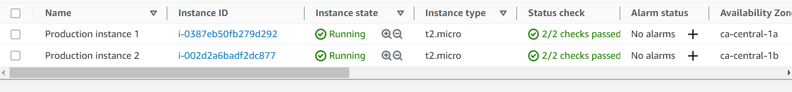

# Deploy WordPress on a 2-Tier AWS Architecture with Terraform&nbsp;[](https://www.youtube.com/playlist?list=PLJl2liPyo6s2DEWVgvW_J7MSI-7JikMOW)

**This article was originally written by "Kemane Donfack" on the blog**: https://blog.numericaideas.com

## Introduction

Deploying WordPress on a **two-tier AWS architecture** with Terraform provides a robust and scalable solution for hosting your WordPress site. **Amazon Web Services (AWS)** offers a wide range of services that can be leveraged to create a resilient and high-performing infrastructure, while Terraform enables us to automate the deployment process.

In this article, we will explore the step-by-step process of deploying WordPress on a two-tier AWS architecture using Terraform. By following this guide, you will be able to set up a reliable infrastructure that separates the presentation layer from the data layer, thereby optimizing performance and providing flexibility for future growth.

[](https://blog.numericaideas.com/xxxxxxxxxxxx)

## What is Terraform?

[**Terraform**](https://youtu.be/tJ6L1332WU4) is an open-source tool developed by [**HashiCorp**](https://www.hashicorp.com/) that allows for the automated management of IT infrastructure. It uses a declarative approach to create, modify, and delete cloud resources. With **Terraform**, you can describe your infrastructure in configuration files, making it easier to manage as code. The tool is compatible with multiple cloud providers, enabling you to provision resources on different platforms. Terraform provides a powerful and flexible solution for automating the deployment and management of your cloud infrastructure.

Here are some **advantages** of Terraform:
- **Infrastructure Automation**: Terraform allows for the automation of provisioning and managing your cloud infrastructure. You can describe your infrastructure using configuration files, making it easy to deploy and update your resources.
- **Multi-Cloud and Multi-Provider**: Terraform supports multiple public cloud providers such as AWS, Azure, GCP, as well as private cloud providers. You can use the same Terraform configuration files to provision resources on different platforms.
- **Modularity**: Terraform allows you to define infrastructure as reusable modules. These modules can encapsulate specific configurations and be used to create complex and scalable infrastructures. This also facilitates sharing and reusing best practices within your organization.
- **Dependency Management**: Terraform automatically manages dependencies between different resources in your infrastructure. It identifies dependencies and updates them consistently during changes. This simplifies the management of complex infrastructures with many interconnected components.

In case you aren't familiar with Terraform yet, we have an introduction [video tutorial](https://youtu.be/tJ6L1332WU4) along with a demo available on YouTube:

[](https://youtu.be/tJ6L1332WU4)

## What is a 2-Tier Architecture?

In the context of the article about deploying WordPress on a **2-Tier AWS architecture with Terraform**, here is a concise description of what a 2-Tier architecture is:

A 2-Tier architecture, also known as a two-tier architecture, is a model of IT infrastructure that separates application components into two distinct layers: `the presentation layer` and `the data layer`.

- **The presentation layer**: also known as the front-end layer, is responsible for the user interface and interaction with end-users. In the case of WordPress, this layer includes the web server that handles HTTP requests and displays website pages to visitors.

- **The data layer**: also known as the back-end layer, is responsible for data storage and access. For WordPress, this involves managing the database where articles, comments, user information, etc., are stored.

By using a 2-Tier architecture, we can achieve several benefits. Firstly, it allows for a clear separation of responsibilities between the presentation layer and the data layer, making application management and maintenance easier.

Additionally, this approach provides greater **flexibility** and **scalability**. In the event of traffic spikes, we can scale only the presentation layer by adding additional web server instances, without impacting the data layer. This ensures optimal performance and a smooth user experience.

## Infrastructure Provisioning

### Prerequisites

Before starting the deployment process, make sure you have the following prerequisites in place:

- Basic knowledge of [Terraform](https://youtu.be/tJ6L1332WU4) & AWS
- Installed AWS CLI, as documented [here](https://blog.numericaideas.com/configure-aws-cli)
- Installed Terraform CLI

Now, let’s start configuring our project

### Step 1: Provider Configuration

create a file `provider.tf` with the below content

```
provider "aws" {
  region = "eu-north-1"
}

terraform {
  required_providers {
    aws = {
      source  = "hashicorp/aws"
      version = "4.65.0"
    }
  }
}
```
The `provider.tf` file is used to configure the AWS provider for Terraform, specifying the AWS region and the required provider version.

The resources defined in this file are:

- **provider "aws"**: Specifies the AWS provider for Terraform. It sets the region to "eu-north-1", indicating that the resources will be provisioned in the AWS EU (Stockholm) region. The role of this resource is to authenticate Terraform with the specified AWS region and allow it to manage AWS resources.
- **terraform block**: Defines the required providers for the Terraform configuration. In this case, it specifies that the "aws" provider is required, with a specific version of "4.65.0". The role of this block is to ensure that the correct version of the AWS provider is used for the configuration.

### Step 2: Create VPC and Subnets

First, let's create a `variables.tf` file to store all our variables.
```
variable "inbound_port_production_ec2" {
  type        = list(any)
  default     = [22, 80]
  description = "inbound port allow on production instance"
}

variable "db_name" {
  type    = string
  default = "kemanedonfack"
}

variable "db_user" {
  type    = string
  default = "kemane"
}

variable "db_password" {
  type    = string
  default = "Kemane-AWS2023"
}

variable "instance_type" {
  type    = string
  default = "t3.micro"
}

variable "ami" {
  type    = string
  default = "ami-0cf13cb849b11b451"
}

variable "key_name" {
  type    = string
  default = "kemane"
}

variable "availability_zone" {
  type    = list(string)
  default = ["eu-north-1a", "eu-north-1b", "eu-north-1c"]
}

variable "vpc_cidr" {
  type    = string
  default = "10.0.0.0/16"
}

variable "subnet_cidrs" {
  type        = list(string)
  description = "list of all cidr for subnet"
  default     = ["10.0.1.0/24", "10.0.2.0/24", "10.0.3.0/24", "10.0.4.0/24", "10.0.5.0/24"]
}

variable "target_application_port" {
  type    = string
  default = "80"
}

```

The `variables.tf` file is used to define and initialize the Terraform variables required for configuring and deploying the 2-Tier architecture for the WordPress application on AWS. The defined variables include information about **EC2 instances**, **the database**, **ports**, **instance type**, **AMI ID**, **availability zone**, **VPC CIDR**, **subnet CIDRs**, and **target application ports**. These variables can be modified to fit the specific needs of the project.

create `vpc.tf` file and add the below content

```
resource "aws_vpc" "infrastructure_vpc" {
  cidr_block           = var.vpc_cidr
  enable_dns_support   = "true" #gives you an internal domain name
  enable_dns_hostnames = "true" #gives you an internal host name
  instance_tenancy     = "default"

  tags = {
    Name = "2-tier-architecture-vpc"
  }
}

# It enables our vpc to connect to the internet
resource "aws_internet_gateway" "tier_architecture_igw" {
  vpc_id = aws_vpc.infrastructure_vpc.id
  tags = {
    Name = "2-tier-architecture-igw"
  }
}

# First ec2 instance public subnet
resource "aws_subnet" "ec2_1_public_subnet" {
  vpc_id                  = aws_vpc.infrastructure_vpc.id
  cidr_block              = var.subnet_cidrs[1]
  map_public_ip_on_launch = "true" //it makes this a public subnet
  availability_zone       = var.availability_zone[1]
  tags = {
    Name = "first ec2 public subnet"
  }
}

# Second ec2 instance public subnet
resource "aws_subnet" "ec2_2_public_subnet" {
  vpc_id                  = aws_vpc.infrastructure_vpc.id
  cidr_block              = var.subnet_cidrs[2]
  map_public_ip_on_launch = "true" //it makes this a public subnet
  availability_zone       = var.availability_zone[2]
  tags = {
    Name = "second ec2 public subnet"
  }
}

# Database private subnet
resource "aws_subnet" "database_private_subnet" {
  vpc_id                  = aws_vpc.infrastructure_vpc.id
  cidr_block              = var.subnet_cidrs[4]
  map_public_ip_on_launch = "false" //it makes this a private subnet
  availability_zone       = var.availability_zone[2]
  tags = {
    Name = "database private subnet"
  }
}

# Database read replica private subnet
resource "aws_subnet" "database_read_replica_private_subnet" {
  vpc_id                  = aws_vpc.infrastructure_vpc.id
  cidr_block              = var.subnet_cidrs[3]
  map_public_ip_on_launch = "false"
  availability_zone       = var.availability_zone[1]
  tags = {
    Name = "database read replica private subnet"
  }
}
```

The `vpc.tf` file contains the definition of the **Virtual Private Cloud (VPC)** where the infrastructure resources will be created for our 2-tier AWS architecture using Terraform.

The resources defined in this file are:

- **aws_vpc**: Defines the VPC with the CIDR block and the enabled DNS resolution and hostname settings. The role of this resource is to create the main VPC that will be used to host the different EC2 instances and RDS databases.
- **aws_internet_gateway**: Adds a gateway to allow the VPC to connect to the internet. The role of this resource is to enable internet connectivity for the VPC, which will be used to provide internet access to the EC2 instances.
- **aws_subnet**: Defines the subnets that will be used to create the EC2 instances and RDS databases. Two subnets are public for the EC2 instances, while the other two are private for the databases. The role of this resource is to create the subnets for the different resources that will be created in the VPC.

Create `route_table.tf` file and add the below content:

```
resource "aws_route_table" "infrastructure_route_table" {
  vpc_id = aws_vpc.infrastructure_vpc.id

  route {
    //associated subnet can reach everywhere
    cidr_block = "0.0.0.0/0"
    //CRT uses this IGW to reach internet
    gateway_id = aws_internet_gateway.tier_architecture_igw.id
  }

}

# attach ec2 1 subnet to an internet gateway
resource "aws_route_table_association" "route-ec2-1-subnet-to-igw" {
  subnet_id      = aws_subnet.ec2_1_public_subnet.id
  route_table_id = aws_route_table.infrastructure_route_table.id
}

# attach ec2 2 subnet to an internet gateway
resource "aws_route_table_association" "route-ec2-2-subnet-to-igw" {
  subnet_id      = aws_subnet.ec2_2_public_subnet.id
  route_table_id = aws_route_table.infrastructure_route_table.id
}

```

The `route_table.tf` file contains the configuration for the route table in our 2-tier AWS architecture created with Terraform.

The resources defined in this file are:

- **aws_route_table**: Defines the main route table for the VPC. It specifies that any traffic with a destination CIDR block of "0.0.0.0/0" (which represents all IP addresses) should be routed through the aws_internet_gateway.tier_architecture_igw resource. The role of this resource is to enable internet connectivity for the associated subnets.
- **aws_route_table_association**: Associates the EC2 subnets with the route table. It specifies that the aws_subnet.ec2_1_public_subnet and aws_subnet.ec2_2_public_subnet subnets should be associated with the aws_route_table.infrastructure_route_table. This association allows the instances in these subnets to access the internet through the configured route. The role of these resources is to establish the routing between the subnets and the internet gateway.

### Step 3: Create Security Groups

create `security_group.tf` file and add the below content

```
#Create a security  group for production node to allow traffic 
resource "aws_security_group" "production-instance-sg" {
  name        = "production-instance-sg"
  description = "Security from who allow inbound traffic on port 22 and 9090"
  vpc_id      = aws_vpc.infrastructure_vpc.id

  # dynamic block who create two rules to allow inbound traffic 
  dynamic "ingress" {
    for_each = var.inbound_port_production_ec2
    content {
      from_port   = ingress.value
      to_port     = ingress.value
      protocol    = "tcp"
      cidr_blocks = ["0.0.0.0/0"]
    }
  }

  egress {
    from_port   = 0
    to_port     = 0
    protocol    = -1
    cidr_blocks = ["0.0.0.0/0"]
  }
}

#Create a security  group for database to allow traffic on port 3306 and from ec2 production security group
resource "aws_security_group" "database-sg" {
  name        = "database-sg"
  description = "security  group for database to allow traffic on port 3306 and from ec2 production security group"
  vpc_id      = aws_vpc.infrastructure_vpc.id

  ingress {
    description     = "Allow traffic from port 3306 and from ec2 production security group"
    from_port       = 3306
    to_port         = 3306
    protocol        = "tcp"
    security_groups = [aws_security_group.production-instance-sg.id]
  }

  egress {
    from_port   = 0
    to_port     = 0
    protocol    = -1
    cidr_blocks = ["0.0.0.0/0"]
  }
}
```

The `security_group.tf` file defines two AWS security groups using Terraform. These security groups control inbound and outbound traffic for the production instances and the database.

The resources defined in this file are:

- **aws_security_group "production-instance-sg"**: This resource defines the security group for the production instances. It allows inbound traffic on specifics ports. The dynamic block is used to create rules for each port specified in the `var.inbound_port_production_ec2` variable. The egress block allows all outbound traffic.

- **aws_security_group "database-sg"**: This resource defines the security group for the database. It allows inbound traffic on port 3306 from the **production-instance-sg security group**. The egress block allows all outbound traffic.


### Step 4: Create Application Load Balancer

create `loadbalancer.tf` file and add the below content
```
# Creation of application LoadBalancer
resource "aws_lb" "application_loadbalancer" {
  name               = "application-loadbalancer"
  internal           = false
  load_balancer_type = "application"
  security_groups    = [aws_security_group.production-instance-sg.id]
  subnets            = [aws_subnet.ec2_2_public_subnet.id, aws_subnet.ec2_1_public_subnet.id]
}

# Target group for application loadbalancer
resource "aws_lb_target_group" "target_group_alb" {
  name     = "target-group-alb"
  port     = var.target_application_port
  protocol = "HTTP"
  vpc_id   = aws_vpc.infrastructure_vpc.id
}

# attach target group to an instance
resource "aws_lb_target_group_attachment" "attachment1" {
  target_group_arn = aws_lb_target_group.target_group_alb.arn
  target_id        = aws_instance.production_1_instance.id
  port             = var.target_application_port
  depends_on = [
    aws_instance.production_1_instance,
  ]
}

# attach target group to an instance
resource "aws_lb_target_group_attachment" "attachment2" {
  target_group_arn = aws_lb_target_group.target_group_alb.arn
  target_id        = aws_instance.production_2_instance.id
  port             = var.target_application_port
  depends_on = [
    aws_instance.production_2_instance,
  ]
}

# attach target group to a loadbalancer
resource "aws_lb_listener" "external-elb" {
  load_balancer_arn = aws_lb.application_loadbalancer.arn
  port              = var.target_application_port
  protocol          = "HTTP"
  default_action {
    type             = "forward"
    target_group_arn = aws_lb_target_group.target_group_alb.arn
  }
}
```

The `loadbalancer.tf` file contains the configuration for creating an application load balancer (ALB) using Terraform. It defines the necessary resources to set up the ALB, target groups, and attachments.

The resources defined in this file are:

- **aws_lb "application_loadbalancer"**: This resource creates the application load balancer. It specifies the load balancer's name, type, and whether it is internal or external. The security_groups parameter references the security group ID of the production instances' security group. The subnets parameter specifies the subnets in which the load balancer will be deployed.

- **aws_lb_target_group "target_group_alb"**: This resource defines the target group for the ALB. It specifies the target group's name, port, protocol, and the VPC in which it will be created.

- **aws_lb_target_group_attachment "attachment1" and "attachment2"**: These resources attach the target group to the respective production instances. They specify the target group ARN, target instance ID, and the port to which traffic will be forwarded.

- **aws_lb_listener "external-elb"**: This resource attaches the target group to the load balancer's listener. It specifies the load balancer ARN, port, and protocol. The default_action block defines the action to be performed for incoming requests, which is forwarding to the target group.


### Step 5: Provision EC2 Instances and RDS Database

create `main.tf` file and add the below content

```
resource "aws_instance" "production_1_instance" {
  ami                    = var.ami
  instance_type          = var.instance_type
  subnet_id              = aws_subnet.ec2_1_public_subnet.id
  vpc_security_group_ids = [aws_security_group.production-instance-sg.id]
  key_name               = var.key_name
  user_data              = file("install_script.sh")
  tags = {
    Name = "Production instance 1"
  }
  depends_on = [
    aws_db_instance.rds_master,
  ]
}

resource "aws_instance" "production_2_instance" {
  ami                    = var.ami
  instance_type          = var.instance_type
  subnet_id              = aws_subnet.ec2_2_public_subnet.id
  vpc_security_group_ids = [aws_security_group.production-instance-sg.id]
  key_name               = var.key_name
  user_data              = file("install_script.sh")
  tags = {
    Name = "Production instance 2"
  }
  depends_on = [
    aws_db_instance.rds_master,
  ]
}

resource "aws_db_subnet_group" "database_subnet" {
  name       = "db subnet"
  subnet_ids = [aws_subnet.database_private_subnet.id, aws_subnet.database_read_replica_private_subnet.id]
}

data "aws_kms_key" "by_id" {
  key_id = "2de55688-7b1f-4830-85aa-385fecca2b1f" # KMS key associated with the CEV
}

resource "aws_db_instance" "rds_master" {
  identifier              = "master-rds-instance"
  allocated_storage       = 10
  engine                  = "mysql"
  engine_version          = "5.7.37"
  instance_class          = "db.t3.micro"
  db_name                 = var.db_name
  username                = var.db_user
  password                = var.db_password
  kms_key_id              = data.aws_kms_key.by_id.arn
  backup_retention_period = 7
  multi_az                = false
  availability_zone       = var.availability_zone[2]
  db_subnet_group_name    = aws_db_subnet_group.database_subnet.id
  skip_final_snapshot     = true
  vpc_security_group_ids  = [aws_security_group.database-sg.id]
  storage_encrypted       = true

  tags = {
    Name = "my-rds-master"
  }
}

resource "aws_db_instance" "rds_replica" {

  replicate_source_db    = aws_db_instance.rds_master.identifier
  instance_class         = "db.t3.micro"
  identifier             = "replica-rds-instance"
  allocated_storage      = 10
  skip_final_snapshot    = true
  multi_az               = false
  availability_zone      = var.availability_zone[1]
  vpc_security_group_ids = [aws_security_group.database-sg.id]
  storage_encrypted      = true

  tags = {
    Name = "my-rds-replica"
  }

}
```

The `main.tf` file contains the main configuration for creating various AWS resources using Terraform. It defines the resources for EC2 instances, RDS instances, and a database subnet group.

The resources defined in this file are:

- **aws_instance "production_1_instance" and "production_2_instance"**: These resources define the EC2 instances for production. They specify the Amazon Machine Image (AMI), instance type, subnet ID, security group ID, key name for SSH access, user data script, and tags. The instances depend on the availability of the RDS master instance.

- **aws_db_subnet_group "database_subnet"**: This resource defines the database subnet group for the RDS instances. It specifies the name and the subnet IDs of the private subnets where the RDS instances will be deployed.

- **data "aws_kms_key" "by_id"**: This data source retrieves information about a specific AWS Key Management Service (KMS) key. It is used to obtain the ARN of the KMS key associated with the Customer-Managed Key (CMK) used for encrypting the RDS instance.

- **aws_db_instance "rds_master"**: This resource creates the master RDS instance. It specifies the identifier, allocated storage, database engine, engine version, instance class, database name, username, password, KMS key ID, backup retention period, availability zone, subnet group name, security group ID, and other configuration options. It tags the RDS instance as `my-rds-master`.

- **aws_db_instance "rds_replica"**: This resource creates the replica RDS instance. It specifies the replicate source DB (the identifier of the master RDS instance), instance class, identifier, allocated storage, skip final snapshot flag, multi-AZ deployment, availability zone, security group ID, storage encryption, and tags. It tags the RDS instance as `my-rds-replica`.


Create `install_script.sh` file with the bellow content

```
#!/bin/bash

#install docker 
sudo apt-get update
sudo apt-get install \
    ca-certificates \
    curl \
    gnupg
sudo install -m 0755 -d /etc/apt/keyrings
curl -fsSL https://download.docker.com/linux/ubuntu/gpg | sudo gpg --dearmor -o /etc/apt/keyrings/docker.gpg
sudo chmod a+r /etc/apt/keyrings/docker.gpg
echo \
  "deb [arch="$(dpkg --print-architecture)" signed-by=/etc/apt/keyrings/docker.gpg] https://download.docker.com/linux/ubuntu \
  "$(. /etc/os-release && echo "$VERSION_CODENAME")" stable" | \
  sudo tee /etc/apt/sources.list.d/docker.list > /dev/null
sudo apt-get update
sudo apt-get install docker-ce docker-ce-cli containerd.io docker-buildx-plugin docker-compose-plugin -y
sudo apt  install docker-compose -y
sudo systemctl enable docker
sudo systemctl start docker

sudo echo ${aws_db_instance.rds_master.password} | sudo tee /root/db_password.txt > /dev/null
sudo echo ${aws_db_instance.rds_master.username} | sudo tee /root/db_username.txt > /dev/null
sudo echo ${aws_db_instance.rds_master.endpoint} | sudo tee /root/db_endpoint.txt > /dev/null
# create docker-compose
sudo cat <<EOF | sudo tee docker-compose.yml > /dev/null
version: '3'

services:
  wordpress:
   image: wordpress:4.8-apache
   ports:
    - 80:80
   environment:
     WORDPRESS_DB_USER: $(cat /root/db_username.txt)
     WORDPRESS_DB_HOST: $(cat /root/db_endpoint.txt)
     WORDPRESS_DB_PASSWORD: $(cat /root/db_password.txt)
   volumes:
     - wordpress-data:/var/wwww/html

volumes:
  wordpress-data:
EOF

sudo docker-compose up
```

The `install_script.sh` file is a shell script that installs Docker and Docker-compose, configures a WordPress environment, and launches the application.

create `outputs.tf` file with the bellow content

```
output "public_1_ip" {
  value = aws_instance.production_1_instance.public_ip
}

output "public_2_ip" {
  value = aws_instance.production_2_instance.public_ip
}

output "rds_endpoint" {
  value = aws_db_instance.rds_master.endpoint
}

output "rds_username" {
  value = aws_db_instance.rds_master.username
}


output "rds_name" {
  value = aws_db_instance.rds_master.db_name
}

# print the DNS of load balancer
output "lb_dns_name" {
  description = "The DNS name of the load balancer"
  value       = aws_lb.application_loadbalancer.dns_name
}
```
The `output.tf` file is a Terraform file that defines the outputs of the resources created in the code.

Specifically, this file defines the following outputs:

- **public_1_ip**: the public IP address of the first instance created in AWS.
- **public_2_ip**: the public IP address of the second instance created in AWS.
- **rds_endpoint**: the endpoint of the RDS database instance created in AWS.
- **rds_username**: the username of the RDS database created in AWS.
- **rds_name**: the name of the RDS database created in AWS.
- **lb_dns_name**: the DNS domain name of the application load balancer created in AWS.

These outputs will be used to connect to the RDS database instance and accessing the application via the application load balancer.

### Step 6: Deployment

To start the deployment process, we need to initialize Terraform in our project directory. This step ensures that Terraform downloads the necessary providers and sets up the backend configuration. Run the following command in your terminal:

```
terraform init
```


After initializing Terraform, we can generate an execution plan to preview the changes that will be made to our AWS infrastructure. The plan provides a detailed overview of the resources that will be created, modified, or destroyed.

To generate the plan, execute the following command:
```
terraform plan
```


Once we are satisfied with the execution plan, we can proceed with deploying our infrastructure on AWS. Terraform will provision the necessary resources and configure them according to our specifications.

To deploy the infrastructure, run the following command:

```
terraform apply
```

Terraform will prompt for confirmation before proceeding with the deployment. Type `yes` and press Enter to continue.


The deployment process will take some time. Terraform will display the progress and status of each resource being created.


Once the deployment is complete, Terraform will output the information about the provisioned resources, such as the IP addresses, DNS names, RDS endpoint, user and database name.


Now let's check our infrastructure





**Congratulations! You have successfully deployed your WordPress application on a 2-tier AWS architecture using Terraform**. You can now access your WordPress website and start customizing it to suit your needs.

———————

We have just started our journey to build a network of professionals to grow even more our free knowledge-sharing community that’ll give you a chance to learn interesting things about topics like cloud computing, software development, and software architectures while keeping the door open to more opportunities.

Does this speak to you? If **YES**, feel free to [Join our Discord Server](https://discord.numericaideas.com) to stay in touch with the community and be part of independently organized events.

———————

## Conclusion

To conclude, deploying WordPress on a 2-Tier AWS architecture with Terraform offers a reliable and scalable solution for hosting your website. This approach allows any team, regardless of their level of Cloud experience, to successfully set up and manage their WordPress application. By leveraging Terraform's infrastructure-as-code capabilities, the deployment process becomes streamlined and repeatable.

However, it is important to emphasize the significance of conducting thorough research and due diligence when selecting the appropriate AWS services and configurations for your specific requirements. Ensuring high availability, fault tolerance, and security should be prioritized during the deployment process.

Thanks for reading this article, recommend and share if you enjoyed it. Follow us on [Facebook](https://www.facebook.com/numericaideas), [Twitter](https://twitter.com/numericaideas), and [LinkedIn](https://www.linkedin.com/company/numericaideas) for more content.
