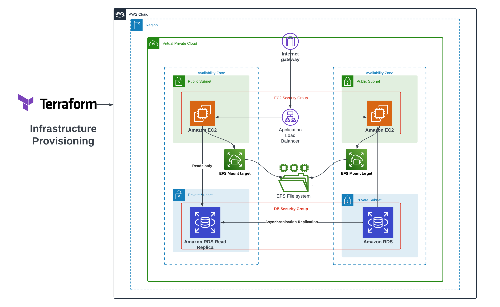

# Deploy WordPress on a 2-Tier AWS Architecture with Terraform&nbsp;[](https://blog.numericaideas.com/deploy-wordpress-2-tier-aws-architecture-with-terraform)

**This article was originally written by "Kemane Donfack" on the blog**: https://blog.numericaideas.com/deploy-wordpress-2-tier-aws-architecture-with-terraform

## Introduction

Deploying WordPress on a **two-tier AWS architecture with Terraform** offers a robust and scalable solution to host your website. **Amazon Web Services (AWS)** provides various services for creating a resilient infrastructure, and Terraform automates the deployment process.

By following this guide, you'll establish a reliable infrastructure that optimizes performance and allows for future growth.

[](https://blog.numericaideas.com/deploy-wordpress-2-tier-aws-architecture-with-terraform)

The **YouTube Channels** in both English (En) and French (Fr) are now accessible, feel free to subscribe by clicking [here](https://www.youtube.com/@numericaideas/channels?sub_confirmation=1).

## What is Terraform?

[**Terraform**](https://youtu.be/tJ6L1332WU4) is an open-source tool by [**HashiCorp**](https://www.hashicorp.com/) for automated IT infrastructure management. It enables you to create, modify, and delete cloud resources declaratively. With **Terraform**, infrastructure is described in configuration files, simplifying its management as code. It supports multiple cloud providers and offers automation and flexibility for deploying and managing your cloud infrastructure.

Here are some **advantages** of Terraform:
- **Infrastructure Automation**: Terraform automates the provisioning and management of cloud infrastructure, allowing for easy deployment and updates using configuration files.
- **Multi-Cloud and Multi-Provider**: Terraform supports various public and private cloud providers, enabling resource provisioning across platforms using the same configuration files.
- **Modularity**: Terraform allows the definition of reusable infrastructure modules, facilitating the creation of complex and scalable architectures and promoting best practice sharing.
- **Dependency Management**: Terraform handles dependencies between resources, ensuring consistent updates and simplifying the management of interconnected infrastructures.

In case you aren't familiar with this IaC tool yet, there is an [Introduction to Terraform video tutorial](https://youtu.be/tJ6L1332WU4) along with a demo available on YouTube:

[](https://youtu.be/tJ6L1332WU4)

## What is a 2-Tier Architecture?

A 2-Tier architecture, also known as a two-tier architecture, is a model of IT infrastructure that separates application components into two distinct layers: `the presentation layer` and `the data layer`.

- **The presentation layer**: also known as the front-end layer, is responsible for the user interface and interaction with end users. In the case of WordPress, this layer includes the web server that handles HTTP requests and displays website pages to visitors.

- **The data layer**: also known as the back-end layer, is responsible for data storage and access. For WordPress, this involves managing the database where articles, comments, user information, etc., are stored.

**Benefits** of a 2-Tier Architecture:

- **Clear Separation**: A 2-Tier architecture separates responsibilities between the presentation and data layers, simplifying application management and maintenance.
- **Flexibility and Scalability**: Scaling the presentation layer without impacting the data layer allows for optimal performance and a smooth user experience, especially during traffic spikes.

## Infrastructure Provisioning

The overall **AWS WordPress Architecture** looks like the following image in which the **AWS Cloud Services** are highlighted:

[](https://blog.numericaideas.com/deploy-wordpress-2-tier-aws-architecture-with-terraform)

### Prerequisites

Before starting the deployment process, make sure you have the following prerequisites in place:

- Basic knowledge of [Terraform](https://youtu.be/tJ6L1332WU4) & AWS
- Installed AWS CLI, as documented [here](https://blog.numericaideas.com/configure-aws-cli)
- Installed Terraform CLI

Now, let’s start configuring our project

### Step 1: Provider Configuration

Create a file named [`provider.tf`](./provider.tf) with the following content:

```
provider "aws" {
  region = "ca-central-1"
}

terraform {
  required_providers {
    aws = {
      source  = "hashicorp/aws"
      version = "4.65.0"
    }
  }
}
```
The `provider.tf` file configures the AWS provider for Terraform by specifying the AWS region and the required provider version.

The resources defined in this file are:

- **provider "aws"**: Specifies the AWS provider for Terraform. It sets the region to "ca-central-1", indicating that the resources will be provisioned in the AWS Canada (Central) region. The role of this resource is to authenticate Terraform with the specified AWS region and allow it to manage AWS resources.
- **terraform block**: Defines the required providers for the Terraform configuration. In this case, it specifies that the "aws" provider is required with a specific version of **4.65.0**. This block ensures that the correct version of the AWS provider is used for the configuration.

### Step 2: Create VPC and Subnets

Create a file named [`variables.tf`](./variables.tf) to store the necessary variables.

```
variable "inbound_port_production_ec2" {
  type        = list(any)
  default     = [22, 80]
  description = "inbound port allow on production instance"
}

variable "db_name" {
  type    = string
  default = "wordpressdb"
}

variable "db_user" {
  type    = string
  default = "admin"
}

variable "db_password" {
  type    = string
  default = "Wordpress-AWS2Tier"
}

variable "instance_type" {
  type    = string
  default = "t2.micro"
}

variable "ami" {
  type    = string
  default = "ami-0cbfa6bba4589dcbb"
}

variable "availability_zone" {
  type    = list(string)
  default = ["ca-central-1a", "ca-central-1b", "ca-central-1d"]
}

variable "vpc_cidr" {
  type    = string
  default = "10.0.0.0/16"
}

variable "subnet_cidrs" {
  type        = list(string)
  description = "list of all cidr for subnet"
  default     = ["10.0.1.0/24", "10.0.2.0/24", "10.0.3.0/24", "10.0.4.0/24", "10.0.5.0/24"]
}

variable "target_application_port" {
  type    = string
  default = "80"
}

variable "private_key_location" {
  description = "Location of the private key"
  type        = string
  default     = "aws_access_key.pem"
}

variable "mount_directory" {
  type    = string
  default = "/var/www/html"
}
```

The `variables.tf` file defines and initializes the Terraform variables required for configuring and deploying the 2-Tier architecture on AWS. These variables include information about **inbound ports**, **database settings**, **instance type**, **AMI ID**, **availability zones**, **VPC CIDR**, **subnet CIDRs**, and **target application ports**. Customize these variables to suit your project's requirements.

**Important:** You should create the Key pair name `wordpressKey`.

Create [`vpc.tf`](./vpc.tf) file and add the below content:

```
resource "aws_vpc" "infrastructure_vpc" {
  cidr_block           = var.vpc_cidr
  enable_dns_support   = "true" #gives you an internal domain name
  enable_dns_hostnames = "true" #gives you an internal host name
  instance_tenancy     = "default"

  tags = {
    Name = "2-tier-architecture-vpc"
  }
}

# It enables our vpc to connect to the internet
resource "aws_internet_gateway" "tier_architecture_igw" {
  vpc_id = aws_vpc.infrastructure_vpc.id
  tags = {
    Name = "2-tier-architecture-igw"
  }
}

# first ec2 instance public subnet
resource "aws_subnet" "ec2_1_public_subnet" {
  vpc_id                  = aws_vpc.infrastructure_vpc.id
  cidr_block              = var.subnet_cidrs[1]
  map_public_ip_on_launch = "true" //it makes this a public subnet
  availability_zone       = var.availability_zone[0]
  tags = {
    Name = "first ec2 public subnet"
  }
}

# second ec2 instance public subnet
resource "aws_subnet" "ec2_2_public_subnet" {
  vpc_id                  = aws_vpc.infrastructure_vpc.id
  cidr_block              = var.subnet_cidrs[2]
  map_public_ip_on_launch = "true" //it makes this a public subnet
  availability_zone       = var.availability_zone[1]
  tags = {
    Name = "second ec2 public subnet"
  }
}

# database private subnet
resource "aws_subnet" "database_private_subnet" {
  vpc_id                  = aws_vpc.infrastructure_vpc.id
  cidr_block              = var.subnet_cidrs[4]
  map_public_ip_on_launch = "false" //it makes this a private subnet
  availability_zone       = var.availability_zone[1]
  tags = {
    Name = "database private subnet"
  }
}

# database read replica private subnet
resource "aws_subnet" "database_read_replica_private_subnet" {
  vpc_id                  = aws_vpc.infrastructure_vpc.id
  cidr_block              = var.subnet_cidrs[3]
  map_public_ip_on_launch = "false"
  availability_zone       = var.availability_zone[0]
  tags = {
    Name = "database read replica private subnet"
  }
}
```

The `vpc.tf` file defines the **Virtual Private Cloud (VPC)** and subnets for the 2-Tier architecture. It creates the **VPC** with the specified CIDR block and enables DNS support and hostnames and a **gateway** to allow the VPC to connect to the internet. Additionally, it creates **two public subnets** for EC2 instances, a **private subnet** for the database, and another for the database read replica.

Create [`route_table.tf`](./route_table.tf) file and add the below content:

```
resource "aws_route_table" "infrastructure_route_table" {
  vpc_id = aws_vpc.infrastructure_vpc.id

  route {
    // associated subnet can reach everywhere
    cidr_block = "0.0.0.0/0"
    // CRT uses this IGW to reach internet
    gateway_id = aws_internet_gateway.tier_architecture_igw.id
  }

}

# attach ec2 1 subnet to an internet gateway
resource "aws_route_table_association" "route-ec2-1-subnet-to-igw" {
  subnet_id      = aws_subnet.ec2_1_public_subnet.id
  route_table_id = aws_route_table.infrastructure_route_table.id
}

# attach ec2 2 subnet to an internet gateway
resource "aws_route_table_association" "route-ec2-2-subnet-to-igw" {
  subnet_id      = aws_subnet.ec2_2_public_subnet.id
  route_table_id = aws_route_table.infrastructure_route_table.id
}

```

The `route_table.tf` file configures the route table for the VPC. It creates a route table with a default route to the internet gateway. It then associates the EC2 subnets with the route table, allowing them to access the internet through the configured route.

### Step 3: Create Security Groups

Create [`security_group.tf`](./security_group.tf) file and add the below content:

```
# Create a security  group for production nodes to allow traffic 
resource "aws_security_group" "production-instance-sg" {
  name        = "production-instance-sg"
  description = "Security from who allow inbound traffic on port 22 and 9090"
  vpc_id      = aws_vpc.infrastructure_vpc.id

  # dynamic block who create two rules to allow inbound traffic 
  dynamic "ingress" {
    for_each = var.inbound_port_production_ec2
    content {
      from_port   = ingress.value
      to_port     = ingress.value
      protocol    = "tcp"
      cidr_blocks = ["0.0.0.0/0"]
    }
  }

  egress {
    from_port   = 0
    to_port     = 0
    protocol    = -1
    cidr_blocks = ["0.0.0.0/0"]
  }
}

# Create a security  group for database to allow traffic on port 3306 and from ec2 production security group
resource "aws_security_group" "database-sg" {
  name        = "database-sg"
  description = "security  group for database to allow traffic on port 3306 and from ec2 production security group"
  vpc_id      = aws_vpc.infrastructure_vpc.id

  ingress {
    description     = "Allow traffic from port 3306 and from ec2 production security group"
    from_port       = 3306
    to_port         = 3306
    protocol        = "tcp"
    security_groups = [aws_security_group.production-instance-sg.id]
  }

  egress {
    from_port   = 0
    to_port     = 0
    protocol    = -1
    cidr_blocks = ["0.0.0.0/0"]
  }
}

# EFS volume security group
resource "aws_security_group" "efs_sg" {
  name        = "efs security group"
  description = "Allow EFS PORT"
  vpc_id      = aws_vpc.infrastructure_vpc.id
  ingress {
    description     = "EFS mount target"
    from_port       = 2049
    to_port         = 2049
    protocol        = "tcp"
    cidr_blocks     = ["0.0.0.0/0"]
    security_groups = [aws_security_group.production-instance-sg.id]
  }

  egress {
    from_port   = 0
    to_port     = 0
    protocol    = "-1"
    cidr_blocks = ["0.0.0.0/0"]
  }
}
```

The `security_group.tf` file defines three AWS **security groups** using Terraform. The first security group (aws_security_group.production-instance-sg) allows inbound traffic on specified ports (these ports are specified in the file `variables.tf` variable `inbound_port_production_ec2`) from any source **(0.0.0.0/0)**. The second security group (aws_security_group.database-sg) allows inbound traffic on port **3306** from the security group associated with the production instances. The third is for the **EFS** which allows inbound traffic on port **2049** NFS port volume, all security groups allow all outbound traffic.


### Step 4:  The Application Load Balancer

Create [`loadbalancer.tf`](./loadbalancer.tf) file and add the below content:

```
# Creation of application LoadBalancer
resource "aws_lb" "application_loadbalancer" {
  name               = "application-loadbalancer"
  internal           = false
  load_balancer_type = "application"
  security_groups    = [aws_security_group.production-instance-sg.id]
  subnets            = [aws_subnet.ec2_2_public_subnet.id, aws_subnet.ec2_1_public_subnet.id]
}

# Target group for application loadbalancer
resource "aws_lb_target_group" "target_group_alb" {
  name     = "target-group-alb"
  port     = var.target_application_port
  protocol = "HTTP"
  vpc_id   = aws_vpc.infrastructure_vpc.id
}

# attach target group to an instance
resource "aws_lb_target_group_attachment" "attachment1" {
  target_group_arn = aws_lb_target_group.target_group_alb.arn
  target_id        = aws_instance.production_1_instance.id
  port             = var.target_application_port
  depends_on = [
    aws_instance.production_1_instance,
  ]
}

# attach target group to an instance
resource "aws_lb_target_group_attachment" "attachment2" {
  target_group_arn = aws_lb_target_group.target_group_alb.arn
  target_id        = aws_instance.production_2_instance.id
  port             = var.target_application_port
  depends_on = [
    aws_instance.production_2_instance,
  ]
}

# attach target group to a loadbalancer
resource "aws_lb_listener" "external-elb" {
  load_balancer_arn = aws_lb.application_loadbalancer.arn
  port              = var.target_application_port
  protocol          = "HTTP"
  default_action {
    type             = "forward"
    target_group_arn = aws_lb_target_group.target_group_alb.arn
  }
}
```

The `loadbalancer.tf` file configures the **application load balancer (ALB)** and its associated resources using Terraform. It creates the ALB with the specified name, type, security groups, and subnets. It also defines the target group for the ALB, attaches the production instances to the target group, and configures the listener to forward traffic to the target group.

### Step 5: Provision EC2 Instances and RDS Database

To provision EC2 instances and an RDS database, you need to create a [`main.tf`](./main.tf) file with the following content:

```
resource "aws_instance" "production_1_instance" {
  ami                    = var.ami
  instance_type          = var.instance_type
  subnet_id              = aws_subnet.ec2_1_public_subnet.id
  vpc_security_group_ids = [aws_security_group.production-instance-sg.id]
  key_name               = aws_key_pair.aws_ec2_access_key.id
  tags = {
    Name = "production-instance"
  }
  depends_on = [
    aws_db_instance.rds_master,
  ]
}

resource "aws_instance" "production_2_instance" {
  ami                    = var.ami
  instance_type          = var.instance_type
  subnet_id              = aws_subnet.ec2_2_public_subnet.id
  vpc_security_group_ids = [aws_security_group.production-instance-sg.id]
  key_name               = aws_key_pair.aws_ec2_access_key.id
  tags = {
    Name = "production-instance"
  }
  depends_on = [
    aws_db_instance.rds_master,
  ]
}

resource "aws_db_subnet_group" "database_subnet" {
  name       = "db subnet"
  subnet_ids = [aws_subnet.database_private_subnet.id, aws_subnet.database_read_replica_private_subnet.id]
}

resource "aws_db_instance" "rds_master" {
  identifier              = "master-rds-instance"
  allocated_storage       = 10
  engine                  = "mysql"
  engine_version          = "5.7.37"
  instance_class          = "db.t3.micro"
  db_name                 = var.db_name
  username                = var.db_user
  password                = var.db_password
  backup_retention_period = 7
  multi_az                = false
  availability_zone       = var.availability_zone[1]
  db_subnet_group_name    = aws_db_subnet_group.database_subnet.id
  skip_final_snapshot     = true
  vpc_security_group_ids  = [aws_security_group.database-sg.id]
  storage_encrypted       = true

  tags = {
    Name = "my-rds-master"
  }
}

resource "aws_db_instance" "rds_replica" {
  replicate_source_db    = aws_db_instance.rds_master.identifier
  instance_class         = "db.t3.micro"
  identifier             = "replica-rds-instance"
  allocated_storage      = 10
  skip_final_snapshot    = true
  multi_az               = false
  availability_zone      = var.availability_zone[0]
  vpc_security_group_ids = [aws_security_group.database-sg.id]
  storage_encrypted      = true

  tags = {
    Name = "my-rds-replica"
  }

}
```

The `main.tf` file contains the main configuration for creating various AWS resources using Terraform. It defines the resources for EC2 instances, RDS instances, and a database subnet group.

The resources defined in this file are:

- **aws_instance "production_1_instance" and "production_2_instance"**: The instances use the specified AMI, instance type, subnet ID, security group ID, key name, and tags. They depend on the availability of the RDS master instance.

- **aws_db_subnet_group "database_subnet"**: resource defines the database subnet group, specifying a name and the subnet IDs of the private subnets where the RDS instances will be deployed.

- **aws_db_instance "rds_master"**: This resource creates the master RDS instance. It specifies the identifier, allocated storage, database engine, engine version, instance class, database name, username, password, backup retention period, availability zone, subnet group name, security group ID, and other configuration options. It tags the RDS instance as `my-rds-master`.

- **aws_db_instance "rds_replica"**: resource creates the replica RDS instance, which replicates from the master RDS instance. It has similar configuration options but with a different identifier and availability zone.

### Step 6: Provisioning the EFS file System

This step is very important as we have **two EC2 instances** connected to a load balancer. It is essential to ensure **data consistency** between the different EC2 instances that make up our architecture. This ensures that regardless of the instance selected by the load balancer, users will always see the same information without any inconsistency or data loss.

An effective way to guarantee this data consistency is to use **Amazon Elastic File System (EFS)** as a shared storage system for our EC2 instances in order to store the files of our WordPress site.

Create [`efs.tf`](./efs.tf) file with the content below:

```
resource "aws_efs_file_system" "efs_volume" {
  creation_token = "efs_volume"
}

resource "aws_efs_mount_target" "efs_mount_target_1" {
  file_system_id  = aws_efs_file_system.efs_volume.id
  subnet_id       = aws_subnet.ec2_1_public_subnet.id
  security_groups = [aws_security_group.efs_sg.id]
}

resource "aws_efs_mount_target" "efs_mount_target_2" {
  file_system_id  = aws_efs_file_system.efs_volume.id
  subnet_id       = aws_subnet.ec2_2_public_subnet.id
  security_groups = [aws_security_group.efs_sg.id]
}

resource "tls_private_key" "ssh" {
  algorithm = "RSA"
  rsa_bits  = 4096
}

resource "aws_key_pair" "aws_ec2_access_key" {
  key_name_prefix = "efs_key"
  public_key      = tls_private_key.ssh.public_key_openssh
}

resource "local_file" "private_key" {
  content  = tls_private_key.ssh.private_key_pem
  filename = var.private_key_location
}

data "aws_instances" "production_instances" {
  instance_tags = {
    "Name" = "production-instance"
  }
  depends_on = [
    aws_instance.production_1_instance,
    aws_instance.production_2_instance
  ]
}

resource "null_resource" "install_script" {
  count = 2

  depends_on = [
    aws_db_instance.rds_master,
    local_file.private_key,
    aws_efs_mount_target.efs_mount_target_1,
    aws_efs_mount_target.efs_mount_target_2,
    aws_instance.production_1_instance,
    aws_instance.production_2_instance
  ]

  connection {
    type        = "ssh"
    host        = data.aws_instances.production_instances.public_ips[count.index]
    user        = "ec2-user"
    private_key = file(var.private_key_location)
  }

  provisioner "remote-exec" {
    inline = [
      "sudo yum update -y",
      "sudo yum install docker -y",
      "wget https://github.com/docker/compose/releases/latest/download/docker-compose-$(uname -s)-$(uname -m)",
      "sudo mv docker-compose-$(uname -s)-$(uname -m) /usr/local/bin/docker-compose",
      "sudo chmod -v +x /usr/local/bin/docker-compose",
      "sudo systemctl enable docker.service",
      "sudo systemctl start docker.service",
      "sudo yum -y install amazon-efs-utils",
      "sudo mkdir -p ${var.mount_directory}",
      "sudo mount -t efs -o tls ${aws_efs_file_system.efs_volume.id}:/ ${var.mount_directory}",
      "sudo docker run --name wordpress-docker -e WORDPRESS_DB_USER=${aws_db_instance.rds_master.username} -e WORDPRESS_DB_HOST=${aws_db_instance.rds_master.endpoint} -e WORDPRESS_DB_PASSWORD=${aws_db_instance.rds_master.password} -v ${var.mount_directory}:${var.mount_directory} -p 80:80 -d wordpress:4.8-apache",
    ]
  }
}
```

The above code provisions an **EFS** file system and configures EFS mount points for EC2 instances.

The defined resources are as follows:

- **aws_efs_file_system "efs_volume"**: This resource creates an EFS file system with a creation token creation_token set as `efs_volume_token`. Its role is to provide durable and scalable storage for the application. It can be attached to `several ec2 instances`.

- **aws_efs_mount_target "efs_mount_target_1" and "efs_mount_target_2"**: These resources define EFS mount points for EC2 instances. They specify the EFS file system ID, the subnet ID where EC2 instances are deployed, and the associated security group ID. Their role is to establish the connectivity between the EC2 instances and the `EFS file system`, enabling the instances to access and use the shared storage.

- **tls_private_key "ssh"**: This resource generates an `SSH key pair` for connecting to the EC2 instances. Its role is to facilitate secure remote access to the EC2 instances.

- **aws_key_pair "aws_ec2_access_key"**: This resource creates an EC2 access key using the previously generated public key. Its role is to associate the generated public key with the EC2 instances, allowing SSH access using the corresponding private key.

- **local_file "private_key"**: This resource saves the generated private key to a local file at the specified location.

- **"data" resource aws_instances**: is used to retrieve information about existing EC2 instances in your AWS account. In this case, the targeted EC2 instances should have a tag with the key "Name" and the value "production-instance". `These are our two already created EC2 instances.`

- **null_resource "install_script"**: This resource execute an installation script on the EC2 instances to configure Docker, mount the EFS file system, and run a Docker container WordPress that uses the RDS database. The script is executed via an SSH connection to the EC2 instance using the previously generated private key.

The **depends_on** option is used to set the resource dependencies, ensuring that the EC2 instances, private key, EFS mount points, and RDS database are available before running the installation scripts.

Create [`output.tf`](./output.tf) file with the bellow content:

```
output "public_1_ip" {
  value = aws_instance.production_1_instance.public_ip
}

output "public_2_ip" {
  value = aws_instance.production_2_instance.public_ip
}

# print the DNS of load balancer
output "lb_dns_name" {
  description = "The DNS name of the load balancer"
  value       = aws_lb.application_loadbalancer.dns_name
}
```

The `output.tf` file is used to define the outputs of the resources created in the Terraform code. It specifies **the public IP** addresses of the **EC2 instances** and the **DNS name of the application load balancer**.

These outputs will be used to connect to the RDS database instance and access the application via the application load balancer.

### Step 7: Deployment

To start the deployment process, we need to initialize Terraform in our project directory. This step ensures that Terraform downloads the necessary providers and sets up the backend configuration. Run the following command in your terminal:

```
terraform init
```


After initializing Terraform, we can generate an execution plan to preview the changes that will be made to our AWS infrastructure. The plan provides a detailed overview of the resources that will be created, modified, or destroyed.

To generate the plan, execute the following command:
```
terraform plan
```


Once we are satisfied with the execution plan, we can proceed with deploying our infrastructure on AWS. Terraform will provide the necessary resources and configure them according to our specifications.

To deploy the infrastructure, run the following command:

```
terraform apply
```

Terraform will prompt for confirmation before proceeding with the deployment. Type `yes` and press Enter to continue.


The deployment process will take some time. Terraform will display the progress and status of each resource being created.


Once the deployment is complete, Terraform will output the information about the provisioned resources, such as the IP addresses, DNS names, RDS endpoint, user and database name.


Finally, let's check our infrastructure from the AWS Console:


The **WordPress** installation is available via the generated Load Balancer domain:


**Important**: Let's note that we can link it to a custom domain along with an HTTP certificate by using the AWS ACM service.

**Congratulations! You have successfully deployed your 2-tier AWS WordPress Architecture using Terraform**. You can now access your WordPress website and start customizing it to suit your needs.

The complete source code of the project is available on [GitHub](https://github.com/numerica-ideas/community/tree/master/terraform/deploy-wordpress-2tier-aws-architecture-with-terraform).

———————

We have just started our journey to build a network of professionals to grow even more our free knowledge-sharing community that’ll give you a chance to learn interesting things about topics like cloud computing, software development, and software architectures while keeping the door open to more opportunities.

Does this speak to you? If **YES**, feel free to [Join our Discord Server](https://discord.numericaideas.com) to stay in touch with the community and be part of independently organized events.

———————

## Conclusion

To conclude, deploying WordPress on a 2-Tier AWS architecture with Terraform offers a reliable and scalable solution for hosting your website. This approach allows any team, regardless of their level of Cloud experience, to successfully set up and manage their WordPress application. By leveraging Terraform's infrastructure-as-code capabilities, the deployment process becomes streamlined and repeatable.

However, it is important to emphasize the significance of conducting thorough research and due diligence when selecting the appropriate AWS services and configurations for your specific requirements. Ensuring high availability, fault tolerance, and security should be prioritized during the deployment process.

Thanks for reading this article. Like, recommend, and share if you enjoyed it. Follow us on [Facebook](https://www.facebook.com/numericaideas), [Twitter](https://twitter.com/numericaideas), and [LinkedIn](https://www.linkedin.com/company/numericaideas) for more content.

