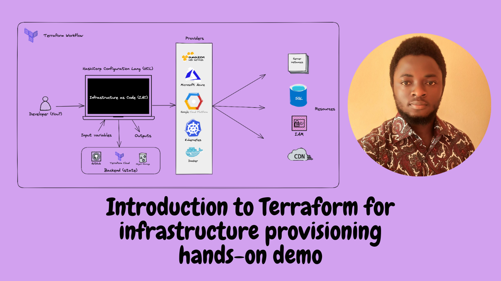
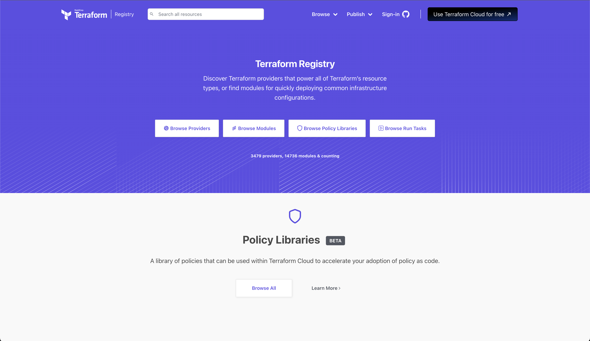
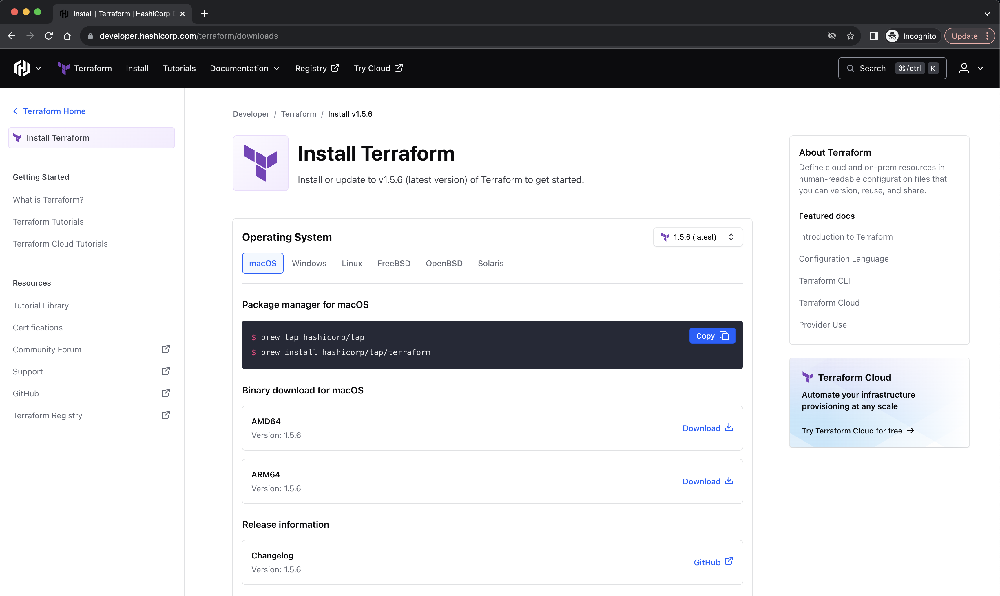
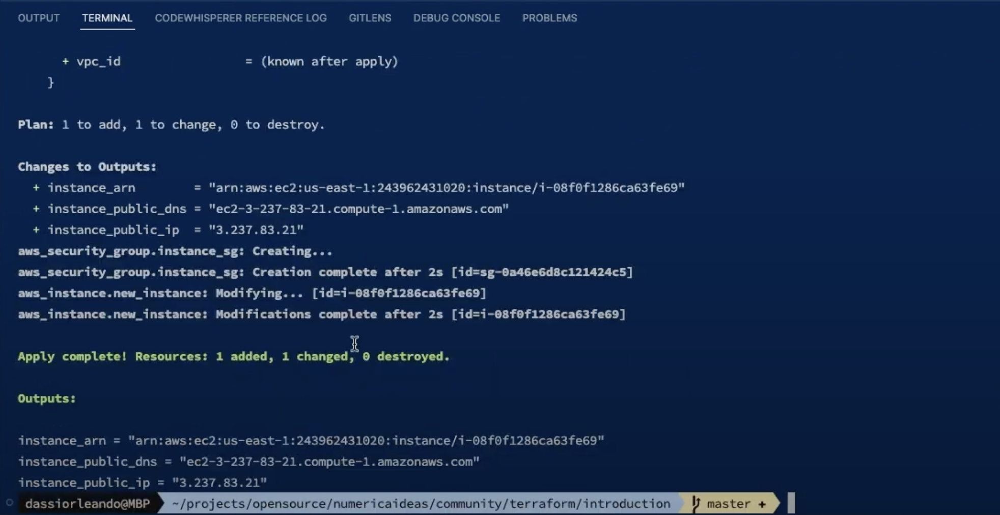

# Introduction to Terraform&nbsp;[](https://blog.numericaideas.com/introduction-to-terraform)

**This article was originally written by "Orleando Dassi" on the blog**: https://blog.numericaideas.com/introduction-to-terraform

## What is Terraform?
[Terraform](https://developer.hashicorp.com/terraform) is widely defined as a cloud-agnostic tool used to deploy resources no matter the provider involved, but it's more than that, since it works on-premises as well, and a provider can be anything else than cloud environments, like Kubernetes clusters and Docker instances can be automated as well. Terraform is an **Infrastructure as Code (IaC)** tool that allows you to automatically create and manage resources for anything that has an accessible API defined as a provider.

The sample code at the end covers the creation of an **EC2 instance on AWS** associated with a **security group** with **Nginx** installed and serving on port **80**.

Do you prefer the Video format instead? Feel free to watch it by following this [link](https://youtu.be/tJ6L1332WU4):
[](https://youtu.be/tJ6L1332WU4)

## Terraform Concepts
Now that we have a minimal understanding of what Terraform is, let’s emphasize some general concepts by using a high-level overview as illustrated in the following diagram:

[](https://youtu.be/tJ6L1332WU4)

The main concepts to grab about Terraform are HCL, Backend, Provider, Resources, Input variables, and Outputs.

### HCL
At the core of Terraform, we have HCL, which is the declarative configuration language that you as a developer have to use to specify your infrastructure, it stands for **Hashicorp Configuration Language**.

### Provider
The provider is one of the most important parts of your Terraform configurations since it specifies the place where you would like your resources to be created. A few well-known providers are Amazon Web Services (AWS), Microsoft Azure, Google Cloud Platform (GCP), Kubernetes, Docker ... and so on.

The official list of recommended providers is available within the [Terraform Registry](https://registry.terraform.io/), even though it's possible to have providers accessible in custom-made registries.



### Resources
Resources are anything that we create on the provider side, e.g.: a server instance or a network component.

### Input variables
Simply put, variables are a way to make your configurations more dynamic and flexible, with a simple change you can easily switch the region to deploy your resources to, or even easily change the type of instance you would like to create (from t2.micro to t3.medium). Generally defined in a file called `variables` with a tf extension.

### Outputs
Since Terraform used the providers’ APIs, at the end of the automation, each resource sent back a response that generally gives more information about the resources we just updated/created, this information is called Outputs. Generally defined in a file called `outputs.tf`, these are printed on the screen once you run your IaC code, unless you defined them as sensitive.

### Backend
While automating your infrastructure, Terraform keeps a state of your resources in a location called the backend, it can be a Git repository, Terraform Cloud service, or an Object Storage like S3. If you don't specify the Backend configurations, your IaC state will be saved on the host machine where Terraform is being run.

## Setup: Terraform CLI and VSCode
Before moving to the commands section, it’s important to have the correct setup on our computer so that we’ll be ready to go.

Setting up Terraform is about having **Terraform CLI** installed on the environment you would like to use it from, in my case, it’s on my personal computer, which I believe is for you as well if you are about to play with it and learn at the same time.

The main page to land on is the [download page](https://developer.hashicorp.com/terraform/downloads) available on the Terraform website. From that page, you have to click on the tab that corresponds to your operating system, mine is MacOS so I simply had to hit these two brew commands:

[](https://youtu.be/tJ6L1332WU4)

To make it even easier, I recommend using the **Visual Studio Code** editor along with the [Terraform extension](https://marketplace.visualstudio.com/items?itemName=HashiCorp.terraform) to write your configurations, this extension is a great tool since it enables **syntax highlighting**, **auto-completion**, **code formatting**, **syntax validation**, **code navigation** and **Terraform Cloud Integration**.

## Terraform Commands
Using Terraform on a daily basis can't be achieved without the following common **Terraform commands** which are demoed in this [YouTube video](https://youtu.be/tJ6L1332WU4?si=nXyQIPE98dZjjpxc&t=494): 
- `terraform init`: initializes the project by downloading the required local data, modules, providers, and the state file to be used by the actual project.
- `terraform fmt`: fix the code formatting for the configuration files.
- `terraform version`: gets the installed Terraform version.
- `terraform validate`: syntax validation for error checking.
- `terraform plan`: generates an execution plan corresponding to your configurations (.tf files) changes.
- `terraform apply`: generates an execution plan and applies it once approved, the `-auto-approve` flag could be used to skip the prompt question.
- `terraform destroy`: destroys previously-created infrastructure, it’s an alias for “terraform apply -destroy”.
- `terraform help`: displays the documentation of Terraform CLI commands.

## Demo: Create an EC2 Instance on AWS
For the demo, I’ll assume you have properly installed AWS CLI on your computer and configured it successfully by using the appropriate command: aws configure. You can read more about it from this [guide](https://blog.numericaideas.com/configure-aws-cli).

We are going to create an EC2 server on AWS and then install Nginx on it, we ended up with three files just for illustration purposes.

Watch it being done live in this video:
[](https://youtu.be/tJ6L1332WU4?si=I2TtmLaFBNMB-CeE&t=588)

Let's initialize the project using the `terraform init` command, then we create the following files below in the same folder.

The file [variables.tf](./variables.tf) includes the variables used by our IaC project:
```
variable "aws_region" {
  type        = string
  description = "AWS region to use"
  default     = "us-east-1"
}

variable "instance_type" {
  type        = string
  description = "Instance type"
  default     = "t3.medium"
}

variable "instance_ami" {
  type        = string
  description = "Instance ami id"
  default     = "ami-09e67e426f25ce0d7"
}

variable "instance_tag_name" {
  type        = string
  description = "Instance tag name"
  default     = "NewEC2Instance"
}
```

The infrastructure provisioning instruction itself generally resides in (or is called by) the [main.tf](./main.tf) file:
```
provider "aws" {
  region = var.aws_region
}

resource "aws_instance" "new_instance" {
  ami                    = var.instance_ami
  instance_type          = var.instance_type
  vpc_security_group_ids = [aws_security_group.instance_sg.id]

  user_data = <<-EOF
        #!/bin/bash
        apt update
        apt install -y nginx
        sudo service nginx start
        EOF

  tags = {
    "Name" = var.instance_tag_name
  }
}

resource "aws_security_group" "instance_sg" {
  name = "instance-sg"

  ingress {
    description = "instance ingress security group"
    from_port   = 80
    to_port     = 80
    cidr_blocks = ["0.0.0.0/0"]
    protocol    = "tcp"
  }

  egress {
    from_port   = 0
    to_port     = 0
    protocol    = "-1"
    cidr_blocks = ["0.0.0.0/0"]
  }
}
```

As said on the top, we could define some outputs to be printed or not in the console, feel free to do so in the [outputs.tf](./outputs.tf) file as below:
```
output "instance_arn" {
  description = "Created EC2 arn"
  value       = aws_instance.new_instance.arn
}

output "instance_public_ip" {
  description = "Instance public ip"
  value       = aws_instance.new_instance.public_ip
}

output "instance_public_dns" {
  description = "Instance public dns"
  value       = aws_instance.new_instance.public_dns
}
```

Finally, let's format the code (`terraform fmt`), perform the validation (`terraform validate`), then execute it by using the command `terraform apply -auto-approve`, you should have as output something similar to this:



Here's the complete [source code](https://github.com/numerica-ideas/community/tree/master/terraform/introduction), the Hashicorp AWS provider [documentation](https://registry.terraform.io/providers/hashicorp/aws/latest/docs) is available to manage other resources or services.

## Advantages of Terraform
The benefits of using Terraform as an infrastructure provisioning tool are:
- **Automation**: infrastructure as code (IaC).
- **Cloud-agnostic**: It enables multi-cloud deployment strategies using the same language (Hashicorp Configuration Language) to specify your Cloud infrastructure.
- The **declarative** approach of defining your cloud resources, vs imperative. Over here you declare your intentions, but not the steps to follow to reach them, Terraform is responsible for handling the orchestration to give you what you want.
- Terraform is **stateful**: roll-back is easily manageable since you can version your infrastructure state via a generated file.
- **Integrates** well with existing Software Development workflows.
- Terraform is modular and favors the **DRY principle (Do Not Repeat Yourself)** in order to write high-quality and reusable codes.

The complete source code of the project is available on [GitHub](https://github.com/numerica-ideas/community/tree/master/terraform/introduction).

In order to better your DevOps skills, learn [How To Deploy WordPress on a 2-Tier AWS Architecture using Terraform](https://blog.numericaideas.com/deploy-wordpress-2-tier-aws-architecture-with-terraform) by following this practical workshop:

[](https://blog.numericaideas.com/deploy-wordpress-2-tier-aws-architecture-with-terraform)

———————

We have just started our journey to build a network of professionals to grow even more our free knowledge-sharing community that’ll give you a chance to learn interesting things about topics like cloud computing, software development, and software architectures while keeping the door open to more opportunities.

Does this speak to you? If **YES**, feel free to [Join our Discord Server](https://discord.numericaideas.com) to stay in touch with the community and be part of independently organized events.

———————

## Conclusion
To sum up, in this article, we looped over the essential knowledge you need to have in order to use Terraform as an IaC tool, some related articles are published on [the blog](https://blog.numericaideas.com/tag/terraform).

Thanks for reading this article. Like, recommend, and share if you enjoyed it. Follow us on [Facebook](https://www.facebook.com/numericaideas), [Twitter](https://twitter.com/numericaideas), and [LinkedIn](https://www.linkedin.com/company/numericaideas) for more content.
