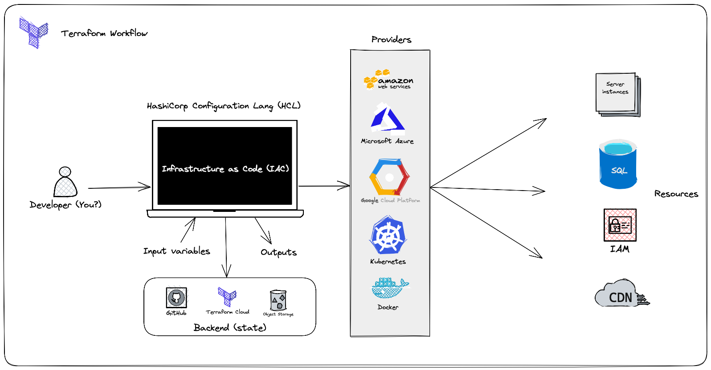
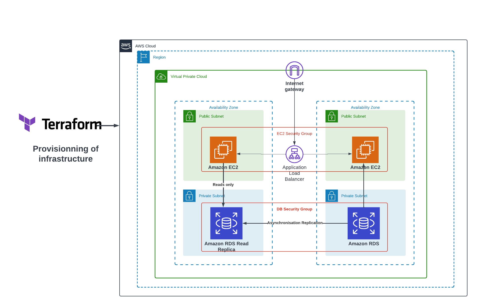

# Demystifying Terraform Modules&nbsp;[](https://blog.numericaideas.com/terraform-modules)

**This article was originally written by "Kemane Donfack" on the blog**: https://blog.numericaideas.com/terraform-modules

In the world of Infrastructure as Code (IaC), Terraform is a leading tool for managing and provisioning resources across various cloud providers. It empowers DevOps teams to define infrastructure in a declarative manner, ensuring consistent and reproducible deployments. Key to Terraform's capabilities are **modules**, which play a pivotal role in creating scalable and maintainable infrastructure code.

[](https://blog.numericaideas.com/terraform-modules)

> The **YouTube Channels** in both English (En) and French (Fr) are now accessible, feel free to subscribe by clicking [here](https://www.youtube.com/@numericaideas/channels?sub_confirmation=1).

## Prerequisites

Before delving into Terraform modules, ensure you have the following:
- **Terraform Installation**: Download the latest version from the [official website](https://www.terraform.io/downloads.html).
- **AWS Account**: Set up an appropriate AWS account credentials as documented [here](https://blog.numericaideas.com/configure-aws-cli).
- **Basic HCL Knowledge**: Familiarity with HashiCorp Configuration Language (HCL), used for writing Terraform configurations.
- **Modularity**: Terraform allows the definition of reusable infrastructure modules, facilitating the creation of complex and scalable architectures and promoting best practice sharing.
- **Dependency Management**: Terraform handles dependencies between resources, ensuring consistent updates and simplifying the management of interconnected infrastructures.

In case you aren't familiar with this IaC tool yet, there is an [Introduction to Terraform video tutorial](https://youtu.be/tJ6L1332WU4) along with a demo available on YouTube:

[](https://youtu.be/tJ6L1332WU4)

## Introduction to Terraform Modules

### What Are Terraform Modules?

Terraform modules are fundamental in this ecosystem. They are collections of Terraform configuration files, templates, and resources bundled into a single directory. Modules enable you to create reusable, composable, and shareable infrastructure components.

### Why Use Terraform Modules?

Terraform modules offer several advantages:

- **Modularity**: Modules break down your infrastructure code into manageable components, focusing on specific aspects. This simplifies understanding and maintenance.

- **Reusability**: Modules can be shared across projects, encapsulating best practices for replicating infrastructure patterns.

- **Versioning**: Modules can be versioned, ensuring consistent configurations throughout your infrastructure.

### What is the Terraform Registry?

The [**Terraform Registry**](https://blog.numericaideas.com/introduction-to-terraform#provider) is a public repository maintained by HashiCorp, the creators of Terraform. It serves as a trusted source for sharing Terraform modules, provider plugins, and other resources. It's the go-to platform for finding and sharing infrastructure code, promoting collaboration, and reducing the need to reinvent the wheel.

## How to Create Terraform Modules?

### Terraform Module Structure

Creating a Terraform module is straightforward. Structure it by organizing configuration files, variables, and outputs in a dedicated directory. Within this directory, include `main.tf`, `outputs.tf`, and `variables.tf` files to define resources, variables, and outputs specific to your module. Here's an example folder structure for a Terraform project with a module:

```plaintext
my-terraform-project/
├── main.tf
├── variables.tf
├── outputs.tf
└── modules/
    └── my-module/
        ├── main.tf
        ├── variables.tf
        └── outputs.tf
```

### Variables and Outputs in Modules

Variables parameterize your module. Define them in `variables.tf` to allow users to customize your module's behavior in their Terraform configurations. Outputs, defined in `outputs.tf`, expose specific values for use in other Terraform configurations.

In `variables.tf`, define input variables like this:

```hcl
variable "instance_count" {
  description = "Number of instances to create."
  type        = number
  default     = 1
}
```

In `outputs.tf`, define outputs like this:

```hcl
output "instance_ips" {
  description = "Public IPs of the instances."
  value       = aws_instance.instances[*].public_ip
}
```

## Using Terraform Modules

### Modules in Configuration
Using a Terraform module in your configuration is straightforward. Specify the module source in your code, like this:

```hcl
module "example" {
  source          = "./modules/my-module"
  instance_count  = 2
}
```

In this example, we use a module named **example** located in the `./modules/my-module` directory. We also provide a value for the `instance_count` variable. 

Now, let's explore how we could have reused or installed that module if it were stored in the Terraform Registry or located in a GitHub repository. 

### Using Modules from the Terraform Registry

The Terraform Registry is a public repository of Terraform modules provided by HashiCorp and the Terraform community. To use a module from the Terraform Registry, you would specify the source as follows:

```hcl
module "example" {
  source = "terraform-aws-modules/ec2-instance/aws"
  instance_count = 2
}
```

### Using Modules from GitHub

If the module is hosted on GitHub, you can reference it using the `git::` source syntax as demonstrated below:

```hcl
module "example" {
  source = "git::https://github.com/your-username/your-module.git"
  instance_count = 2
}
```

Here, `https://github.com/your-username/your-module.git` should be replaced with the actual URL of your GitHub repository containing the module.

By specifying the appropriate source, you can easily reuse or install modules from various sources, including the Terraform Registry and GitHub, making your infrastructure management more efficient and flexible.

## Terraform Module Examples

To grasp the power of Terraform modules, let's dive into real-world examples. We'll create two modules: one for provisioning an EC2 instance and another for creating a Security Group that we'll associate with the instance.

### The Security Group Module

The Security Group module encapsulates the creation of an AWS Security Group, acting as a virtual firewall for EC2 instances, controlling inbound and outbound traffic.

#### Module Structure

Directory structure for our Security Group module:

```plaintext
my-terraform-project/
└── modules/
    └── security-group/
        ├── main.tf
        ├── variables.tf
        ├── outputs.tf
```

#### Variables

In `variables.tf`, define variables for customizing the Security Group:

```hcl
variable "security_group_name" {
  description = "Name of the security group"
}

variable "security_group_description" {
  description = "Description of the security group"
}

variable "inbound_port" {
  type        = list(any)
  description = "List of inbound ports to allow"
}

variable "vpc_id" {
  description = "ID of the VPC"
}
```

#### Resources

In `main.tf`, create the Security Group:

```hcl
# Create a security group
resource "aws_security_group" "security" {
  name        = var.security_group_name
  description = var.security_group_description
  vpc_id      = var.vpc_id

  dynamic "ingress" {
    for_each = var.inbound_port
    content {
      from_port   = ingress.value
      to_port     = ingress.value
      protocol    = "tcp"
      cidr_blocks = ["0.0.0.0/0"]
    }
  }

  egress {
    from_port   = 0
    to_port     = 0
    protocol    = -1
    cidr_blocks = ["0.0.0.0/0"]
  }
}
```

#### Outputs

Our Security Group module exposes the Security Group's ID as an output in `outputs.tf`:

```hcl
output "security_group_id" {
  value = aws_security_group.security.id
}
```

### The EC2 Instance Module

The EC2 instance module creates an EC2 instance and associates it with the Security Group created using our Security Group module, ensuring instances launch with the necessary security configurations.

#### Module Structure

Directory structure for our EC2 instance module:

```plaintext
my-terraform-project/
└── modules/
    └── ec2-instance/
        ├── main.tf
        ├── variables.tf
        └── outputs.tf
```

#### Variables

In `variables.tf`, define variables to customize the EC2 instance:

```hcl
variable "instance_name" {
  description = "Name of the EC2 instance launched with this configuration"
}

variable "aws_subnet_id" {
  description = "ID of the AWS subnet for launching the EC2 instance"
}

variable "ami" {
  description = "ID of the Amazon Machine Image (AMI) for the EC2 instance"
}

variable "key_name" {
  description = "Name of the SSH key pair for connecting to the EC2 instance"
}

variable "instance_type" {
  description = "Type of EC2 instance to launch (e.g., t2.micro, m5.large, etc.)"
}

variable "ebs_volume_size" {
  description = "Size (in GB) of the EBS volume to attach to the EC2 instance"
}

variable "ec2_sg_id" {
  description = "ID of the EC2 Security Group(s) to associate with the EC2 instance"
}
```

#### Resources

In `main.tf`,

 create the EC2 instance:

```hcl
resource "aws_instance" "instance" {
  ami                    = var.ami
  instance_type          = var.instance_type
  subnet_id              = var.aws_subnet_id
  vpc_security_group_ids = var.ec2_sg_id
  key_name               = var.key_name

  root_block_device {
    volume_size           = var.ebs_volume_size
    volume_type           = "gp3"
    delete_on_termination = true
  }

  tags = {
    Name = var.instance_name
  }
}
```

#### Outputs

Our EC2 instance module exposes the public IP address of the instance as an output in `outputs.tf`

```hcl
output "instance_ip" {
  value = aws_instance.instance.public_ip
}
```

### Using the Modules

Now that we have created our Security Group and EC2 Instance modules, let's explore how to use them in a Terraform configuration.

In your Terraform configuration, use these modules as shown below:

```hcl
data "aws_vpc" "myvpc" {
  id = "vpc-xxxxxx"
}

data "aws_subnet" "mysubnet" {
  id = "subnet-xxxxxx"
}

module "security_group_ec2" {
  source                     = "./modules/security-group"
  security_group_name        = "myec2-sg"
  security_group_description = "EC2 Security Group"
  inbound_port               = [8080, 22]
  vpc_id                     = data.aws_vpc.myvpc.id
}

module "myinstance" {
  source                    = "./modules/ec2-instance"
  aws_subnet_id             = data.aws_subnet.mysubnet.id
  instance_name             = "EC2"
  ami                       = "ami-08766f81ab52792ce"
  key_name                  = "mykey"
  instance_type             = "t3.micro"
  ebs_volume_size           = 30
  ec2_sg_id                 = [module.security_group_ec2.security_group_id]
}
```

In this example:

- Define data sources for the VPC and Subnet where your EC2 instance will be associated.

- Use the `module` block to create an instance of our Security Group module named **security_group_ec2**. Specify parameters such as `security_group_name`, `security_group_description`, `inbound_port`, and `vpc_id` to customize the Security Group.

- Provision an EC2 instance using the **myinstance** module. Provide parameters like `aws_subnet_id`, `instance_name`, `ami`, `key_name`, `instance_type`, `ebs_volume_size`, and `ec2_sg_id`. The `ec2_sg_id` parameter is set to the `security_group_id` output of the **security_group_ec2** module, ensuring the EC2 instance associates with the correct Security Group.

By adopting these modules and using this configuration, efficiently manage the security and provisioning of EC2 instances while ensuring consistency and security best practices.

To deploy your infrastructure, execute the following commands:

``` shell
terraform init
terraform plan
terraform apply -auto-approve
```

Once completed, your infrastructure should resemble the image displayed below:


The complete source code of the project is available on [GitHub](https://github.com/numerica-ideas/community/tree/master/terraform/terraform-modules).

In order to better your DevOps skills, learn [How To Deploy WordPress on a 2-Tier AWS Architecture using Terraform](https://blog.numericaideas.com/deploy-wordpress-2-tier-aws-architecture-with-terraform) by following this practical workshop:

[](https://blog.numericaideas.com/deploy-wordpress-2-tier-aws-architecture-with-terraform)

———————

We have just started our journey to build a network of professionals to grow our free knowledge-sharing community that will allow you to learn exciting things about topics like cloud computing, software development, and software architectures while keeping the door open to more opportunities.

Does this speak to you? If **YES**, feel free to [Join our Discord Server](https://discord.numericaideas.com) to stay in touch with the community and be part of independently organized events.

———————


# Conclusion

Terraform modules are fundamental for creating maintainable and scalable Infrastructure as Code. They allow encapsulation of infrastructure components, promote reusability, and simplify the management of complex resources. Mastering Terraform modules enhances your ability to provision and manage infrastructure efficiently, making you a more effective DevOps engineer.

Thanks for reading this article. Like, recommend, and share if you enjoyed it. Follow us on [Facebook](https://www.facebook.com/numericaideas), [Twitter](https://twitter.com/numericaideas), and [LinkedIn](https://www.linkedin.com/company/numericaideas) for more content.
