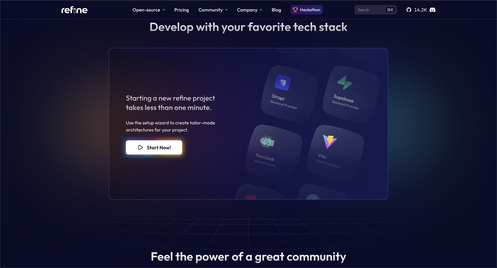
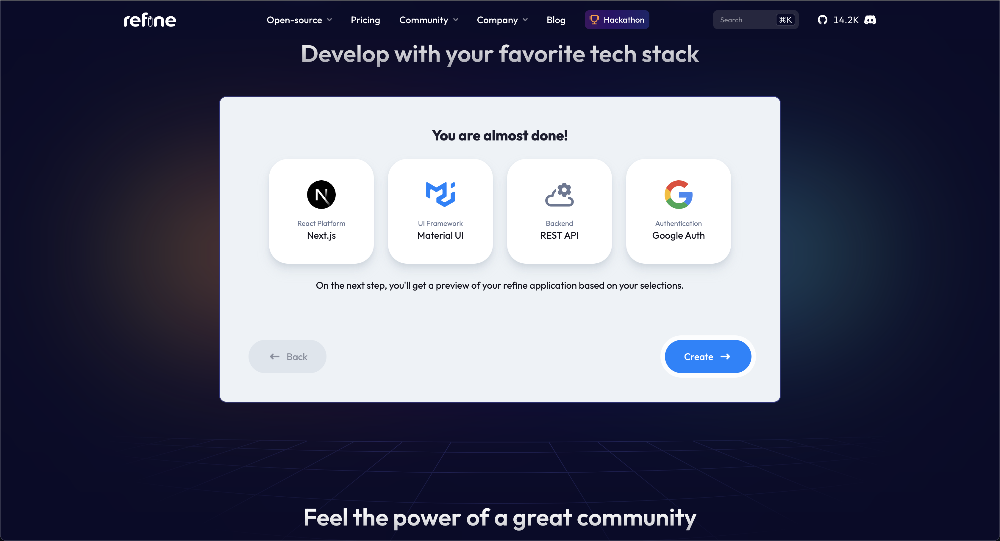

# Quickly Build your React CRUD Application with Refine&nbsp;[](https://blog.numericaideas.com/)

**This article was originally written by "Ismael Messa" on the blog**: https://blog.numericaideas.com/build-react-crud-app-with-refine

## Introduction

Are you looking for an easy and fast way to create a React CRUD app? I think so! Look no further, **Refine** is the tool that will allow you to achieve this. Refine is a powerful React framework that allows you to develop various types of React applications by providing a lot of prebuilt functionality to help you get started quickly. In this article, we are going to give you a preview of how you can use the powerful or refine to build your React CRUD Application quickly.

The **YouTube Channels** in both English (En) and French (Fr) are now accessible, feel free to subscribe by clicking [here](https://www.youtube.com/@numericaideas/channels?sub_confirmation=1).

## Set up a Refine Project

To put in place a Refine project, you have the choice between the **browser-based** app and the **CLI-based** one. For our article, we are going to use the browser-based app to create our app.

From the Refine [playground](https://refine.dev/#playground) after clicking on the `Start now` button below;



The next step is to choose which tools your app must have and below that are the tools we selected:



For our app, we choosen `NextJS`, `Material UI`, `Rest API`, and `Google Auth Provider` as tools as shown in the image above.

## Authentication

Refine provides us with a unified way to authenticate whether via a third-party authentication service or not by using Refine hooks. To use authentication you must pass an AuthProvider to the entry point component like this `<Refine authProvider={authProvider} />` from the `_app.tsx` file.
An **AuthProvider** for a Refine application is an object of `type AuthBindings` that implements some methods related to the authentication (login, register, logout….) that refine will consume to using some hooks to perform these different operations.

`/pages/_app.tsx`

```typescript
import type { AuthBindings } from "@refinedev/core";
import { SessionProvider, signIn, signOut, useSession } from "next-auth/react";

function App({ Component, pageProps }: AppProps): JSX.Element {
...
  const authProvider: AuthBindings = {
    login: async () => {
      signIn("google", {
        callbackUrl: to ? to.toString() : "/",
        redirect: true,
      });

      return {
        success: true,
      };
    },
    logout: async () => {
      signOut({
        redirect: true,
        callbackUrl: "/login",
      });

      return {
        success: true,
      };
    },
    onError: async (error) => {
      console.error(error);
      return {
        error,
      };
    }
  };

  ...
  return (
    <Refine 
      authProvider={authProvider}
      ...
    >
      {props.children}
    </Refine>
  )
}
```

### How to use AuthProvider methods in the app

Below we have an example of how to use Refine hooks to perform the login operation.

`/pages/login/index.tsx`
```typescript
import { useLogin } from "@refinedev/core";

export default function Login() {
  const { mutate: login } = useLogin();

  return (
    <Button
      style={{ width: "240px" }}
      variant="contained"
      size="large"
      onClick={() => login({})}
    >
      Sign in
    </Button>
  );
}
```

## Routing

Refine comes with a built-in router package for Next.js, ReactRouter v6, and Remix. Depending on the used framework, refine provides router bindings and utilities through a package to facilitate integration between the router framework and him. In our case, we have chosen Next.JS, and its router provider comes from [@refinedev/nextjs-router](https://refine.dev/docs/packages/documentation/routers/nextjs/#basic-usage).
After the router provider, next comes the routing actions, where you define lists of page paths in your application that you can sort by resource name as in the following example:

`/pages/_app.tsx`

```typescript

import { Refine } from "@refinedev/core";
import routerProvider from "@refinedev/nextjs-router";

function App({ Component, pageProps }: AppProps): JSX.Element {
  ...
  return (
    <Refine
      routerProvider={routerProvider}
      resources={[
        {
          name: "blog_posts",
          list: "/blog-posts",
          create: "/blog-posts/create",
          edit: "/blog-posts/edit/:id",
          show: "/blog-posts/show/:id",
          meta: {
            canDelete: true,
          },
        }
      ]}
    >
      {props.children}
    </Refine>
  );
}
```

## Data Provider

It defines the way in which your application makes API calls and through data hooks, the methods of these requests are consumed by Refine. Depending on your API provider, it provides a package with the corresponding data provider to facilitate communication with your backend. To use the [data provider](https://refine.dev/docs/tutorial/understanding-dataprovider/index/#what-is-data-provider) in your Refine app, you must provide it to the entry point component.
In our case, we have chosen **Rest API** as the API provider and the corresponding data provider is available from `@refinedev/simple-rest` package.
This is how you can enable data providers in your Refine app:

`/pages/_app.tsx`

```typescript
...
import dataProvider from "@refinedev/simple-rest";
const API_URL = "https://api.fake-rest.refine.dev";

function App({ Component, pageProps }: AppProps): JSX.Element {
  ...
  return (
    <Refine
      dataProvider={dataProvider(API_URL)}    
      ...
    >;
      {props.children}
    </Refine>
  );
}
```

### How to use DataProvider methods in the app

Basically, a data provider comes with some methods used to perform data operations, this is how it looks :

```typescript
import { DataProvider } from "@refinedev/core";

const dataProvider: DataProvider = {
    create: ({ resource, variables, meta }) => Promise,
    deleteOne: ({ resource, id, variables, meta }) => Promise,
    getList: ({
        resource,
        pagination,
        sorters,
        filters,
        meta,
    }) => Promise,
    getOne: ({ resource, id, meta }) => Promise,
    update: ({ resource, id, variables, meta }) => Promise,
    getApiUrl: () => "",
    ...
}
```

Refine also provides a way to build a provider from scratch for those who want to have full control of its data provider, you can use this to [create a data provider from scratch](https://refine.dev/docs/tutorial/understanding-dataprovider/create-dataprovider/#introduction). Depending on the resource name the data provider knows which route from your API to call to perform a data operation, and if it’s not provided Refine uses the URL to determine the corresponding resource name automatically.

To fetch data from API, we do it by using Refine data hooks:

`src/pages/posts/index.tsx`

```typescript
import { useList } from "@refinedev/core";

const postUseListResult = useList({ resource: "posts" });
```

## Conclusion

In view of all these different points, using Refine to build your React CRUD app becomes very easy and super fast thanks to the many [pre-built features](https://github.com/refinedev/refine) it offers. Using it will allow you to focus on the critical parts of your application. So what do you think of this awesome React Framework? let us know in the comments.

Thanks for reading this article. Like, recommend, and share if you enjoyed it. Follow us on [Facebook](https://www.facebook.com/numericaideas), [Twitter](https://twitter.com/numericaideas), and [LinkedIn](https://www.linkedin.com/company/numericaideas) for more content.
