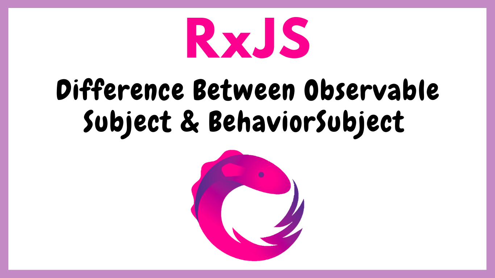

# Difference between RxJS Observable, Subject, and BehaviorSubject&nbsp;[](https://blog.numericaideas.com/difference-between-rxjs-observable-subject-and-behaviorsubject)

**This article was originally written by "Ismael Messa" on the blog**: https://blog.numericaideas.com/difference-between-rxjs-observable-subject-and-behaviorsubject

## Introduction

**RxJS** (Reactive Extensions for JavaScript) is a library that brings the concept of reactive programming that deals with asynchronous data calls, callbacks, and event-based programs using observables. It provides a lot of operators to allow handling asynchronous events as collections. Using the Observables pattern, RxJS comes with two other types of Observables which include **Subject** and **BehaviorSubject**. Understanding the distinctions between Observable, Subject, and BehaviorSubject is important while building Reactive Apps, which this article intends to outline.

[](https://blog.numericaideas.com/difference-between-rxjs-observable-subject-and-behaviorsubject)

## Observable

An **Observable** is a function that creates an observer and attaches it to the source where events are excepted. It performs this by calling a `subscribe()` method where you can access the published event. With Observable, we can only consume events but not emit them, which implies that we can have many consumers but only one producer. One thing to notice is that the producer will run as many times for each observer.

### Methods

- subscribe

### Example

```
import { Observable } from 'rxjs';

let observable = new Observable(
   function subscribe(observer) {
      observer.next("My First Observable")
   }
);

observable.subscribe(x => console.log(x));
// Output: My First Observable
```

## Subject

A **Subject**’s a kind of observable that allows unlike a simple observable, the ability to publish an event after subscription, but it has no initial value. In addition to the `subscribe()` method, it has a method `next()` which is used to emit an event. Subject is stateful and the producer executes only once for all listeners/observers.

### Methods

- subscribe
- next

### Example

```
import { Subject } from 'rxjs';

const subject = new Subject(); 

subject.next(‘value 0'); 

subject.subscribe(val => console.log(val)); 

subject.next(‘value 1'); 
// Output: value 1

subject.next(‘value 2'); 
// Output: value 2
```

## BehaviorSubject

About **BehaviorSubject**, this one is very similar to **Subject** except that **it can have an initial value**. Technically, it extends from the **Subject** model while ensuring the last published event is consumed by new consumers.

### Methods

- subscribe
- next

### Example

```
import { BehavioSubject } from 'rxjs';

const behaviorsubject = new BehavioSubject(‘initial’); 

behaviorsubject.next(‘value 0'); 

behaviorsubject.subscribe(val => console.log(val)); 
 // Output: value 0

behaviorsubject.next(‘value 1'); 
// Output: value 1

behaviorsubject.next(‘value 2'); 
// Output: value 2
```

If you are interested to build a **Custom State Management**, the following article is for you:

https://blog.numericaideas.com/custom-rxjs-store-architecture

———————

We have just started our journey to build a network of professionals to grow even more our free knowledge-sharing community that’ll give you a chance to learn interesting things about topics like cloud computing, software development, and software architectures while keeping the door open to more opportunities.

Does this speak to you? If **YES**, feel free to [Join our Discord Server](https://discord.numericaideas.com) to stay in touch with the community and be part of independently organized events.

———————

## Conclusion

We hope that this article has cleared up any confusion surrounding Observable, Subject, and BehaviorSubject. If you have any further thoughts or insights to add, please do not hesitate to share them with us. We welcome all feedback and suggestions.

Thanks for reading this article, recommend and share if you enjoyed it. Follow us on [Facebook](https://www.facebook.com/numericaideas), [Twitter](https://twitter.com/numericaideas), and [LinkedIn](https://www.linkedin.com/company/numericaideas) for more content.
