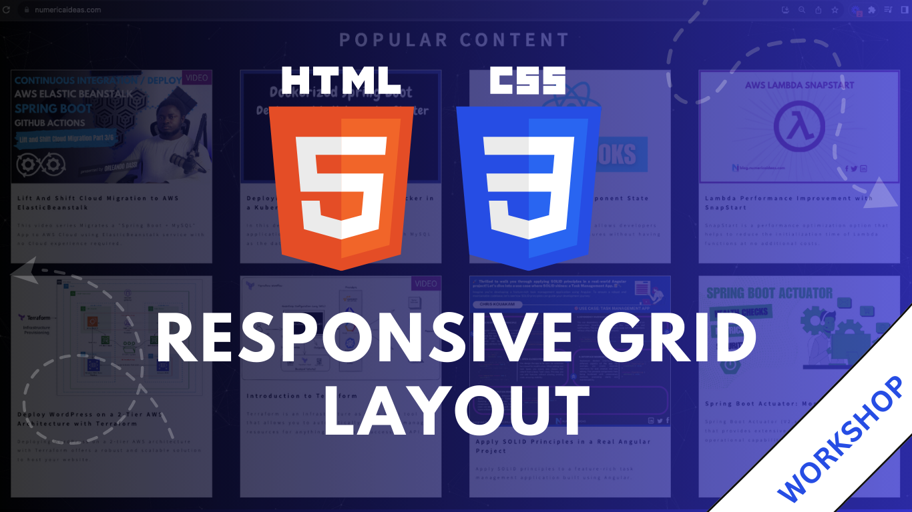

# NI GRID CONTENT: HTML + CSS&nbsp;
This is the implementation of a responsive GRID layout like the one used by [NumericaIdeas](https://numericaideas.com) as of **10 October 2023**.

Nowadays, front-end frameworks simplify the creation of Grids but it remains a good thing to know in case you may need to do some customizations or to quickly understand what these frameworks do, plus this can be put on the table during job interviews.

The full tutorial that highlights the steps we used in order to build it is available on [YouTube](https://youtu.be/IfFZK8nc-0c):

> The **YouTube Channels** in both English (En) and French (Fr) are now accessible, Feel free to subscribe by clicking [here](https://www.youtube.com/@numericaideas/channels?sub_confirmation=1).

## Tasks DONE
- [x] Context: Ni' popular content section
- [x] Come out with the structure of the page
- [x] Build the card design
- [x] Main container of the section and the grid
- [x] Implement the badge element
- [x] Add some animations on the cards
- [x] Make sure the grid is Responsive: desktop, tablet, and mobile

**Note**: The intent is not to have a pixel-perfect version of the version deployed online, but to demonstrate how to create a grid layout with cards using **"HTML + CSS"** skills without any third party library.

## Tools
- VSCode as the Code Editor + Live Server
- Google Chrome as the browser
- Google Fonts

## Final Result
The final result is accessible [here](https://www.youtube.com/watch?v=IfFZK8nc-0c&t=3497s).

Thanks for reading this, share it around if you enjoyed it. Follow us on [Facebook](https://www.facebook.com/numericaideas),  [Twitter](https://twitter.com/numericaideas), and [LinkedIn](https://www.linkedin.com/company/numericaideas) for more content.
