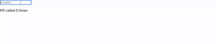
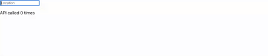
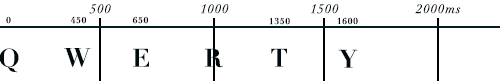
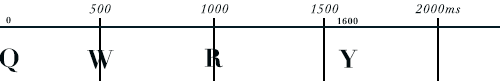

## Introduction

In the ever-evolving world of web development, tools that streamline processes and optimize performance are essential. **Lodash**, a versatile utility library, has emerged as a powerhouse for JavaScript developers. In this article, we'll explore how **Lodash** can significantly impact API request handling within a React environment. We'll focus on two crucial features: **Throttling** and **Debouncing**. By delving into examples and code snippets, we'll demonstrate how **Lodash** can be utilized to enhance API request management, ensuring smoother user interactions and improved application efficiency.

**Note: This article assumes a basic familiarity with React and API interactions.**


The **YouTube Channels** in both English (En) and French (Fr) are now accessible, feel free to subscribe by clicking [here](https://www.youtube.com/@numericaideas/channels?sub_confirmation=1).

## Throttling and Debouncing: Elevating API Request Handling

Efficiently managing API requests is vital to prevent overwhelming servers and deliver a seamless user experience. Throttling and debouncing are techniques that allow us to control how often a function is executed, particularly useful when functions are tied to user-triggered events.

Let's dirty our hands.
The following code showcases a text field that triggers an API call when its value is changed.

```
import React from "react";

const getLocations = async (search) => {
    const response = await fetch("https://fakemyapi.com/api/fake?id=8e3e24d8-569a-44d8-9e13-c4b6f7a1a68f", {
        method: "GET",
    });
    return response.json();
};

const App = () => {
    const onSearchText = (text) => {
        if (!!text.length) {
            getLocations(text);
        }
    };

    return (
        <div className="App">
            <input
                onChange={(e) => {
                    onSearchText(e.target.value);
                }}
                style={{ width: 200, height: 50, margin: 20 }}
            />
        </div>
    );
};

export default App;
```

Look at the output :



We can notice that the API was called for every key pressed, when fewer calls would have been enough.
On a small scale it's negligible; but imagine if your platform had 10 thousand simultaneous users doing this search. Your server would experience unnecessary heavy load. Let's see how Lodash can help us improve that.

### Throttling: Controlled Function Invocation

Throttling limits the rate at which a function can be invoked, ensuring that it is executed at a controlled frequency. Consider a scenario where user keystrokes trigger API requests for live search suggestions. To prevent excessive server load, we can implement throttling.

In this example, the throttle function from Lodash ensures that the handleSearch function is invoked at most once every 500 milliseconds, preventing rapid and excessive API requests while maintaining real-time search functionality.

```
...
import { throttle } from "lodash";

const getLocations = async () => {
    const response = await fetch("https://fakemyapi.com/api/fake?id=8e3e24d8-569a-44d8-9e13-c4b6f7a1a68f", {
        method: "GET",
    });
    return response.json();
};

const search = throttle(getLocations, 500);

const App = () => {
    const onSearchText = (text) => {
        if (!!text.length) {
            search(text);
        } else {
            search.cancel();
        }
    };

    return (
        ....
    );
};

export default App;

```

The result :



Now, the API has been call only 3 times.

> Throttle => invokes function at most once per every period of time.

Now, let's have a look on how the throttle options work :

Consider this sequence:



#### 1. { leading: true, trailing: true }



- leading: When set to true, the throttled function will be executed once at the beginning of a series of rapid invocations. This means the first invocation is not delayed, and subsequent invocations within a short period will be skipped until the throttling time window ends.

- trailing: When set to true, the throttled function will be executed once at the end of a series of rapid invocations, after the throttling time window expires. This ensures that the function is executed even if there are remaining invocations after the throttle period.

#### 2. { leading: true, trailing: false }

#### 3. { leading: false, trailing: true }

### Debouncing: Delayed Execution for Enhanced Efficiency

Debouncing delays the execution of a function until after a specified period has passed since the last invocation. This is particularly useful when responding to user actions that trigger multiple function calls in quick succession.

Now, let's have a look on how the debounce options work :

#### 1. { leading: true, trailing: true }

#### 2. { leading: true, trailing: false }

#### 3. { leading: false, trailing: true }
