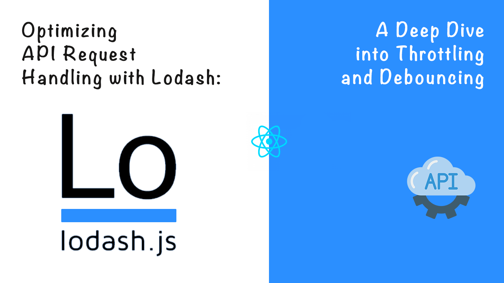
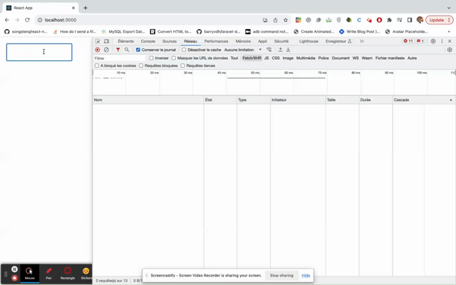
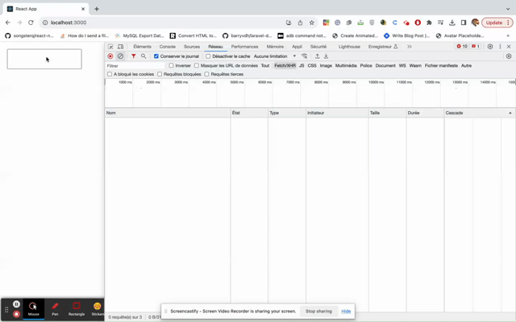
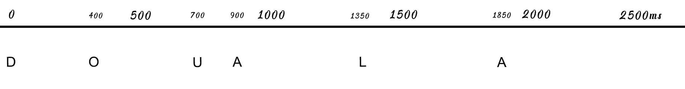
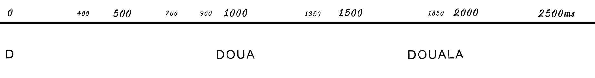
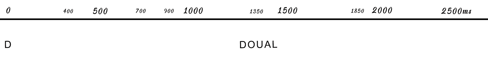
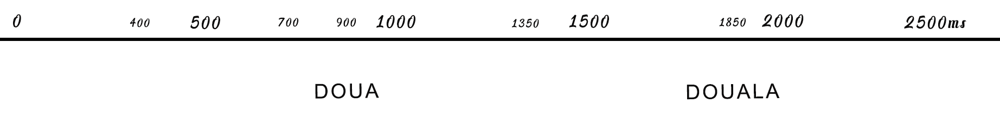
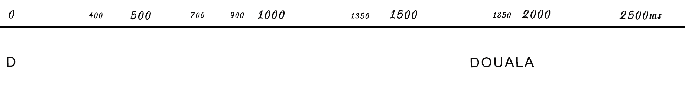
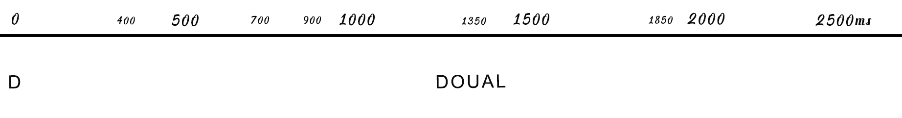
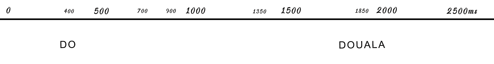

## Introduction

In the ever-evolving world of web development, tools that streamline processes and optimize performance are essential. **Lodash**, a versatile utility library, has emerged as a powerhouse for JavaScript developers. In this article, we'll explore how **Lodash** can significantly impact API request handling within a React environment. We'll focus on two crucial features: **Throttling** and **Debouncing**. By delving into examples and code snippets, we'll demonstrate how **Lodash** can be utilized to enhance API request management, ensuring smoother user interactions and improved application efficiency.

**Note: This article assumes a basic familiarity with React and API interactions.**



The **YouTube Channels** in both English (En) and French (Fr) are now accessible, feel free to subscribe by clicking [here](https://www.youtube.com/@numericaideas/channels?sub_confirmation=1).

## The context

Suppose in your application, you have a search location text input. And you have to retrieve the result of an api called every time the user enters a new key.

The code could look like this :

```
import React, { useState } from "react";
import { getLocations } from "./api";
import { List } from "./List";

const searchLocations = async (search, processData) => {
    getLocations(search).then((response) => {
        processData(response.data);
    });
};

const App = () => {
    const [results, setResults] = useState([]);
    const onSearchText = (text) => {
        if (!!text.length) {
            searchLocations(text, setResults);
        }
    };

    return (
        <div className="App">
            <input
                onChange={(e) => {
                    onSearchText(e.target.value);
                }}
                style={{ width: 200, height: 50, margin: 20, fontSize: 20 }}
            />

            <List data={results} />
        </div>
    );
};

export default App;

```

Look at the output :



We can notice that the API was called for every key pressed, when fewer calls would have been enough.
On a small scale it's negligible; but imagine if your platform had 10 thousand simultaneous users doing this search. Your server would experience unnecessary heavy load. Let's see how Lodash can help us improve that.

## Throttling and Debouncing: Elevating API Request Handling

### Throttling: Controlled Function Invocation

Throttling limits the rate at which a function can be invoked, ensuring that it is executed at a controlled frequency. Consider a scenario where user keystrokes trigger API requests for live search suggestions. To prevent excessive server load, we can implement throttling.

Let's update the previous code.

```
...
import { throttle } from "lodash";

const searchLocations = async (search, processData) => {
    getLocations(search).then((response) => {
        processData(response.data);
    });
};

const search = throttle(searchLocations, 1000);

const App = () => {
    const [results, setResults] = useState([]);
    const onSearchText = (text) => {
        if (!!text.length) {
            search(text, setResults);
        } else {
            search.cancel();
        }
    };

    return (
        <div className="App">
            <input
                onChange={(e) => {
                    onSearchText(e.target.value);
                }}
                style={{ width: 200, height: 50, margin: 20, fontSize: 20 }}
            />

            <List data={results} />
        </div>
    );
};

export default App;


```

The result :



Now, the API has been call only 3 times and we have the same result

In this example, the throttle function from Lodash ensures that the searchLocations function is invoked at most once every 1000 milliseconds, preventing rapid and excessive API requests while maintaining real-time search functionality.

You can change the behavior of throttle with the options leading and trailing, depending on your requirements.
The default config is { leading: true, trailing: true }

```
const search = throttle(searchLocations, 1000, { leading: true, trailing: true });
```

Let's have a look on how these options work :

> leading

- When set to true, the throttled function will be executed once at the beginning and subsequent invocations within a short period will be skipped until the throttling time window ends.
- When set to false, the throttled function will not be executed at the beginning.

> trailing

- When set to true, if the function is called multiple times within the throttle interval, only the last call will execute after the throttle interval. This is the typical behavior of a throttle.
- when set to false, if the function is called multiple times within the throttle interval, only the first call will execute immediately. Subsequent calls within the throttle interval will be ignored and not executed. Only when the throttle interval has passed with no further calls will the function be allowed to be called again.

Consider this sequence (1000ms as interval):



#### _1. { leading: true, trailing: true }_



> Remember : Only one call per interval

_Breakdown:_

- The first call is done with the value **D** at 0ms.
- The throttle will skip the api call with value **DO** and perform the one with **DOUA** at 1000ms (the end of the interval due to the trailing).
- The throttle will skip the call with **DOUAL** at 1350ms and perform the one with **DOUALA** at 1850ms; end of sequence

#### _2. { leading: true, trailing: false }_



_Breakdown:_

- The first call is done with the value **D** at 0ms.
- Calls with values **DO**, **DOU** and **DOUA** are skipped
- The throttle will perform the call with value **DOUAL** at 1350ms and ignore the call with **DOUALA** cause the trailing is false

#### _3. { leading: false, trailing: true }_



_Breakdown:_

- The first call with the value **D** at 0ms is skipped cause the leading is false
- Calls with values **DO**, **DOU** are skipped
- Api is called with the value **DOUA** at 900ms cause it's the last call in the interval.
- The throttle will skip the call with **DOUAL** at 1350ms and perform the one with **DOUALA** at 1850ms; end of sequence

### Debouncing: Delayed Execution for Enhanced Efficiency

As Throttling, Debouncing limits the rate at which a function can be invoked, but in a different way. Debouncing delays the execution of a function until after a specified period has passed since the last invocation. This is particularly useful when responding to user actions that trigger multiple function calls in quick succession.

The signature is also similar to throttle as you can notice in the code below ;

```
import { debounce } from "lodash";
....

const search = debounce(searchLocations, 1000);
.....

```

Now, let's have a look on how the debounce works with different options :

> leading

- When set to true, the debounced function will be invoked immediately if you call it and there's been no previous invocation within the specified wait time. It's essentially allowing an immediate invocation at the beginning before the wait interval starts.

- When set to false, the debounced function will not be invoked immediately on the first call. Instead, it will wait for the specified wait time to pass before executing the function.

> trailing

- the debounced function will be invoked after the specified wait time has passed since the last invocation. If there are subsequent invocations within the wait time, the timer will be reset, and the function will be invoked again after the wait time from the last invocation.
- when set to false, the debounced function will not be invoked if there are subsequent invocations within the wait time. It will only be invoked after the wait time has passed since the last invocation and there are no further invocations during that time.

#### 1. { leading: true, trailing: true }



_Breakdown:_

- The api is called with value **D** at 0ms
- The calls with values **DO**, **DOU** and **DOUA** are delayed to the next interval (+1000ms)
- The trailing executes the last call in the interval with the value **DOUALA** and skips all the calls before.

#### 2. { leading: true, trailing: false }



_Breakdown:_

- The api is called with value **D** at 0ms
- The calls with values **DO**, **DOU** and **DOUA** are ignored
- The api is called with the value **DOUAL**
- Api call with the value **DOUALA** is ignored

#### 3. { leading: false, trailing: true }



_Breakdown:_

- The call with value **D** at 0ms is skipped
- The api is called with value **DO** at 400ms
- The calls with values **DOU** and **DOUA** are delayed to the next interval (+1000ms)
- The trailing executes the last call in the interval with the value **DOUALA** and skips all the calls before.

## How to choose between Throttling and Debouncing

Throttling is useful when you want to maintain a steady flow of requests at a controlled rate, like updating a UI component based on user input without overwhelming the server. Use throttle when dealing with continuous events like scrolling or resizing, and you want to limit the number of times a function is called within a specific time interval.

> **_Use case_**
> For a feature like a timeline update, you can control how many times the api is called and ui refreshed, when the user is scrolling.

Debouncing is particularly useful for scenarios where you want to delay an API request until the user has finished a series of actions (e.g., typing in a search bar), which can reduce unnecessary API calls and optimize performance.

> **_Use case_**
> For a search input

## Conclusion

Efficiently managing API requests is vital to prevent overwhelming servers and deliver a seamless user experience. Throttling and Debouncing are techniques that allow us to control how often a function is executed, particularly useful when functions are tied to user-triggered events.

I hope it was helpful. Do not hesitate to comment or give some feedbacks.
